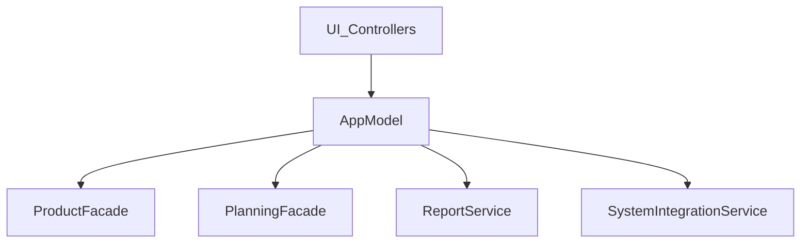

# Arquitectura AppModel y fachadas

> **Histórico:** existió el paquete `core/app_model_bridges/` (compat / product / planning). Fue **eliminado**: `AppModel` delega directamente en `ProductFacade`, `PlanningFacade`, `ReportService` y `SystemIntegrationService`.

## Objetivo
Centralizar señales y una API estable para controladores sin capa intermedia de “puentes”; el dominio producto/planificación pasa por fachadas; reportes y sistema (lotes, config, órdenes) por servicios dedicados.

## Estructura
- `core/app_model.py`: inicialización de servicios, fachadas, señales y delegación a `product_facade`, `planning_facade`, `report_service`, `system_integration`.
- `core/facades/product_facade.py`, `planning_facade.py`: API de producto y pilas/planificación.
- `core/services/report_service.py`, `system_integration_service.py`: reportes tabulares y operaciones de lotes/config/tracking.

## Diagrama (Mermaid)

## Reglas de evolución
1. Nuevo consumo en UI/controlador: preferir servicio/fachada resuelto por DI cuando el controlador no necesite la fachada completa de `AppModel`.
2. Métodos legacy en `AppModel` deben delegar en una sola línea a fachada o servicio; no reintroducir paquetes puente.
3. Antes de eliminar un método público de `AppModel`, verificar uso en producción y tests.

## Estado actual
- `core/app_model_bridges/` no existe; no hay `AppModel*Bridge`.
- `AppModel` mantiene la misma superficie pública hacia controladores existentes.

## Resumen ejecutivo
- Menos saltos en la pila de llamadas (sin wrapper intermedio hacia las mismas fachadas/servicios).
- El impacto funcional para usuarios es nulo si solo se refactoriza el cableado interno.
