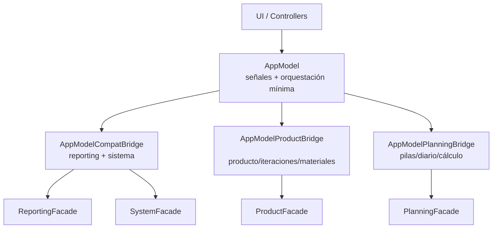

# Arquitectura AppModel Bridges

## Objetivo
Reducir el riesgo de `God Object` en `AppModel` separando la API legacy en bridges por dominio, manteniendo compatibilidad mientras los consumidores migran a servicios/fachadas.

## Estructura
- `core/app_model.py`: inicialización de servicios, fachadas, señales y orquestación mínima.
- `core/app_model_bridges/compat.py`: bridge de reporting y sistema (lotes/config).
- `core/app_model_bridges/product.py`: bridge de producto, iteraciones y materiales.
- `core/app_model_bridges/planning.py`: bridge de pilas, diario y cálculo.


## Diagrama (Mermaid)


## Reglas de evolución
1. Nuevo consumo en UI/controlador: usar servicio/fachada directa, no `model.get_*`.
2. Si se mantiene API legacy, se implementa en un bridge, no en `app_model.py`.
3. Antes de eliminar un método legacy, verificar uso en producción y tests.

## Estado actual
- Callsites productivos directos `*.model.get_*`: 0.
- `AppModel` conserva compatibilidad por herencia de bridges, con menor acoplamiento interno.


## Antes vs Después

### Antes (alto acoplamiento)
```mermaid
flowchart LR
    UI[UI / Controllers] --> AppModel[AppModel monolítico]
    AppModel --> Services[Servicios múltiples
(product/worker/machine/pila/report/...)]
```

### Después (compatibilidad por bridges)
```mermaid
flowchart LR
    UI[UI / Controllers] --> AppModel[AppModel delgado
(señales + orquestación)]
    AppModel --> B1[CompatBridge]
    AppModel --> B2[ProductBridge]
    AppModel --> B3[PlanningBridge]
    B1 --> F1[Reporting/System Facades]
    B2 --> F2[Product Facade]
    B3 --> F3[Planning Facade]
```


## Resumen Ejecutivo (Stakeholders)
- Se redujo el riesgo de cuello de botella técnico en el núcleo de la aplicación.
- `AppModel` pasó de concentrar demasiadas funciones a un rol más estable y mantenible.
- La compatibilidad con el sistema actual se mantiene mediante bridges por dominio.
- El impacto funcional para usuarios es nulo: no se cambió el comportamiento visible.
- El impacto técnico es alto: menor acoplamiento, menor riesgo de regresiones y mejor escalabilidad.
- El camino de evolución queda definido: nuevos cambios se implementan por dominio, no en un monolito central.
