# Documentación Técnica: Hipatia

> Generado automáticamente el 2026-04-08 13:09:27

---

## Índice de Código (completo y verificable)

### Resumen rápido (para auditoría en papel)

| Métrica | Valor |
|---|---:|
| Archivos `.py` listados en el índice | 436 |
| Incluidos en el cuerpo (tienen bloque en el PDF) | 436 |
| Omitidos (reglas de docstrings/otros) | 0 |

Leyenda:
- `pNNNN`: página exacta donde empieza el bloque del archivo en el PDF (placeholder `p0000` si aún no se calculó).
- `Omitido`: el archivo no se incluye en el cuerpo por reglas de docstrings (ver `FRASES_IGNORADAS`).
- `FRASES_IGNORADAS`: Conjunto de textos genéricos (ej. 'Sin descripción disponible') o docstrings vacíos. El script ignora intencionalmente los módulos con estas descripciones porque no aportan información útil.
- `Mypy Sí`: tipado estricto aplicado a ese módulo en `mypy.ini`.
- `Mypy Parcial`: el proyecto usa una configuración gradual allí; se prioriza estabilidad/coste de esfuerzo.

- analysis/
  - `scripts/analysis/analyze_codebase.py` → p0483 | clases: FileStats, DirectorySummary | Mypy: Parcial (configuración gradual: disallow_untyped_defs=False en mypy.ini tipar todo al 100% no compensa el esfuerzo; se prioriza estabilidad.)
  - `scripts/analysis/analyze_controller.py` → p0484 | Mypy: Parcial (configuración gradual: disallow_untyped_defs=False en mypy.ini tipar todo al 100% no compensa el esfuerzo; se prioriza estabilidad.)
  - `scripts/analysis/analyze_coverage_risks.py` → p0485 | Mypy: Parcial (configuración gradual: disallow_untyped_defs=False en mypy.ini tipar todo al 100% no compensa el esfuerzo; se prioriza estabilidad.)
  - `scripts/analysis/analyze_db_usage.py` → p0486 | Mypy: Parcial (configuración gradual: disallow_untyped_defs=False en mypy.ini tipar todo al 100% no compensa el esfuerzo; se prioriza estabilidad.)
  - `scripts/analysis/analyze_dependencies.py` → p0487 | Mypy: Parcial (configuración gradual: disallow_untyped_defs=False en mypy.ini tipar todo al 100% no compensa el esfuerzo; se prioriza estabilidad.)
  - `scripts/analysis/analyze_fabrication_dialogs.py` → p0488 | Mypy: Parcial (configuración gradual: disallow_untyped_defs=False en mypy.ini tipar todo al 100% no compensa el esfuerzo; se prioriza estabilidad.)
  - `scripts/analysis/analyze_loose_mocks.py` → p0489 | Mypy: Parcial (configuración gradual: disallow_untyped_defs=False en mypy.ini tipar todo al 100% no compensa el esfuerzo; se prioriza estabilidad.)
  - `scripts/analysis/analyze_refactoring_impact.py` → p0490 | Mypy: Parcial (configuración gradual: disallow_untyped_defs=False en mypy.ini tipar todo al 100% no compensa el esfuerzo; se prioriza estabilidad.)
  - `scripts/analysis/analyze_repository_connections.py` → p0491 | clases: FileAnalysisResult, RepoUsageData, ProjectAnalysisResult, RepositoryConnectionAnalyzer | Mypy: Parcial (configuración gradual: disallow_untyped_defs=False en mypy.ini tipar todo al 100% no compensa el esfuerzo; se prioriza estabilidad.)
  - `scripts/analysis/analyze_root_files.py` → p0492 | clases: DefinitionsDict, DefinitionsPayload, ErrorPayload, MissingResult, RootFileAnalysis | Mypy: Parcial (configuración gradual: disallow_untyped_defs=False en mypy.ini tipar todo al 100% no compensa el esfuerzo; se prioriza estabilidad.)
  - `scripts/analysis/analyze_structure.py` → p0493 | Mypy: Parcial (configuración gradual: disallow_untyped_defs=False en mypy.ini tipar todo al 100% no compensa el esfuerzo; se prioriza estabilidad.)
  - `scripts/analysis/analyze_tracking_impact.py` → p0494 | Mypy: Parcial (configuración gradual: disallow_untyped_defs=False en mypy.ini tipar todo al 100% no compensa el esfuerzo; se prioriza estabilidad.)
  - `scripts/analysis/analyze_typing_deep.py` → p0495 | Mypy: Parcial (configuración gradual: disallow_untyped_defs=False en mypy.ini tipar todo al 100% no compensa el esfuerzo; se prioriza estabilidad.)
  - `scripts/analysis/analyze_ui_structure.py` → p0496 | Mypy: Parcial (configuración gradual: disallow_untyped_defs=False en mypy.ini tipar todo al 100% no compensa el esfuerzo; se prioriza estabilidad.)
  - `scripts/analysis/detect_obsolete_code.py` → p0497 | Mypy: Parcial (configuración gradual: disallow_untyped_defs=False en mypy.ini tipar todo al 100% no compensa el esfuerzo; se prioriza estabilidad.)
  - `scripts/analysis/verify_naming_conventions.py` → p0498 | Mypy: Parcial (configuración gradual: disallow_untyped_defs=False en mypy.ini tipar todo al 100% no compensa el esfuerzo; se prioriza estabilidad.)
- camera_manager/
  - `core/camera_manager/__init__.py` → p0148 | Mypy: Sí (disallow_untyped_defs=True en mypy.ini (fase avanzada/módulo completado).)
  - `core/camera_manager/base.py` → p0149 | clases: CameraBackend, CameraInfo | Mypy: Sí (disallow_untyped_defs=True en mypy.ini (fase avanzada/módulo completado).)
  - `core/camera_manager/detector.py` → p0150 | Mypy: Sí (disallow_untyped_defs=True en mypy.ini (fase avanzada/módulo completado).)
  - `core/camera_manager/manager.py` → p0151 | clases: CameraManager | Mypy: Sí (disallow_untyped_defs=True en mypy.ini (fase avanzada/módulo completado).)
  - `core/camera_manager/utils.py` → p0152 | Mypy: Sí (disallow_untyped_defs=True en mypy.ini (fase avanzada/módulo completado).)
- dialogs/
  - effects/
    - `ui/dialogs/effects/__init__.py` → p0339 | Mypy: Sí (disallow_untyped_defs=True en mypy.ini (fase avanzada/módulo completado).)
    - `ui/dialogs/effects/golden_glow.py` → p0340 | clases: GoldenGlowEffect | Mypy: Sí (disallow_untyped_defs=True en mypy.ini (fase avanzada/módulo completado).)
    - `ui/dialogs/effects/green_cycle.py` → p0341 | clases: GreenCycleEffect | Mypy: Sí (disallow_untyped_defs=True en mypy.ini (fase avanzada/módulo completado).)
    - `ui/dialogs/effects/mixed_gold_green.py` → p0342 | clases: MixedGoldGreenEffect | Mypy: Sí (disallow_untyped_defs=True en mypy.ini (fase avanzada/módulo completado).)
    - `ui/dialogs/effects/processing_glow.py` → p0343 | clases: ProcessingGlowEffect | Mypy: Sí (disallow_untyped_defs=True en mypy.ini (fase avanzada/módulo completado).)
    - `ui/dialogs/effects/progress.py` → p0344 | clases: SimulationProgressEffect | Mypy: Sí (disallow_untyped_defs=True en mypy.ini (fase avanzada/módulo completado).)
  - fabrication/
    - `ui/dialogs/fabrication/__init__.py` → p0345 | Mypy: Sí (disallow_untyped_defs=True en mypy.ini (fase avanzada/módulo completado).)
    - `ui/dialogs/fabrication/assignment_dialogs.py` → p0346 | clases: AssignPreprocesosDialog | Mypy: Sí (disallow_untyped_defs=True en mypy.ini (fase avanzada/módulo completado).)
    - `ui/dialogs/fabrication/bitacora_dialog.py` → p0347 | clases: BitacoraEntryDTO, FabricacionBitacoraDialog | Mypy: Sí (disallow_untyped_defs=True en mypy.ini (fase avanzada/módulo completado).)
    - `ui/dialogs/fabrication/create_dialog.py` → p0348 | clases: CreateFabricacionDialog | Mypy: Sí (disallow_untyped_defs=True en mypy.ini (fase avanzada/módulo completado).)
    - `ui/dialogs/fabrication/create_presenter.py` → p0349 | clases: CreateFabricacionPresenter | Mypy: Sí (disallow_untyped_defs=True en mypy.ini (fase avanzada/módulo completado).)
    - `ui/dialogs/fabrication/dialog_dependencies.py` → p0350 | Mypy: Sí (disallow_untyped_defs=True en mypy.ini (fase avanzada/módulo completado).)
    - `ui/dialogs/fabrication/input_dialogs.py` → p0351 | clases: GetLoteInstanceParametersDialog, GetOptimizationParametersDialog, GetUnitsDialog | Mypy: Sí (disallow_untyped_defs=True en mypy.ini (fase avanzada/módulo completado).)
    - `ui/dialogs/fabrication/persistence_dialogs.py` → p0352 | clases: SavePilaDialog, LoadPilaDialog | Mypy: Sí (disallow_untyped_defs=True en mypy.ini (fase avanzada/módulo completado).)
    - `ui/dialogs/fabrication/products_dialog.py` → p0353 | clases: ProductsSelectionDialog | Mypy: Sí (disallow_untyped_defs=True en mypy.ini (fase avanzada/módulo completado).)
    - `ui/dialogs/fabrication/selection_dialogs.py` → p0354 | clases: PreprocesosSelectionDialog, PreprocesosForCalculationDialog | Mypy: Sí (disallow_untyped_defs=True en mypy.ini (fase avanzada/módulo completado).)
    - `ui/dialogs/fabrication/ui_dialog_protocols.py` → p0355 | clases: OpensFabricacionPreprocesos, ShowsUserMessage | Mypy: Sí (disallow_untyped_defs=True en mypy.ini (fase avanzada/módulo completado).)
  - prep/
    - `ui/dialogs/prep/__init__.py` → p0356 | Mypy: Sí (disallow_untyped_defs=True en mypy.ini (fase avanzada/módulo completado).)
    - `ui/dialogs/prep/prep_groups_dialog.py` → p0357 | clases: PrepGroupsDialog | Mypy: Sí (disallow_untyped_defs=True en mypy.ini (fase avanzada/módulo completado).)
    - `ui/dialogs/prep/prep_steps_dialog.py` → p0358 | clases: PrepStepsDialog | Mypy: Sí (disallow_untyped_defs=True en mypy.ini (fase avanzada/módulo completado).)
    - `ui/dialogs/prep/preproceso_dialog.py` → p0359 | clases: PreprocesoDialog | Mypy: Sí (disallow_untyped_defs=True en mypy.ini (fase avanzada/módulo completado).)
  - product/
    - `ui/dialogs/product/__init__.py` → p0360 | Mypy: Sí (disallow_untyped_defs=True en mypy.ini (fase avanzada/módulo completado).)
    - `ui/dialogs/product/add_iteration_dialog.py` → p0361 | clases: AddIterationFormData, AddIterationDialog | Mypy: Sí (disallow_untyped_defs=True en mypy.ini (fase avanzada/módulo completado).)
    - `ui/dialogs/product/bom_import_preview_dialog.py` → p0362 | clases: BOMImportPreviewDialog | Mypy: Sí (disallow_untyped_defs=True en mypy.ini (fase avanzada/módulo completado).)
    - `ui/dialogs/product/procesos_mecanicos_dialog.py` → p0363 | clases: ProcesosMecanicosDialog, AddProcesoMecanicoDialog | Mypy: Sí (disallow_untyped_defs=True en mypy.ini (fase avanzada/módulo completado).)
    - `ui/dialogs/product/product_details_dialog.py` → p0364 | clases: ProductDetailsDialog | Mypy: Sí (disallow_untyped_defs=True en mypy.ini (fase avanzada/módulo completado).)
    - `ui/dialogs/product/subfabricaciones_dialog.py` → p0365 | clases: SubfabricacionesDialog | Mypy: Sí (disallow_untyped_defs=True en mypy.ini (fase avanzada/módulo completado).)
  - production_flow/
    - `ui/dialogs/production_flow/__init__.py` → p0366 | Mypy: Sí (disallow_untyped_defs=True en mypy.ini (fase avanzada/módulo completado).)
    - `ui/dialogs/production_flow/common_dialogs.py` → p0367 | Mypy: Sí (disallow_untyped_defs=True en mypy.ini (fase avanzada/módulo completado).)
    - `ui/dialogs/production_flow/cycle_end_config_dialog.py` → p0368 | clases: CycleEndConfigDialog | Mypy: Sí (disallow_untyped_defs=True en mypy.ini (fase avanzada/módulo completado).)
    - `ui/dialogs/production_flow/define_flow_dialog.py` → p0369 | clases: DefineProductionFlowDialog | Mypy: Sí (disallow_untyped_defs=True en mypy.ini (fase avanzada/módulo completado).)
    - `ui/dialogs/production_flow/define_flow_presenter.py` → p0370 | clases: DefineFlowPresenter | Mypy: Sí (disallow_untyped_defs=True en mypy.ini (fase avanzada/módulo completado).)
    - `ui/dialogs/production_flow/definir_cantidades_dialog.py` → p0371 | clases: DefinirCantidadesDialog | Mypy: Sí (disallow_untyped_defs=True en mypy.ini (fase avanzada/módulo completado).)
    - `ui/dialogs/production_flow/enhanced_flow_dialog.py` → p0372 | clases: EnhancedProductionFlowDialog | Mypy: Sí (disallow_untyped_defs=True en mypy.ini (fase avanzada/módulo completado).)
    - `ui/dialogs/production_flow/enhanced_flow_presenter.py` → p0373 | clases: EnhancedFlowPresenter | Mypy: Sí (disallow_untyped_defs=True en mypy.ini (fase avanzada/módulo completado).)
    - `ui/dialogs/production_flow/enhanced_flow_state_manager.py` → p0374 | clases: EnhancedFlowStateManager | Mypy: Sí (disallow_untyped_defs=True en mypy.ini (fase avanzada/módulo completado).)
    - `ui/dialogs/production_flow/flow_action_handler.py` → p0375 | clases: FlowActionHandler | Mypy: Sí (disallow_untyped_defs=True en mypy.ini (fase avanzada/módulo completado).)
    - `ui/dialogs/production_flow/flow_builder.py` → p0376 | clases: FlowBuilder | Mypy: Sí (disallow_untyped_defs=True en mypy.ini (fase avanzada/módulo completado).)
    - `ui/dialogs/production_flow/flow_simulation_handler.py` → p0377 | clases: FlowSimulationHandler | Mypy: Sí (disallow_untyped_defs=True en mypy.ini (fase avanzada/módulo completado).)
    - `ui/dialogs/production_flow/machine_resource_manager.py` → p0378 | clases: MachineResourceManager | Mypy: Sí (disallow_untyped_defs=True en mypy.ini (fase avanzada/módulo completado).)
    - `ui/dialogs/production_flow/reassignment_rule_dialog.py` → p0379 | clases: ReassignmentRuleDialog | Mypy: Sí (disallow_untyped_defs=True en mypy.ini (fase avanzada/módulo completado).)
  - `ui/dialogs/__init__.py` → p0331 | Mypy: Sí (disallow_untyped_defs=True en mypy.ini (fase avanzada/módulo completado).)
  - `ui/dialogs/backup_restore_dialog.py` → p0332 | clases: BackupRestoreDialog | Mypy: Sí (disallow_untyped_defs=True en mypy.ini (fase avanzada/módulo completado).)
  - `ui/dialogs/canvas_widget.py` → p0333 | clases: CanvasWidget | Mypy: Sí (disallow_untyped_defs=True en mypy.ini (fase avanzada/módulo completado).)
  - `ui/dialogs/canvas_widgets.py` → p0334 | Mypy: Sí (disallow_untyped_defs=True en mypy.ini (fase avanzada/módulo completado).)
  - `ui/dialogs/card_widget.py` → p0335 | clases: CardWidget | Mypy: Sí (disallow_untyped_defs=True en mypy.ini (fase avanzada/módulo completado).)
  - `ui/dialogs/connection_dialog.py` → p0336 | clases: ConnectionDialog | Mypy: Sí (disallow_untyped_defs=True en mypy.ini (fase avanzada/módulo completado).)
  - `ui/dialogs/tracking_dialogs.py` → p0337 | clases: OrderSetupDialog | Mypy: Sí (disallow_untyped_defs=True en mypy.ini (fase avanzada/módulo completado).)
  - `ui/dialogs/utility_dialogs.py` → p0338 | clases: AddBreakDialog, LoginDialog, ChangePasswordDialog, SyncDialog, SeleccionarHojasExcelDialog, MultiWorkerSelectionDialog | Mypy: Sí (disallow_untyped_defs=True en mypy.ini (fase avanzada/módulo completado).)
- facades/
  - `core/facades/__init__.py` → p0153 | Mypy: Sí (disallow_untyped_defs=True en mypy.ini (fase avanzada/módulo completado).)
  - `core/facades/planning_facade.py` → p0154 | clases: PlanningFacade | Mypy: Sí (disallow_untyped_defs=True en mypy.ini (fase avanzada/módulo completado).)
  - `core/facades/product_facade.py` → p0155 | clases: ProductFacade | Mypy: Sí (disallow_untyped_defs=True en mypy.ini (fase avanzada/módulo completado).)
  - `core/facades/production_facade.py` → p0156 | clases: ProductionFacade | Mypy: Sí (disallow_untyped_defs=True en mypy.ini (fase avanzada/módulo completado).)
  - `core/facades/reporting_facade.py` → p0157 | clases: ReportingFacade | Mypy: Sí (disallow_untyped_defs=True en mypy.ini (fase avanzada/módulo completado).)
  - `core/facades/system_facade.py` → p0158 | clases: SystemFacade | Mypy: Sí (disallow_untyped_defs=True en mypy.ini (fase avanzada/módulo completado).)
  - `core/facades/workforce_facade.py` → p0159 | clases: WorkforceFacade | Mypy: Sí (disallow_untyped_defs=True en mypy.ini (fase avanzada/módulo completado).)
- hardware/
  - `tools/hardware/detect_cameras.py` → p0506 | clases: CameraInfo | Mypy: Parcial (configuración gradual: disallow_untyped_defs=False en mypy.ini tipar todo al 100% no compensa el esfuerzo; se prioriza estabilidad.)
- health/
  - `core/health/__init__.py` → p0160 | Mypy: Sí (disallow_untyped_defs=True en mypy.ini (fase avanzada/módulo completado).)
  - `core/health/constants.py` → p0161 | Mypy: Sí (disallow_untyped_defs=True en mypy.ini (fase avanzada/módulo completado).)
  - `core/health/health_checker.py` → p0162 | clases: TableHealth, SystemHealth, TestResults, HealthReport, DatabaseHealthChecker | Mypy: Sí (disallow_untyped_defs=True en mypy.ini (fase avanzada/módulo completado).)
  - `core/health/health_worker.py` → p0163 | clases: HealthCheckWorker | Mypy: Sí (disallow_untyped_defs=True en mypy.ini (fase avanzada/módulo completado).)
  - `core/health/test_runner.py` → p0164 | clases: TestRunner | Mypy: Sí (disallow_untyped_defs=True en mypy.ini (fase avanzada/módulo completado).)
- historial/
  - `controllers/historial/__init__.py` → p0078 | Mypy: Sí (disallow_untyped_defs=True en mypy.ini (fase avanzada/módulo completado).)
  - `controllers/historial/controller.py` → p0079 | clases: HistorialController | Mypy: Sí (disallow_untyped_defs=True en mypy.ini (fase avanzada/módulo completado).)
  - `controllers/historial/interaction_manager.py` → p0080 | clases: HistorialInteractionManager | Mypy: Sí (disallow_untyped_defs=True en mypy.ini (fase avanzada/módulo completado).)
  - `controllers/historial/protocols.py` → p0081 | clases: HistorialControllerProtocol | Mypy: Sí (disallow_untyped_defs=True en mypy.ini (fase avanzada/módulo completado).)
  - `controllers/historial/report_manager.py` → p0082 | clases: HistorialReportManager | Mypy: Sí (disallow_untyped_defs=True en mypy.ini (fase avanzada/módulo completado).)
  - `controllers/historial/view_manager.py` → p0083 | clases: HistorialViewManager | Mypy: Sí (disallow_untyped_defs=True en mypy.ini (fase avanzada/módulo completado).)
- import_manager/
  - adapters/
    - `core/import_manager/adapters/__init__.py` → p0168 | Mypy: Sí (disallow_untyped_defs=True en mypy.ini (fase avanzada/módulo completado).)
    - `core/import_manager/adapters/a3rp_csv_adapter.py` → p0169 | clases: A3RPCSVAdapter | Mypy: Sí (disallow_untyped_defs=True en mypy.ini (fase avanzada/módulo completado).)
    - `core/import_manager/adapters/a3rp_excel_adapter.py` → p0170 | clases: A3RPExcelAdapter | Mypy: Sí (disallow_untyped_defs=True en mypy.ini (fase avanzada/módulo completado).)
  - services/
    - `core/import_manager/services/__init__.py` → p0171 | Mypy: Sí (disallow_untyped_defs=True en mypy.ini (fase avanzada/módulo completado).)
    - `core/import_manager/services/bom_import_service.py` → p0172 | clases: BOMImportService | Mypy: Sí (disallow_untyped_defs=True en mypy.ini (fase avanzada/módulo completado).)
  - `core/import_manager/__init__.py` → p0165 | Mypy: Sí (disallow_untyped_defs=True en mypy.ini (fase avanzada/módulo completado).)
  - `core/import_manager/dto.py` → p0166 | clases: BOMNodeDTO | Mypy: Sí (disallow_untyped_defs=True en mypy.ini (fase avanzada/módulo completado).)
  - `core/import_manager/ports.py` → p0167 | clases: IBOMImporter | Mypy: Sí (disallow_untyped_defs=True en mypy.ini (fase avanzada/módulo completado).)
- interfaces/
  - `core/interfaces/controller_interface.py` → p0173 | clases: QABCMeta, IController | Mypy: Sí (disallow_untyped_defs=True en mypy.ini (fase avanzada/módulo completado).)
  - `core/interfaces/view_interface.py` → p0174 | clases: IView | Mypy: Sí (disallow_untyped_defs=True en mypy.ini (fase avanzada/módulo completado).)
  - `core/interfaces/worker_view_interface.py` → p0175 | clases: IWorkerView | Mypy: Sí (disallow_untyped_defs=True en mypy.ini (fase avanzada/módulo completado).)
- label_manager/
  - `core/label_manager/__init__.py` → p0176 | Mypy: Sí (disallow_untyped_defs=True en mypy.ini (fase avanzada/módulo completado).)
  - `core/label_manager/base.py` → p0177 | Mypy: Sí (disallow_untyped_defs=True en mypy.ini (fase avanzada/módulo completado).)
  - `core/label_manager/manager.py` → p0178 | clases: LabelManager | Mypy: Sí (disallow_untyped_defs=True en mypy.ini (fase avanzada/módulo completado).)
  - `core/label_manager/ports.py` → p0179 | clases: IDocumentGenerator | Mypy: Sí (disallow_untyped_defs=True en mypy.ini (fase avanzada/módulo completado).)
  - `core/label_manager/printer.py` → p0180 | Mypy: Sí (disallow_untyped_defs=True en mypy.ini (fase avanzada/módulo completado).)
- maintenance/
  - `scripts/maintenance/backup_database.py` → p0499 | Mypy: Sí (disallow_untyped_defs=True en mypy.ini (fase avanzada/módulo completado).)
  - `scripts/maintenance/reset_admin.py` → p0500 | Mypy: Sí (disallow_untyped_defs=True en mypy.ini (fase avanzada/módulo completado).)
- models/
  - `database/models/__init__.py` → p0256 | Mypy: Sí (disallow_untyped_defs=True en mypy.ini (fase avanzada/módulo completado).)
  - `database/models/base.py` → p0257 | clases: Base | Mypy: Sí (disallow_untyped_defs=True en mypy.ini (fase avanzada/módulo completado).)
  - `database/models/fabrication.py` → p0258 | clases: Fabricacion, FabricacionContador | Mypy: Sí (disallow_untyped_defs=True en mypy.ini (fase avanzada/módulo completado).)
  - `database/models/inventory.py` → p0259 | clases: Material, Pila, PasoPila, DiarioBitacora, EntradaDiario, Lote | Mypy: Sí (disallow_untyped_defs=True en mypy.ini (fase avanzada/módulo completado).)
  - `database/models/machine.py` → p0260 | clases: Maquina, MachineMaintenanc, GrupoPreparacion, PreparacionPaso | Mypy: Sí (disallow_untyped_defs=True en mypy.ini (fase avanzada/módulo completado).)
  - `database/models/product.py` → p0261 | clases: Producto, Preproceso, Subfabricacion, ProcesoMecanico, ProductIteration | Mypy: Sí (disallow_untyped_defs=True en mypy.ini (fase avanzada/módulo completado).)
  - `database/models/security.py` → p0263 | clases: Configuration, LoginAttempt, AuditLog | Mypy: Sí (disallow_untyped_defs=True en mypy.ini (fase avanzada/módulo completado).)
  - `database/models/tracking.py` → p0264 | clases: TrabajoLog, PasoTrazabilidad, IncidenciaLog, IncidenciaAdjunto | Mypy: Sí (disallow_untyped_defs=True en mypy.ini (fase avanzada/módulo completado).)
  - `database/models/worker.py` → p0265 | clases: Trabajador, TrabajadorPilaAnotacion | Mypy: Sí (disallow_untyped_defs=True en mypy.ini (fase avanzada/módulo completado).)
- pila/
  - `controllers/pila/controller.py` → p0084 | clases: PilaController | Mypy: Sí (disallow_untyped_defs=True en mypy.ini (fase avanzada/módulo completado).)
  - `controllers/pila/lote_manager.py` → p0085 | clases: LoteManager | Mypy: Sí (disallow_untyped_defs=True en mypy.ini (fase avanzada/módulo completado).)
  - `controllers/pila/pila_manager.py` → p0086 | clases: PilaManager | Mypy: Sí (disallow_untyped_defs=True en mypy.ini (fase avanzada/módulo completado).)
  - `controllers/pila/protocols.py` → p0087 | clases: IPilaView, IPilaDatabase, IPilaService, IProductService, IFabricacionService | Mypy: Sí (disallow_untyped_defs=True en mypy.ini (fase avanzada/módulo completado).)
- product/
  - `controllers/product/__init__.py` → p0088 | Mypy: Sí (disallow_untyped_defs=True en mypy.ini (fase avanzada/módulo completado).)
  - `controllers/product/application_shell.py` → p0089 | clases: IApplicationShell | Mypy: Sí (disallow_untyped_defs=True en mypy.ini (fase avanzada/módulo completado).)
  - `controllers/product/fabricacion_manager.py` → p0090 | clases: FabricacionManager | Mypy: Sí (disallow_untyped_defs=True en mypy.ini (fase avanzada/módulo completado).)
  - `controllers/product/fabricacion_products_handler.py` → p0091 | clases: IPlanningCalculationProvider, FabricacionProductsHandler | Mypy: Sí (disallow_untyped_defs=True en mypy.ini (fase avanzada/módulo completado).)
  - `controllers/product/material_manager.py` → p0092 | clases: MaterialManager | Mypy: Sí (disallow_untyped_defs=True en mypy.ini (fase avanzada/módulo completado).)
  - `controllers/product/preproceso_manager.py` → p0093 | clases: PreprocesoManager | Mypy: Sí (disallow_untyped_defs=True en mypy.ini (fase avanzada/módulo completado).)
  - `controllers/product/product_manager.py` → p0094 | clases: ProductManager | Mypy: Sí (disallow_untyped_defs=True en mypy.ini (fase avanzada/módulo completado).)
  - `controllers/product/protocols.py` → p0095 | clases: IProductView, IProductModel, IFabricacionControllerDelegate, ProductControllerProtocol | Mypy: Sí (disallow_untyped_defs=True en mypy.ini (fase avanzada/módulo completado).)
- protocols/
  - `core/protocols/__init__.py` → p0181 | Mypy: Sí (disallow_untyped_defs=True en mypy.ini (fase avanzada/módulo completado).)
  - `core/protocols/domain.py` → p0182 | clases: IProductService, IFabricacionService, IMaterialService | Mypy: Sí (disallow_untyped_defs=True en mypy.ini (fase avanzada/módulo completado).)
- qr_scanner/
  - `core/qr_scanner/__init__.py` → p0183 | Mypy: Sí (disallow_untyped_defs=True en mypy.ini (fase avanzada/módulo completado).)
  - `core/qr_scanner/base.py` → p0184 | Mypy: Sí (disallow_untyped_defs=True en mypy.ini (fase avanzada/módulo completado).)
  - `core/qr_scanner/detector.py` → p0185 | clases: QRDetector | Mypy: Sí (disallow_untyped_defs=True en mypy.ini (fase avanzada/módulo completado).)
  - `core/qr_scanner/scanner.py` → p0186 | clases: QrScanner, QrScannerCallback | Mypy: Sí (disallow_untyped_defs=True en mypy.ini (fase avanzada/módulo completado).)
  - `core/qr_scanner/ui.py` → p0187 | Mypy: Sí (disallow_untyped_defs=True en mypy.ini (fase avanzada/módulo completado).)
- repositories/
  - machine/
    - `database/repositories/machine/__init__.py` → p0281 | Mypy: Sí (disallow_untyped_defs=True en mypy.ini (fase avanzada/módulo completado).)
    - `database/repositories/machine/crud_manager.py` → p0282 | clases: MachineCRUDManager | Mypy: Sí (disallow_untyped_defs=True en mypy.ini (fase avanzada/módulo completado).)
    - `database/repositories/machine/maintenance_manager.py` → p0283 | clases: MachineMaintenanceManager | Mypy: Sí (disallow_untyped_defs=True en mypy.ini (fase avanzada/módulo completado).)
    - `database/repositories/machine/preparation_manager.py` → p0284 | clases: MachinePreparationManager | Mypy: Sí (disallow_untyped_defs=True en mypy.ini (fase avanzada/módulo completado).)
    - `database/repositories/machine/repository.py` → p0285 | clases: MachineRepository | Mypy: Sí (disallow_untyped_defs=True en mypy.ini (fase avanzada/módulo completado).)
    - `database/repositories/machine/stats_manager.py` → p0286 | clases: MachineStatsManager | Mypy: Sí (disallow_untyped_defs=True en mypy.ini (fase avanzada/módulo completado).)
  - pila/
    - `database/repositories/pila/__init__.py` → p0287 | Mypy: Sí (disallow_untyped_defs=True en mypy.ini (fase avanzada/módulo completado).)
    - `database/repositories/pila/pila_base_manager.py` → p0288 | clases: PilaBaseManager | Mypy: Sí (disallow_untyped_defs=True en mypy.ini (fase avanzada/módulo completado).)
    - `database/repositories/pila/pila_bitacora_manager.py` → p0289 | clases: PilaBitacoraManager | Mypy: Sí (disallow_untyped_defs=True en mypy.ini (fase avanzada/módulo completado).)
    - `database/repositories/pila/pila_crud_manager.py` → p0290 | clases: PilaCRUDManager | Mypy: Sí (disallow_untyped_defs=True en mypy.ini (fase avanzada/módulo completado).)
    - `database/repositories/pila/pila_workflow_manager.py` → p0291 | clases: PilaWorkflowManager | Mypy: Sí (disallow_untyped_defs=True en mypy.ini (fase avanzada/módulo completado).)
    - `database/repositories/pila/repository.py` → p0292 | clases: PilaRepository | Mypy: Sí (disallow_untyped_defs=True en mypy.ini (fase avanzada/módulo completado).)
  - preproceso/
    - `database/repositories/preproceso/__init__.py` → p0293 | Mypy: Sí (disallow_untyped_defs=True en mypy.ini (fase avanzada/módulo completado).)
    - `database/repositories/preproceso/fabricacion_manager.py` → p0294 | clases: FabricacionManager | Mypy: Sí (disallow_untyped_defs=True en mypy.ini (fase avanzada/módulo completado).)
    - `database/repositories/preproceso/preproceso_manager.py` → p0295 | clases: PreprocesoManager | Mypy: Sí (disallow_untyped_defs=True en mypy.ini (fase avanzada/módulo completado).)
    - `database/repositories/preproceso/repository.py` → p0296 | clases: PreprocesoRepository | Mypy: Sí (disallow_untyped_defs=True en mypy.ini (fase avanzada/módulo completado).)
  - reports/
    - `database/repositories/reports/__init__.py` → p0297 | Mypy: Sí (disallow_untyped_defs=True en mypy.ini (fase avanzada/módulo completado).)
    - `database/repositories/reports/reports_incidences_manager.py` → p0298 | clases: ReportsIncidencesManager | Mypy: Sí (disallow_untyped_defs=True en mypy.ini (fase avanzada/módulo completado).)
    - `database/repositories/reports/reports_orders_manager.py` → p0299 | clases: ReportsOrdersManager | Mypy: Sí (disallow_untyped_defs=True en mypy.ini (fase avanzada/módulo completado).)
    - `database/repositories/reports/reports_products_manager.py` → p0300 | clases: ReportsProductsManager | Mypy: Sí (disallow_untyped_defs=True en mypy.ini (fase avanzada/módulo completado).)
    - `database/repositories/reports/reports_search_manager.py` → p0301 | clases: ReportsSearchManager | Mypy: Sí (disallow_untyped_defs=True en mypy.ini (fase avanzada/módulo completado).)
    - `database/repositories/reports/reports_stats_manager.py` → p0302 | clases: ReportsStatsManager | Mypy: Sí (disallow_untyped_defs=True en mypy.ini (fase avanzada/módulo completado).)
    - `database/repositories/reports/repository.py` → p0303 | clases: ReportsRepository | Mypy: Sí (disallow_untyped_defs=True en mypy.ini (fase avanzada/módulo completado).)
  - tracking/
    - `database/repositories/tracking/core_manager.py` → p0304 | clases: TrackingCoreManager | Mypy: Sí (disallow_untyped_defs=True en mypy.ini (fase avanzada/módulo completado).)
    - `database/repositories/tracking/mappers.py` → p0305 | clases: TrackingMapper | Mypy: Sí (disallow_untyped_defs=True en mypy.ini (fase avanzada/módulo completado).)
    - `database/repositories/tracking/queries_manager.py` → p0306 | clases: TrackingQueriesManager | Mypy: Sí (disallow_untyped_defs=True en mypy.ini (fase avanzada/módulo completado).)
    - `database/repositories/tracking/steps_manager.py` → p0307 | clases: TrackingStepsManager | Mypy: Sí (disallow_untyped_defs=True en mypy.ini (fase avanzada/módulo completado).)
  - worker/
    - `database/repositories/worker/__init__.py` → p0308 | Mypy: Sí (disallow_untyped_defs=True en mypy.ini (fase avanzada/módulo completado).)
    - `database/repositories/worker/annotation_manager.py` → p0309 | clases: WorkerAnnotationManager | Mypy: Sí (disallow_untyped_defs=True en mypy.ini (fase avanzada/módulo completado).)
    - `database/repositories/worker/auth_manager.py` → p0310 | clases: WorkerAuthManager | Mypy: Sí (disallow_untyped_defs=True en mypy.ini (fase avanzada/módulo completado).)
    - `database/repositories/worker/repository.py` → p0311 | clases: WorkerRepository | Mypy: Sí (disallow_untyped_defs=True en mypy.ini (fase avanzada/módulo completado).)
    - `database/repositories/worker/worker_manager.py` → p0312 | clases: WorkerCoreManager | Mypy: Sí (disallow_untyped_defs=True en mypy.ini (fase avanzada/módulo completado).)
  - `database/repositories/__init__.py` → p0266 | Mypy: Sí (disallow_untyped_defs=True en mypy.ini (fase avanzada/módulo completado).)
  - `database/repositories/base.py` → p0267 | clases: BaseRepository | Mypy: Sí (disallow_untyped_defs=True en mypy.ini (fase avanzada/módulo completado).)
  - `database/repositories/configuration_repository.py` → p0268 | clases: ConfigurationRepository | Mypy: Sí (disallow_untyped_defs=True en mypy.ini (fase avanzada/módulo completado).)
  - `database/repositories/incidencia_repository.py` → p0269 | clases: IncidenciaRepository | Mypy: Sí (disallow_untyped_defs=True en mypy.ini (fase avanzada/módulo completado).)
  - `database/repositories/iteration_repository.py` → p0270 | clases: IterationRepository | Mypy: Sí (disallow_untyped_defs=True en mypy.ini (fase avanzada/módulo completado).)
  - `database/repositories/iteration_repository_helpers.py` → p0271 | Mypy: Sí (disallow_untyped_defs=True en mypy.ini (fase avanzada/módulo completado).)
  - `database/repositories/label_counter_repository.py` → p0272 | clases: LabelCounterRepository | Mypy: Sí (disallow_untyped_defs=True en mypy.ini (fase avanzada/módulo completado).)
  - `database/repositories/lote_repository.py` → p0273 | clases: LoteRepository | Mypy: Sí (disallow_untyped_defs=True en mypy.ini (fase avanzada/módulo completado).)
  - `database/repositories/material_repository.py` → p0274 | clases: MaterialRepository | Mypy: Sí (disallow_untyped_defs=True en mypy.ini (fase avanzada/módulo completado).)
  - `database/repositories/product_repository.py` → p0275 | clases: ProductRepository | Mypy: Sí (disallow_untyped_defs=True en mypy.ini (fase avanzada/módulo completado).)
  - `database/repositories/product_repository_helpers.py` → p0276 | Mypy: Sí (disallow_untyped_defs=True en mypy.ini (fase avanzada/módulo completado).)
  - `database/repositories/protocols.py` → p0277 | clases: RepositoryProtocol, PilaRepositoryProtocol, TrackingRepositoryProtocol | Mypy: Sí (disallow_untyped_defs=True en mypy.ini (fase avanzada/módulo completado).)
  - `database/repositories/tracking_log_repository.py` → p0278 | clases: TrackingLogRepository | Mypy: Sí (disallow_untyped_defs=True en mypy.ini (fase avanzada/módulo completado).)
  - `database/repositories/tracking_repository.py` → p0279 | clases: TrackingRepository | Mypy: Sí (disallow_untyped_defs=True en mypy.ini (fase avanzada/módulo completado).)
  - `database/repositories/tracking_stats_repository.py` → p0280 | clases: TrackingStatsRepository | Mypy: Sí (disallow_untyped_defs=True en mypy.ini (fase avanzada/módulo completado).)
- security/
  - `core/security/access_control.py` → p0188 | Mypy: Sí (disallow_untyped_defs=True en mypy.ini (fase avanzada/módulo completado).)
  - `core/security/password_service.py` → p0189 | clases: PasswordService | Mypy: Sí (disallow_untyped_defs=True en mypy.ini (fase avanzada/módulo completado).)
  - `core/security/security_exceptions.py` → p0190 | clases: SecurityError, SecurityServiceNotInitializedError, InsufficientPermissionsError, RateLimitExceededError | Mypy: Sí (disallow_untyped_defs=True en mypy.ini (fase avanzada/módulo completado).)
  - `core/security/security_service.py` → p0191 | clases: UserRole, Permission, SecurityService | Mypy: Sí (disallow_untyped_defs=True en mypy.ini (fase avanzada/módulo completado).)
- services/
  - report_sheets/
    - `core/services/report_sheets/__init__.py` → p0214 | Mypy: Sí (disallow_untyped_defs=True en mypy.ini (fase avanzada/módulo completado).)
    - `core/services/report_sheets/audit.py` → p0215 | clases: AuditSheet | Mypy: Sí (disallow_untyped_defs=True en mypy.ini (fase avanzada/módulo completado).)
    - `core/services/report_sheets/base.py` → p0216 | clases: ExcelSheetStrategy | Mypy: Sí (disallow_untyped_defs=True en mypy.ini (fase avanzada/módulo completado).)
    - `core/services/report_sheets/cronograma.py` → p0217 | clases: CronogramaSheet | Mypy: Sí (disallow_untyped_defs=True en mypy.ini (fase avanzada/módulo completado).)
    - `core/services/report_sheets/cuellos_botella.py` → p0218 | clases: CuellosBotollaSheet | Mypy: Sí (disallow_untyped_defs=True en mypy.ini (fase avanzada/módulo completado).)
    - `core/services/report_sheets/graficas.py` → p0219 | clases: GraficasSheet | Mypy: Sí (disallow_untyped_defs=True en mypy.ini (fase avanzada/módulo completado).)
    - `core/services/report_sheets/resumen.py` → p0220 | clases: ResumenEjecutivoSheet | Mypy: Sí (disallow_untyped_defs=True en mypy.ini (fase avanzada/módulo completado).)
    - `core/services/report_sheets/trabajadores.py` → p0221 | clases: AnalisisTrabajadoresSheet | Mypy: Sí (disallow_untyped_defs=True en mypy.ini (fase avanzada/módulo completado).)
    - `core/services/report_sheets/trabajo_paralelo.py` → p0222 | clases: TrabajoParaleloSheet | Mypy: Sí (disallow_untyped_defs=True en mypy.ini (fase avanzada/módulo completado).)
  - reporting/
    - `core/services/reporting/__init__.py` → p0223 | Mypy: Sí (disallow_untyped_defs=True en mypy.ini (fase avanzada/módulo completado).)
    - `core/services/reporting/base.py` → p0224 | clases: IReporteEstrategia, GeneradorDeInformes | Mypy: Sí (disallow_untyped_defs=True en mypy.ini (fase avanzada/módulo completado).)
    - `core/services/reporting/excel_report_strategy.py` → p0225 | clases: ReportePilaFabricacionExcelMejorado | Mypy: Sí (disallow_untyped_defs=True en mypy.ini (fase avanzada/módulo completado).)
    - `core/services/reporting/pdf_report_sections.py` → p0226 | Mypy: Sí (disallow_untyped_defs=True en mypy.ini (fase avanzada/módulo completado).)
    - `core/services/reporting/pdf_report_strategy.py` → p0227 | clases: ReporteHistorialFabricacion, ReporteHistorialIteracion | Mypy: Sí (disallow_untyped_defs=True en mypy.ini (fase avanzada/módulo completado).)
  - `core/services/audit_logger.py` → p0192 | clases: AuditLogger | Mypy: Sí (disallow_untyped_defs=True en mypy.ini (fase avanzada/módulo completado).)
  - `core/services/backup_service.py` → p0193 | clases: BackupService | Mypy: Sí (disallow_untyped_defs=True en mypy.ini (fase avanzada/módulo completado).)
  - `core/services/backup_utils.py` → p0194 | Mypy: Sí (disallow_untyped_defs=True en mypy.ini (fase avanzada/módulo completado).)
  - `core/services/calculation_audit.py` → p0195 | clases: DecisionStatus, CalculationDecision | Mypy: Sí (disallow_untyped_defs=True en mypy.ini (fase avanzada/módulo completado).)
  - `core/services/calendar_helper.py` → p0196 | Mypy: Sí (disallow_untyped_defs=True en mypy.ini (fase avanzada/módulo completado).)
  - `core/services/data_importer.py` → p0197 | clases: Material, IMaterialImporter, ExcelMaterialImporter, MaterialImporterFactory | Mypy: Sí (disallow_untyped_defs=True en mypy.ini (fase avanzada/módulo completado).)
  - `core/services/fabricacion_service.py` → p0198 | clases: FabricacionService | Mypy: Sí (disallow_untyped_defs=True en mypy.ini (fase avanzada/módulo completado).)
  - `core/services/flow_builder_service.py` → p0199 | clases: FlowBuilderService | Mypy: Sí (disallow_untyped_defs=True en mypy.ini (fase avanzada/módulo completado).)
  - `core/services/flow_simulation_service.py` → p0200 | clases: SimulationSession, FlowSimulationService | Mypy: Sí (disallow_untyped_defs=True en mypy.ini (fase avanzada/módulo completado).)
  - `core/services/machine_service.py` → p0201 | clases: MachineService | Mypy: Sí (disallow_untyped_defs=True en mypy.ini (fase avanzada/módulo completado).)
  - `core/services/maintenance_service.py` → p0202 | clases: MaintenanceWorker, MaintenanceService | Mypy: Sí (disallow_untyped_defs=True en mypy.ini (fase avanzada/módulo completado).)
  - `core/services/pila_service.py` → p0203 | clases: PilaService | Mypy: Sí (disallow_untyped_defs=True en mypy.ini (fase avanzada/módulo completado).)
  - `core/services/preparation_service.py` → p0204 | clases: PreparationService | Mypy: Sí (disallow_untyped_defs=True en mypy.ini (fase avanzada/módulo completado).)
  - `core/services/product_service.py` → p0205 | clases: ProductService | Mypy: Sí (disallow_untyped_defs=True en mypy.ini (fase avanzada/módulo completado).)
  - `core/services/rate_limiter.py` → p0206 | clases: RateLimiter | Mypy: Sí (disallow_untyped_defs=True en mypy.ini (fase avanzada/módulo completado).)
  - `core/services/report_service.py` → p0207 | clases: ReportService | Mypy: Sí (disallow_untyped_defs=True en mypy.ini (fase avanzada/módulo completado).)
  - `core/services/report_strategy.py` → p0208 | Mypy: Sí (disallow_untyped_defs=True en mypy.ini (fase avanzada/módulo completado).)
  - `core/services/system_integration_service.py` → p0209 | clases: SystemIntegrationService | Mypy: Sí (disallow_untyped_defs=True en mypy.ini (fase avanzada/módulo completado).)
  - `core/services/temporal_storage.py` → p0210 | clases: RegistroTemporal | Mypy: Sí (disallow_untyped_defs=True en mypy.ini (fase avanzada/módulo completado).)
  - `core/services/time_calculator.py` → p0211 | clases: CalculadorDeTiempos | Mypy: Sí (disallow_untyped_defs=True en mypy.ini (fase avanzada/módulo completado).)
  - `core/services/tracking_assignment_service.py` → p0212 | clases: TrackingAssignmentService | Mypy: Sí (disallow_untyped_defs=True en mypy.ini (fase avanzada/módulo completado).)
  - `core/services/worker_service.py` → p0213 | clases: WorkerService | Mypy: Sí (disallow_untyped_defs=True en mypy.ini (fase avanzada/módulo completado).)
- simulation/
  - engine/
    - `core/simulation/engine/__init__.py` → p0234 | Mypy: Sí (disallow_untyped_defs=True en mypy.ini (fase avanzada/módulo completado).)
    - `core/simulation/engine/base.py` → p0235 | clases: SimulationState | Mypy: Sí (disallow_untyped_defs=True en mypy.ini (fase avanzada/módulo completado).)
    - `core/simulation/engine/core_runner.py` → p0236 | clases: CoreSimulationRunner | Mypy: Sí (disallow_untyped_defs=True en mypy.ini (fase avanzada/módulo completado).)
    - `core/simulation/engine/dependency_handler.py` → p0237 | clases: DependencyHandler | Mypy: Sí (disallow_untyped_defs=True en mypy.ini (fase avanzada/módulo completado).)
    - `core/simulation/engine/motor.py` → p0238 | clases: MotorDeEventos | Mypy: Sí (disallow_untyped_defs=True en mypy.ini (fase avanzada/módulo completado).)
    - `core/simulation/engine/results_compiler.py` → p0239 | clases: ResultsCompiler | Mypy: Sí (disallow_untyped_defs=True en mypy.ini (fase avanzada/módulo completado).)
  - simulation_events/
    - `core/simulation/simulation_events/__init__.py` → p0240 | Mypy: Sí (disallow_untyped_defs=True en mypy.ini (fase avanzada/módulo completado).)
    - `core/simulation/simulation_events/base.py` → p0241 | clases: EventoDeSimulacion | Mypy: Sí (disallow_untyped_defs=True en mypy.ini (fase avanzada/módulo completado).)
    - `core/simulation/simulation_events/production.py` → p0242 | clases: EventoInicioUnidad, EventoFinUnidad | Mypy: Sí (disallow_untyped_defs=True en mypy.ini (fase avanzada/módulo completado).)
    - `core/simulation/simulation_events/worker.py` → p0243 | clases: EventoReasignacionTrabajador, EventoTiempoInactivo | Mypy: Sí (disallow_untyped_defs=True en mypy.ini (fase avanzada/módulo completado).)
  - `controllers/simulation/__init__.py` → p0096 | Mypy: Sí (disallow_untyped_defs=True en mypy.ini (fase avanzada/módulo completado).)
  - `controllers/simulation/controller.py` → p0097 | clases: SimulationController | Mypy: Sí (disallow_untyped_defs=True en mypy.ini (fase avanzada/módulo completado).)
  - `controllers/simulation/editor_manager.py` → p0098 | clases: SimulationEditorManager | Mypy: Sí (disallow_untyped_defs=True en mypy.ini (fase avanzada/módulo completado).)
  - `controllers/simulation/execution_helpers.py` → p0099 | Mypy: Sí (disallow_untyped_defs=True en mypy.ini (fase avanzada/módulo completado).)
  - `controllers/simulation/execution_manager.py` → p0100 | clases: SimulationExecutionManager | Mypy: Sí (disallow_untyped_defs=True en mypy.ini (fase avanzada/módulo completado).)
  - `controllers/simulation/optimizer_worker.py` → p0101 | clases: OptimizerWorker | Mypy: Sí (disallow_untyped_defs=True en mypy.ini (fase avanzada/módulo completado).)
  - `controllers/simulation/protocols.py` → p0102 | clases: SimulationControllerProtocol | Mypy: Sí (disallow_untyped_defs=True en mypy.ini (fase avanzada/módulo completado).)
  - `core/simulation/__init__.py` → p0228 | Mypy: Sí (disallow_untyped_defs=True en mypy.ini (fase avanzada/módulo completado).)
  - `core/simulation/event_engine.py` → p0229 | Mypy: Sí (disallow_untyped_defs=True en mypy.ini (fase avanzada/módulo completado).)
  - `core/simulation/resource_manager.py` → p0230 | clases: IntervaloOcupacion, ReglaReasignacion, GestorDeRecursos | Mypy: Sí (disallow_untyped_defs=True en mypy.ini (fase avanzada/módulo completado).)
  - `core/simulation/simulation_engine.py` → p0231 | clases: SimulationWorker, Optimizer | Mypy: Sí (disallow_untyped_defs=True en mypy.ini (fase avanzada/módulo completado).)
  - `core/simulation/timeline_task.py` → p0232 | clases: LineaTemporalTarea | Mypy: Sí (disallow_untyped_defs=True en mypy.ini (fase avanzada/módulo completado).)
  - `core/simulation/timeline_task_parallel.py` → p0233 | Mypy: Sí (disallow_untyped_defs=True en mypy.ini (fase avanzada/módulo completado).)
- utils/
  - `core/utils/author_loader.py` → p0244 | clases: WorkerSignals, AuthorInfoLoader | Mypy: Sí (disallow_untyped_defs=True en mypy.ini (fase avanzada/módulo completado).)
  - `core/utils/helpers.py` → p0245 | Mypy: Sí (disallow_untyped_defs=True en mypy.ini (fase avanzada/módulo completado).)
  - `core/utils/pila_serializer.py` → p0246 | clases: PilaJSONEncoder | Mypy: Sí (disallow_untyped_defs=True en mypy.ini (fase avanzada/módulo completado).)
  - `core/utils/ui_scaler.py` → p0247 | clases: UIScaler | Mypy: Sí (disallow_untyped_defs=True en mypy.ini (fase avanzada/módulo completado).)
  - `core/utils/visualization.py` → p0248 | clases: VisualizationGenerator | Mypy: Sí (disallow_untyped_defs=True en mypy.ini (fase avanzada/módulo completado).)
- validation/
  - `core/validation/validator_service.py` → p0249 | clases: ValidationResult, ValidatorService | Mypy: Sí (disallow_untyped_defs=True en mypy.ini (fase avanzada/módulo completado).)
- versions/
  - `migrations/versions/a195b5f170d2_add_security_tables.py` → p0511 | Mypy: Parcial (configuración gradual: disallow_untyped_defs=False en mypy.ini tipar todo al 100% no compensa el esfuerzo; se prioriza estabilidad.)
  - `migrations/versions/c1444b2546d3_initial_clean_migration.py` → p0512 | Mypy: Parcial (configuración gradual: disallow_untyped_defs=False en mypy.ini tipar todo al 100% no compensa el esfuerzo; se prioriza estabilidad.)
- widgets/
  - product/
    - `ui/widgets/product/__init__.py` → p0401 | Mypy: Sí (disallow_untyped_defs=True en mypy.ini (fase avanzada/módulo completado).)
    - `ui/widgets/product/iterations_widget.py` → p0402 | clases: ProductIterationsWidget | Mypy: Sí (disallow_untyped_defs=True en mypy.ini (fase avanzada/módulo completado).)
    - `ui/widgets/product/materials_widget.py` → p0403 | clases: ProductMaterialsWidget | Mypy: Sí (disallow_untyped_defs=True en mypy.ini (fase avanzada/módulo completado).)
  - production_flow/
    - `ui/widgets/production_flow/__init__.py` → p0404 | Mypy: Sí (disallow_untyped_defs=True en mypy.ini (fase avanzada/módulo completado).)
    - `ui/widgets/production_flow/define_control_panel.py` → p0405 | clases: DefineControlPanel | Mypy: Sí (disallow_untyped_defs=True en mypy.ini (fase avanzada/módulo completado).)
    - `ui/widgets/production_flow/flow_canvas.py` → p0406 | clases: _FlowConnectionsLayer, ProductionFlowCanvas | Mypy: Sí (disallow_untyped_defs=True en mypy.ini (fase avanzada/módulo completado).)
    - `ui/widgets/production_flow/flow_card_widget.py` → p0407 | clases: FlowCardWidget | Mypy: Sí (disallow_untyped_defs=True en mypy.ini (fase avanzada/módulo completado).)
    - `ui/widgets/production_flow/flow_connection_painter.py` → p0408 | clases: FlowConnectionPainter | Mypy: Sí (disallow_untyped_defs=True en mypy.ini (fase avanzada/módulo completado).)
    - `ui/widgets/production_flow/flow_display_panel.py` → p0410 | clases: FlowDisplayPanel | Mypy: Sí (disallow_untyped_defs=True en mypy.ini (fase avanzada/módulo completado).)
    - `ui/widgets/production_flow/flow_graph_manager.py` → p0411 | clases: FlowGraphManager | Mypy: Sí (disallow_untyped_defs=True en mypy.ini (fase avanzada/módulo completado).)
    - `ui/widgets/production_flow/flow_item_widget.py` → p0412 | clases: FlowItemWidget | Mypy: Sí (disallow_untyped_defs=True en mypy.ini (fase avanzada/módulo completado).)
    - `ui/widgets/production_flow/flow_toolbar.py` → p0413 | clases: FlowToolbarWidget | Mypy: Sí (disallow_untyped_defs=True en mypy.ini (fase avanzada/módulo completado).)
    - `ui/widgets/production_flow/inspector_panel.py` → p0414 | clases: ProductionTaskInspector | Mypy: Sí (disallow_untyped_defs=True en mypy.ini (fase avanzada/módulo completado).)
    - `ui/widgets/production_flow/inspector_presenter.py` → p0415 | clases: InspectorPresenter | Mypy: Sí (disallow_untyped_defs=True en mypy.ini (fase avanzada/módulo completado).)
    - `ui/widgets/production_flow/inspector_task_loader.py` → p0416 | Mypy: Sí (disallow_untyped_defs=True en mypy.ini (fase avanzada/módulo completado).)
    - `ui/widgets/production_flow/inspector_ui.py` → p0417 | clases: InspectorWidgets | Mypy: Sí (disallow_untyped_defs=True en mypy.ini (fase avanzada/módulo completado).)
    - `ui/widgets/production_flow/library_panel.py` → p0418 | clases: TaskLibraryPanel | Mypy: Sí (disallow_untyped_defs=True en mypy.ini (fase avanzada/módulo completado).)
  - reports/
    - `ui/widgets/reports/__init__.py` → p0419 | Mypy: Sí (disallow_untyped_defs=True en mypy.ini (fase avanzada/módulo completado).)
    - `ui/widgets/reports/charts_container.py` → p0420 | clases: ReportsChartsWidget | Mypy: Sí (disallow_untyped_defs=True en mypy.ini (fase avanzada/módulo completado).)
    - `ui/widgets/reports/charts_renderers.py` → p0421 | Mypy: Sí (disallow_untyped_defs=True en mypy.ini (fase avanzada/módulo completado).)
    - `ui/widgets/reports/order_list.py` → p0422 | clases: OrderCard, OrderListWidget | Mypy: Sí (disallow_untyped_defs=True en mypy.ini (fase avanzada/módulo completado).)
    - `ui/widgets/reports/smart_search.py` → p0423 | clases: SmartSearchWidget | Mypy: Sí (disallow_untyped_defs=True en mypy.ini (fase avanzada/módulo completado).)
    - `ui/widgets/reports/stat_card.py` → p0424 | clases: StatCard | Mypy: Sí (disallow_untyped_defs=True en mypy.ini (fase avanzada/módulo completado).)
  - worker/
    - `ui/widgets/worker/camera_info_panel.py` → p0425 | clases: CameraInfoPanel | Mypy: Sí (disallow_untyped_defs=True en mypy.ini (fase avanzada/módulo completado).)
    - `ui/widgets/worker/camera_selector_panel.py` → p0426 | clases: CameraSelectorPanel | Mypy: Sí (disallow_untyped_defs=True en mypy.ini (fase avanzada/módulo completado).)
    - `ui/widgets/worker/worker_activity_panel.py` → p0427 | clases: WorkerActivityPanel | Mypy: Sí (disallow_untyped_defs=True en mypy.ini (fase avanzada/módulo completado).)
    - `ui/widgets/worker/worker_details_panel.py` → p0428 | clases: WorkerDetailsPanel | Mypy: Sí (disallow_untyped_defs=True en mypy.ini (fase avanzada/módulo completado).)
    - `ui/widgets/worker/worker_incidence_dialog.py` → p0429 | clases: WorkerIncidenceDialog | Mypy: Sí (disallow_untyped_defs=True en mypy.ini (fase avanzada/módulo completado).)
  - `ui/widgets/__init__.py` → p0380 | Mypy: Sí (disallow_untyped_defs=True en mypy.ini (fase avanzada/módulo completado).)
  - `ui/widgets/base.py` → p0381 | Mypy: Sí (disallow_untyped_defs=True en mypy.ini (fase avanzada/módulo completado).)
  - `ui/widgets/calculate_times_widget.py` → p0382 | clases: CalculateTimesWidget | Mypy: Sí (disallow_untyped_defs=True en mypy.ini (fase avanzada/módulo completado).)
  - `ui/widgets/dashboard_widget.py` → p0383 | clases: DashboardWidget | Mypy: Sí (disallow_untyped_defs=True en mypy.ini (fase avanzada/módulo completado).)
  - `ui/widgets/fabrications_widget.py` → p0384 | clases: FabricationsWidget | Mypy: Sí (disallow_untyped_defs=True en mypy.ini (fase avanzada/módulo completado).)
  - `ui/widgets/gestion_datos_widget.py` → p0385 | clases: GestionDatosWidget | Mypy: Sí (disallow_untyped_defs=True en mypy.ini (fase avanzada/módulo completado).)
  - `ui/widgets/help_widget.py` → p0386 | clases: HelpWidget | Mypy: Sí (disallow_untyped_defs=True en mypy.ini (fase avanzada/módulo completado).)
  - `ui/widgets/historial_widget.py` → p0387 | clases: HistorialWidget | Mypy: Sí (disallow_untyped_defs=True en mypy.ini (fase avanzada/módulo completado).)
  - `ui/widgets/home_widget.py` → p0388 | clases: HomeWidget | Mypy: Sí (disallow_untyped_defs=True en mypy.ini (fase avanzada/módulo completado).)
  - `ui/widgets/log_terminal_widget.py` → p0389 | clases: LogTerminalWidget | Mypy: Sí (disallow_untyped_defs=True en mypy.ini (fase avanzada/módulo completado).)
  - `ui/widgets/lotes_widget.py` → p0390 | clases: DefinirLoteWidget, LotesWidget | Mypy: Sí (disallow_untyped_defs=True en mypy.ini (fase avanzada/módulo completado).)
  - `ui/widgets/machines_widget.py` → p0391 | clases: MachinesWidget | Mypy: Sí (disallow_untyped_defs=True en mypy.ini (fase avanzada/módulo completado).)
  - `ui/widgets/main_header.py` → p0392 | clases: MainHeader | Mypy: Sí (disallow_untyped_defs=True en mypy.ini (fase avanzada/módulo completado).)
  - `ui/widgets/main_nav_panel.py` → p0393 | clases: MainNavPanel | Mypy: Sí (disallow_untyped_defs=True en mypy.ini (fase avanzada/módulo completado).)
  - `ui/widgets/prep_steps_widget.py` → p0394 | clases: PrepStepsWidget | Mypy: Sí (disallow_untyped_defs=True en mypy.ini (fase avanzada/módulo completado).)
  - `ui/widgets/preprocesos_widget.py` → p0395 | clases: PreprocesosWidget | Mypy: Sí (disallow_untyped_defs=True en mypy.ini (fase avanzada/módulo completado).)
  - `ui/widgets/products_widget.py` → p0396 | clases: ProductsWidget | Mypy: Sí (disallow_untyped_defs=True en mypy.ini (fase avanzada/módulo completado).)
  - `ui/widgets/reportes_widget.py` → p0397 | clases: ReportesWidget | Mypy: Sí (disallow_untyped_defs=True en mypy.ini (fase avanzada/módulo completado).)
  - `ui/widgets/settings_widget.py` → p0398 | clases: SettingsWidget | Mypy: Sí (disallow_untyped_defs=True en mypy.ini (fase avanzada/módulo completado).)
  - `ui/widgets/timeline_widget.py` → p0399 | clases: TimelineVisualizationWidget, TaskAnalysisPanel | Mypy: Sí (disallow_untyped_defs=True en mypy.ini (fase avanzada/módulo completado).)
  - `ui/widgets/workers_widget.py` → p0400 | clases: WorkersWidget | Mypy: Sí (disallow_untyped_defs=True en mypy.ini (fase avanzada/módulo completado).)
- worker/
  - main_window/
    - `ui/worker/main_window/__init__.py` → p0433 | Mypy: Sí (disallow_untyped_defs=True en mypy.ini (fase avanzada/módulo completado).)
    - `ui/worker/main_window/ui_manager.py` → p0434 | clases: WorkerMainWindowUIManager | Mypy: Sí (disallow_untyped_defs=True en mypy.ini (fase avanzada/módulo completado).)
    - `ui/worker/main_window/window.py` → p0435 | clases: WorkerMainWindow | Mypy: Sí (disallow_untyped_defs=True en mypy.ini (fase avanzada/módulo completado).)
  - `controllers/worker/__init__.py` → p0103 | Mypy: Sí (disallow_untyped_defs=True en mypy.ini (fase avanzada/módulo completado).)
  - `controllers/worker/auth_manager.py` → p0104 | clases: WorkerAuthManager | Mypy: Sí (disallow_untyped_defs=True en mypy.ini (fase avanzada/módulo completado).)
  - `controllers/worker/controller.py` → p0105 | clases: WorkerController | Mypy: Sí (disallow_untyped_defs=True en mypy.ini (fase avanzada/módulo completado).)
  - `controllers/worker/management_manager.py` → p0106 | clases: WorkerManagementManager | Mypy: Sí (disallow_untyped_defs=True en mypy.ini (fase avanzada/módulo completado).)
  - `controllers/worker/protocols.py` → p0107 | clases: IWorkerView, IWorkerService, IWorkerModel, WorkerControllerProtocol | Mypy: Sí (disallow_untyped_defs=True en mypy.ini (fase avanzada/módulo completado).)
  - `controllers/worker/task_manager.py` → p0108 | clases: WorkerTaskManager | Mypy: Sí (disallow_untyped_defs=True en mypy.ini (fase avanzada/módulo completado).)
  - `controllers/worker/worker_camera_config.py` → p0109 | Mypy: Sí (disallow_untyped_defs=True en mypy.ini (fase avanzada/módulo completado).)
  - `ui/worker/__init__.py` → p0430 | Mypy: Sí (disallow_untyped_defs=True en mypy.ini (fase avanzada/módulo completado).)
  - `ui/worker/camera_config_dialog.py` → p0431 | clases: CameraConfigDialog | Mypy: Sí (disallow_untyped_defs=True en mypy.ini (fase avanzada/módulo completado).)
  - `ui/worker/camera_config_presenter.py` → p0432 | clases: CameraConfigPresenter | Mypy: Sí (disallow_untyped_defs=True en mypy.ini (fase avanzada/módulo completado).)
- `analyze_ui.py` → p0049 | Mypy: Parcial (configuración gradual: disallow_untyped_defs=False en mypy.ini tipar todo al 100% no compensa el esfuerzo; se prioriza estabilidad.)
- `app.py` → p0048 | Mypy: Sí (disallow_untyped_defs=True en mypy.ini (fase avanzada/módulo completado).)
- `controllers/__init__.py` → p0054 | Mypy: Sí (disallow_untyped_defs=True en mypy.ini (fase avanzada/módulo completado).)
- `controllers/app_controller.py` → p0055 | clases: AppController | Mypy: Sí (disallow_untyped_defs=True en mypy.ini (fase avanzada/módulo completado).)
- `controllers/backup_controller.py` → p0056 | clases: IBackupControllerDatabase, BackupController | Mypy: Sí (disallow_untyped_defs=True en mypy.ini (fase avanzada/módulo completado).)
- `controllers/backup_controller_io_manager.py` → p0057 | clases: BackupControllerIOContext, BackupIOManager | Mypy: Sí (disallow_untyped_defs=True en mypy.ini (fase avanzada/módulo completado).)
- `controllers/calculation_controller.py` → p0058 | clases: CalculationController | Mypy: Sí (disallow_untyped_defs=True en mypy.ini (fase avanzada/módulo completado).)
- `controllers/fabricacion_controller.py` → p0059 | clases: FabricacionController | Mypy: Sí (disallow_untyped_defs=True en mypy.ini (fase avanzada/módulo completado).)
- `controllers/file_controller.py` → p0060 | clases: FileController | Mypy: Sí (disallow_untyped_defs=True en mypy.ini (fase avanzada/módulo completado).)
- `controllers/hardware_controller.py` → p0061 | clases: HardwareController | Mypy: Sí (disallow_untyped_defs=True en mypy.ini (fase avanzada/módulo completado).)
- `controllers/lote_controller.py` → p0062 | clases: LoteController | Mypy: Sí (disallow_untyped_defs=True en mypy.ini (fase avanzada/módulo completado).)
- `controllers/machine_controller.py` → p0063 | clases: MachineController | Mypy: Sí (disallow_untyped_defs=True en mypy.ini (fase avanzada/módulo completado).)
- `controllers/navigation_controller.py` → p0064 | clases: NavigationController | Mypy: Sí (disallow_untyped_defs=True en mypy.ini (fase avanzada/módulo completado).)
- `controllers/preproceso_controller.py` → p0065 | clases: PreprocesoController | Mypy: Sí (disallow_untyped_defs=True en mypy.ini (fase avanzada/módulo completado).)
- `controllers/product_controller_v2.py` → p0066 | clases: ProductController | Mypy: Sí (disallow_untyped_defs=True en mypy.ini (fase avanzada/módulo completado).)
- `controllers/report_controller.py` → p0067 | clases: ReportController | Mypy: Sí (disallow_untyped_defs=True en mypy.ini (fase avanzada/módulo completado).)
- `controllers/report_export_helper.py` → p0068 | clases: ReportExportHelper | Mypy: Sí (disallow_untyped_defs=True en mypy.ini (fase avanzada/módulo completado).)
- `controllers/schedule_controller.py` → p0069 | clases: ScheduleController | Mypy: Sí (disallow_untyped_defs=True en mypy.ini (fase avanzada/módulo completado).)
- `controllers/schedule_helpers.py` → p0070 | Mypy: Sí (disallow_untyped_defs=True en mypy.ini (fase avanzada/módulo completado).)
- `controllers/schedule_ui_helper.py` → p0071 | clases: ScheduleUiOpsHelper | Mypy: Sí (disallow_untyped_defs=True en mypy.ini (fase avanzada/módulo completado).)
- `controllers/session_controller.py` → p0072 | clases: SessionController | Mypy: Sí (disallow_untyped_defs=True en mypy.ini (fase avanzada/módulo completado).)
- `controllers/startup_controller.py` → p0073 | clases: StartupController | Mypy: Sí (disallow_untyped_defs=True en mypy.ini (fase avanzada/módulo completado).)
- `controllers/ui_class_loader.py` → p0074 | Mypy: Sí (disallow_untyped_defs=True en mypy.ini (fase avanzada/módulo completado).)
- `controllers/ui_controller.py` → p0075 | clases: UIController | Mypy: Sí (disallow_untyped_defs=True en mypy.ini (fase avanzada/módulo completado).)
- `controllers/ui_signals_controller.py` → p0076 | clases: UISignalsController | Mypy: Sí (disallow_untyped_defs=True en mypy.ini (fase avanzada/módulo completado).)
- `controllers/ui_signals_wiring.py` → p0077 | clases: UISignalsWiring | Mypy: Sí (disallow_untyped_defs=True en mypy.ini (fase avanzada/módulo completado).)
- `core/__init__.py` → p0113 | Mypy: Sí (disallow_untyped_defs=True en mypy.ini (fase avanzada/módulo completado).)
- `core/app_model.py` → p0114 | clases: AppModel | Mypy: Sí (disallow_untyped_defs=True en mypy.ini (fase avanzada/módulo completado).)
- `core/application_state.py` → p0115 | clases: ApplicationState | Mypy: Sí (disallow_untyped_defs=True en mypy.ini (fase avanzada/módulo completado).)
- `core/constants.py` → p0116 | Mypy: Sí (disallow_untyped_defs=True en mypy.ini (fase avanzada/módulo completado).)
- `core/define_flow_form_io.py` → p0117 | Mypy: Sí (disallow_untyped_defs=True en mypy.ini (fase avanzada/módulo completado).)
- `core/define_flow_presenter_io.py` → p0118 | Mypy: Sí (disallow_untyped_defs=True en mypy.ini (fase avanzada/módulo completado).)
- `core/definir_cantidades_dialog_io.py` → p0119 | Mypy: Sí (disallow_untyped_defs=True en mypy.ini (fase avanzada/módulo completado).)
- `core/di_container.py` → p0120 | clases: ServiceLifecycle, ServiceRegistration, DIContainer | Mypy: Sí (disallow_untyped_defs=True en mypy.ini (fase avanzada/módulo completado).)
- `core/dtos.py` → p0121 | Mypy: Sí (disallow_untyped_defs=True en mypy.ini (fase avanzada/módulo completado).)
- `core/dtos_catalog.py` → p0122 | clases: ProductDTO, SubfabricacionDTO, ProcesoMecanicoDTO, MaterialDTO, PilaDTO, MaterialStatsDTO, ComponenteDTO, FabricacionProductoDTO, PreprocesoDTO, FabricacionDTO, LoteDTO, ConfigurationDTO (+4) | Mypy: Sí (disallow_untyped_defs=True en mypy.ini (fase avanzada/módulo completado).)
- `core/dtos_flow_camera.py` → p0123 | clases: FlowTaskDataDTO, CanvasCyclicConnectionFlags, ProductFlowLibraryProductDTO, FlowTaskConfigDTO, ProductionFlowStepDTO, FlowCanvasTaskDTO, CameraConfigDTO, CameraDetailDTO, FlowItemDTO | Mypy: Sí (disallow_untyped_defs=True en mypy.ini (fase avanzada/módulo completado).)
- `core/dtos_models.py` → p0124 | clases: MachineDTO, MachineMaintenanceDTO, PreparationGroupDTO, PreparationStepDTO, WorkerDTO, WorkerAnnotationDTO, WorkerDetailDTO, AuthResponseDTO, BackupInfoDTO, SimulationResultTaskDTO, CalculationSubPartDTO, CalculationProductDTO (+11) | Mypy: Sí (disallow_untyped_defs=True en mypy.ini (fase avanzada/módulo completado).)
- `core/enhanced_flow_canvas_state_io.py` → p0125 | Mypy: Sí (disallow_untyped_defs=True en mypy.ini (fase avanzada/módulo completado).)
- `core/enhanced_flow_presenter_io.py` → p0126 | Mypy: Sí (disallow_untyped_defs=True en mypy.ini (fase avanzada/módulo completado).)
- `core/flow_canvas_io.py` → p0127 | clases: CanvasVisualConnection | Mypy: Sí (disallow_untyped_defs=True en mypy.ini (fase avanzada/módulo completado).)
- `core/flow_card_labels.py` → p0128 | Mypy: Sí (disallow_untyped_defs=True en mypy.ini (fase avanzada/módulo completado).)
- `core/flow_graph_manager_io.py` → p0129 | Mypy: Sí (disallow_untyped_defs=True en mypy.ini (fase avanzada/módulo completado).)
- `core/flow_inspector_context.py` → p0130 | clases: FlowInspectorTaskContext | Mypy: Sí (disallow_untyped_defs=True en mypy.ini (fase avanzada/módulo completado).)
- `core/holidays_config_io.py` → p0131 | Mypy: Sí (disallow_untyped_defs=True en mypy.ini (fase avanzada/módulo completado).)
- `core/inspector_task_payload_io.py` → p0132 | Mypy: Sí (disallow_untyped_defs=True en mypy.ini (fase avanzada/módulo completado).)
- `core/paths.py` → p0133 | Mypy: Sí (disallow_untyped_defs=True en mypy.ini (fase avanzada/módulo completado).)
- `core/planning_session_access.py` → p0134 | Mypy: Sí (disallow_untyped_defs=True en mypy.ini (fase avanzada/módulo completado).)
- `core/production_context.py` → p0135 | clases: ProductionStatus, ProductionContext | Mypy: Sí (disallow_untyped_defs=True en mypy.ini (fase avanzada/módulo completado).)
- `core/qr_generator.py` → p0136 | clases: QrGenerator | Mypy: Sí (disallow_untyped_defs=True en mypy.ini (fase avanzada/módulo completado).)
- `core/qt_log_handler.py` → p0138 | clases: _SignalEmitter, QtLogHandler | Mypy: Sí (disallow_untyped_defs=True en mypy.ini (fase avanzada/módulo completado).)
- `core/quote_service.py` → p0140 | clases: QuoteService | Mypy: Sí (disallow_untyped_defs=True en mypy.ini (fase avanzada/módulo completado).)
- `core/reassignment_rule_dialog_io.py` → p0141 | Mypy: Sí (disallow_untyped_defs=True en mypy.ini (fase avanzada/módulo completado).)
- `core/reports_dtos.py` → p0142 | clases: ResultadoBusquedaDTO, OrdenFabricacionResumenDTO, OrdenFabricacionDetalleDTO, PromedioTiempoDTO, TiempoTrabajadorDTO, IncidenciaResumenDTO, PuntoEvolucionDTO, UnidadTrabajoDTO, ResumenProductoDTO | Mypy: Sí (disallow_untyped_defs=True en mypy.ini (fase avanzada/módulo completado).)
- `core/schedule_config.py` → p0144 | clases: ScheduleConfig | Mypy: Sí (disallow_untyped_defs=True en mypy.ini (fase avanzada/módulo completado).)
- `core/sync_service.py` → p0145 | clases: SyncService | Mypy: Sí (disallow_untyped_defs=True en mypy.ini (fase avanzada/módulo completado).)
- `core/tracking_dtos.py` → p0146 | clases: FabricacionAsignadaDTO, IncidenciaAdjuntoDTO, IncidenciaLogDTO, PasoTrazabilidadDTO, TrabajoLogDTO | Mypy: Sí (disallow_untyped_defs=True en mypy.ini (fase avanzada/módulo completado).)
- `core/worker_ui_dtos.py` → p0147 | clases: WorkerTaskListRowDTO | Mypy: Sí (disallow_untyped_defs=True en mypy.ini (fase avanzada/módulo completado).)
- `database/__init__.py` → p0253 | Mypy: Sí (disallow_untyped_defs=True en mypy.ini (fase avanzada/módulo completado).)
- `database/config.py` → p0254 | clases: DatabaseConfig | Mypy: Sí (disallow_untyped_defs=True en mypy.ini (fase avanzada/módulo completado).)
- `database/database_manager.py` → p0255 | clases: DatabaseManager | Mypy: Sí (disallow_untyped_defs=True en mypy.ini (fase avanzada/módulo completado).)
- `features/__init__.py` → p0316 | Mypy: Sí (disallow_untyped_defs=True en mypy.ini (fase avanzada/módulo completado).)
- `features/worker_controller.py` → p0317 | clases: WorkerController | Mypy: Sí (disallow_untyped_defs=True en mypy.ini (fase avanzada/módulo completado).)
- `features/worker_controller_io_manager.py` → p0318 | clases: WorkerIOManager | Mypy: Sí (disallow_untyped_defs=True en mypy.ini (fase avanzada/módulo completado).)
- `features/worker_db_sync.py` → p0319 | clases: WorkerDbSync | Mypy: Sí (disallow_untyped_defs=True en mypy.ini (fase avanzada/módulo completado).)
- `features/worker_incidence_dialog.py` → p0320 | clases: IncidenceDialog | Mypy: Sí (disallow_untyped_defs=True en mypy.ini (fase avanzada/módulo completado).)
- `features/worker_validation_service.py` → p0321 | clases: QRScannerProtocol, WorkerValidationService | Mypy: Sí (disallow_untyped_defs=True en mypy.ini (fase avanzada/módulo completado).)
- `generate_ui_report.py` → p0050 | Mypy: Parcial (configuración gradual: disallow_untyped_defs=False en mypy.ini tipar todo al 100% no compensa el esfuerzo; se prioriza estabilidad.)
- `migrations/env.py` → p0510 | Mypy: Parcial (configuración gradual: disallow_untyped_defs=False en mypy.ini tipar todo al 100% no compensa el esfuerzo; se prioriza estabilidad.)
- `scripts/__init__.py` → p0439 | Mypy: Parcial (configuración gradual: disallow_untyped_defs=False en mypy.ini tipar todo al 100% no compensa el esfuerzo; se prioriza estabilidad.)
- `scripts/analyze_mixin.py` → p0440 | Mypy: Parcial (configuración gradual: disallow_untyped_defs=False en mypy.ini tipar todo al 100% no compensa el esfuerzo; se prioriza estabilidad.)
- `scripts/analyze_pila_controller.py` → p0441 | Mypy: Parcial (configuración gradual: disallow_untyped_defs=False en mypy.ini tipar todo al 100% no compensa el esfuerzo; se prioriza estabilidad.)
- `scripts/analyze_product_controller_coverage.py` → p0442 | Mypy: Parcial (configuración gradual: disallow_untyped_defs=False en mypy.ini tipar todo al 100% no compensa el esfuerzo; se prioriza estabilidad.)
- `scripts/analyze_ui_state.py` → p0443 | Mypy: Parcial (configuración gradual: disallow_untyped_defs=False en mypy.ini tipar todo al 100% no compensa el esfuerzo; se prioriza estabilidad.)
- `scripts/architecture_layer_edges.py` → p0444 | Mypy: Parcial (configuración gradual: disallow_untyped_defs=False en mypy.ini tipar todo al 100% no compensa el esfuerzo; se prioriza estabilidad.)
- `scripts/audit_import_graph.py` → p0445 | Mypy: Parcial (configuración gradual: disallow_untyped_defs=False en mypy.ini tipar todo al 100% no compensa el esfuerzo; se prioriza estabilidad.)
- `scripts/audit_module_docstrings.py` → p0446 | Mypy: Parcial (configuración gradual: disallow_untyped_defs=False en mypy.ini tipar todo al 100% no compensa el esfuerzo; se prioriza estabilidad.)
- `scripts/build_executable.py` → p0447 | Mypy: Parcial (configuración gradual: disallow_untyped_defs=False en mypy.ini tipar todo al 100% no compensa el esfuerzo; se prioriza estabilidad.)
- `scripts/check_documentation_omissions.py` → p0448 | Mypy: Parcial (configuración gradual: disallow_untyped_defs=False en mypy.ini tipar todo al 100% no compensa el esfuerzo; se prioriza estabilidad.)
- `scripts/check_typing_coverage.py` → p0449 | Mypy: Parcial (configuración gradual: disallow_untyped_defs=False en mypy.ini tipar todo al 100% no compensa el esfuerzo; se prioriza estabilidad.)
- `scripts/codebase_analyzer.py` → p0450 | Mypy: Parcial (configuración gradual: disallow_untyped_defs=False en mypy.ini tipar todo al 100% no compensa el esfuerzo; se prioriza estabilidad.)
- `scripts/coverage_focus.py` → p0451 | Mypy: Parcial (configuración gradual: disallow_untyped_defs=False en mypy.ini tipar todo al 100% no compensa el esfuerzo; se prioriza estabilidad.)
- `scripts/detect_dead_code.py` → p0452 | clases: MethodExtractor | Mypy: Parcial (configuración gradual: disallow_untyped_defs=False en mypy.ini tipar todo al 100% no compensa el esfuerzo; se prioriza estabilidad.)
- `scripts/doc_audit_common.py` → p0453 | Mypy: Parcial (configuración gradual: disallow_untyped_defs=False en mypy.ini tipar todo al 100% no compensa el esfuerzo; se prioriza estabilidad.)
- `scripts/download_opencv_resources.py` → p0454 | Mypy: Parcial (configuración gradual: disallow_untyped_defs=False en mypy.ini tipar todo al 100% no compensa el esfuerzo; se prioriza estabilidad.)
- `scripts/extract_test_quality_in_progress.py` → p0455 | clases: BacklogItem | Mypy: Parcial (configuración gradual: disallow_untyped_defs=False en mypy.ini tipar todo al 100% no compensa el esfuerzo; se prioriza estabilidad.)
- `scripts/generate_comprehensive_report.py` → p0456 | Mypy: Parcial (configuración gradual: disallow_untyped_defs=False en mypy.ini tipar todo al 100% no compensa el esfuerzo; se prioriza estabilidad.)
- `scripts/generate_coverage_report.py` → p0457 | Mypy: Parcial (configuración gradual: disallow_untyped_defs=False en mypy.ini tipar todo al 100% no compensa el esfuerzo; se prioriza estabilidad.)
- `scripts/generate_daniel_doc.py` → p0458 | clases: FileIndexInfo, DirIndexNode | Mypy: Parcial (configuración gradual: disallow_untyped_defs=False en mypy.ini tipar todo al 100% no compensa el esfuerzo; se prioriza estabilidad.)
- `scripts/generate_monolitos_finales.py` → p0459 | Mypy: Parcial (configuración gradual: disallow_untyped_defs=False en mypy.ini tipar todo al 100% no compensa el esfuerzo; se prioriza estabilidad.)
- `scripts/generate_quotes_db.py` → p0460 | Mypy: Parcial (configuración gradual: disallow_untyped_defs=False en mypy.ini tipar todo al 100% no compensa el esfuerzo; se prioriza estabilidad.)
- `scripts/init_database.py` → p0461 | Mypy: Sí (disallow_untyped_defs=True en mypy.ini (fase avanzada/módulo completado).)
- `scripts/inject_module_docstrings.py` → p0462 | Mypy: Parcial (configuración gradual: disallow_untyped_defs=False en mypy.ini tipar todo al 100% no compensa el esfuerzo; se prioriza estabilidad.)
- `scripts/legacy_analyzer.py` → p0463 | Mypy: Parcial (configuración gradual: disallow_untyped_defs=False en mypy.ini tipar todo al 100% no compensa el esfuerzo; se prioriza estabilidad.)
- `scripts/list_mypy_core_services_gaps.py` → p0464 | Mypy: Parcial (configuración gradual: disallow_untyped_defs=False en mypy.ini tipar todo al 100% no compensa el esfuerzo; se prioriza estabilidad.)
- `scripts/monolith_analyzer.py` → p0465 | clases: FileNode, GraphStats, _ImportCollector | Mypy: Parcial (configuración gradual: disallow_untyped_defs=False en mypy.ini tipar todo al 100% no compensa el esfuerzo; se prioriza estabilidad.)
- `scripts/print_summary.py` → p0466 | Mypy: Parcial (configuración gradual: disallow_untyped_defs=False en mypy.ini tipar todo al 100% no compensa el esfuerzo; se prioriza estabilidad.)
- `scripts/profile_queries.py` → p0467 | clases: QueryCounter | Mypy: Parcial (configuración gradual: disallow_untyped_defs=False en mypy.ini tipar todo al 100% no compensa el esfuerzo; se prioriza estabilidad.)
- `scripts/reorder_docstring_before_future.py` → p0468 | Mypy: Parcial (configuración gradual: disallow_untyped_defs=False en mypy.ini tipar todo al 100% no compensa el esfuerzo; se prioriza estabilidad.)
- `scripts/run_quality_audit.py` → p0469 | Mypy: Parcial (configuración gradual: disallow_untyped_defs=False en mypy.ini tipar todo al 100% no compensa el esfuerzo; se prioriza estabilidad.)
- `scripts/security_audit_analyzer.py` → p0470 | clases: SecurityAuditAnalyzer | Mypy: Parcial (configuración gradual: disallow_untyped_defs=False en mypy.ini tipar todo al 100% no compensa el esfuerzo; se prioriza estabilidad.)
- `scripts/seed_data.py` → p0471 | Mypy: Parcial (configuración gradual: disallow_untyped_defs=False en mypy.ini tipar todo al 100% no compensa el esfuerzo; se prioriza estabilidad.)
- `scripts/sync_worktree_to_icloud.py` → p0472 | Mypy: Parcial (configuración gradual: disallow_untyped_defs=False en mypy.ini tipar todo al 100% no compensa el esfuerzo; se prioriza estabilidad.)
- `scripts/test_quality_analyzer.py` → p0473 | Mypy: Parcial (configuración gradual: disallow_untyped_defs=False en mypy.ini tipar todo al 100% no compensa el esfuerzo; se prioriza estabilidad.)
- `scripts/track_docx_dependencies.py` → p0474 | Mypy: Parcial (configuración gradual: disallow_untyped_defs=False en mypy.ini tipar todo al 100% no compensa el esfuerzo; se prioriza estabilidad.)
- `scripts/ui_dto_boundary_analyzer.py` → p0475 | clases: Finding | Mypy: Parcial (configuración gradual: disallow_untyped_defs=False en mypy.ini tipar todo al 100% no compensa el esfuerzo; se prioriza estabilidad.)
- `scripts/ui_dto_boundary_decision_report.py` → p0476 | clases: Decision | Mypy: Parcial (configuración gradual: disallow_untyped_defs=False en mypy.ini tipar todo al 100% no compensa el esfuerzo; se prioriza estabilidad.)
- `scripts/ui_dto_findings_catalog.py` → p0477 | Mypy: Parcial (configuración gradual: disallow_untyped_defs=False en mypy.ini tipar todo al 100% no compensa el esfuerzo; se prioriza estabilidad.)
- `scripts/update_readme_metrics.py` → p0478 | Mypy: Parcial (configuración gradual: disallow_untyped_defs=False en mypy.ini tipar todo al 100% no compensa el esfuerzo; se prioriza estabilidad.)
- `scripts/update_test_imports.py` → p0479 | Mypy: Parcial (configuración gradual: disallow_untyped_defs=False en mypy.ini tipar todo al 100% no compensa el esfuerzo; se prioriza estabilidad.)
- `scripts/verify_migration.py` → p0480 | clases: CodeIssue | Mypy: Parcial (configuración gradual: disallow_untyped_defs=False en mypy.ini tipar todo al 100% no compensa el esfuerzo; se prioriza estabilidad.)
- `scripts/verify_qr_optimization.py` → p0481 | clases: TestQrScannerOptimization | Mypy: Parcial (configuración gradual: disallow_untyped_defs=False en mypy.ini tipar todo al 100% no compensa el esfuerzo; se prioriza estabilidad.)
- `scripts/verify_structure.py` → p0482 | Mypy: Parcial (configuración gradual: disallow_untyped_defs=False en mypy.ini tipar todo al 100% no compensa el esfuerzo; se prioriza estabilidad.)
- `tools/__init__.py` → p0504 | Mypy: Parcial (configuración gradual: disallow_untyped_defs=False en mypy.ini tipar todo al 100% no compensa el esfuerzo; se prioriza estabilidad.)
- `tools/analyze_app_controller.py` → p0505 | clases: AppControllerVisitor | Mypy: Parcial (configuración gradual: disallow_untyped_defs=False en mypy.ini tipar todo al 100% no compensa el esfuerzo; se prioriza estabilidad.)
- `ui/__init__.py` → p0325 | Mypy: Sí (disallow_untyped_defs=True en mypy.ini (fase avanzada/módulo completado).)
- `ui/main_window.py` → p0326 | clases: MainView | Mypy: Sí (disallow_untyped_defs=True en mypy.ini (fase avanzada/módulo completado).)
- `ui/startup_screen.py` → p0327 | clases: StartupScreen | Mypy: Sí (disallow_untyped_defs=True en mypy.ini (fase avanzada/módulo completado).)
- `ui/startup_screen_constants.py` → p0328 | Mypy: Sí (disallow_untyped_defs=True en mypy.ini (fase avanzada/módulo completado).)
- `ui/startup_screen_report.py` → p0329 | Mypy: Sí (disallow_untyped_defs=True en mypy.ini (fase avanzada/módulo completado).)
- `ui/startup_screen_ui.py` → p0330 | clases: StartupSectionWidgets | Mypy: Sí (disallow_untyped_defs=True en mypy.ini (fase avanzada/módulo completado).)

---

## Vision General

Hipatia es un sistema industrial para la **Simulación y Optimización de Tiempos de Fabricación**. Permite gestionar flujos de trabajo complejos, planificar cargas de operarios y realizar trazabilidad en tiempo real mediante **códigos QR**.

Funcionalidades principales:

- Cálculo de tiempos de fabricación por procesos mecánicos y manuales
- Trazabilidad completa de componentes y órdenes de fabricación
- Asignación inteligente de trabajadores y máquinas
- Motor de simulación de escenarios de producción
- Gestión de backups, auditoría y seguridad por roles

### Mantenimiento industrial, calidad de tests y análisis estático

Estado documentado del repo (actualizado en la generación de esta documentación):

- **`scripts/maintenance/`** — `backup_database.py` y `reset_admin.py` con **tipado estricto** según `[mypy-scripts.maintenance.*]` en `mypy.ini` (`ignore_errors = False`, `disallow_untyped_defs = True`). El reset de admin usa `DatabaseConfig` y raíz del proyecto vía `Path(__file__).resolve().parents[2]` para imports fiables.
- **`scripts/detect_dead_code.py`** — Analiza el **paquete** `ui/dialogs/` (no el monolito antiguo), genera `Documentacion/Analisis_Codigo_Muerto_ui_dialogs.md` con claves `ruta.py::Clase` y sección de **0 eliminaciones** cuando la heurística no marca métodos muertos (revisión manual obligatoria antes de borrar código).
- **`scripts/test_quality_analyzer.py`** — Distingue penalizaciones **inevitables** (p. ej. `MagicMock()` en la misma línea que nombres típicos de **widgets Qt**) de penalizaciones **corregibles**; en archivos con PyQt6, los **repositorios y servicios del proyecto** siguen pudiendo (y deben) usar `create_autospec` donde aplique (ver skill `testing_fixtures_y_mocks`).
- **Tests de servicios** — Ejemplos endurecidos: `test_worker_service.py` y `test_machine_service.py` usan `create_autospec(DatabaseManager, instance=True)` y `create_autospec` de los repositorios reales; `test_historial_controller_comprehensive.py` usa `create_autospec` en `IterationRepository` y `ProductRepository` donde corresponde.
- **Historial PDF** — `HistorialReportManager` obtiene el historial de iteraciones vía `db.iteration_repo.get_product_iterations` (alineado con `IterationRepository` y con `interaction_manager`).

---

## Arquitectura del Sistema

Patrón **MVC modernizado** con inyección de dependencias vía `DIContainer`. Cada capa tiene responsabilidad única y se comunica hacia abajo:

| Capa | Tecnología | Responsabilidad |
|---|---|---|
| UI | PyQt6 | Widgets, diálogos, señales/slots |
| Controllers | Python | Orquestación, delegación, manejo de eventos UI |
| Services | Python | Lógica de negocio pura, sin dependencia de UI |
| Core / AppModel | Python | Fachada que expone servicios a los controllers |
| Database | SQLAlchemy 2.0 | Repositorios, modelos ORM, migraciones Alembic |

### Regla de Arquitectura: Fase 12C (DTO-First)

La Fase 12C define una frontera estricta entre UI y dominio:

- La UI no debe manipular diccionarios crudos de negocio.
- El intercambio entre capas se realiza con DTOs (`*DTO`).
- Los analizadores de frontera verifican que no se reintroduzcan accesos legacy en UI.
- `PrepStepsWidget` lee filas de preproceso/fase con `_ui_record_field` (dict o DTO), evitando `preproceso['id']` en la lista.
- Vista trabajador: `WorkerDbSync.get_assigned_fabricaciones` devuelve `WorkerTaskListRowDTO`; `WorkerMainWindow` mantiene la selección tipada y las señales emiten `to_signal_dict()` donde el receptor aún espera `dict`.
- Nueva iteración de producto: `AddIterationFormData` en el diálogo; `ProductIterationsWidget` usa `asdict(form)` al llamar al controlador.
- **CI** ejecuta `scripts/ui_dto_boundary_analyzer.py --enforce-zero`: el job **falla** si hay hallazgos en el alcance por defecto de `ui/` (sin `continue-on-error`). En fallo, el workflow sube el artefacto `ui_dto_boundary_report.json` para depuración.

### Desacoplamiento UI: widgets hoja frente a MainView

**MainView** sigue siendo el lugar que recibe `AppController` para navegación, backup y casos especiales (p. ej. settings). Los **widgets hoja** y diálogos reutilizables deben preferir:

- Inyección de **servicios**, **fachadas** (`ProductFacade`, …) o **controladores de dominio acotados** (`ProductController`) resueltos desde `DIContainer`.
- **Señales PyQt** o callbacks mínimos (`show_warning`, abrir fichero) en lugar de `controller.view.show_message` desde componentes reutilizables.
- **GestionDatosWidget**: pestañas construidas con dependencias del contenedor donde proceda; **PrepStepsWidget**: validación expuesta vía señales hacia el padre.
- **Tests de cableado**: arranque con `MainView` real sustituye `QChartView` por un `QWidget` hijo válido en layout; `WorkersWidget()` sin `controller=` tras registrar `WorkerController` en DI; `PreprocesoDialog` recibe `material_port` (no el hub completo).

```mermaid
graph TD
    subgraph UI["🖥️ Capa UI (PyQt6)"]
        MV[MainView — único orquestador que retiene AppController]
        subgraph REP["Reportes: hijos sin AppController"]
            RW[ReportesWidget]
            SSW[SmartSearchWidget]
            OLW[OrderListWidget]
            RCH[ReportsChartsWidget]
            RW --> SSW
            RW --> OLW
            RW --> RCH
        end
        subgraph LEAF["Widgets hoja / diálogos: dependencias explícitas"]
            PMW[ProductMaterialsWidget]
            PIW[ProductIterationsWidget]
            PDD[ProductDetailsDialog]
            GDW[GestionDatosWidget pestañas vía DI]
            PSW[PrepStepsWidget señales / notificador]
            PMW --> PF[ProductFacade / servicios inyectados]
            PIW --> PF
            PDD --> PMW
            PDD --> PIW
        end
        subgraph WK["Vista trabajador"]
            WMW[WorkerMainWindow filas WorkerTaskListRowDTO]
        end
        WOTH[Otras páginas: Home Historial Fabricación Settings …]
        DLG[Otros diálogos DefineFlow Bitácora Prep …]
        MV --> RW
        MV --> WOTH
        MV --> DLG
        MV --> LEAF
        MV --> WK
    end

    subgraph CTRL["⚙️ Capa Controllers"]
        AC[AppController coordinador]
        ST[StartupController]
        SC[SessionController]
        LC[LoteController]
        FC[FabricacionController]
        PC[ProductController]
        WC[WorkerController]
        SIMC[SimulationController]
        RPC[ReportController]
        HRC[HistorialController + HistorialReportManager]
        AC --> SC
        AC --> LC
        AC --> FC
        AC --> PC
        AC --> WC
        AC --> SIMC
        AC --> RPC
        AC --> HRC
        ST -.->|registro DI + wiring| AC
    end

    subgraph CORE["🧠 Capa Core: DI + servicios + fachada"]
        DI[DIContainer singleton]
        AM[AppModel fachada]
        RS[ReportService]
        WS[WorkerService]
        PS[ProductService]
        FS[FabricacionService]
        PLS[PilaService]
        LM[LabelManager]
        QR[QrGenerator]
        ENG[SimulationEngine]
        AC -->|self.container| DI
        DI -->|resolve| RS
        DI -->|resolve| PF
        AM --> WS
        AM --> PS
        AM --> FS
        AM --> PLS
        AM --> RS
        AM --> LM
        AM --> ENG
        LM --> QR
    end

    subgraph DB["🗄️ Capa Database"]
        DM[DatabaseManager]
        WR[WorkerRepository]
        PR[ProductRepository]
        IR[IterationRepository]
        TR[TrackingRepository]
        LR[LabelCounterRepo]
        RPR[ReportsRepository]
        DM --> WR
        DM --> PR
        DM --> IR
        DM --> TR
        DM --> LR
        DM --> RPR
    end

    subgraph SCR["🔧 Scripts mantenimiento y calidad"]
        BK[backup_database.py mypy estricto]
        RA[reset_admin.py mypy estricto]
        DC[detect_dead_code.py paquete ui/dialogs]
        TQA[test_quality_analyzer.py techo vs corregible]
        UDA[ui_dto_boundary_analyzer Fase 12C gate CI]
    end

    MV -->|set_controller| AC
    RW -->|.container → ReportService; si no, .model.report_service| AC
    SSW -->|search_reports_data| RS
    OLW -->|get_orders_for_product| RS
    RCH -->|stats y gráficas| RS
    WOTH -->|señales| AC
    DLG -->|señales| AC
    HRC -->|informes PDF iteraciones| IR
    FC -.->|delegación| FS
    SIMC -.->|motor| ENG
    CTRL --> CORE
    RS --> RPR
    CORE --> DB
    SCR -.->|no runtime app| DB
```

### Matriz RBAC (Roles vs Permisos)

| Permiso | ADMIN | RESPONSABLE | OPERARIO | INVITADO |
|---|---|---|---|---|
| MANAGE_USERS | Sí | Sí | No | No |
| VIEW_PRODUCTS | Sí | Sí | Sí | No |
| CREATE_PRODUCT | Sí | Sí | No | No |
| EDIT_PRODUCT | Sí | Sí | No | No |
| DELETE_PRODUCT | Sí | Sí | No | No |
| VIEW_FABRICATIONS | Sí | Sí | Sí | No |
| CREATE_FABRICATION | Sí | Sí | No | No |
| EDIT_FABRICATION | Sí | Sí | No | No |
| DELETE_FABRICATION | Sí | Sí | No | No |
| MANAGE_MACHINES | Sí | Sí | No | No |
| VIEW_DASHBOARD | Sí | Sí | Sí | No |
| GENERATE_REPORTS | Sí | Sí | No | No |
| MANAGE_SETTINGS | Sí | Sí | No | No |
| VIEW_HISTORY | Sí | Sí | No | No |

### Defensa en profundidad RBAC (controladores)

Además del filtrado de UI en `SessionController`, operaciones sensibles usan `@require_permission` (`core/security/access_control.py`):

| Área | Permiso | Entrypoints |
|---|---|---|
| Backup ZIP (import / export / sync) y diálogo restore | MANAGE_SETTINGS | `BackupController.on_import_databases`, `on_export_databases`, `on_sync_databases`, `show_backup_restore_dialog` |
| PDF desde historial | GENERATE_REPORTS | `HistorialReportManager.on_print_report_clicked` |
| Productos, fabricaciones, máquinas, usuarios, preprocesos | (matriz anterior) | `ProductController` / managers, `MachineController`, `TaskManager`, `PreprocesoManager`, etc. |

### Simulación: RegistroTemporal

- SQLite en archivo temporal con **WAL** para reducir pérdida si el proceso termina entre vaciados del buffer.
- `MotorDeEventos.ejecutar_simulacion` confía en `consultar_eventos` (vaciado previo del buffer) y en `finally: registro_temporal.cleanup()`.
- `RegistroTemporal.cleanup()` borra el `.db` y los compañeros `-wal` / `-shm`.

### Política AppModel y nuevas features

- Registrar servicios en `DIContainer` y resolver dependencias en controladores; evitar nuevos delegadores en `AppModel` salvo señales Qt o compatibilidad documentada.
- Poda de métodos delegadores de `AppModel` solo si **cero usos** en el repo (búsqueda con `rg`), con `pytest`/`mypy` en módulos tocados.

### Acciones Auditables

| Acción | Disparo principal | Registro |
|---|---|---|
| LOGIN | SessionController.handle_login | AuditLogger.log_login |
| LOGOUT | SessionController.logout | AuditLogger.log_logout |
| DELETE | Operaciones sensibles de datos | AuditLogger.log_delete |
| EXPORT | Exportaciones de reportes/datos | AuditLogger.log_export |
| IMPORT | Importaciones y restauraciones | AuditLogger.log_import |
| SETTINGS_CHANGE | Cambios de configuración | AuditLogger.log_settings_change |

---

## Arbol de Carpetas

```mermaid
graph TD
    ROOT["📁 Hipatia (raíz)"]
    ROOT --> controllers["⚙️ controllers"]
    controllers --> controllers_historial["historial/"]
    controllers --> controllers_pila["pila/"]
    controllers --> controllers_product["product/"]
    controllers --> controllers_simulation["simulation/"]
    controllers --> controllers_worker["worker/"]
    ROOT --> core["🧠 core"]
    core --> core_camera_manager["camera_manager/"]
    core --> core_facades["facades/"]
    core --> core_health["health/"]
    core --> core_import_manager["import_manager/"]
    core --> core_interfaces["interfaces/"]
    core --> core_label_manager["label_manager/"]
    ROOT --> database["🗄️ database"]
    database --> database_models["models/"]
    database --> database_repositories["repositories/"]
    ROOT --> ui["🖥️ ui"]
    ui --> ui_dialogs["dialogs/"]
    ui --> ui_widgets["widgets/"]
    ui --> ui_worker["worker/"]
    ROOT --> features["🔌 features"]
    ROOT --> scripts["🛠️ scripts"]
    scripts --> scripts_analysis["analysis/"]
    scripts --> scripts_maintenance["maintenance/"]
    ROOT --> tests["🧪 tests"]
    tests --> tests_controllers["controllers/"]
    tests --> tests_db["db/"]
    tests --> tests_debugging["debugging/"]
    tests --> tests_e2e["e2e/"]
    tests --> tests_integration["integration/"]
    tests --> tests_logic["logic/"]
    ROOT --> migrations["📦 migrations"]
    migrations --> migrations_versions["versions/"]
    migrations --> migrations_versions 2["versions 2/"]
```

| Carpeta | Contenido |
|---|---|
| `controllers/` | Controladores MVC — uno por dominio funcional |
| `core/` | AppModel, servicios de negocio, DTOs, simulación, seguridad |
| `database/` | Modelos SQLAlchemy, repositorios, DatabaseManager |
| `ui/` | Widgets PyQt6, diálogos, ventana principal |
| `features/` | Módulos de funcionalidad transversal (worker sync, validación) |
| `scripts/` | Generación de docs (`generate_daniel_doc`), QA (`test_quality_analyzer`), auditoría frontera UI/DTO Fase 12C (`ui_dto_boundary_analyzer`, gate en CI con `--enforce-zero`), detección de código muerto (`detect_dead_code`), **mantenimiento crítico** (`maintenance/`: backup BD, reset admin), `init_database.py` con mypy estricto en CI |
| `tests/` | Suite de tests (unit, integration, e2e) |
| `migrations/` | Migraciones Alembic de la base de datos |

---

## Modelo de Base de Datos ERD

Esquema completo extraído de los modelos SQLAlchemy en `database/models/`. Las tablas de enlace Many-to-Many (`fabricacion_preproceso_link`, `trabajador_fabricacion_link`, etc.) están implícitas en las relaciones.

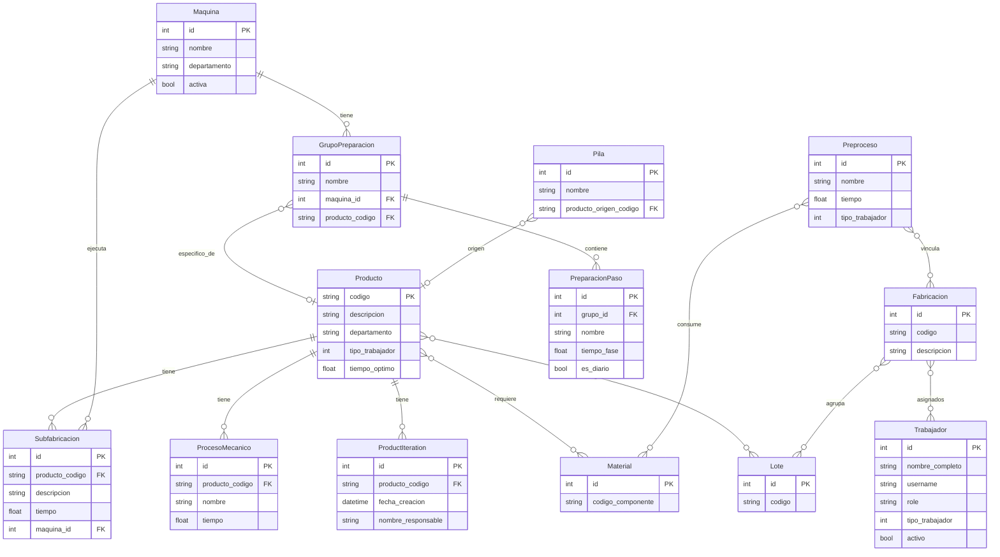

### Leyenda del Diccionario de Datos

El esquema ERD contiene campos de control lógico cuyo significado literal es:
- **`tipo_trabajador`** (INT) en Tablas `Producto`, `Subfabricacion`, `ProcesoMecanico` y `Trabajador`:
  - `1`: **Operario Básico / Junior** (Capaz de montar y ejecutar tareas estándar).
  - `2`: **Especialista / Mid** (Capaz de operar maquinaria pesada, Tornos/Fresas y programación CNC sencilla).
  - `3`: **Experto / Senior** (Capaz de validar calidad, resolver cuellos de botella y supervisar flujo).
---

### Modelos principales

| Modelo | Tabla | Descripción |
|---|---|---|
| `Producto` | `productos` | Catálogo de productos con tiempos y procesos |
| `Fabricacion` | `fabricaciones` | Orden de fabricación (OF) |
| `Trabajador` | `trabajadores` | Operarios y administradores |
| `Maquina` | `maquinas` | Recursos físicos de planta |
| `Preproceso` | `preprocesos` | Tareas preparatorias reutilizables |
| `Material` | `materiales` | Materias primas y componentes (BOM) |
| `Pila` | `pilas` | Plan de producción para simulación |
| `Lote` | `lotes` | Agrupación logística de fabricaciones |
| `GrupoPreparacion` | `grupos_preparacion` | Pasos de setup de máquina |

---

## Flujos Principales

### Flujo de Fabricación y Trazabilidad QR

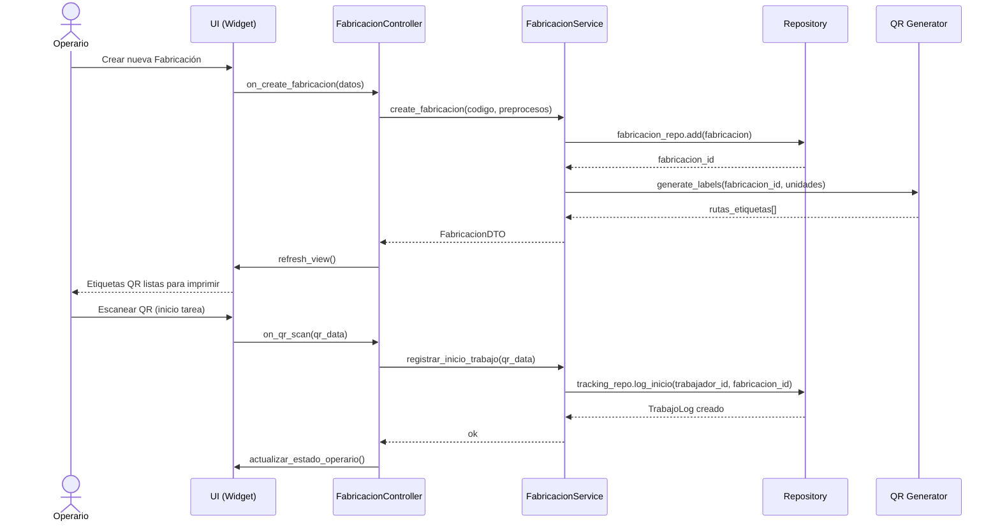

### Flujo de Importación BOM (A3RP)

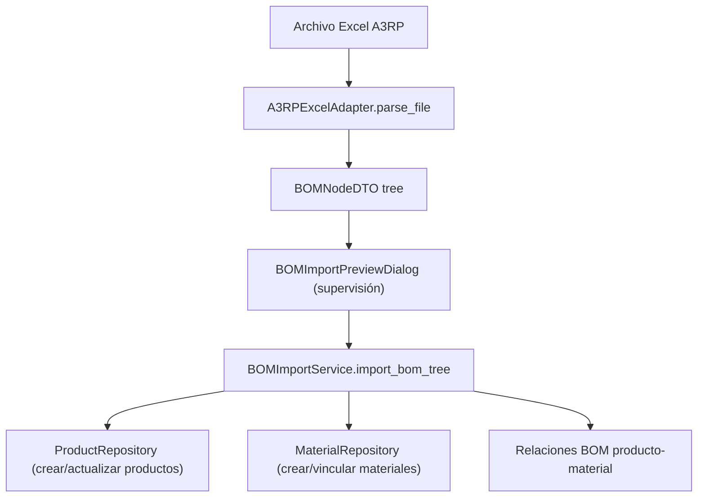

### Flujo de Simulación y Gantt

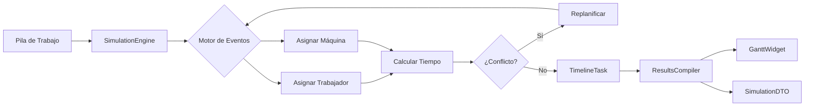

### Sistema de Etiquetado QR (Apli 1861)

Arquitectura desacoplada para la generación de etiquetas de trazabilidad. Soporta plantillas Word estáticas y generación dinámica de cuadrículas A5 (66 etiquetas).

```mermaid
graph TD
    subgraph SVC["📦 Core Services"]
        LM[LabelManager]
        QR[QrGenerator]
    end
    
    subgraph PORT["🔌 Ports (Interfaces)"]
        IDG[IDocumentGenerator]
    end
    
    subgraph ADAPT["🔌 Adapters (Infraestructure)"]
        DOCX[DocxGeneratorAdapter - Plantillas]
        APLI[Apli1861LabelGenerator - Dinámico A5]
    end
    
    LM --> IDG
    IDG <|-- DOCX
    IDG <|-- APLI
    LM --> QR
    APLI -->|Genera| DOC[Archivo .docx A5 / 66 etiquetas]
```

### Flujo de Sincronización Offline/USB

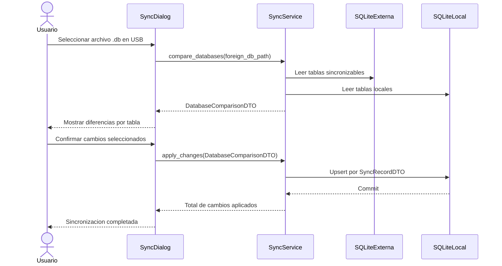

### Flujo de Login y Autorización

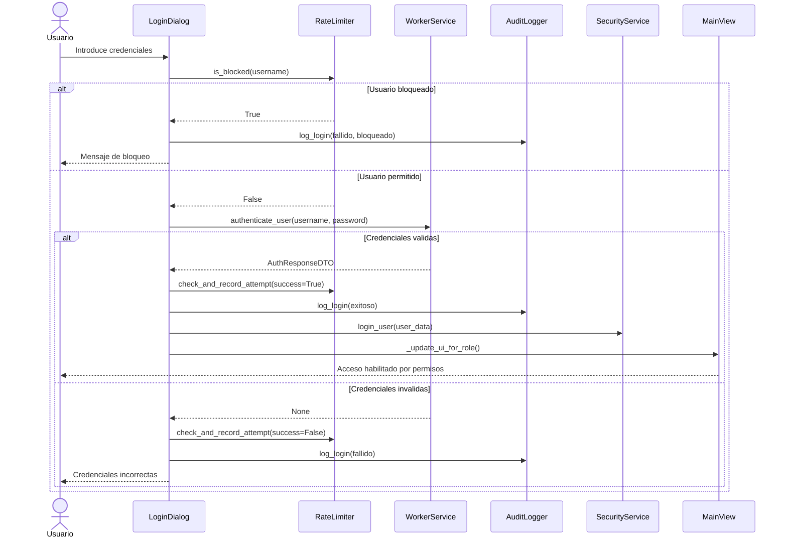

---

## Tecnologias

| Librería | Versión |
|---|---|
| Python | 3.12+ |
| alembic | N/A |
| bcrypt | N/A |
| greenlet | N/A |
| psycopg2-binary | N/A |
| PyQt6 | 6.10.1 |
| PyQt6-Charts | 6.10.0 |
| SQLAlchemy | 2.0.45 |
| pandas | 2.2.3 |
| openpyxl | 3.1.5 |
| Pillow | 12.0.0 |
| opencv-contrib-python | 4.12.0.88 |
| qrcode | 8.0 |
| python-docx | 1.2.0 |
| reportlab | 4.4.7 |
| jinja2 | 3.1.4 |
| markdown-pdf | 1.3.1 |
| requests | 2.32.0 |
| concurrent-log-handler | 0.9.25 |
| graphviz | 0.20.3 |
| wikiquote | 0.1.17 |
| wikipedia | 1.4.0 |
| pytest | 8.4.2 |
| pytest-cov | 6.0.0 |
| pytest-html | 4.1.1 |
| pytest-qt | 4.4.0 |
| pytest-mock | 3.14.0 |
| pytest-timeout | 2.3.1 |
| pytest-env | 1.1.3 |
| coverage | 7.6.0 |
| pylint | 3.3.0 |
| bandit | 1.7.10 |
| flake8 | 7.1.0 |
| mypy | 1.8.0 |

### ¿Qué representa cada tecnología? (explicación simple)

- `Python`: el “lenguaje de trabajo” del proyecto; el sistema programa toda la lógica.
- `SQLAlchemy`: traduce objetos Python a “filas/tablas” en la base de datos.
- `PyQt6`: crea la interfaz de escritorio (ventanas, botones, diálogos y señales).
- `Alembic`: gestiona cambios graduales del esquema de la base de datos.
- `pytest`: ejecuta la suite de pruebas para asegurar que todo funciona tras cambios.

- `mypy`: revisa tipos de forma estática para detectar errores antes de ejecutar.
- `Mermaid`: dibuja diagramas (arquitectura, relaciones y flujos) dentro del documento.
- `markdown-pdf`: convierte el Markdown final a PDF listo para leer/compartir.

---

## Instalacion y Despliegue

### Requisitos base

- Python 3.11 o superior; CI en 3.11 y 3.12 (`.github/workflows/ci.yml`); referencia de tipado mypy `python_version = 3.12`; `.python-version` recomienda 3.12 para pyenv.
- Entorno virtual (`venv`) recomendado
- Dependencias instaladas desde `requirements.txt`

### Instalación local (desarrollo)

1. Crear entorno virtual: `python -m venv .venv`
2. Activar entorno:
   - macOS/Linux: `source .venv/bin/activate`
   - Windows (PowerShell): `.venv\\Scripts\\Activate.ps1`
3. Instalar dependencias: `pip install -r requirements.txt`
4. Configurar entorno: copiar `.env.example` a `.env` y ajustar variables
5. Ejecutar aplicación: `python app.py`

### Configuración de rutas (producción)

- Base de datos: `DB_TYPE` y `DB_PATH` (SQLite por defecto en `data/montaje.db`).
- Logs: `LOG_DIR` (por defecto `logs`).
- Backups: `BACKUP_DIR` (por defecto `backups`).
- Todas las rutas relativas se resuelven desde la raíz del proyecto.

### Empaquetado para planta

- Script oficial: `python scripts/build_executable.py`
- Motor: PyInstaller
- Artefacto final: carpeta `dist/` con ejecutable `Hipatia`
- Incluye recursos críticos de migración (`migrations/` y `alembic.ini`).

---

## Suite de Tests

> Sección generada automáticamente desde `test_reports/compliance_data.json`. Ejecutar `python3 scripts/test_quality_analyzer.py` para actualizar.

### Filosofía de Testing

La suite de tests de Hipatia sigue un modelo de **calidad verificable** con tres principios fundamentales:

1. **Mocks estrictos por defecto** — `create_autospec()` o `MagicMock(spec=...)` para cualquier dependencia que tenga stubs de tipo disponibles. Esto garantiza que los tests fallen si la interfaz real cambia.

2. **Excepciones documentadas** — PyQt6 y python-docx no tienen stubs de tipo completos: en **widgets y diálogos Qt** suele usarse `MagicMock()` sin spec; el analizador solo trata como **inevitables** los mocks sueltos en líneas con indicios de widget Qt (heurística). Los **repositorios y servicios Python del proyecto** no entran en esa excepción: deben usar `create_autospec(ClaseReal, instance=True)` o `MagicMock(spec=[...])` acotado cuando proceda (ver `.agents/skills/testing_fixtures_y_mocks/SKILL.md`).

3. **Verificación de interacciones explícita** — En controladores y servicios, cada test que verifica una llamada usa `assert x.call_count == N` antes de `assert_called_once_with(...)`. Esto evita el antipatrón de `assert_called_once()` sin argumentos, que no verifica qué se pasó.

4. **Asserts observables por defecto** — `assert True` se considera un **smoke test** y solo se permite como último recurso, siempre documentado como `assert True  # smoke_test: ...`. Si existe un observable (estado/retorno/interacción), se prefiere ese assert.

El marcador `pytestmark = pytest.mark.unit` se aplica a nivel de módulo en todos los archivos de tests unitarios, permitiendo ejecutar subconjuntos con `pytest -m unit`.

### Sistema de Scoring y Techo Real

El analizador `scripts/test_quality_analyzer.py` asigna un **score absoluto** (0-100) basado en criterios objetivos, y calcula un **score techo** que descuenta las penalizaciones inevitables por dependencias externas sin stubs.

| Criterio | Puntos | Notas |
|---|---|---|
| Tiene `pytestmark` o `@pytest.mark.*` | +25 | Obligatorio en todos los archivos |
| Usa `create_autospec` / `spec=` | +20 | Para dependencias con stubs disponibles |
| Verifica interacciones (`assert_called*`) | +15 | Obligatorio en controllers/services |
| Valida DTOs con `isinstance(..., XxxDTO)` | +15 | Para tests de capa de servicio |
| Todos los `@patch` tienen `autospec=True` | +15 | Excepto builtins/Qt/OS |
| Tiene docstrings en clases y métodos | +10 | |
| `MagicMock()` sin spec (por mock) | -5 (máx -30) | Inevitable si usa PyQt6/docx |
| `@patch` sin autospec (por patch) | -3 (máx -20) | Inevitable para builtins/Qt/OS |
| Test sin ningún `assert` (por test) | -5 (máx -20) | Siempre corregible |
| `assert True` trivial sin justificar | -1 (máx -10) | Solo permitido con `# smoke_test:` |
| `assert_called_once()` sin args | -3 (máx -15) | Antipatrón: no verifica argumentos |

Cuando un archivo alcanza su **techo real** (`score optimizado = techo`), el analizador lo marca con ✅ y explica la razón (p. ej. importa PyQt6 y el techo solo perdona parte de los `MagicMock()` sueltos en contexto de widgets). El estado del archivo (`Actualizado / En Progreso / Legacy`) se calcula sobre el score techo, no el absoluto, para no penalizar lo ya optimizado.

### Resumen Global

| Métrica | Valor |
|---|---|
| Archivos analizados | 240 |
| Actualizados (≥80 techo) | 214 |
| En Progreso (50-79) | 26 |
| Legacy / Pendiente (<50) | 0 |
| Score absoluto medio | 75.1/100 |
| Score optimizado medio | 76.9/100 |
| Archivos en su techo real | 240/240 |

### Detalle por Archivo

Columnas: **Score** = score absoluto · **Techo** = score máximo alcanzable · **✅** = en techo real · **Estado** = calculado sobre techo

| Archivo | Score | Techo | Estado | Decisión técnica de mocking |
|---|---|---|---|---|
| `conftest.py` | 100 | 100 ✅ | Actualizado | — |
| `__init__.py` | 100 | 100 ✅ | Actualizado | — |
| `__init__.py` | 100 | 100 ✅ | Actualizado | — |
| `audit_report_generator.py` | 100 | 100 ✅ | Actualizado | — |
| `test_iteration_repository.py` | 100 | 100 ✅ | Actualizado | — |
| `test_app_model.py` | 100 | 100 ✅ | Actualizado | — |
| `test_dashboard_widget.py` | 100 | 100 ✅ | Actualizado | DummyChartView(QWidget) en patch de QChartView; Dashboard sin set_controller ni hub — solo update_* desde UIController |
| `test_pila_controller_comprehensive.py` | 100 | 100 ✅ | Actualizado | PilaService/ProductService/FabricacionService → create_autospec(); repositorios con MagicMock(spec=[métodos mínimos])... |
| `test_calculate_times_widget.py` | 100 | 100 ✅ | Actualizado | — |
| `test_product_dialogs_coverage.py` | 70 | 100 ✅ | Actualizado | Diálogos Qt heredan de QDialog → MagicMock() inevitable para widgets internos; ProductDetailsDialog usa ``ProductCont... |
| `test_a3rp_excel_adapter.py` | 100 | 100 ✅ | Actualizado | — |
| `test_lote_manager_isolated.py` | 70 | 100 ✅ | Actualizado | create_autospec() con IPilaDatabase/IProductService/IFabricacionService para garantizar que las llamadas respetan las... |
| `test_historial_controller_comprehensive.py` | 70 | 100 ✅ | Actualizado | Widgets Qt del historial → MagicMock() sin spec (inevitable en UI); `iteration_repo` y `product_repo` → `create_autos... |
| `test_preproceso_controller_comprehensive.py` | 100 | 100 ✅ | Actualizado | — |
| `test_machine_repository.py` | 100 | 100 ✅ | Actualizado | — |
| `test_prep_dialogs_coverage.py` | 100 | 100 ✅ | Actualizado | — |
| `test_navigation_controller_comprehensive.py` | 70 | 100 ✅ | Actualizado | Widgets de destino (CalculateTimesWidget, DefinirLoteWidget, GestionDatosWidget) importados para isinstance() pero in... |
| `test_pila_manager_isolated.py` | 70 | 100 ✅ | Actualizado | create_autospec() con IPilaService para garantizar interfaz; QDialog importado para isinstance() pero instancias con ... |
| `test_calculation_controller_comprehensive.py` | 82 | 100 ✅ | Actualizado | CalculateTimesWidget es Qt → `MagicMock()` con `__class__` forzado para `isinstance`; `@patch('QFileDialog')` y `@pat... |
| `test_worker_controller_comprehensive.py` | 70 | 100 ✅ | Actualizado | — |
| `__init__.py` | 100 | 100 ✅ | Actualizado | — |
| `test_camera_manager_full.py` | 100 | 100 ✅ | Actualizado | — |
| `test_ui_controller_comprehensive.py` | 70 | 100 ✅ | Actualizado | HomeWidget y widgets de progreso son Qt → MagicMock() sin spec inevitable; llamadas asíncronas verificadas con assert... |
| `test_lote_controller_comprehensive.py` | 70 | 100 ✅ | Actualizado | Componentes Qt (QTableWidgetItem, QSpinBox, pyqtSignal) parcheados antes de importar LoteController para evitar SIGAB... |
| `test_ui_signals_controller_comprehensive.py` | 100 | 100 ✅ | Actualizado | — |
| `test_worker_main_window.py` | 70 | 100 ✅ | Actualizado | WorkerMainWindow es QMainWindow (PyQt6) → MagicMock() inevitable para widgets internos; usuario activo simulado con M... |
| `test_preproceso_repository.py` | 100 | 100 ✅ | Actualizado | — |
| `test_product_controller_v2_comprehensive.py` | 100 | 100 ✅ | Actualizado | mock_app con create_autospec(AppController) y servicios/repos; PreprocesoDialog se aserta con material_port=controlle... |
| `test_app_controller_orchestration.py` | 100 | 100 ✅ | Actualizado | — |
| `test_machine_controller_comprehensive.py` | 70 | 100 ✅ | Actualizado | MachinesWidget y GestionDatosWidget son Qt → MagicMock() sin spec; servicio de seguridad parcheado globalmente con au... |
| `test_qapp_crash.py` | 100 | 100 ✅ | Actualizado | — |
| `test_simulation_controller_comprehensive.py` | 100 | 100 ✅ | Actualizado | SimulationEngine puro Python → `create_autospec(SimulationEngine)`; widgets de resultado Qt → `MagicMock()` |
| `test_define_flow_dialog_edge.py` | 70 | 100 ✅ | Actualizado | DefineProductionFlowDialog depende de DefineControlPanel (QWidget) → sustituido por FakeControlPanel(QWidget) real co... |
| `test_product_controller_preprocesos.py` | 70 | 100 ✅ | Actualizado | ProductController depende de AppController → MagicMock() estándar; QDialog/QMessageBox parcheados con patch() para in... |
| `test_di_container_lifecycle.py` | 100 | 100 ✅ | Actualizado | — |
| `test_charts_container.py` | 100 | 100 ✅ | Actualizado | — |
| `test_canvas_widgets.py` | 100 | 100 ✅ | Actualizado | — |
| `__init__.py` | 100 | 100 ✅ | Actualizado | — |
| `__init__.py` | 100 | 100 ✅ | Actualizado | — |
| `__init__.py` | 100 | 100 ✅ | Actualizado | — |
| `macos_fix.py` | 100 | 100 ✅ | Actualizado | — |
| `__init__.py` | 100 | 100 ✅ | Actualizado | — |
| `test_product_repository_db.py` | 100 | 100 ✅ | Actualizado | — |
| `__init__.py` | 100 | 100 ✅ | Actualizado | — |
| `__init__.py` | 100 | 100 ✅ | Actualizado | — |
| `test_backup_restore_dialog.py` | 100 | 100 ✅ | Actualizado | Diálogo Qt → `MagicMock()` inevitable para todos los widgets del diálogo |
| `test_flow_item_widget.py` | 100 | 100 ✅ | Actualizado | — |
| `test_fabrication_dialogs.py` | 82 | 94 ✅ | Actualizado | — |
| `test_report_controller_comprehensive.py` | 77 | 92 ✅ | Actualizado | Controlador con múltiples widgets Qt → `MagicMock()` para widgets; `create_autospec` para servicios de negocio puros |
| `test_cycle_reproduction.py` | 85 | 85 ✅ | Actualizado | — |
| `test_backup_integration.py` | 85 | 85 ✅ | Actualizado | — |
| `test_audit_report_generator.py` | 85 | 85 ✅ | Actualizado | — |
| `test_features_worker_controller.py` | 85 | 85 ✅ | Actualizado | — |
| `test_preparation_service.py` | 85 | 85 ✅ | En Progreso | — |
| `test_app_coverage.py` | 85 | 85 ✅ | Actualizado | Cobertura de app.py → `@patch('QApplication')` sin autospec (Qt inevitable) |
| `test_label_manager.py` | 85 | 85 ✅ | Actualizado | python-docx sin stubs → `sys.modules['docx'] = MagicMock()` en módulo; `create_autospec(logging.Logger)` para logger;... |
| `test_scheduler_logic.py` | 85 | 85 ✅ | Actualizado | Lógica de planificación pura → tests sin mocks, solo DTOs reales |
| `test_ui_scaler.py` | 85 | 85 ✅ | Actualizado | — |
| `test_lotes_widget.py` | 85 | 85 ✅ | Actualizado | — |
| `test_security_improvements.py` | 85 | 85 ✅ | Actualizado | Módulo de seguridad sin UI → `create_autospec` para hasher y validadores |
| `test_apli_adapter.py` | 85 | 85 ✅ | Actualizado | — |
| `test_products_widget.py` | 85 | 85 ✅ | Actualizado | — |
| `test_historial_widget.py` | 85 | 85 ✅ | Actualizado | — |
| `test_fabrication_dialogs_coverage.py` | 85 | 85 ✅ | Actualizado | CreateFabricacionDialog es QDialog (PyQt6) → MagicMock() inevitable para widgets; objetos Preproceso/Producto simulad... |
| `test_machine_service.py` | 85 | 85 ✅ | En Progreso | MachineService puro Python → `create_autospec(DatabaseManager, instance=True)` y `create_autospec(MachineRepository, ... |
| `test_reports_widgets.py` | 85 | 85 ✅ | Actualizado | StatCard, OrderListWidget, SmartSearchWidget, ReportsChartsWidget son QWidget/QFrame (PyQt6) → MagicMock() inevitable... |
| `test_backup_controller.py` | 85 | 85 ✅ | Actualizado | — |
| `test_enhanced_flow_dialog.py` | 70 | 85 ✅ | Actualizado | — |
| `test_phase5_di_injection.py` | 85 | 85 ✅ | Actualizado | — |
| `test_product_service_delegation.py` | 85 | 85 ✅ | Actualizado | — |
| `test_maintenance_service.py` | 85 | 85 ✅ | En Progreso | — |
| `test_dialog_dependencies.py` | 85 | 85 ✅ | Actualizado | — |
| `test_reports_infrastructure.py` | 85 | 85 ✅ | Actualizado | Infraestructura de reportes → `create_autospec` para generadores; `@patch('builtins.open')` inevitable |
| `test_inspector_panel.py` | 85 | 85 ✅ | Actualizado | — |
| `test_widgets_coverage.py` | 85 | 85 ✅ | Actualizado | — |
| `test_product_service_core_paths.py` | 85 | 85 ✅ | Actualizado | — |
| `test_health_checker.py` | 85 | 85 ✅ | Actualizado | — |
| `test_define_flow_dialog.py` | 85 | 85 ✅ | Actualizado | — |
| `test_database_manager_full.py` | 85 | 85 ✅ | Actualizado | — |
| `test_settings_widget.py` | 85 | 85 ✅ | Actualizado | SettingsWidget Qt → `MagicMock()` inevitable; `create_autospec` para ScheduleController |
| `test_enhanced_flow_presenter.py` | 85 | 85 ✅ | Actualizado | — |
| `test_configuration_repository.py` | 85 | 85 ✅ | En Progreso | — |
| `test_worker_validation_service.py` | 85 | 85 ✅ | En Progreso | — |
| `test_common_dialogs.py` | 85 | 85 ✅ | Actualizado | — |
| `test_preprocesos_widget.py` | 85 | 85 ✅ | Actualizado | — |
| `test_product_service.py` | 85 | 85 ✅ | En Progreso | — |
| `test_security_phase2_integration.py` | 85 | 85 ✅ | Actualizado | Test de integración de seguridad → usa BD real en memoria (SQLite); sin mocks de repositorio |
| `test_tracking_repository_stats_export.py` | 85 | 85 ✅ | En Progreso | — |
| `test_charts_widget.py` | 85 | 85 ✅ | Actualizado | — |
| `test_session_controller_comprehensive.py` | 85 | 85 ✅ | Actualizado | SessionController sin dependencias Qt directas → `create_autospec` para todos los servicios |
| `test_backup_service.py` | 85 | 85 ✅ | En Progreso | — |
| `test_startup_controller.py` | 85 | 85 ✅ | Actualizado | StartupController orquesta arranque → `MagicMock(spec=[...])` para cada subsistema |
| `test_health_test_runner.py` | 85 | 85 ✅ | Actualizado | — |
| `test_create_fabricacion_dialog.py` | 80 | 85 ✅ | Actualizado | — |
| `test_visual_effects.py` | 85 | 85 ✅ | Actualizado | — |
| `test_worker_service.py` | 85 | 85 ✅ | En Progreso | WorkerService puro Python → `create_autospec(DatabaseManager, instance=True)` y `create_autospec` en WorkerRepository... |
| `test_define_flow_presenter.py` | 85 | 85 ✅ | Actualizado | DefineFlowPresenter lógica pura → `create_autospec(MachineService)` / mocks de `PreparationService` para consultas de... |
| `test_app_model_coverage.py` | 85 | 85 ✅ | Actualizado | — |
| `test_widgets_dashboard.py` | 85 | 85 ✅ | Actualizado | — |
| `test_reportes_widget.py` | 85 | 85 ✅ | Actualizado | ReportesWidget (hub Qt) → hub con `container` (DI) y/o `model.report_service`; `create_autospec(ReportService)`; sub-... |
| `test_smart_search.py` | 85 | 85 ✅ | Actualizado | SmartSearch puro Python → `create_autospec` para índice; sin dependencias externas |
| `test_bom_import_service.py` | 85 | 85 ✅ | En Progreso | — |
| `test_order_list_widget.py` | 85 | 85 ✅ | Actualizado | — |
| `test_qr_scanner.py` | 85 | 85 ✅ | Actualizado | QR Scanner con cámara → `@patch('cv2.VideoCapture')` sin autospec (C extension) |
| `test_worker_db_sync.py` | 85 | 85 ✅ | Actualizado | — |
| `test_machine_controller.py` | 85 | 85 ✅ | Actualizado | — |
| `test_flow_canvas.py` | 85 | 85 ✅ | Actualizado | — |
| `test_order_list.py` | 85 | 85 ✅ | Actualizado | — |
| `test_bitacora_dialog.py` | 85 | 85 ✅ | Actualizado | FabricacionBitacoraDialog (Qt) → mock `controller.model.planning_facade` o `pila_service`; ya no se asertan llamadas ... |
| `test_backup_controller_comprehensive.py` | 85 | 85 ✅ | Actualizado | — |
| `test_product_repository.py` | 85 | 85 ✅ | En Progreso | — |
| `test_hardware_controller.py` | 85 | 85 ✅ | Actualizado | — |
| `test_historial_report_manager_security.py` | 85 | 85 ✅ | Actualizado | `require_permission` + `set_security_service` con `MagicMock(spec=SecurityService)`; sin Qt real |
| `test_event_engine_comprehensive.py` | 85 | 85 ✅ | Actualizado | — |
| `test_timeline_widget.py` | 85 | 85 ✅ | Actualizado | TimelineWidget Qt puro → todos los mocks `MagicMock()` inevitables |
| `test_flow_builder_service.py` | 85 | 85 ✅ | En Progreso | — |
| `test_schedule_controller_comprehensive.py` | 63 | 85 ✅ | Actualizado | SettingsWidget es Qt → `MagicMock()` con `__class__` forzado; factories `_make_db/_make_view/_make_schedule_manager` ... |
| `test_file_controller.py` | 85 | 85 ✅ | Actualizado | — |
| `test_dialogs.py` | 85 | 85 ✅ | Actualizado | — |
| `test_workers_widget.py` | 85 | 85 ✅ | Actualizado | — |
| `test_report_strategy_comprehensive.py` | 85 | 85 ✅ | Actualizado | Estrategias de reporte puras → `create_autospec` para cada estrategia concreta |
| `test_tracking_exceptions.py` | 85 | 85 ✅ | Actualizado | Excepciones de dominio puras → tests sin mocks, solo instanciación y asserts |
| `test_worker_camera_config.py` | 85 | 85 ✅ | Actualizado | — |
| `test_fabricacion_controller_comprehensive.py` | 85 | 85 ✅ | Actualizado | — |
| `test_simulation_events_comprehensive.py` | 85 | 85 ✅ | Actualizado | Eventos de simulación sin UI → `create_autospec` para engine y repositorios |
| `test_controller_interface.py` | 85 | 85 ✅ | Actualizado | — |
| `test_tracking_assignment_service.py` | 85 | 85 ✅ | En Progreso | TrackingService puro Python → `create_autospec` para todos los repositorios |
| `test_widgets_integration.py` | 85 | 85 ✅ | Actualizado | WorkersWidget() tras registrar WorkerController en DIContainer; señales a management_manager |
| `test_app_model_services_setup.py` | 85 | 85 ✅ | Actualizado | — |
| `test_reports_ui_integration.py` | 85 | 85 ✅ | Actualizado | — |
| `test_pila_integration.py` | 85 | 85 ✅ | Actualizado | — |
| `test_iteration_setup.py` | 85 | 85 ✅ | Actualizado | — |
| `test_app_services_e2e_setup.py` | 85 | 85 ✅ | Actualizado | — |
| `test_machine_workflow.py` | 85 | 85 ✅ | Actualizado | — |
| `test_iteration_workflow.py` | 85 | 85 ✅ | Actualizado | — |
| `test_security_workflow.py` | 85 | 85 ✅ | Actualizado | — |
| `test_product_workflow.py` | 85 | 85 ✅ | Actualizado | — |
| `test_dialogs_e2e.py` | 85 | 85 ✅ | Actualizado | — |
| `test_backup_audit_e2e.py` | 85 | 85 ✅ | Actualizado | — |
| `test_fabricacion_manager.py` | 85 | 85 ✅ | Actualizado | — |
| `test_material_manager.py` | 85 | 85 ✅ | Actualizado | — |
| `test_product_manager.py` | 85 | 85 ✅ | Actualizado | — |
| `test_preproceso_manager.py` | 85 | 85 ✅ | Actualizado | — |
| `test_management_manager.py` | 85 | 85 ✅ | Actualizado | — |
| `test_auth_manager.py` | 85 | 85 ✅ | Actualizado | — |
| `test_task_manager.py` | 85 | 85 ✅ | Actualizado | — |
| `test_sync_service.py` | 80 | 80 ✅ | En Progreso | SyncService con threading → `create_autospec` para repositorios; `MagicMock()` para objetos de hilo |
| `test_main_window.py` | 75 | 75 ✅ | Actualizado | — |
| `test_app_startup_integration.py` | 75 | 75 ✅ | Actualizado | MainView + init_ui: sustituto de QChartView como QWidget real (_FakeChartView) para addWidget; GestionDatosWidget ver... |
| `test_flow_action_handler.py` | 75 | 75 ✅ | Actualizado | — |
| `test_machines_widget.py` | 70 | 70 ✅ | Actualizado | Widget Qt puro → todos los mocks son `MagicMock()` inevitables; sin lógica de negocio testeable con autospec |
| `test_dialogs_flow.py` | 70 | 70 ✅ | Actualizado | — |
| `test_health_worker.py` | 70 | 70 ✅ | Actualizado | — |
| `test_fabrications_widget.py` | 70 | 70 ✅ | Actualizado | — |
| `test_canvas_widgets_coverage.py` | 70 | 70 ✅ | Actualizado | CardWidget (×2) y CanvasWidget/ProductionFlowCanvas son QWidget/QLabel (PyQt6) → MagicMock() inevitable; CardWidget d... |
| `test_tracking_repository_full.py` | 70 | 70 ✅ | En Progreso | — |
| `test_security_validation.py` | 70 | 70 ✅ | Actualizado | Validación de seguridad pura → tests sin mocks, solo asserts sobre lógica |
| `test_camera_config_dialog.py` | 70 | 70 ✅ | Actualizado | — |
| `test_gestion_datos_widget.py` | 70 | 70 ✅ | Actualizado | GestionDatosWidget instancia pestañas vía DI → monkeypatch ``DIContainer.get_instance`` con mock ``resolve``/``is_reg... |
| `test_home_widget.py` | 70 | 70 ✅ | Actualizado | — |
| `test_dialogs_integration.py` | 70 | 70 ✅ | Actualizado | — |
| `test_label_counter_setup.py` | 70 | 70 ✅ | Actualizado | — |
| `test_conftest_infrastructure.py` | 70 | 70 ✅ | Actualizado | — |
| `test_main_window_flows.py` | 70 | 70 ✅ | Actualizado | — |
| `test_camera_config_presenter.py` | 65 | 65 ✅ | Actualizado | — |
| `test_camera_manager_no_cv2.py` | 65 | 65 ✅ | Actualizado | — |
| `test_camera_manager_main.py` | 65 | 65 ✅ | Actualizado | — |
| `test_macos_fix.py` | 65 | 65 ✅ | Actualizado | — |
| `test_utility_dialogs_coverage.py` | 65 | 65 ✅ | Actualizado | — |
| `test_reports_repository.py` | 65 | 65 ✅ | En Progreso | Repositorio SQLAlchemy → `create_autospec(Session)` para sesión de BD |
| `test_label_counter_repository.py` | 65 | 65 ✅ | En Progreso | — |
| `test_pila_repository.py` | 65 | 65 ✅ | En Progreso | — |
| `test_flow_simulation_service.py` | 65 | 65 ✅ | En Progreso | — |
| `test_lote_repository.py` | 65 | 65 ✅ | En Progreso | — |
| `test_password_service.py` | 65 | 65 ✅ | En Progreso | — |
| `test_worker_repository.py` | 65 | 65 ✅ | En Progreso | — |
| `test_detect_dead_code.py` | 65 | 65 ✅ | Actualizado | Script de análisis estático sin Qt → `MethodExtractor`, `extract_package_classes`, `main` mockeado con `DIALOGS_PACKA... |
| `test_reports_integration.py` | 65 | 65 ✅ | Actualizado | — |
| `test_iteration_integration.py` | 65 | 65 ✅ | Actualizado | — |
| `test_label_counter_integration.py` | 65 | 65 ✅ | Actualizado | — |
| `test_material_repository.py` | 65 | 65 ✅ | En Progreso | — |
| `test_tracking_repository_unit.py` | 65 | 65 ✅ | En Progreso | — |
| `test_pila_service_planning_session.py` | 60 | 60 ✅ | Actualizado | — |
| `test_flow_toolbar.py` | 60 | 60 ✅ | Actualizado | — |
| `test_create_dialog.py` | 50 | 55 ✅ | Actualizado | — |
| `test_audit_infra.py` | 50 | 50 ✅ | Actualizado | — |
| `test_common_production_dialogs.py` | 50 | 50 ✅ | Actualizado | — |
| `test_inspector_presenter.py` | 50 | 50 ✅ | Actualizado | — |
| `test_connection_dialog_comprehensive.py` | 50 | 50 ✅ | Actualizado | — |
| `test_architecture_layer_edges.py` | 50 | 50 ✅ | Actualizado | — |
| `test_qt_log_handler.py` | 50 | 50 ✅ | Actualizado | — |
| `test_help_widget.py` | 50 | 50 ✅ | Actualizado | — |
| `test_log_terminal_widget.py` | 50 | 50 ✅ | Actualizado | — |
| `test_dialog_integration_smoke.py` | 50 | 50 ✅ | Actualizado | CycleEndConfigDialog, ReassignmentRuleDialog, DefinirCantidadesDialog son QDialog (PyQt6) → MagicMock() inevitable pa... |
| `test_ui_opt3_features_no_ui_imports.py` | 50 | 50 ✅ | Actualizado | — |
| `test_code_quality_config.py` | 50 | 50 ✅ | Actualizado | — |
| `test_schedule_helpers.py` | 50 | 50 ✅ | Actualizado | — |
| `test_tracking_repository_coverage_fix.py` | 50 | 50 ✅ | En Progreso | — |
| `test_prep_steps_widget.py` | 50 | 50 ✅ | Actualizado | PrepStepsWidget: avisos de validación con ``validation_warning`` (pyqtSignal); qtbot.waitSignal en tests de campos va... |
| `test_report_sheets.py` | 50 | 50 ✅ | Actualizado | Hojas de reporte con openpyxl → `create_autospec(Workbook)` para libro Excel |
| `test_temporal_storage.py` | 50 | 50 ✅ | Actualizado | RegistroTemporal en archivo temporal real → un evento, `close()`, `consultar_eventos`; `cleanup()` en finally |
| `test_library_panel.py` | 50 | 50 ✅ | Actualizado | TaskLibraryPanel es QWidget (PyQt6) → MagicMock() inevitable para dependencias visuales; update_visual_state() parche... |
| `test_startup_screen_report.py` | 50 | 50 ✅ | Actualizado | — |
| `test_database_config.py` | 50 | 50 ✅ | Actualizado | — |
| `test_opt4_ast_guard_no_static_ui_imports.py` | 50 | 50 ✅ | Actualizado | — |
| `test_protocols_imports.py` | 50 | 50 ✅ | Actualizado | — |
| `test_startup_screen_constants.py` | 50 | 50 ✅ | Actualizado | — |
| `test_paths.py` | 50 | 50 ✅ | Actualizado | — |
| `test_fabrication_module_structure.py` | 50 | 50 ✅ | Actualizado | — |
| `test_test_quality_analyzer_domain.py` | 50 | 50 ✅ | Actualizado | — |
| `test_tracking_dialogs.py` | 50 | 50 ✅ | Actualizado | Diálogos de tracking Qt → `MagicMock()` para widgets; `create_autospec` para servicios |
| `test_create_presenter.py` | 50 | 50 ✅ | Actualizado | — |
| `test_ui_opt2_fabrication_dialogs_boundary.py` | 50 | 50 ✅ | Actualizado | — |
| `test_machine_integration.py` | 50 | 50 ✅ | Actualizado | — |
| `test_worker_integration.py` | 50 | 50 ✅ | Actualizado | — |
| `test_configuration_integration.py` | 50 | 50 ✅ | Actualizado | — |
| `test_product_integration.py` | 50 | 50 ✅ | Actualizado | — |
| `test_preproceso_integration.py` | 50 | 50 ✅ | Actualizado | — |
| `test_docx_adapter.py` | 50 | 50 ✅ | Actualizado | — |
| `test_app_model_integration.py` | 50 | 50 ✅ | Actualizado | — |
| `test_widgets_setup.py` | 50 | 50 ✅ | Actualizado | — |
| `test_preproceso_setup.py` | 50 | 50 ✅ | Actualizado | — |
| `test_product_setup.py` | 50 | 50 ✅ | Actualizado | — |
| `test_machine_setup.py` | 50 | 50 ✅ | Actualizado | — |
| `test_pila_setup.py` | 50 | 50 ✅ | Actualizado | — |
| `test_dialogs_setup.py` | 50 | 50 ✅ | Actualizado | — |
| `test_worker_setup.py` | 50 | 50 ✅ | Actualizado | — |
| `test_macos_setup.py` | 50 | 50 ✅ | Actualizado | — |
| `test_tracking_repository_setup.py` | 50 | 50 ✅ | En Progreso | — |
| `test_pila_workflow.py` | 50 | 50 ✅ | Actualizado | — |
| `test_preproceso_workflow.py` | 50 | 50 ✅ | Actualizado | — |
| `test_worker_workflow.py` | 50 | 50 ✅ | Actualizado | — |
| `test_label_counter_e2e.py` | 50 | 50 ✅ | Actualizado | — |
| `test_package_compliance.py` | 50 | 50 ✅ | Actualizado | — |
| `test_main_header.py` | 50 | 50 ✅ | Actualizado | — |
| `test_main_nav_panel.py` | 50 | 50 ✅ | Actualizado | — |
| `test_flow_simulation_handler.py` | 50 | 50 ✅ | Actualizado | — |
| `test_planning_session_access.py` | 40 | 40 ✅ | Actualizado | — |
| `test_bom_import_preview_dialog.py` | 40 | 40 ✅ | Actualizado | — |
| `test_bom_importer.py` | 25 | 25 ✅ | Actualizado | — |

---

## Referencia de Componentes

> Extraído automáticamente de los docstrings del código fuente. Organizado por capa.

<div class='pagebreak'></div>

<div id='folder_root'>

## Raíz del proyecto

</div>

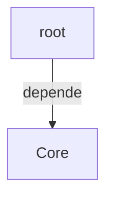

<div id='sec_app_py'>

### 📄 `app.py`

</div>

Nombre del Módulo: app.py
Descripcion: Punto de entrada principal para la aplicación Hipatia (Cálculo de Tiempos de Fabricación).
             Se encarga de la inicialización de QT, configuración de BD, logging y arranque de controladores.
             También crea e instala el ``QtLogHandler`` que alimenta la terminal interna de advertencias
             y errores visible en la pantalla de inicio.

             En ejecutable PyInstaller (Windows), ``_fix_qt_macos`` no aplica; BD, logs y config editable
             se resuelven con ``core.paths`` (directorio del ``.exe``).

- 🔧 `_check_dependencies`: Verifica e importa dependencias opcionales dinámicamente. En particular, intenta cargar OpenCV (cv2) para funcionalidades de cámara.
- 🔧 `_fix_qt_macos`: Aplica correcciones específicas para macOS. Resuelve problemas conocidos de Qt con espacios en rutas y configuración de plugins.
- 🔧 `setup_logging`: Configura el sistema de registro (logging) en archivo y consola. Implementa rotación de archivos concurrente y salida por consola con diferentes niveles de detalle. El ``QtLogHandler`` NO se crea aquí: se instala en ``main()`` después de crear ``QApplication``, ya que ``QObject`` requiere que exista una instancia de ``QApplication``.
- 🔧 `main`: Punto de entrada principal que orquesta el arranque de la aplicación. Inicializa la base de datos, el modelo, la vista y el controlador principal, gestionando también el proceso de autenticación de usuario. Después del login conecta el ``QtLogHandler`` al ``HomeWidget`` para que la terminal interna de la pantalla de inicio reciba los mensajes de advertencia y error generados durante la sesión. El ``QtLogHandler`` se crea DESPUÉS de ``QApplication`` porque ``QObject`` no puede instanciarse antes de que exista un event-loop de Qt. El buffer interno del handler almacena los warnings del arranque y los reproduce en cuanto el widget está listo.

---

<div id='sec_analyze_ui_py'>

### 📄 `analyze_ui.py`

</div>

Nombre del Módulo: analyze_ui.py
Descripción: Script para analizar la complejidad y estructura de los archivos de la interfaz de usuario (UI).
             Extrae clases, métodos, complejidad ciclomática aproximada y uso de señales/conexiones.

- 🔧 `analyze_file`: Analiza un archivo Python individual para extraer métricas de estructura y complejidad. Args: filepath: Ruta absoluta o relativa al archivo .py que se desea analizar. Returns: Un diccionario con el recuento de líneas, ruta del archivo y una lista de clases encontradas con sus métodos y métricas asociadas.
- 🔧 `main`: Punto de entrada principal del script. Escanea los directorios de UI y genera un informe en formato JSON.

---

<div id='sec_generate_ui_report_py'>

### 📄 `generate_ui_report.py`

</div>

- 🔧 `generate_markdown`: Lee un informe JSON de análisis de UI y genera un documento Markdown estructurado. Args: json_path: Ruta al archivo JSON generado por analyze_ui.py. output_path: Ruta donde se guardará el informe Markdown resultante.

---

<div class='pagebreak'></div>

<div id='folder_controllers'>

## Capítulo: `controllers/`

</div>

| Métrica | Valor |
|---|---:|
| Archivos `.py` en `controllers/` | 56 |
| Incluidos en el cuerpo | 56 |
| Omitidos (docstrings/reglas) | 0 |
| Clases detectadas (AST) | 60 |

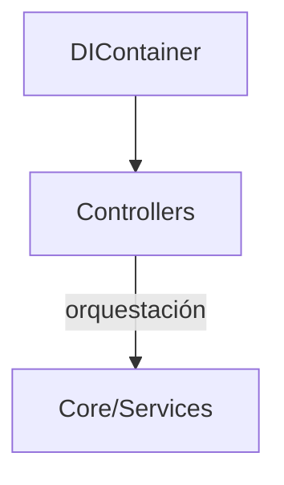

<div class='pagebreak'></div>

## controllers/ — Referencia

<div id='sec_controllers___init___py'>

### 📄 `controllers/__init__.py`

</div>

Nombre del Paquete: controllers
Descripción: Centraliza y exporta todos los controladores del sistema Hipatia.
             Sigue el patrón MVC, donde los controladores actúan como mediadores entre 
             los modelos de datos y las vistas de la interfaz de usuario.

---

<div id='sec_controllers_app_controller_py'>

### 📄 `controllers/app_controller.py`

</div>

Nombre del Módulo: app_controller.py
Descripción: Orquestador central de la aplicación. Gestiona el ciclo de vida de los 
             sub-controladores y coordina la comunicación entre el modelo global y la vista principal.

#### 🏛️ Clase `AppController`

Controlador Principal de la Aplicación.

Actúa como el 'Hub' central de la lógica de negocio, encargándose de la 
inicialización de la infraestructura, la inyección de dependencias a través 
del contenedor DI y la delegación de tareas a controladores especializados.

**Métodos Principales:**

- `__init__`: Inicializa el orquestador principal y sus dependencias base. Args: model: Instancia del modelo de aplicación (AppModel). view: Instancia de la vista principal (MainView). schedule_manager: Gestor de configuración de horarios.
- `initialize_infra`: Inicializa la infraestructura básica y los sub-controladores. Este método prepara los servicios y estados antes de que se conecten las señales de la UI.
- `connect_all_signals`: Establece todas las conexiones de señales y slots entre controladores y la UI. Debe llamarse una vez que todos los componentes visuales han sido inicializados.
- `initialize`: Realiza una inicialización completa de la aplicación (infraestructura + señales). Método de conveniencia para arranques estándar.
- `cleanup`: Limpieza de recursos al cerrar la aplicación.
- `current_user`: Obtiene el usuario autenticado actualmente a través del controlador de sesión. Returns: Instancia del usuario actual o None si no hay sesión activa.
- `current_user`: Permite sincronizar el usuario actual con SessionController.
- `on_data_changed`: Notifica a los componentes interesados que los datos globales han cambiado. Coordina la actualización de la UI y el refresco de tablas de búsqueda.
- `config_get_setting`: Compatibilidad para widgets que reciben AppController durante arranque y esperan la API de configuración del ScheduleController.
- `config_set_setting`: Compatibilidad para escritura de configuración en arranque temprano.
- `handle_attach_file`: Delega la adjunción de archivos al FileController.

---

<div id='sec_controllers_backup_controller_py'>

### 📄 `controllers/backup_controller.py`

</div>

Nombre del Módulo: backup_controller.py
Descripción: Gestiona las operaciones de copia de seguridad (backup), restauración, 
             exportación e importación de la base de datos y logs del sistema.

#### 🏛️ Clase `IBackupControllerDatabase`

Contrato mínimo de BD para backup/sync (incluye dobles de test ligeros).

#### 🏛️ Clase `BackupController`

Controlador encargado de la gestión de copias de seguridad.

Centraliza la lógica para crear backups estructurados por fecha, importar datos
desde paquetes ZIP, exportar la BD actual y sincronizar cambios entre diferentes
archivos de base de datos SQLite.

**Métodos Principales:**

- `__init__`: Inicializa el controlador de backups. Args: db: Instancia del gestor de base de datos. view: Referencia a la vista principal para diálogos y mensajes. logger: Instancia para el registro de eventos técnicos. backup_service: Servicio especializado en lógica de backup (opcional). audit_logger: Servicio de auditoría para registrar acciones de usuario (opcional).
- `show_backup_restore_dialog`: Muestra el diálogo de gestión de backups.
- `_get_db_path`: Extract SQLite file path from db_url. Returns empty string for non-SQLite DBs.
- `_create_backup_directory_structure`: Crea la estructura de carpetas para backups organizados por fecha y hora.
- `_backup_and_clean_log`: Realiza backup del log de errores y lo limpia.
- `create_automatic_backup`: Realiza una copia de seguridad automática completa. Crea una estructura organizada por fecha y hora, copia la base de datos y realiza la rotación/limpieza de los logs de errores. Returns: True si el proceso se completó con éxito, False en caso contrario.

---

<div id='sec_controllers_backup_controller_io_manager_py'>

### 📄 `controllers/backup_controller_io_manager.py`

</div>

Operaciones I/O de importación, exportación y sincronización para backups.

``BackupController`` instancia ``BackupIOManager`` y delega en ``on_import_databases`` /
``on_export_databases`` / ``on_sync_databases``; sin herencia múltiple.

#### 🏛️ Clase `BackupControllerIOContext`

Contrato mínimo que el I/O manager necesita del controlador (solo composición).

#### 🏛️ Clase `BackupIOManager`

Colaborador de composición para operaciones I/O de backup.

---

<div id='sec_controllers_calculation_controller_py'>

### 📄 `controllers/calculation_controller.py`

</div>

Nombre del Módulo: calculation_controller.py
Descripción: Gestiona la lógica de cálculo de tiempos de fabricación, incluyendo la 
             interacción con la pila de preprocesos y la exportación de logs de auditoría.

#### 🏛️ Clase `CalculationController`

Controlador para la lógica de cálculo de tiempos de fabricación.

Responsable de orquestar la página de cálculo, gestionar la conexión de sus 
señales y procesar las operaciones sobre la pila de preprocesos.

**Métodos Principales:**

- `__init__`: Inicializa el CalculationController. Args: app_controller: Referencia al AppController principal. pila_service: Servicio de pilas (inyectado).
- `connect_calculate_signals`: Conecta las señales del widget de cálculo. Si la UI no está inicializada, programa la conexión para después.
- `on_go_home_and_reset_calc`: Limpia el estado de la simulación y retorna a la pantalla principal. Asegura que no queden datos residuales de cálculos anteriores.
- `on_calc_product_result_selected`: Maneja la selección de un producto en los resultados de cálculo.
- `on_export_audit_log`: Exporta el contenido del log de auditoría a un archivo HTML.
- `get_fabricacion_products_for_calculation`: Obtiene y prepara los productos de una fabricación para el motor de cálculo. Args: fabricacion_id: Identificador único de la fabricación. Returns: Una lista de CalculationProductDTO con los tiempos y cantidades preparados.
- `add_preprocesos_to_current_pila`: Añade preprocesos a la pila de cálculo actual. Args: preprocesos: Lista de CalculationProductDTO con la información de los preprocesos. Returns: int: Número de preprocesos añadidos exitosamente.
- `update_lote_content_table`: Refresca la tabla de contenido del lote en la UI.
- `update_calculate_page_lists`: Actualiza las listas de la página de cálculo. Args: calc_page: Instancia opcional del widget.
- `safe_update_calculate_page`: Actualiza la página de cálculo de forma segura, con manejo de errores. Este método se llama diferido para dar tiempo a Qt a estabilizar los widgets.

---

<div id='sec_controllers_fabricacion_controller_py'>

### 📄 `controllers/fabricacion_controller.py`

</div>

Nombre del Módulo: fabricacion_controller.py
Descripción: Controlador central para la gestión del ciclo de vida de las fabricaciones.
             Maneja la creación, búsqueda y la integración con preprocesos.

#### 🏛️ Clase `FabricacionController`

Controlador dedicado a la gestión de fabricaciones.

Actúa como mediador para las operaciones CRUD de fabricaciones, delegando gran 
parte de la lógica pesada a `ProductControllerV2` para mantener la consistencia.

**Métodos Principales:**

- `__init__`: Inicializa el controlador de fabricaciones. Args: db_manager: Gestor de conexión a la base de datos. view: Referencia a la vista principal. product_controller: Controlador de productos para delegación. logger: Instancia de logging.
- `connect_signals`: Conecta las señales del widget de gestión de Fabricaciones.
- `show_create_fabricacion_dialog`: Muestra el diálogo para crear una nueva fabricación.
- `search_fabricaciones`: Busca fabricaciones por texto. Args: text: Texto de búsqueda
- `show_fabricacion_preprocesos`: Muestra los preprocesos de una fabricación. Args: fabricacion_id: ID de la fabricación
- `refresh_fabricaciones_list`: Actualiza la lista de fabricaciones en la UI.
- `get_fabricacion_products_for_calculation`: Obtiene todos los productos de una fabricación preparados para cálculo. Args: fabricacion_id: ID de la fabricación Returns: Lista de CalculationProductDTO con datos para cálculo

---

<div id='sec_controllers_file_controller_py'>

### 📄 `controllers/file_controller.py`

</div>

Nombre del Módulo: file_controller.py
Descripción: Gestiona la persistencia de archivos adjuntos, la apertura de documentos 
             del sistema y la importación de datos externos en formato JSON.

#### 🏛️ Clase `FileController`

Controlador dedicado a la gestión de archivos y persistencia de datos externos.

Proporciona utilidades para adjuntar imágenes o planos a productos/fabricaciones,
visualizar archivos usando aplicaciones del sistema y procesar importaciones JSON 
de tareas y registros de trabajo.

**Métodos Principales:**

- `__init__`: Inicializa el controlador de archivos. Args: db_manager: Gestor de conexión a la base de datos para operaciones de persistencia. view: Referencia a la vista principal para mostrar diálogos de archivo. logger: Instancia para el registro de operaciones de sistema de archivos.
- `handle_attach_file`: Copia un archivo externo al directorio de datos del sistema y genera una ruta relativa. Args: owner_type: Tipo de entidad (p. ej. 'producto', 'fabricacion'). owner_id: Identificador de la entidad. source_file_path: Ruta absoluta del archivo de origen. file_type: Categoría del archivo (p. ej. 'imagen', 'plano'). Returns: FileOperationResultDTO: Resultado de la operación con estado y ruta o error.
- `handle_view_file`: Abre un archivo usando el visor por defecto del sistema. Args: relative_path: Ruta relativa del archivo
- `on_import_task_data`: Inicia un diálogo para importar datos de tareas desde un archivo JSON. Fusiona la información importada con la base de datos de tracking local.
- `on_data_after_import`: Callback auxiliar para actualizar UI después de importar backup.

---

<div id='sec_controllers_hardware_controller_py'>

### 📄 `controllers/hardware_controller.py`

</div>

Nombre del Módulo: hardware_controller.py
Descripción: Gestiona la interacción con dispositivos de hardware, principalmente 
             cámaras de video para el escaneo de códigos QR.

#### 🏛️ Clase `HardwareController`

Controlador para la gestión de dispositivos de hardware.

Maneja el ciclo de vida de la conexión con cámaras, la detección de dispositivos 
compatibles, la configuración de resolución y la integración con el escáner QR.

**Métodos Principales:**

- `__init__`: Inicializa el controlador de hardware. Args: db: Gestor de base de datos para acceder a la configuración de dispositivos. view: Referencia a la vista principal de la aplicación. logger: Instancia opcional para el registro de eventos de hardware.
- `initialize_qr_scanner`: Inicializa el escáner QR configurando el dispositivo de captura de video. Este método busca la cámara preferida, la abre y vincula el objeto VideoCapture al QrScanner. Args: worker_controller: Opcional; instancia del controlador de operario para inyectar el scanner.
- `_get_settings_page_with_camera_combo`: Obtiene la página de ajustes si expone `camera_combo`.
- `detect_cameras`: Detecta cámaras y actualiza la UI de configuración.
- `load_hardware_settings`: Carga la configuración de hardware guardada en la UI.
- `save_hardware_settings`: Guarda la configuración de hardware con validación.
- `test_camera`: Prueba la cámara seleccionada mostrando un preview.

---

<div id='sec_controllers_lote_controller_py'>

### 📄 `controllers/lote_controller.py`

</div>

Nombre del Módulo: lote_controller.py
Descripción: Gestiona la lógica de plantillas de lotes, incluyendo su definición, 
             búsqueda y la actualización de su contenido en la interfaz de cálculo.

#### 🏛️ Clase `LoteController`

Controlador dedicado a la gestión de lotes y sus plantillas.

Permite el filtrado de lotes existentes, la actualización dinámica de su 
contenido en tablas editables y la delegación de operaciones de persistencia 
al controlador de pilas.

**Métodos Principales:**

- `__init__`: Inicializa el controlador de lotes. Args: db_manager: Instancia del gestor de base de datos. view: Referencia a la vista principal. pila_controller: Controlador de pilas para operaciones delegadas. logger: Instancia de logging.
- `connect_signals`: Conecta las señales del widget de lotes.
- `connect_definir_lote_signals`: Conecta las señales del widget para definir plantillas de Lote.
- `update_lotes_view`: Actualiza la vista de lotes.
- `update_lote_content_table`: Refresca la tabla de contenido del lote en la interfaz de cálculo. Construye filas con controles interactivos (SpinBox) para gestionar cantidades.
- `on_calc_lote_search_changed`: Maneja cambios en la búsqueda de lotes. Args: text: Texto de búsqueda
- `set_current_lote_content`: Establece el contenido actual del lote. Args: content: Lista de items del lote

---

<div id='sec_controllers_machine_controller_py'>

### 📄 `controllers/machine_controller.py`

</div>

Nombre del Módulo: machine_controller.py
Descripción: Controlador encargado de la gestión de maquinaria, mantenimientos 
             y configuración de grupos de preparación de máquinas.

#### 🏛️ Clase `MachineController`

Controlador para la gestión de máquinas.

Coordina la creación, edición y eliminación de maquinaria, además de supervisar 
los registros de mantenimiento preventivo/correctivo y los grupos de preparación.

**Métodos Principales:**

- `__init__`: Inicializa el controlador de máquinas con sus dependencias. Args: machine_service: Servicio lógico de gestión de máquinas. preparation_service: Grupos y pasos de preparación de máquinas. product_service: Catálogo de productos (diálogos de prep). view: Interfaz de usuario para interacciones y mensajes. logger: Sistema de registro de eventos.
- `update_machines_view`: Actualiza la vista de máquinas con TODAS las máquinas.
- `get_distinct_machine_processes`: Obtiene el conjunto de procesos únicos (ej. 'Inyección', 'Montaje') asignados a las máquinas registradas.

---

<div id='sec_controllers_navigation_controller_py'>

### 📄 `controllers/navigation_controller.py`

</div>

Nombre del Módulo: navigation_controller.py
Descripción: Gestiona la navegación entre las diferentes páginas de la aplicación, 
             controlando la carga de datos específicos y el flujo de transiciones.

#### 🏛️ Clase `NavigationController`

Controlador dedicado a la gestión de navegación.

Responsable de orquestar el cambio de vista entre los diferentes widgets funcionales, 
asegurando que los datos necesarios se refresquen al entrar en cada sección.

**Métodos Principales:**

- `__init__`: Inicializa el controlador de navegación. Args: app: Referencia al controlador principal de la aplicación. view: Interfaz de la vista para gestionar el cambio de páginas. product_service: Servicio de productos para carga de datos durante la navegación. logger: Instancia para el registro de eventos de navegación.
- `initialize`: Inicializa el controlador y establece las conexiones iniciales.
- `cleanup`: Limpieza de recursos del controlador.
- `connect_signals`: Conecta las señales de los botones de navegación.
- `on_nav_button_clicked`: Maneja el clic en botones de navegación. Args: name: Nombre de la página destino
- `navigate_to`: Navega a una página específica. Args: page_name: Nombre de la página Returns: True si la navegación fue exitosa
- `_perform_navigation`: Lógica interna de navegación. Lanza excepciones en caso de error. Args: name: Nombre de la página
- `safe_update_calculate_page`: Actualiza la página de cálculo de forma segura, con manejo de errores. Este método se llama diferido para dar tiempo a Qt a estabilizar los widgets. Args: calc_page: Widget de la página de cálculo
- `on_go_home_and_reset_calc`: Limpia la simulación y vuelve a la pantalla de inicio.
- `update_page_permissions`: Actualiza los permisos de acceso a páginas según el rol del usuario. Args: role: Rol del usuario actual

---

<div id='sec_controllers_preproceso_controller_py'>

### 📄 `controllers/preproceso_controller.py`

</div>

Nombre del Módulo: preproceso_controller.py
Descripción: Gestiona la lógica de preprocesos, incluyendo su carga desde el modelo, 
             vínculo con componentes y conversión a pasos operativos en la pila.

#### 🏛️ Clase `PreprocesoController`

Controlador para la gestión de preprocesos de fabricación.

**Métodos Principales:**

- `__init__`: Inicializa el controlador de preprocesos. Args: db_manager: Gestor de conexión a la base de datos. view: Referencia a la vista principal. fabricacion_service: Servicio lógico de fabricaciones. logger: Instancia de logging.
- `preproceso_repo`: Lazy initialization del repositorio de preprocesos.
- `connect_signals`: Conecta las señales del widget de preprocesos.
- `load_preprocesos_data`: Solicita al servicio la carga de todos los preprocesos disponibles y los refleja en la tabla de la interfaz de usuario.
- `get_all_preprocesos_with_components`: Obtiene todos los preprocesos ya formateados desde el repositorio. Returns: Lista de preprocesos con sus componentes
- `get_preprocesos_by_fabricacion`: Obtiene los preprocesos asignados a una fabricación. Args: fabricacion_id: ID de la fabricación Returns: Lista de diccionarios con información de preprocesos
- `add_preprocesos_to_current_pila`: Añade preprocesos a la pila de cálculo actual. Args: preprocesos: Lista de preprocesos a añadir
- `convert_preproceso_to_pila_step`: Convierte un preproceso al formato de paso de pila. Args: preproceso: Diccionario con datos del preproceso Returns: Diccionario en formato de paso de pila
- `on_manage_procesos_for_new_product`: Gestiona los procesos para un nuevo producto. Args: current_procesos: Procesos actuales del producto

---

<div id='sec_controllers_product_controller_v2_py'>

### 📄 `controllers/product_controller_v2.py`

</div>

Nombre del Módulo: product_controller_v2.py
Descripción: Controlador centralizado para la gestión de productos, fabricaciones y 
             preprocesos. Actúa como fachada (Facade) delegando en gestores especializados.

#### 🏛️ Clase `ProductController`

Controlador para la gestión de productos, fabricaciones y preprocesos.
Fachada que orquesta la lógica distribuida en Managers especializados.

**Métodos Principales:**

- `__init__`: Inicializa el controlador de productos V2 con dependencias explícitas. Args: app_shell: Hub (IApplicationShell): adjuntos, sesión, ui_controller. db: DatabaseManager. product_model: Fachada AppModel / protocolo IProductModel (repos y delegación restante). view: Vista principal. product_facade: ProductFacade del dominio. fabricacion_service: Servicio de fabricaciones. planning_facade: PlanningFacade (pila / cálculo). material_service: Servicio de materiales (alias frecuente: product_service). machine_service: Servicio de máquinas. state: ApplicationState compartido.
- `on_data_changed`: Puente requerido por protocolos: notifica cambios de datos a la UI.
- `_connect_products_signals`: Delega la conexión de señales al gestor correspondiente.

---

<div id='sec_controllers_report_controller_py'>

### 📄 `controllers/report_controller.py`

</div>

Nombre del Módulo: report_controller.py
Descripción: Gestiona la generación y exportación de informes en diversos formatos 
             (Excel, PDF), incluyendo resultados de simulación e historiales.

#### 🏛️ Clase `ReportController`

Controlador de informes y exportaciones.

Responsable de orquestar la creación de documentos PDF y Excel a partir de 
datos de simulación, históricos de piezas o registros de actividad.

**Métodos Principales:**

- `__init__`: Inicializa el controlador de informes. Args: db: Gestor de base de datos. view: Referencia a la vista principal. worker_service: Servicio de trabajadores. product_service: Servicio de productos. pila_service: Servicio de pilas de fabricación. schedule_manager: Configuración de horarios. logger: Logger opcional.
- `initialize`: Inicializa el controlador.
- `cleanup`: Limpieza de recursos.
- `update_simulation_data`: Actualiza los datos de la última simulación para usar en exportaciones. Args: results: Lista de resultados de simulación audit_log: Log de auditoría de la simulación production_flow: Flujo de producción usado units: Unidades calculadas flexible_workers: Número de trabajadores flexibles necesarios
- `on_generar_informe_clicked`: Genera el informe seleccionado por el usuario desde la página de Reportes.
- `on_print_historial_report_clicked`: Genera un informe PDF del historial seleccionado.

---

<div id='sec_controllers_report_export_helper_py'>

### 📄 `controllers/report_export_helper.py`

</div>

Exportaciones Excel/PDF desde la última simulación (composición sobre ReportController).

#### 🏛️ Clase `ReportExportHelper`

Delegado sin herencia múltiple; usa el controlador para estado y handle_error.

---

<div id='sec_controllers_schedule_controller_py'>

### 📄 `controllers/schedule_controller.py`

</div>

Nombre del Módulo: schedule_controller.py
Descripción: Controlador orquestador para la gestión de la planificación de la producción.
Gestiona la configuración de horarios laborales, descansos y festivos mediante componentes delegados.

#### 🏛️ Clase `ScheduleController`

Controlador de horarios y descansos.
Utiliza composición para delegar la lógica de UI y API legacy en helpers especializados.

**Métodos Principales:**

- `__init__`: Inicializa el controlador y sus componentes delegados. Args: db: DatabaseManager con acceso a los repositorios. view: MainView para mostrar mensajes y acceder a widgets. schedule_manager: ScheduleConfig para recargar configuración. logger: Logger opcional para registro.
- `model`: Propiedad puente para compatibilidad con el sistema de widgets antiguos.
- `save_schedule_settings`: Guarda la configuración del horario laboral persistiendo en la DB.
- `load_schedule_settings`: Carga la configuración de horarios desde la arquitectura persistente a la UI.
- `on_add_break_clicked`: Manejador del botón para añadir un nuevo descanso en la configuración.
- `on_remove_break_clicked`: Manejador para eliminar el descanso seleccionado de la lista de UI.
- `on_edit_break_clicked`: Manejador para editar un descanso existente.
- `on_add_break`: Método de compatibilidad para el flujo legacy de añadir descansos.
- `add_break`: API para añadir descansos programáticamente.
- `delete_break`: API para eliminar descansos por índice.
- `save_work_hours`: API directa para guardar horas laborales.
- `load_schedule_config`: Carga completa de la configuración (Horas, Descansos, Festivos).
- `load_holidays`: Carga la lista de festivos desde la configuración y la vuelca en la UI.
- `on_add_holiday`: Añade el día seleccionado en el calendario como festivo.
- `on_remove_holiday`: Elimina el día seleccionado de la lista de festivos configurada.
- `config_get_setting`: Obtiene un ajuste de configuración de la persistencia.
- `config_set_setting`: Establece o actualiza un ajuste de configuración.
- `reload_config`: Recarga la configuración global de horarios en el sistema.

- 🔧 `get_add_break_dialog_class`: Clase del diálogo de descansos (carga diferida; sin import estático `ui`).

---

<div id='sec_controllers_schedule_helpers_py'>

### 📄 `controllers/schedule_helpers.py`

</div>

Helpers puros para `ScheduleController`.

Se extraen funciones sin dependencia de UI para mantener el controlador pequeño y testeable.

- 🔧 `parse_break_text`: Parsea un texto `HH:mm - HH:mm` y devuelve (start, end) o None.
- 🔧 `load_breaks_list`: Convierte JSON de breaks a lista normalizada de dicts.
- 🔧 `break_display_lines_from_json`: Devuelve textos listos para QListWidget (capa de deserialización, sin tocar UI). Evita que el widget acceda con subscripts a dicts crudos del JSON.
- 🔧 `normalize_holidays`: Normaliza holidays legacy (list[str] o list[dict]) a list[dict{date,desc}].
- 🔧 `holidays_dates`: Extrae `date` de la lista normalizada.
- 🔧 `dump_json`: Serializa JSON de forma consistente.

---

<div id='sec_controllers_schedule_ui_helper_py'>

### 📄 `controllers/schedule_ui_helper.py`

</div>

Nombre del Módulo: schedule_ui_helper.py
Descripción: Helper para operaciones de interfaz de usuario del ScheduleController.
Maneja la lógica de interacción con widgets y diálogos de configuración de horarios.

#### 🏛️ Clase `ScheduleUiOpsHelper`

Helper encargado de las operaciones que interactúan con la UI.
Extraído de ScheduleController para mejorar la cohesión y reducir el tamaño del controlador.

**Métodos Principales:**

- `__init__`: Inicializa el helper con las dependencias necesarias. Args: db: DatabaseManager para persistencia. view: MainView para acceso a widgets y mensajes. schedule_manager: Gestor de configuración de horarios. logger: Instancia de logger. controller: Referencia al controlador padre para delegación de llamadas mockeables.
- `save_schedule_settings`: Guarda la configuración completa del horario laboral desde la UI.
- `load_schedule_settings`: Carga la configuración del horario en los widgets de la UI.
- `on_add_break_clicked`: Abre el diálogo especializado para añadir un nuevo descanso horaro.
- `on_remove_break_clicked`: Elimina el descanso seleccionado actualmente en la lista de la UI.
- `on_edit_break_clicked`: Permite editar un descanso existente abriendo el diálogo con los datos actuales.
- `on_add_break`: Legacy helper: Abre un diálogo genérico para añadir un descanso.
- `add_break`: Añade un descanso de forma programática (API legacy / tests).
- `delete_break`: Elimina un descanso por índice (API legacy / tests).
- `save_work_hours`: Guarda horas laborales y descansos en configuración (API legacy).
- `load_schedule_config`: Carga horas y descansos en la UI y delega festivos al controlador.

---

<div id='sec_controllers_session_controller_py'>

### 📄 `controllers/session_controller.py`

</div>

Nombre del Módulo: session_controller.py
Descripción: Gestiona el ciclo de vida de la sesión del usuario, incluyendo la 
             autenticación, cierre de sesión, control de acceso por roles y auditoría.

#### 🏛️ Clase `SessionController`

Controlador de sesiones y seguridad.

Responsable de validar credenciales, manejar el bloqueo por intentos fallidos 
(Rate Limiting) y habilitar/deshabilitar funcionalidades de la UI según el rol.

**Métodos Principales:**

- `__init__`: Inicializa el controlador de sesión. Args: app_controller: Referencia al controlador principal de la aplicación. db: DatabaseManager (misma instancia que expone AppController). worker_service: Servicio de trabajadores (inyectado).
- `handle_login`: Muestra el diálogo de login y gestiona la autenticación.
- `logout`: Cierra la sesión actual.
- `_update_ui_for_role`: Habilita o deshabilita elementos de la UI según los permisos del usuario.
- `launch_worker_interface`: Lanza la interfaz simplificada para trabajadores.

---

<div id='sec_controllers_startup_controller_py'>

### 📄 `controllers/startup_controller.py`

</div>

Nombre del Módulo: startup_controller.py
Descripción: Orquestador del arranque de la aplicación. Se encarga de instanciar 
             servicios, repositorios y todos los controladores del sistema.

#### 🏛️ Clase `StartupController`

Controlador responsable de la inicialización de la aplicación.
Maneja la configuración de servicios, repositorios y sub-controladores.

**Métodos Principales:**

- `__init__`: Inicializa el controlador de arranque. Args: app_controller: Instancia del controlador principal de la aplicación.
- `initialize_app`: Orquesta todo el proceso de arranque.
- `_init_services`: Inicializa y registra los servicios y repositorios core.
- `_init_scheduler`: Inicializa el planificador de tareas automático.
- `_check_scheduled_tasks`: Verifica si hay tareas programadas para ejecutar en este momento.
- `_init_state`: Inicializa el estado global de la aplicación (ApplicationState).
- `_init_controllers`: Inicializa todos los controladores de la aplicación usando el contenedor. Utiliza fábricas (lambdas) para permitir la instanciación diferida y ciclos de vida.

---

<div id='sec_controllers_ui_class_loader_py'>

### 📄 `controllers/ui_class_loader.py`

</div>

Resolución de clases del paquete `ui` sin `import ui.*` en el AST.

El informe `architecture_layer_edges` solo cuenta `import` / `import from` estáticos;
`importlib.import_module` evita aristas `controllers`→`ui` manteniendo el mismo comportamiento en runtime.

- 🔧 `ui_class`: Devuelve un atributo (típicamente una clase QWidget/QDialog) de un submódulo `ui`. Sin caché inter-test: los tests pueden parchear ``ui.dialogs.*`` o el nombre reexportado en el módulo controlador antes de cada llamada.

---

<div id='sec_controllers_ui_controller_py'>

### 📄 `controllers/ui_controller.py`

</div>

Nombre del Módulo: ui_controller.py
Descripción: Controlador central para la sincronización de la interfaz de usuario.

#### 🏛️ Clase `UIController`

Controlador de sincronización de la interfaz.

Se encarga de mantener los widgets actualizados frente a cambios en los datos, 
gestionar barras de progreso y cargar elementos informativos como frases célebres.

**Métodos Principales:**

- `__init__`: Inicializa el controlador de UI. Args: view: Referencia a la interfaz principal. machine_service: Servicio de máquinas. worker_service: Servicio de trabajadores. report_service: Servicio de informes. product_service: Servicio de productos. worker_controller: Referencia al controlador de trabajadores. machine_controller: Referencia al controlador de máquinas. quote_service: Servicio de frases célebres. thread_pool: Pool de hilos para tareas asíncronas. logger: Instancia de logging.
- `update_dashboard_view`: Actualiza la vista del dashboard.
- `update_workers_view`: Actualiza la lista de trabajadores en la vista.
- `update_machines_view`: Actualiza la lista de máquinas en la vista.
- `update_simulation_progress`: Actualiza el valor de la barra de progreso en la UI. Args: value: Valor de progreso (0-100)
- `on_data_changed`: Maneja eventos de cambio de datos, actualizando vistas relevantes.
- `load_quote_for_home`: Anteriormente cargaba una frase de WikiQuote en el HomeWidget. El HomeWidget ahora muestra el resumen de salud del sistema en su lugar, por lo que este método ya no realiza ninguna acción.

---

<div id='sec_controllers_ui_signals_controller_py'>

### 📄 `controllers/ui_signals_controller.py`

</div>

Nombre del Módulo: ui_signals_controller.py
Descripción: Centralizador de la interconexión mediante señales y slots. Desacopla
             la lógica de los widgets de los controladores principales.

#### 🏛️ Clase `UISignalsController`

Controlador de señales y ranuras (signals & slots).

Centraliza la conexión entre los eventos de la interfaz de usuario (clics,
cambios de texto) y los métodos de negocio de los diversos controladores.

**Métodos Principales:**

- `__init__`: Inicializa el controlador de señales. Args: app_controller: Referencia al controlador principal.
- `connect_all_signals`: Conecta todas las señales de la aplicación.

---

<div id='sec_controllers_ui_signals_wiring_py'>

### 📄 `controllers/ui_signals_wiring.py`

</div>

Cableado de señales Qt entre vista y controladores (composición; sin herencia múltiple).

#### 🏛️ Clase `UISignalsWiring`

Encapsula la conexión de widgets y slots; recibe app, vista y logger del controlador.

**Métodos Principales:**

- `run_import_tasks_from_csv_dialog`: Abre diálogo CSV y delega la importación en AppModel o TrackingRepository.

---

<div id='sec_controllers_historial___init___py'>

### 📄 `controllers/historial/__init__.py`

</div>

Nombre del Paquete: historial
Descripción: Gestiona la visualización e interacción con los registros históricos,
             auditorías e iteraciones de productos.

---

<div id='sec_controllers_historial_controller_py'>

### 📄 `controllers/historial/controller.py`

</div>

Nombre del Módulo: controller.py (Historial)
Descripción: Controlador principal del sub-paquete de historial. Utiliza composición 
             para delegar la gestión de UI, interacciones y reportes.

#### 🏛️ Clase `HistorialController`

Controlador central para el historial.

Orquestra los diferentes gestores (Vista, Interacción, Reportes) para 
proporcionar una interfaz unificada de consulta de auditoría y bitácoras.

**Métodos Principales:**

- `__init__`: Inicializa el controlador y compone sus gestores. Args: db: Referencia a la base de datos. pila_service: Servicio de gestión de pilas de fabricación. worker_service: Servicio de gestión de operarios. view: Referencia a la vista principal. logger: Instancia de logging (opcional).
- `connect_signals`: Conecta las señales de la vista del historial delegando en los gestores.

---

<div id='sec_controllers_historial_interaction_manager_py'>

### 📄 `controllers/historial/interaction_manager.py`

</div>

Nombre del Módulo: interaction_manager.py (Historial)
Descripción: Gestiona la lógica de interacción del usuario en la sección de historial,
             como la selección de elementos y filtros por calendario.

#### 🏛️ Clase `HistorialInteractionManager`

Gestor de interacción para el historial.

Se encarga de reaccionar a los eventos de usuario, como la selección de 
iteraciones o fabricaciones, actualizando los detalles y resaltando fechas.

**Métodos Principales:**

- `on_item_selected`: Maneja la selección de un ítem en la lista de resultados.
- `on_calendar_clicked`: Filtra la lista por la fecha seleccionada en el calendario.

---

<div id='sec_controllers_historial_protocols_py'>

### 📄 `controllers/historial/protocols.py`

</div>

Nombre del Módulo: protocols.py (Historial)
Descripción: Define los protocolos (interfaces estructurales) para garantizar el 
             tipado correcto y la compatibilidad entre el controlador de historial y sus gestores.

---

<div id='sec_controllers_historial_report_manager_py'>

### 📄 `controllers/historial/report_manager.py`

</div>

Nombre del Módulo: report_manager.py (Historial)
Descripción: Gestor encargado de la generación de informes PDF para el historial de 
             iteraciones y fabricaciones, utilizando estrategias de reporte personalizadas.

#### 🏛️ Clase `HistorialReportManager`

Gestor de reportes para el historial.

Se encarga de recolectar los datos necesarios según el modo de visualización 
y disparar la generación de documentos PDF.

**Métodos Principales:**

- `__init__`: Inicializa el HistorialReportManager. Args: db (Any): Instancia del servicio de base de datos. pila_service (Any): Instancia del servicio de pila. worker_service (Any): Instancia del servicio de worker. view (MainView): Referencia a la vista principal de la aplicación. controller_ref (Any, optional): Referencia al controlador, si es necesario. Defaults to None.
- `on_print_report_clicked`: Generador de informes PDF para historial.

---

<div id='sec_controllers_historial_view_manager_py'>

### 📄 `controllers/historial/view_manager.py`

</div>

Nombre del Módulo: view_manager.py (Historial)
Descripción: Gestiona la lógica de presentación de los datos históricos, incluyendo 
             el filtrado de listas, resaltado de calendarios y generación de gráficos QtCharts.

#### 🏛️ Clase `HistorialViewManager`

Gestor de vista para el historial.

Sincroniza los datos crudos con la interfaz de usuario, manejando la 
población de listas, el resaltado dinámico de fechas en el calendario 
y la actualización del gráfico de actividad.

**Métodos Principales:**

- `update_view`: Actualiza la vista completa de Historial.
- `populate_list`: Rellena la lista de resultados según el modo y filtros.
- `update_calendar_highlights`: Actualiza los resaltados del calendario según los ítems listados.
- `update_activity_chart`: Actualiza el gráfico de actividad (últimos 12 meses).

---

<div id='sec_controllers_pila_controller_py'>

### 📄 `controllers/pila/controller.py`

</div>

Nombre del Módulo: controller.py
Descripción: Controlador Fachada para la gestión de Pilas y Lotes.
             Delega la lógica pesada a LoteManager y PilaManager.

#### 🏛️ Clase `PilaController`

Controlador Fachada para Pilas y Lotes.
Implementa Composición sobre Herencia delegando en Gestores.

**Métodos Principales:**

- `get_preprocesos_for_fabricacion`: Obtiene los preprocesos asociados a una fabricación específica. Args: fabricacion_id: ID de la fabricación. Returns: Lista de diccionarios con id, nombre y descripción de los preprocesos.
- `_connect_lotes_management_signals`: Conecta las señales de la pestaña de gestión de Lotes.

---

<div id='sec_controllers_pila_lote_manager_py'>

### 📄 `controllers/pila/lote_manager.py`

</div>

Nombre del Módulo: lote_manager.py
Descripción: Gestor especializado en la lógica de plantillas de lote (Templates).
             Se encarga de la búsqueda de productos, fabricaciones y el guardado
             de la estructura del lote.

#### 🏛️ Clase `LoteManager`

Gestor de plantillas de lote.
Maneja la interacción entre la vista de definición de lotes y los repositorios.

**Métodos Principales:**

- `on_calc_lote_search_changed`: Busca plantillas de lote para la pila de cálculo. Con texto vacío se listan todas las plantillas en BD (misma idea que productos en Definir Lote); con texto se filtra por código o descripción.
- `on_lote_def_product_search_changed`: Busca productos para añadir a una plantilla de lote. Con caja vacía se listan todos (hasta el límite del repositorio) para poder eleger sin escribir; con texto se filtra por código o descripción.
- `on_lote_def_fab_search_changed`: Busca fabricaciones para añadir a una plantilla de lote. Con caja vacía se listan todas las coincidencias del servicio (misma idea que productos).
- `update_lotes_view`: Actualiza la lista de gestión de lotes.
- `save_lote_template`: Guarda una nueva plantilla de lote.
- `delete_lote_template`: Elimina una plantilla de lote tras confirmación.

---

<div id='sec_controllers_pila_pila_manager_py'>

### 📄 `controllers/pila/pila_manager.py`

</div>

Nombre del Módulo: pila_manager.py
Descripción: Gestor especializado en el ciclo de vida de las Pilas de fabricación.
             Maneja el cargado, guardado, eliminación y visualización de la bitácora.

#### 🏛️ Clase `PilaManager`

Gestor de ciclo de vida de Pilas.
Coordina la persistencia y recuperación de sesiones de planificación.

**Métodos Principales:**

- `load_pila`: Muestra el diálogo de carga y procesa la pila seleccionada.
- `_handle_delete_pila`: Maneja la eliminación de una pila tras confirmación.
- `_apply_loaded_pila_to_ui`: Actualiza el estado de la aplicación y la UI con los datos cargados.
- `save_pila`: Muestra el diálogo de guardado y persiste la pila actual.
- `view_bitacora`: Abre el diálogo de bitácora para la pila actual.
- `_reparse_dates`: Convierte fechas ISO de resultados de simulación a objetos datetime.

---

<div id='sec_controllers_pila_protocols_py'>

### 📄 `controllers/pila/protocols.py`

</div>

Nombre del Módulo: protocols.py
Descripción: Define las interfaces (Protocolos) necesarias para que los gestores 
             de Lotes y Pilas interactúen con la Vista y la Base de Datos de 
             forma desacoplada.

#### 🏛️ Clase `IPilaView`

Interfaz para la vista que maneja Pilas y Lotes.

#### 🏛️ Clase `IPilaDatabase`

Interfaz para el acceso a datos relacionado con Pilas.

#### 🏛️ Clase `IPilaService`

Interfaz para el servicio de Pilas.

#### 🏛️ Clase `IProductService`

Interfaz para el servicio de Productos.

#### 🏛️ Clase `IFabricacionService`

Interfaz para el servicio de Fabricaciones.

---

<div id='sec_controllers_product___init___py'>

### 📄 `controllers/product/__init__.py`

</div>

Nombre del Paquete: product
Descripción: Gestiona la lógica de productos, materiales, sub-fabricaciones y 
             preprocesos asociados mediante gestores especializados (Managers).

---

<div id='sec_controllers_product_application_shell_py'>

### 📄 `controllers/product/application_shell.py`

</div>

Subconjunto tipado de AppController usado por ProductManager / FabricacionManager.
Evita depender del tipo completo del hub en la capa de producto.

#### 🏛️ Clase `IApplicationShell`

Operaciones del hub requeridas por los gestores de producto/fabricación.

---

<div id='sec_controllers_product_fabricacion_manager_py'>

### 📄 `controllers/product/fabricacion_manager.py`

</div>

Nombre del Módulo: fabricacion_manager.py (Product)
Descripción: Gestor de órdenes de fabricación, encargado de coordinar la creación 
             y edición de producciones junto con sus preprocesos y productos asociados.

#### 🏛️ Clase `FabricacionManager`

Gestor de fabricaciones y órdenes de trabajo.

Facilita la creación de nuevas fabricaciones mediante diálogos interactivos, 
gestiona la búsqueda y filtrado de las mismas, y sincroniza sus preprocesos.

**Métodos Principales:**

- `__init__`: Inicializa el gestor de fabricaciones. Args: app: Shell del hub (auditoría, refresco UI). view: Referencia a la vista principal (IProductView). fabricacion_service: Servicio lógico de fabricaciones (IFabricacionService). product_facade: Fachada de catálogo de productos (IProductService). planning_facade: Fachada de planificación (datos para motor de cálculo). state: Estado compartido de la aplicación (ApplicationState). controller_ref: Referencia opcional al controlador.
- `show_fabricacion_products`: Muestra el diálogo para asignar/editar productos de una fabricación.
- `get_fabricacion_products_for_calculation`: Obtiene productos de la fabricación preparados para el motor de cálculo.
- `show_create_fabricacion_dialog`: Muestra el diálogo para crear fabricación con preprocesos y productos.
- `search_fabricaciones`: Busca fabricaciones usando el repositorio de preprocesos.
- `show_fabricacion_preprocesos`: Muestra el diálogo para asignar/editar preprocesos de una fabricación.

---

<div id='sec_controllers_product_fabricacion_products_handler_py'>

### 📄 `controllers/product/fabricacion_products_handler.py`

</div>

Nombre del Módulo: fabricacion_products_handler
Descripción: Coordinación de productos asociados a fabricaciones (diálogo y datos
             para cálculo). Extraído en B4.5 desde lógica que antes estaba acoplada al controlador de producto.

#### 🏛️ Clase `IPlanningCalculationProvider`

Solo la parte de planificación necesaria para armar DTOs de cálculo.

#### 🏛️ Clase `FabricacionProductsHandler`

Colaborador con composición: gestión de productos de una fabricación y
preparación para el motor de cálculo.

**Métodos Principales:**

- `show_fabricacion_products`: Muestra el diálogo para asignar/editar productos de una fabricación.
- `refresh_fabrication_display`: Refresca la visualización de la fabricación en la pestaña. Si ``fabricacion_data`` ya está cargado (p. ej. tras comprobar que existe), se reutiliza y se evita un segundo ``get_fabricacion_by_id``.
- `get_fabricacion_products_for_calculation`: Obtiene y prepara los productos de una fabricación para el motor de cálculo. Retorna una lista de CalculationProductDTO.

---

<div id='sec_controllers_product_material_manager_py'>

### 📄 `controllers/product/material_manager.py`

</div>

Nombre del Módulo: material_manager.py (Product)
Descripción: Gestor encargado de la administración de materiales y componentes del sistema, 
             incluyendo su creación, importación masiva y vinculación con productos.

#### 🏛️ Clase `MaterialManager`

Gestor de materiales y componentes.

Proporciona funcionalidades para gestionar el catálogo de piezas (componentes), 
su persistencia y su relación con los productos terminados.

**Métodos Principales:**

- `__init__`: Inicializa el gestor de materiales. Args: view: Referencia a la vista principal (IProductView). material_service: Servicio lógico de materiales (IMaterialService). controller_ref: Referencia opcional al controlador (ProductControllerProtocol).
- `handle_import_materials_to_product`: Gestiona la importación de una lista de materiales desde un archivo.
- `handle_add_material_to_product`: Crea un material y lo vincula al producto.
- `handle_update_material`: Actualiza los datos de un material.
- `handle_unlink_material_from_product`: Desvincula un material de un producto.
- `handle_create_material`: Crea un nuevo material en el sistema.
- `handle_delete_material`: Elimina un material del sistema.

---

<div id='sec_controllers_product_preproceso_manager_py'>

### 📄 `controllers/product/preproceso_manager.py`

</div>

Nombre del Módulo: preproceso_manager.py (Product)
Descripción: Gestor de rutinas de preproceso, encargado de la definición, edición 
             y eliminación de tareas previas necesarias para la fabricación.

#### 🏛️ Clase `PreprocesoManager`

Gestor de rutinas de preproceso.

Administra el ciclo de vida de los preprocesos, permitiendo su creación, 
modificación y eliminación, así como su visualización en la interfaz de gestión.

**Métodos Principales:**

- `__init__`: Inicializa el gestor de preprocesos. Args: view: Referencia a la vista principal (IProductView). fabricacion_service: Servicio lógico de fabricaciones (IFabricacionService). material_service: Servicio lógico de materiales (IMaterialService). controller_ref: Referencia opcional al controlador (ProductControllerProtocol).
- `get_preprocesos_by_fabricacion`: Obtiene preprocesos vinculados a una fabricación.
- `_load_preprocesos_data`: Carga datos de preprocesos en la tabla visual.
- `show_add_preproceso_dialog`: Muestra diálogo para crear preproceso.
- `show_edit_preproceso_dialog`: Muestra diálogo para editar preproceso.
- `delete_preproceso`: Solicita confirmación y elimina un preproceso.

---

<div id='sec_controllers_product_product_manager_py'>

### 📄 `controllers/product/product_manager.py`

</div>

Nombre del Módulo: product_manager.py (Product)
Descripción: Gestor central para la administración de productos, incluyendo su creación, 
             edición, eliminación y gestión de iteraciones de diseño.

#### 🏛️ Clase `ProductManager`

Gestor de productos e iteraciones.

Maneja las operaciones CRUD de productos, la validación de sus datos 
y la coordinación con los servicios de persistencia e iteraciones.

**Métodos Principales:**

- `__init__`: Inicializa el gestor de productos. Args: app: Shell del hub (adjuntos, sesión, UI). machine_service: Servicio de máquinas para listados en diálogos. view: Referencia a la vista principal (IProductView). product_facade: Fachada de catálogo / iteraciones (cumple IProductService). state: Estado compartido de la aplicación (ApplicationState). controller_ref: Referencia opcional al controlador de productos.
- `handle_add_product_iteration`: Gestiona la lógica para añadir una nueva iteración de producto.
- `handle_add_iteration_image`: Añade una imagen a la galería de la iteración.
- `_log_audit`: Helper para registrar auditoría.
- `_connect_products_signals`: Conecta las señales del widget de gestión de Productos.

---

<div id='sec_controllers_product_protocols_py'>

### 📄 `controllers/product/protocols.py`

</div>

Protocolos de la capa producto: vista, modelo de fachada y contrato del controlador.

Los protocolos de dominio (`IProductService`, `IFabricacionService`, `IMaterialService`)
viven en `core.protocols` e implementan nominalmente los servicios en `core.services`.

#### 🏛️ Clase `IProductView`

Vista principal usada por los gestores de producto (p. ej. MainView).

#### 🏛️ Clase `IProductModel`

Fachada pasada como `product_model` (p. ej. `AppModel`).

Los servicios se anotan con las clases concretas para que mypy acepte `AppModel`
sin depender de la subtipificación nominal QObject+Protocol en todos los casos.

#### 🏛️ Clase `IFabricacionControllerDelegate`

Subconjunto de `ProductController` usado por `FabricacionController` (delegación UI).

#### 🏛️ Clase `ProductControllerProtocol`

Contrato estructural que cumple ProductController (vista, servicios, estado, callbacks).

---

<div id='sec_controllers_simulation___init___py'>

### 📄 `controllers/simulation/__init__.py`

</div>

Nombre del Paquete: simulation
Descripción: Contiene la lógica para la simulación de flujos de producción, 
             optimización de tiempos y gestión del editor visual de tareas.

---

<div id='sec_controllers_simulation_controller_py'>

### 📄 `controllers/simulation/controller.py`

</div>

Nombre del Módulo: controller.py (Simulation)
Descripción: Controlador principal para el módulo de simulación. Orquesta la ejecución 
             de hilos de cálculo, la optimización de recursos y la persistencia de flujos.

#### 🏛️ Clase `SimulationController`

Controlador de simulaciones y optimización.

Encargado de coordinar el motor de simulación con la interfaz de usuario, 
gestionando hilos de ejecución para evitar bloqueos y delegando tareas a los managers.

**Métodos Principales:**

- `__init__`: Inicializa el controlador de simulaciones. Args: app_controller: Referencia al controlador principal de la aplicación. worker_service: Servicio de trabajadores (inyectado). machine_service: Servicio de máquinas (inyectado). pila_service: Servicio de pilas (inyectado).
- `handle_save_flow_only`: Guarda solo el flujo de producción, reconstruyendo los datos necesarios.
- `_update_simulation_progress`: Actualiza el valor de la barra de progreso en la UI.
- `clear_simulation_state`: Limpia el estado de la simulación.

---

<div id='sec_controllers_simulation_editor_manager_py'>

### 📄 `controllers/simulation/editor_manager.py`

</div>

Coordinación y señales del subsistema «editor_manager»: enlaza UI, servicios y persistencia para este ámbito de la aplicación Hipatia.

#### 🏛️ Clase `SimulationEditorManager`

Gestor para la gestión del Editor Visual de Flujo de Producción.

---

<div id='sec_controllers_simulation_execution_helpers_py'>

### 📄 `controllers/simulation/execution_helpers.py`

</div>

Utilidades de apoyo para `SimulationExecutionManager`.

Estas funciones encapsulan bloques repetidos (construcción de scheduler,
activación de botones y arranque de hilos) para mantener el manager pequeño.

- 🔧 `build_scheduler`: Construye el motor de simulación a partir del estado actual de workers y máquinas.
- 🔧 `set_planning_units`: Aplica unidades de producción a cada ítem (dict o DTO).
- 🔧 `enable_result_actions`: Habilita los botones de acciones disponibles tras resultados.
- 🔧 `start_optimizer_thread`: Crea y arranca el hilo de optimización, registrándolo en controller_ref.

---

<div id='sec_controllers_simulation_execution_manager_py'>

### 📄 `controllers/simulation/execution_manager.py`

</div>

Nombre del Módulo: execution_manager.py (Simulation)
Descripción: Gestor encargado de la ejecución física de las simulaciones, 
             manejando hilos de trabajo, optimizadores y comunicación de resultados a la UI.

#### 🏛️ Clase `SimulationExecutionManager`

Gestor de ejecución de simulaciones.

Encargado de configurar el motor de simulación (Scheduler), gestionar los 
hilos de ejecución de cálculo manual y disparar el proceso de optimización.

**Métodos Principales:**

- `__init__`: Inicializa el gestor de ejecución. Args: app: Referencia a la aplicación principal. db: Gestor de base de datos. worker_service: Servicio de trabajadores. machine_service: Servicio de máquinas. pila_service: Servicio de pilas. view: Referencia a la vista principal. state: Estado compartido. schedule_manager: Gestor de horarios. controller_ref: Referencia al controlador de simulación.
- `_prepare_large_visual_simulation`: Minimiza efectos visuales en simulaciones grandes para reducir carga de UI.

---

<div id='sec_controllers_simulation_optimizer_worker_py'>

### 📄 `controllers/simulation/optimizer_worker.py`

</div>

Coordinación y señales del subsistema «optimizer_worker»: enlaza UI, servicios y persistencia para este ámbito de la aplicación Hipatia.

#### 🏛️ Clase `OptimizerWorker`

Worker para ejecutar el Optimizer en un hilo separado.

**Métodos Principales:**

- `run`: Ejecuta el bucle de optimización usando `MotorDeEventos` directo.
- `_create_scheduler`: Crea y configura una instancia de `MotorDeEventos`.

---

<div id='sec_controllers_simulation_protocols_py'>

### 📄 `controllers/simulation/protocols.py`

</div>

Nombre del Módulo: protocols.py (Simulation)
Descripción: Define los protocolos para asegurar la interoperabilidad entre el 
             SimulationController y sus gestores delegados (Execution y Editor).

---

<div id='sec_controllers_worker___init___py'>

### 📄 `controllers/worker/__init__.py`

</div>

Coordinación y señales del subsistema «__init__»: enlaza UI, servicios y persistencia para este ámbito de la aplicación Hipatia.

---

<div id='sec_controllers_worker_auth_manager_py'>

### 📄 `controllers/worker/auth_manager.py`

</div>

Nombre del Módulo: auth_manager.py (Worker)
Descripción: Gestor encargado de la seguridad y autenticación de trabajadores, 
             específicamente el cambio de contraseñas propias y ajenas.

#### 🏛️ Clase `WorkerAuthManager`

Gestor para el cambio de contraseñas de trabajadores y administración.

---

<div id='sec_controllers_worker_controller_py'>

### 📄 `controllers/worker/controller.py`

</div>

Nombre del Módulo: WorkerController
Descripción: Controlador principal para la gestión de trabajadores y acceso a la interfaz de operario.

#### 🏛️ Clase `WorkerController`

Controlador para la gestión de trabajadores (Admin).
Incluye CRUD de trabajadores, asignación de tareas y lanzamiento de interfaz de operario.
Implementa WorkerControllerProtocol (Fachada).

**Métodos Principales:**

- `__init__`: Inicializa el controlador de trabajadores inyectando dependencias. Args: app_controller: Controlador principal (sesión, QR, navegación). view: Vista principal (protocolo IWorkerView). worker_service: Servicio de dominio de trabajadores. product_service: Búsqueda de productos en asignación de tareas. fabricacion_service: Órdenes de fabricación para autocompletado. workers_changed_signal: Señal re-emitida por AppModel al cambiar trabajadores.
- `update_workers_view`: Actualiza la lista de trabajadores en la vista.
- `_launch_worker_interface`: Lanza la interfaz simplificada para trabajadores.

---

<div id='sec_controllers_worker_management_manager_py'>

### 📄 `controllers/worker/management_manager.py`

</div>

Nombre del Módulo: management_manager.py (Worker)
Descripción: Gestor de administración de personal. Maneja el CRUD de trabajadores 
             y la visualización de sus detalles en el panel de administración.

#### 🏛️ Clase `WorkerManagementManager`

Gestor para la administración de trabajadores (CRUD).

**Métodos Principales:**

- `__init__`: Inicializa el gestor de administración de trabajadores. Args: app: Instancia del controlador principal. view: Interfaz de usuario. worker_service: Servicio lógico de gestión de trabajadores. fabricacion_service: Servicio opcional para gestión de fabricaciones.
- `update_workers_view`: Actualiza la vista de trabajadores con TODOS los trabajadores.

---

<div id='sec_controllers_worker_protocols_py'>

### 📄 `controllers/worker/protocols.py`

</div>


Nombre del Módulo: protocols.py (Worker)
Paquete: controllers.worker — interfaces estructurales para administración de trabajadores.


#### 🏛️ Clase `IWorkerView`

Vista raíz mínima para administración de trabajadores (p. ej. MainView).
Solo expone lo que usan management/task/auth sobre `self.view`.

#### 🏛️ Clase `IWorkerService`

Contrato alineado con `core.services.worker_service.WorkerService`.

#### 🏛️ Clase `IWorkerModel`

Interfaz legacy para tests que aún mockean el modelo agregado.

#### 🏛️ Clase `WorkerControllerProtocol`

Interfaz para el controlador fachada de Worker.

---

<div id='sec_controllers_worker_task_manager_py'>

### 📄 `controllers/worker/task_manager.py`

</div>

Nombre del Módulo: task_manager.py (Worker)
Descripción: Gestor de asignación de tareas. Permite buscar productos y asignar 
             órdenes de fabricación específicas a los trabajadores.

#### 🏛️ Clase `WorkerTaskManager`

Gestor para la asignación y cancelación de tareas a trabajadores.

---

<div id='sec_controllers_worker_worker_camera_config_py'>

### 📄 `controllers/worker/worker_camera_config.py`

</div>

Diálogo de configuración de cámara para la interfaz operario (controllers + ui; no features).

- 🔧 `run_worker_camera_config_dialog`: Abre `CameraConfigDialog` y actualiza `QrScanner` en el feature controller.

---

<div class='pagebreak'></div>

<div id='folder_core'>

## Capítulo: `core/`

</div>

| Métrica | Valor |
|---|---:|
| Archivos `.py` en `core/` | 134 |
| Incluidos en el cuerpo | 134 |
| Omitidos (docstrings/reglas) | 0 |
| Clases detectadas (AST) | 180 |

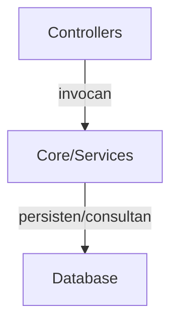

<div class='pagebreak'></div>

## core/ — Referencia

<div id='sec_core___init___py'>

### 📄 `core/__init__.py`

</div>

Lógica o utilidades del núcleo (`__init__`): tipos, servicios auxiliares o infraestructura compartida fuera de la capa de interfaz.

---

<div id='sec_core_app_model_py'>

### 📄 `core/app_model.py`

</div>

Nombre del Módulo: app_model.py
Descripción: Fachada principal que centraliza el acceso a todos los servicios de 
             dominio (productos, máquinas, trabajadores, etc.) y la base de datos.

#### 🏛️ Clase `AppModel`

Modelo unificado de la aplicación (Fachada).

Proporciona un punto de entrada único para los controladores, delegando la 
lógica de negocio en servicios especializados y emitiendo señales de cambio.

**Métodos Principales:**

- `__init__`: Inicializa el modelo de la aplicación. Args: db_manager: Gestor de conexión a la base de datos.
- `_connect_service_signals`: Conecta las señales de los servicios a las señales del AppModel (Bridge).
- `get_dashboard_stats`: Obtiene estadísticas consolidadas para el dashboard. Delega a los servicios correspondientes.
- `get_prep_info_for_product`: Delega en PreparationService (grupo y máquina por defecto para el producto).
- `get_latest_fabricaciones`: Obtiene las últimas órdenes de fabricación creadas.
- `search_fabricaciones`: Busca órdenes de fabricación por código o descripción.
- `create_fabricacion`: Crea una nueva orden de fabricación básica.
- `update_fabricacion_preprocesos`: Vincula un conjunto de preprocesos a una fabricación.
- `create_preproceso`: Crea un nuevo preproceso en el sistema.
- `update_preproceso`: Actualiza los datos de un preproceso existente.
- `delete_preproceso`: Elimina un preproceso del sistema.
- `get_fabricacion_by_id`: Busca una orden de fabricación por su ID numérico.
- `get_fabricacion_by_codigo`: Busca una orden de fabricación por su código alfanumérico.
- `get_products_for_fabricacion`: Obtiene los productos asociados a una orden de fabricación.
- `create_fabricacion_with_preprocesos`: Crea una fabricación y sus preprocesos asociados en una sola transacción.
- `set_products_for_fabricacion`: Asigna una lista de productos a una fabricación específica.
- `delete_product`: Elimina un producto del catálogo por su código.

---

<div id='sec_core_application_state_py'>

### 📄 `core/application_state.py`

</div>

Nombre del Módulo: application_state.py
Descripción: Almacén de estado compartido (State Management) que centraliza las 
             variables globales y temporales de la aplicación.

#### 🏛️ Clase `ApplicationState`

Estado compartido de la aplicación.

Almacena variables de sesión, resultados de la última simulación, estados de 
búsqueda y referencias a hilos en segundo plano, permitiendo la comunicación 
entre componentes desacoplados.

**Métodos Principales:**

- `__init__`: Inicializa una nueva instancia de ApplicationState. Configura el logger y todas las variables de estado iniciales.

---

<div id='sec_core_constants_py'>

### 📄 `core/constants.py`

</div>

Módulo de Constantes Globales.

Define iconos, colores, estados y parámetros de configuración compartidos 
por toda la aplicación Hipatia.

---

<div id='sec_core_define_flow_form_io_py'>

### 📄 `core/define_flow_form_io.py`

</div>

Nombre del Módulo: define_flow_form_io
Descripcion: Convierte el dict devuelto por DefineControlPanel.get_form_data en
             FlowTaskConfigDTO, fuera de la capa ui (Fase 12C).

- 🔧 `define_form_data_to_flow_task_config`: Arma el DTO de configuracion desde el mapa del panel de definicion.

---

<div id='sec_core_define_flow_presenter_io_py'>

### 📄 `core/define_flow_presenter_io.py`

</div>

Nombre del Módulo: define_flow_presenter_io
Descripcion: Lectura de mapas de producto/tarea/paso y conversion legacy a DTOs
             para DefineFlowPresenter, fuera de ui/dialogs (Fase 12C).

- 🔧 `find_first_positive_duration`: Primera clave con valor float > 0 (misma logica que el presenter legacy).
- 🔧 `flow_task_data_from_legacy_step_task`: DTO de tarea desde el dict anidado en un paso de flujo persistido.
- 🔧 `flow_task_config_from_legacy_step`: DTO de config desde un paso de flujo persistido (dict plano).

---

<div id='sec_core_definir_cantidades_dialog_io_py'>

### 📄 `core/definir_cantidades_dialog_io.py`

</div>

Nombre del Módulo: definir_cantidades_dialog_io
Descripcion: Etiquetas de filas del plan de produccion para DefinirCantidadesDialog,
             fuera de ui/dialogs (Fase 12C).

---

<div id='sec_core_di_container_py'>

### 📄 `core/di_container.py`

</div>

Nombre del Módulo: di_container.py
Descripción: Contenedor ligero de Inyección de Dependencias (DI) para gestionar 
             la instanciación y resolución de servicios y controladores con 
             soporte para ciclos de vida (Singleton y Transient).

#### 🏛️ Clase `ServiceLifecycle`

Define el ciclo de vida de un servicio en el contenedor.

#### 🏛️ Clase `ServiceRegistration`

Estructura interna para almacenar el registro de un servicio.

#### 🏛️ Clase `DIContainer`

Contenedor de Inyección de Dependencias (Singleton).

Gestiona el registro de tipos y la resolución de instancias, permitiendo 
configurar el ciclo de vida de cada componente.

**Métodos Principales:**

- `get_instance`: Devuelve la instancia única (singleton) del contenedor.
- `register`: Registra un servicio o componente en el contenedor. Args: service_type: El tipo o identificador de la clase. instance: Una instancia ya creada (se registrará como SINGLETON). factory: Una función que devuelve la instancia (lazy loading). lifecycle: El ciclo de vida deseado (SINGLETON por defecto).
- `resolve`: Resuelve y retorna una instancia del servicio solicitado. Args: service_type: El tipo clase a resolver. Returns: La instancia solicitada del servicio. Raises: KeyError: Si el servicio no está registrado.
- `is_registered`: Comprueba si un servicio está registrado en el contenedor.
- `clear`: Limpia todos los registros. Útil para entornos de test.

---

<div id='sec_core_dtos_py'>

### 📄 `core/dtos.py`

</div>

Fachada de compatibilidad para DTOs de dominio.

`core.dtos` se mantiene como punto de import estable para todo el proyecto.
Las definiciones concretas viven en `core.dtos_models`.

---

<div id='sec_core_dtos_catalog_py'>

### 📄 `core/dtos_catalog.py`

</div>

DTOs de catálogo/producción (productos, lotes, pilas, iteraciones).

---

<div id='sec_core_dtos_flow_camera_py'>

### 📄 `core/dtos_flow_camera.py`

</div>

DTOs de flujo de producción y cámara.

#### 🏛️ Clase `FlowTaskDataDTO`

**Métodos Principales:**

- `from_legacy_mapping`: Construye un DTO a partir de un dict legado (canvas / tests). Centraliza la conversión para que la UI no use `.get` sobre mapas crudos.

#### 🏛️ Clase `CanvasCyclicConnectionFlags`

Metadatos de pintado para aristas cíclicas en el canvas de flujo (UI).

**Métodos Principales:**

- `from_connection_mapping`: Interpreta flags desde el dict de conexión legado del canvas.

#### 🏛️ Clase `ProductFlowLibraryProductDTO`

Agrupa descripción de producto y tareas (`FlowTaskDataDTO`) para biblioteca / panel de definición.

#### 🏛️ Clase `FlowItemDTO`

DTO para representar un ítem del flujo en la vista (Fase 12C).

---

<div id='sec_core_dtos_models_py'>

### 📄 `core/dtos_models.py`

</div>

Definiciones concretas de DTOs del dominio Hipatia.

#### 🏛️ Clase `FileOperationResultDTO`

Resultado de una operación de adjuntar o mover archivos.

#### 🏛️ Clase `ProductDetailsDTO`

Detalles completos de un producto y sus subcomponentes.

#### 🏛️ Clase `QuoteDTO`

Frase célebre.

#### 🏛️ Clase `AuthorInfoDTO`

Información enriquecida de un autor de Wikipedia.

#### 🏛️ Clase `SyncRecordPayloadDTO`

Contenedor de datos dinámicos para un registro de sincronización.

#### 🏛️ Clase `SyncRecordDTO`

Un registro individual para sincronización.

#### 🏛️ Clase `SyncTableDifferencesDTO`

Diferencias detectadas en una tabla específica.

#### 🏛️ Clase `DatabaseComparisonDTO`

Resultado completo de la comparación de dos bases de datos.

#### 🏛️ Clase `WorkerFormDataDTO`

Datos extraídos del formulario de un trabajador.

#### 🏛️ Clase `LoteInstanceParametersDTO`

Parámetros para instanciar un lote desde UI.

#### 🏛️ Clase `CalculationStepDTO`

Representa un paso o item en la sesión de planificación/cálculo.

---

<div id='sec_core_enhanced_flow_canvas_state_io_py'>

### 📄 `core/enhanced_flow_canvas_state_io.py`

</div>

Nombre del Módulo: enhanced_flow_canvas_state_io
Descripcion: Mutaciones y consultas sobre entradas `canvas_tasks` del flujo
             enhanced (data/config/position), fuera de ui/dialogs (Fase 12C).

- 🔧 `canvas_state_all_logical_connections`: Aristas globales: dependencias, ciclos y orden por defecto en el lienzo. Las tareas con inicio por fecha (sin dependencia explícita) se enlazan en cadena ``(i-1) → i`` para mostrar el orden de planificación al colocar tarjetas. Si una tarea define ``start_condition`` tipo ``dependency``, no se añade ese eslabón secuencial hacia ella (el orden lo marca solo el predecesor elegido).

---

<div id='sec_core_enhanced_flow_presenter_io_py'>

### 📄 `core/enhanced_flow_presenter_io.py`

</div>

Nombre del Módulo: enhanced_flow_presenter_io
Descripcion: Carga de flujo, biblioteca de productos y exportacion a dicts para
             FlowBuilder (ui/dialogs/production_flow/flow_builder.py), fuera de ui/dialogs (Fase 12C).

- 🔧 `_main_task_as_mapping`: Acepta dict (legado) o ``CalculationProductDTO`` (sesión desde PilaService).

---

<div id='sec_core_flow_canvas_io_py'>

### 📄 `core/flow_canvas_io.py`

</div>

Nombre del Módulo: flow_canvas_io
Descripcion: Lectura de mapas de conexion del canvas de flujo desde capa no-UI,
             para que los widgets no usen .get/.[] sobre dicts en bucles de pintado.
             Incluye acceso al cuerpo `data` de tareas canvas y flags de ciclo en `config`.

#### 🏛️ Clase `CanvasVisualConnection`

Arista visual entre dos widgets del canvas (define-flow y production flow).

- 🔧 `canvas_visual_connection_from_mapping`: Construye una conexion visual desde el dict historico start/end/type.
- 🔧 `normalize_canvas_visual_connections`: Normaliza entradas dict o DTO a lista homogenea.
- 🔧 `legacy_canvas_task_widget`: Widget asociado a una entrada `canvas_tasks[i]` del dialogo legacy.
- 🔧 `legacy_canvas_task_config`: Subdict `config` de una tarea en canvas legacy.
- 🔧 `legacy_canvas_task_is_cycle_start`: True si la tarea marca inicio de ciclo en el modelo legacy.
- 🔧 `canvas_task_body`: Cuerpo `data` de una entrada `presenter.canvas_tasks[i]`.
- 🔧 `canvas_task_display_name`: Nombre de tarea para listas de dialogo (`data` dict o DTO con `.name`).
- 🔧 `flow_task_config_is_cycle_end_flag`: True si config marca fin de ciclo.
- 🔧 `flow_task_config_is_cycle_start_flag`: True si config marca inicio de ciclo.
- 🔧 `flow_task_config_cycle_return_to_index`: Indice de tarea a la que regresa el ciclo (`cycle_return_to_index` en config legacy).
- 🔧 `cycle_end_dialog_configuration_values`: Par (is_cycle_end, return_to_index) del dict de `CycleEndConfigDialog.get_configuration`.
- 🔧 `worker_line_config_display_name`: Nombre visible de una linea de trabajador en el canvas (clave `name`).
- 🔧 `worker_line_config_reassignment_rule`: Regla de reasignacion asociada a la linea de trabajador, si existe.
- 🔧 `worker_line_config_set_reassignment_rule`: Persiste la regla de reasignacion en la config mutable de la linea.
- 🔧 `connection_widgets_pair`: Devuelve (start, end) tal como los guarda el modelo de conexiones del canvas.
- 🔧 `connection_link_type`: Tipo de arista: 'normal' o 'cyclic'.
- 🔧 `connection_cyclic_paint_flags`: Flags de pintado para aristas ciclicas (dict legacy o DTO).

---

<div id='sec_core_flow_card_labels_py'>

### 📄 `core/flow_card_labels.py`

</div>

Nombre del Módulo: flow_card_labels
Descripcion: Textos para tarjetas del canvas de flujo; lectura de mapas de tarea
             fuera de ui/ (Fase 12C).

- 🔧 `flow_card_primary_html`: HTML principal nombre + duracion.
- 🔧 `flow_card_task_id_str`: Identificador logico de la tarea para señales.
- 🔧 `flow_card_with_workers_html`: Returns: (texto QLabel, tooltip)

---

<div id='sec_core_flow_graph_manager_io_py'>

### 📄 `core/flow_graph_manager_io.py`

</div>

Nombre del Módulo: flow_graph_manager_io
Descripcion: Lectura y mutacion del estado canvas/presenter usada por FlowGraphManager,
             fuera de subscripts y .get en la capa ui (Fase 12C).

- 🔧 `logical_connection_indices`: Indices from/to desde `get_logical_connections`.
- 🔧 `logical_connection_highlights`: highlight_parent, highlight_child, highlight_destination, highlight_origin.
- 🔧 `apply_loaded_flow_step_to_presenter_config`: Copia campos persistidos del paso al subdict config del presenter.

---

<div id='sec_core_flow_inspector_context_py'>

### 📄 `core/flow_inspector_context.py`

</div>

Nombre del Módulo: flow_inspector_context
Descripcion: DTO de vista para enlazar el grafo de flujo con el inspector de tarea
             sin construir mapas intermedios con subindices en el dialogo.

#### 🏛️ Clase `FlowInspectorTaskContext`

Datos listos para `InspectorPanel.set_task` y listas asociadas.

**Métodos Principales:**

- `inspector_step_payload`: Formato esperado por el inspector (id + task + config).

---

<div id='sec_core_holidays_config_io_py'>

### 📄 `core/holidays_config_io.py`

</div>

Nombre del Módulo: holidays_config_io
Descripcion: Normalizacion y consultas sobre la lista de festivos en configuracion,
             fuera de la capa ui (Fase 12C).

- 🔧 `normalize_holidays_json`: Convierte JSON/str/lista heterogenea en lista deduplicada de dicts date/desc.
- 🔧 `holiday_dates_set`: Conjunto de fechas ISO ya normalizadas.
- 🔧 `holidays_without_date`: Copia sin la entrada con la fecha dada.
- 🔧 `iter_holiday_dates_iso`: Lista ordenada de fechas para resaltar en calendario.

---

<div id='sec_core_inspector_task_payload_io_py'>

### 📄 `core/inspector_task_payload_io.py`

</div>

Nombre del Módulo: inspector_task_payload_io
Descripcion: Lectura de filas task/config del inspector de flujo, fuera de ui/ (Fase 12C).

---

<div id='sec_core_paths_py'>

### 📄 `core/paths.py`

</div>

Nombre del Modulo: paths
Descripcion: Rutas de aplicacion: desarrollo vs ejecutable PyInstaller (``sys.frozen``).

- Solo lectura embebida: usar ``core.utils.helpers.resource_path`` (``_MEIPASS``).
- Escritura (SQLite, logs, backups, copia de usuario de ``config.ini``): directorio del
  ejecutable en frozen; raíz del repositorio en desarrollo.

- 🔧 `get_writable_app_root`: Directorio donde la app puede crear ``data/``, ``logs/``, etc. En binario PyInstaller (``onedir``/``onefile``) coincide con la carpeta del ``.exe``. En desarrollo, la raíz del repositorio (padre de ``core/``).
- 🔧 `resolve_user_config_ini`: Ruta efectiva de ``config/config.ini``. En desarrollo lee el fichero del repo. En frozen copia una vez desde el bundle a ``<exe_dir>/config/config.ini`` para que la conexión recordada sea escribible.

---

<div id='sec_core_planning_session_access_py'>

### 📄 `core/planning_session_access.py`

</div>

Lectura uniforme de ítems en ``planning_session`` (dict legado o DTOs).

- 🔧 `planning_unidades`: Unidades de fabricación asociadas al ítem de sesión.

---

<div id='sec_core_production_context_py'>

### 📄 `core/production_context.py`

</div>

Lógica o utilidades del núcleo (`production_context`): tipos, servicios auxiliares o infraestructura compartida fuera de la capa de interfaz.

#### 🏛️ Clase `ProductionStatus`

Data class to hold the status of the current production session.

#### 🏛️ Clase `ProductionContext`

Manages the context of the current production session for a worker.
Keeps track of the current Order (OF), progress (1 of X), and current process layer.

**Métodos Principales:**

- `start_session`: Starts a new production session.
- `increment_unit`: Increments the completed units counter.
- `is_complete`: Checks if the target number of units has been reached.
- `get_progress_label`: Returns a formatted string like 'Unit 5 of 100'.
- `reset`: Clears the current session.

---

<div id='sec_core_qr_generator_py'>

### 📄 `core/qr_generator.py`

</div>

========================================================================
GENERADOR DE CÓDIGOS QR - SISTEMA DE TRAZABILIDAD
========================================================================
Genera códigos QR únicos para trazabilidad de unidades individuales
y proporciona funciones para convertirlos a diferentes formatos.

Características:
- Generación de IDs únicos con timestamp y hash
- Códigos QR con corrección de errores alta (nivel H)
- Conversión a PIL Image y PyQt6 QPixmap
- Generación en lote

Autor: Sistema de Trazabilidad
Fecha: 2025
========================================================================

#### 🏛️ Clase `QrGenerator`

Generador de códigos QR para trazabilidad.

Attributes:
    logger: Logger para registro de operaciones
    qr_version: Versión del código QR (tamaño)
    error_correction: Nivel de corrección de errores
    box_size: Tamaño de cada "caja" del QR en píxeles
    border: Tamaño del borde en cajas

**Métodos Principales:**

- `__init__`: Inicializa el generador de QR. Args: qr_version: Versión del QR (1-40, None para auto) error_correction: Nivel de corrección (L, M, Q, H) box_size: Tamaño de cada caja en píxeles border: Tamaño del borde en cajas
- `generate_unique_id`: Genera un identificador único para una unidad. El formato es: FAB{id}-{producto}-UNIT{num}-{timestamp}-{hash} Ejemplo: FAB123-PROD001-UNIT1-20250131143022-A3F9 Args: fabricacion_id: ID de la fabricación producto_codigo: Código del producto unit_number: Número de unidad timestamp: Timestamp específico (opcional, usa datetime.now() por defecto) Returns: String con el identificador único
- `generate_qr_code`: Genera un código QR a partir de datos. Args: data: Datos a codificar en el QR size: Tamaño final de la imagen (ancho, alto) en píxeles (opcional) Returns: PIL Image con el código QR o None si hay error
- `generate_qr_pixmap`: Genera un QPixmap de PyQt6 con el código QR. Útil para mostrar el QR directamente en la UI de PyQt6. Args: data: Datos a codificar size: Tamaño del QPixmap (ancho, alto) Returns: QPixmap con el código QR o None si hay error
- `save_qr_to_file`: Guarda un código QR en un archivo. Args: data: Datos a codificar filepath: Ruta donde guardar el archivo size: Tamaño opcional de la imagen Returns: True si se guardó correctamente, False si hubo error
- `generate_batch_qr_codes`: Genera múltiples códigos QR en lote. Args: base_data: Datos base para el QR count: Número de QRs a generar size: Tamaño opcional de las imágenes Returns: Lista de tuplas (data, imagen)

- 🔧 `generate_simple_qr`: Función de utilidad para generar rápidamente un QR. Args: data: Datos a codificar size: Tamaño del QR Returns: QPixmap con el QR o None si hay error
- 🔧 `generate_production_qr_id`: Función de utilidad para generar un ID de producción estándar. Args: fabricacion_id: ID de la fabricación producto_codigo: Código del producto unit_number: Número de unidad Returns: ID único para la unidad

---

<div id='sec_core_qt_log_handler_py'>

### 📄 `core/qt_log_handler.py`

</div>

Nombre del Módulo: qt_log_handler
Descripcion: Handler de logging de Python que integra el sistema de registro
             estándar con el hilo de interfaz de Qt. Captura mensajes de nivel
             WARNING, ERROR y CRITICAL y los reenvía a la UI mediante señales
             Qt (thread-safe) para su visualización en tiempo real.

             Diseño:
             - ``QtLogHandler`` hereda de ``logging.Handler`` (no puede ser
               QObject simultáneamente, por eso se delega la señal a
               ``_SignalEmitter``).
             - ``_SignalEmitter`` es un ``QObject`` mínimo que expone la señal
               ``log_emitted(str)``.  Al conectar esa señal a un slot del hilo
               principal, Qt garantiza que la ejecución del slot ocurre en el
               event-loop correcto aunque ``emit()`` se invoque desde otro hilo.
             - Almacena en un buffer interno los mensajes que llegan antes de que
               la UI esté lista.  Cuando ``connect_to_widget()`` se invoca,
               reproduce el buffer completo para que el usuario vea también los
               warnings de arranque generados antes del login.

#### 🏛️ Clase `_SignalEmitter`

Objeto Qt auxiliar que alberga la señal de log.

Se separa en su propia clase porque ``logging.Handler`` no puede heredar
de ``QObject`` (herencia múltiple incompatible con la metaclase de Qt).

Signals:
    log_emitted: emitida por cada registro de log procesado.
                 Transporta el mensaje ya formateado como cadena.

#### 🏛️ Clase `QtLogHandler`

Handler de logging que reenvía mensajes WARNING/ERROR/CRITICAL a la UI de Qt.

Conecta el sistema de logging de Python con un widget de visualización en la
interfaz gráfica de forma thread-safe: usa una señal Qt para cruzar
desde hilos de fondo al event-loop del hilo principal.

Incorpora un buffer interno que almacena mensajes mientras la UI no está
lista (antes e incluso durante el proceso de login). Al llamar a
``connect_to_widget()``, el buffer se reproduce completo y a partir de
ese momento los mensajes llegan en tiempo real.

Uso típico::

    handler = QtLogHandler()
    logging.getLogger().addHandler(handler)
    # ... más tarde, una vez creado el HomeWidget ...
    handler.connect_to_widget(home_widget.append_log)

Attributes:
    emitter: instancia de ``_SignalEmitter`` cuya señal ``log_emitted``
             puede conectarse manualmente al slot del widget de destino.

**Métodos Principales:**

- `__init__`: Inicializa el handler con nivel WARNING, formatter estándar y buffer vacío. El formatter incluye hora, nivel y nombre del logger para facilitar la identificación del origen del mensaje en la terminal visual.
- `emit`: Procesa un registro de log y emite la señal Qt con el mensaje formateado. Si el widget de destino aún no está conectado, el mensaje se almacena en el buffer interno para ser reproducido posteriormente. Llamado automáticamente por el sistema de logging cada vez que se genera un mensaje cuyo nivel supera el mínimo del handler. Args: record: Registro de log generado por el framework estándar de Python.
- `connect_to_widget`: Conecta el handler al slot del widget y reproduce el buffer acumulado. Debe llamarse una sola vez, una vez que el ``HomeWidget`` ha sido creado y mostrado. A partir de este momento los mensajes fluyen en tiempo real y no se buferizan más. Args: slot: Callable del widget de destino que acepta un único argumento de tipo ``str`` (el mensaje formateado). Típicamente ``LogTerminalWidget.append_log``.

---

<div id='sec_core_quote_service_py'>

### 📄 `core/quote_service.py`

</div>

Lógica o utilidades del núcleo (`quote_service`): tipos, servicios auxiliares o infraestructura compartida fuera de la capa de interfaz.

#### 🏛️ Clase `QuoteService`

Servicio para mostrar frases célebres y enriquecerlas con datos de Wikipedia.

**Métodos Principales:**

- `_load_quotes`: Carga las frases del JSON local.
- `get_random_quote`: Devuelve una frase aleatoria. Returns: Instancia de QuoteDTO con la frase y el autor.
- `get_author_info`: Busca información del autor en Wikipedia (Bio + Imagen). Args: author_name: Nombre del autor a buscar. Returns: AuthorInfoDTO con el resumen e imagen, o None si no se encuentra.

---

<div id='sec_core_reassignment_rule_dialog_io_py'>

### 📄 `core/reassignment_rule_dialog_io.py`

</div>

Nombre del Módulo: reassignment_rule_dialog_io
Descripcion: Lectura de tareas canvas y reglas de reasignacion para el dialogo,
             fuera de ui/dialogs (Fase 12C).

---

<div id='sec_core_reports_dtos_py'>

### 📄 `core/reports_dtos.py`

</div>

========================================================================
REPORTS DTOs - DATA TRANSFER OBJECTS PARA MÓDULO DE REPORTES
========================================================================
Este módulo define los DTOs (Data Transfer Objects) utilizados para
transferir datos entre el ReportsRepository y las capas de UI.
Cada DTO representa una vista específica de los datos optimizada para
la visualización en el módulo de Reportes de Producción.
========================================================================

#### 🏛️ Clase `ResultadoBusquedaDTO`

DTO para resultados de búsqueda inteligente.
Representa un producto, fabricación u orden encontrada.

#### 🏛️ Clase `OrdenFabricacionResumenDTO`

DTO para resumen de una Orden de Fabricación.
Muestra información agregada sin detalles individuales.

#### 🏛️ Clase `OrdenFabricacionDetalleDTO`

DTO para detalle completo de una Orden de Fabricación.
Incluye información extendida para vista de detalle.

#### 🏛️ Clase `PromedioTiempoDTO`

DTO para estadísticas de tiempo promedio de un producto.
Incluye métricas de dispersión para análisis.

#### 🏛️ Clase `TiempoTrabajadorDTO`

DTO para tiempos promedio por trabajador en un producto.
Permite comparar rendimiento entre operarios.

#### 🏛️ Clase `IncidenciaResumenDTO`

DTO para resumen de incidencias agrupadas por tipo.
Usado en gráficas de patrón de incidencias.

#### 🏛️ Clase `PuntoEvolucionDTO`

DTO para un punto en la gráfica de evolución temporal.
Representa el tiempo promedio en un período específico.

#### 🏛️ Clase `UnidadTrabajoDTO`

DTO para detalle de una unidad individual de trabajo.
Usado en la vista expandida de una orden.

#### 🏛️ Clase `ResumenProductoDTO`

DTO para resumen estadístico de un producto.
Información general mostrada al seleccionar un producto.

---

<div id='sec_core_schedule_config_py'>

### 📄 `core/schedule_config.py`

</div>

Lógica o utilidades del núcleo (`schedule_config`): tipos, servicios auxiliares o infraestructura compartida fuera de la capa de interfaz.

#### 🏛️ Clase `ScheduleConfig`

**Métodos Principales:**

- `_load_from_database`: Carga la configuración desde la base de datos.
- `__getstate__`: Prepara el estado del objeto para ser 'pickled' (guardado). Excluimos los atributos que no se pueden guardar, como el logger y el gestor de BD.
- `__setstate__`: Restaura el estado del objeto al ser 'unpickled' (cargado).
- `reload_config`: Recarga la configuración desde la base de datos. Args: db_manager: Gestor de base de datos (opcional, usa self.db_manager si no se proporciona)
- `_parse_time`: Convierte string de tiempo a objeto time.
- `_process_holidays`: Procesa los datos de festivos desde la base de datos y los convierte a objetos date para compatibilidad con el sistema de calendario.

---

<div id='sec_core_sync_service_py'>

### 📄 `core/sync_service.py`

</div>

SyncService: Database Comparison and Merge for USB Sync
========================================================
Enables "sneakernet" synchronization by comparing local database with
an imported SQLite file and allowing selective merge of differences.

#### 🏛️ Clase `SyncService`

Service for comparing and synchronizing two SQLAlchemy databases.
Designed for USB-based sync workflow between disconnected machines.

**Métodos Principales:**

- `__init__`: Initialize SyncService with the local database session factory. Args: local_session_factory: SQLAlchemy sessionmaker for local DB
- `compare_databases`: Compare local database with a foreign SQLite database file. Args: foreign_db_path: Path to the foreign .db file (from USB) Returns: DatabaseComparisonDTO containing differences per table.
- `_compare_table`: Compare a single table between local and foreign databases. Args: local_session: Local database session foreign_session: Foreign database session model_class: SQLAlchemy model class primary_key: Name of the primary key column Returns: List of SyncRecordDTOs that differ (new or updated in foreign DB). Each DTO contains a SyncRecordPayloadDTO with the fields.
- `apply_changes`: Apply selected changes to the local database. Args: comparison: DatabaseComparisonDTO containing changes to apply Returns: Number of records successfully applied
- `_apply_single_record`: Apply a single record to the local database. Args: session: Local database session model_class: SQLAlchemy model class primary_key: Name of primary key column record_dto: SyncRecordDTO Returns: True if successfully applied.

---

<div id='sec_core_tracking_dtos_py'>

### 📄 `core/tracking_dtos.py`

</div>

Lógica o utilidades del núcleo (`tracking_dtos`): tipos, servicios auxiliares o infraestructura compartida fuera de la capa de interfaz.

#### 🏛️ Clase `FabricacionAsignadaDTO`

DTO para fabricaciones asignadas a un trabajador.

#### 🏛️ Clase `IncidenciaAdjuntoDTO`

DTO para adjuntos de una incidencia.

#### 🏛️ Clase `IncidenciaLogDTO`

DTO para incidencias registradas.

#### 🏛️ Clase `PasoTrazabilidadDTO`

DTO para pasos de trazabilidad (sellos).

#### 🏛️ Clase `TrabajoLogDTO`

DTO para el log principal de trabajo (Pasaporte).

---

<div id='sec_core_worker_ui_dtos_py'>

### 📄 `core/worker_ui_dtos.py`

</div>

Nombre del Modulo: worker_ui_dtos
Descripcion: DTOs tipados para la vista trabajador (lista de fabricaciones asignadas).

Origen típico: ``WorkerDbSync.get_assigned_fabricaciones``. La UI serializa filas con
``to_signal_dict()`` cuando el receptor aún espera un mapping plano.

#### 🏛️ Clase `WorkerTaskListRowDTO`

Fila plana para la lista de tareas/fabricaciones en WorkerMainWindow.

**Métodos Principales:**

- `to_signal_dict`: Payload para señales y controladores que aún esperan dict plano.
- `from_flat_mapping`: Construye desde el dict histórico de WorkerDbSync (tests y migración).

---

<div id='sec_core_camera_manager___init___py'>

### 📄 `core/camera_manager/__init__.py`

</div>

Lógica o utilidades del núcleo (`__init__`): tipos, servicios auxiliares o infraestructura compartida fuera de la capa de interfaz.

- 🔧 `main`: Función principal para pruebas manuales.

---

<div id='sec_core_camera_manager_base_py'>

### 📄 `core/camera_manager/base.py`

</div>

Nombre del Módulo: camera_manager.base
Descripcion: Tipos base para detección de cámaras y metadatos de dispositivos.

---

<div id='sec_core_camera_manager_detector_py'>

### 📄 `core/camera_manager/detector.py`

</div>

Nombre del Módulo: detector.py (CameraDetector)
Descripción: Utilidades para la detección y filtrado de dispositivos de cámara 
             compatibles conectados al sistema.

---

<div id='sec_core_camera_manager_manager_py'>

### 📄 `core/camera_manager/manager.py`

</div>

Nombre del Módulo: manager.py (CameraManager)
Descripción: Gestor de hardware de cámara. Controla el acceso, la captura de frames 
             y la liberación de recursos de video.

#### 🏛️ Clase `CameraManager`

Gestiona la detección, validación y acceso a cámaras de video conectadas al sistema.
Proporciona funcionalidades para listar cámaras disponibles, obtener información detallada
y seleccionar la mejor cámara para una aplicación.

---

<div id='sec_core_camera_manager_utils_py'>

### 📄 `core/camera_manager/utils.py`

</div>

Nombre del Módulo: camera_manager.utils
Descripcion: Utilidades de plataforma para seleccionar backend de captura OpenCV.

---

<div id='sec_core_facades___init___py'>

### 📄 `core/facades/__init__.py`

</div>

Fachadas de aplicación por dominio (encima de servicios / repos).

---

<div id='sec_core_facades_planning_facade_py'>

### 📄 `core/facades/planning_facade.py`

</div>

Fachada de aplicación: pilas, bitácora y datos de cálculo.

#### 🏛️ Clase `PlanningFacade`

Punto estable para planificación; delega en ``PilaService``.

---

<div id='sec_core_facades_product_facade_py'>

### 📄 `core/facades/product_facade.py`

</div>

Fachada de aplicación: catálogo, iteraciones y materiales.

#### 🏛️ Clase `ProductFacade`

Punto estable para el dominio producto; delega en ``ProductService``.

**Métodos Principales:**

- `service`: Acceso al servicio durante la migración (señales Qt, tests).

---

<div id='sec_core_facades_production_facade_py'>

### 📄 `core/facades/production_facade.py`

</div>

Fachada de dominio de fabricación y preprocesos.

#### 🏛️ Clase `ProductionFacade`

Agrupa FabricacionService y operaciones de repositorio pendientes de migrar.

---

<div id='sec_core_facades_reporting_facade_py'>

### 📄 `core/facades/reporting_facade.py`

</div>

Fachada de dominio de reporting.

#### 🏛️ Clase `ReportingFacade`

Agrupa operaciones de ReportService.

---

<div id='sec_core_facades_system_facade_py'>

### 📄 `core/facades/system_facade.py`

</div>

Fachada de dominio de sistema (máquinas, preparación y utilidades DB).

#### 🏛️ Clase `SystemFacade`

Agrupa MachineService, PreparationService y utilidades de configuración/lotes.

---

<div id='sec_core_facades_workforce_facade_py'>

### 📄 `core/facades/workforce_facade.py`

</div>

Fachada de dominio de trabajadores y asignaciones.

#### 🏛️ Clase `WorkforceFacade`

Agrupa operaciones de WorkerService y TrackingAssignmentService.

---

<div id='sec_core_health___init___py'>

### 📄 `core/health/__init__.py`

</div>

Módulo de verificación de salud del sistema al arranque.

Exporta DatabaseHealthChecker, HealthReport y las dataclasses de resultado
para su uso desde health_worker y startup_screen.

---

<div id='sec_core_health_constants_py'>

### 📄 `core/health/constants.py`

</div>

Constantes de salud del sistema para startup checks.

---

<div id='sec_core_health_health_checker_py'>

### 📄 `core/health/health_checker.py`

</div>

Nombre del Módulo: health_checker
Descripción: Verifica el estado de la base de datos y del sistema al arranque.
             Sin dependencia de UI — solo lógica pura.

#### 🏛️ Clase `TableHealth`

Estado de una tabla de la base de datos.

#### 🏛️ Clase `SystemHealth`

Información de salud general del sistema.

#### 🏛️ Clase `TestResults`

Resultados de la ejecución de tests unitarios.

#### 🏛️ Clase `HealthReport`

Informe completo de salud del sistema.

#### 🏛️ Clase `DatabaseHealthChecker`

Verifica el estado de la base de datos y del sistema.

**Métodos Principales:**

- `check`: Ejecuta todas las verificaciones y devuelve un HealthReport. Args: db_manager: Instancia de DatabaseManager. Returns: HealthReport con el estado completo del sistema.
- `_check_tables`: Verifica el estado de cada tabla conocida.
- `_check_system`: Recopila información de salud del sistema.
- `_compute_status`: Calcula el estado general basado en el informe.

---

<div id='sec_core_health_health_worker_py'>

### 📄 `core/health/health_worker.py`

</div>

Nombre del Módulo: health_worker
Descripción: QThread que orquesta DatabaseHealthChecker y TestRunner
             emitiendo señales de progreso a la UI.

#### 🏛️ Clase `HealthCheckWorker`

Hilo de verificación de salud del sistema.
Emite señales de progreso para que la UI las consuma sin bloquearse.

**Métodos Principales:**

- `__init__`: Inicializa el worker con el gestor de base de datos. Args: db_manager: Instancia de DatabaseManager. run_tests: Si True, ejecuta los tests unitarios tras verificar la BD.
- `run`: Ejecuta las verificaciones en el hilo secundario.

---

<div id='sec_core_health_test_runner_py'>

### 📄 `core/health/test_runner.py`

</div>

Nombre del Módulo: test_runner
Descripción: Ejecuta pytest -m unit en un subprocess y parsea el progreso en tiempo real.

#### 🏛️ Clase `TestRunner`

Ejecuta pytest -m unit en un subprocess y emite progreso línea a línea.

**Métodos Principales:**

- `run`: Lanza pytest -m unit y llama a los callbacks con el progreso. Args: progress_callback: (test_name, current, total) finished_callback: (TestResults)
- `_read_coverage`: Lee la cobertura del último run guardado en test_reports/compliance_data.json.

---

<div id='sec_core_import_manager___init___py'>

### 📄 `core/import_manager/__init__.py`

</div>

Lógica o utilidades del núcleo (`__init__`): tipos, servicios auxiliares o infraestructura compartida fuera de la capa de interfaz.

---

<div id='sec_core_import_manager_dto_py'>

### 📄 `core/import_manager/dto.py`

</div>

Nombre del Módulo: import_manager.dto
Descripcion: DTOs para representar árboles BOM importados desde A3RP.

---

<div id='sec_core_import_manager_ports_py'>

### 📄 `core/import_manager/ports.py`

</div>

Lógica o utilidades del núcleo (`ports`): tipos, servicios auxiliares o infraestructura compartida fuera de la capa de interfaz.

#### 🏛️ Clase `IBOMImporter`

**Métodos Principales:**

- `parse_file`: Debe leer un archivo y devolver la raíz del árbol de fabricación (BOMNodeDTO)

---

<div id='sec_core_import_manager_adapters___init___py'>

### 📄 `core/import_manager/adapters/__init__.py`

</div>

Lógica o utilidades del núcleo (`__init__`): tipos, servicios auxiliares o infraestructura compartida fuera de la capa de interfaz.

---

<div id='sec_core_import_manager_adapters_a3rp_csv_adapter_py'>

### 📄 `core/import_manager/adapters/a3rp_csv_adapter.py`

</div>

Nombre del Módulo: import_manager.adapters.a3rp_csv_adapter
Descripcion: Adaptador CSV de A3RP para construir un árbol BOM jerárquico.

---

<div id='sec_core_import_manager_adapters_a3rp_excel_adapter_py'>

### 📄 `core/import_manager/adapters/a3rp_excel_adapter.py`

</div>

A3RPExcelAdapter: Adaptador para importar estructuras BOM desde archivos Excel de A3RP.
=======================================================================================
Implementa el puerto `IBOMImporter` leyendo archivos `.xlsx` mediante `pandas`.
Reconstruye el árbol de lista de materiales (BOM) analizando los niveles de indentación
y las dependencias implícitas en el formato exportado por el ERP A3RP.

#### 🏛️ Clase `A3RPExcelAdapter`

Adaptador concreto para leer estructuras de producto desde archivos Excel (.xlsx).

Analiza la estructura jerárquica exportada por A3RP, reconstruyendo el árbol
BOM (Bill of Materials) basándose en la columna 'Nivel'.

Atributos de columna esperados:
    Nivel: Profundidad (0=Raíz).
    Componente: Código único.
    Denominación: Descripción.
    Tipo: 'Compuesto' o 'Simple'.
    Cantidad: Unidades para el padre.

**Métodos Principales:**

- `parse_file`: Lee el archivo Excel y devuelve el nodo raíz del árbol BOM. Args: file_path: Ruta absoluta al archivo .xlsx. **kwargs: Argumentos adicionales (por ejemplo, sheet_name). Returns: BOMNodeDTO: Estructura jerárquica con el nodo raíz y sus hijos anidados. Raises: ValueError: Si no se encuentra un nodo raíz (Nivel 0) o si el formato es inválido. FileNotFoundError: Si el archivo no existe.

---

<div id='sec_core_import_manager_services___init___py'>

### 📄 `core/import_manager/services/__init__.py`

</div>

Lógica o utilidades del núcleo (`__init__`): tipos, servicios auxiliares o infraestructura compartida fuera de la capa de interfaz.

---

<div id='sec_core_import_manager_services_bom_import_service_py'>

### 📄 `core/import_manager/services/bom_import_service.py`

</div>

BOMImportService: Servicio de dominio para importar estructuras supervisadas.
=============================================================================
Toma el árbol `BOMNodeDTO` (ya supervisado por el usuario en la UI) y
se coordina con `ProductService` para inyectar estos nodos en la base de datos,
creando o actualizando los productos según sea necesario.

#### 🏛️ Clase `BOMImportService`

Servicio encargado de importar un árbol BOM a la base de datos de Hipatia.

**Métodos Principales:**

- `__init__`: Inicializa el servicio de importación. Args: product_service: Interfaz o instancia capaz de crear/actualizar productos y manejar subfabricaciones (por e.g., ProductService o ProductManager).
- `import_bom_tree`: Recorre el árbol BOM recursivamente y procesa la inserción o actualización de productos y sus relaciones de subfabricación. Sólo procesa subfabricaciones si `nodo.es_subfabricacion` es True. Args: root_node: El nodo raíz supervisado. Returns: Dict con estadísticas de importación (ej. {'creados': X, 'actualizados': Y}).
- `_process_node`: Proceso recursivo interno para manejar cada nodo y sus hijos. Asegura la creación del producto, procesa sus dependencias (hijos) y evita ciclos infinitos mediante el conjunto 'procesados'. Args: node: Nodo actual a procesar. stats: Diccionario de estadísticas para acumular resultados. procesados: Conjunto de códigos ya visitados para evitar ciclos.
- `_ensure_product_exists`: Verifica si el producto existe. Si no, lo crea de forma básica.
- `_update_product_dependencies`: Actualiza el registro del producto padre con la nueva lista de hijos.

---

<div id='sec_core_interfaces_controller_interface_py'>

### 📄 `core/interfaces/controller_interface.py`

</div>

Lógica o utilidades del núcleo (`controller_interface`): tipos, servicios auxiliares o infraestructura compartida fuera de la capa de interfaz.

#### 🏛️ Clase `IController`

Interface base para todos los controladores de la aplicación.
Hereda de QObject para permitir el uso de señales y slots.
Establece un contrato estándar para inicialización, limpieza y manejo de errores.

**Métodos Principales:**

- `initialize`: Configura los recursos necesarios, conecta señales y prepara el controlador para su uso. Debe ser llamado explícitamente después de la instanciación si es necesario, o como parte del __init__ si no hay dependencias circulares.
- `cleanup`: Libera recursos, desconecta señales y realiza tareas de limpieza antes de destruir el controlador. Critical para prevenir memory leaks en aplicaciones PyQt.
- `handle_error`: Manejo estándar de errores. Puede ser sobreescrito por subclases. Args: error: La excepción capturada. context: Descripción opcional del contexto donde ocurrió el error.

---

<div id='sec_core_interfaces_view_interface_py'>

### 📄 `core/interfaces/view_interface.py`

</div>

Lógica o utilidades del núcleo (`view_interface`): tipos, servicios auxiliares o infraestructura compartida fuera de la capa de interfaz.

#### 🏛️ Clase `IView`

Interfaz abstracta para la vista principal.
Define los métodos que el controlador puede invocar sin depender 
de la implementación concreta de PyQt.

**Métodos Principales:**

- `show_message`: Muestra un mensaje al usuario.
- `show_confirmation_dialog`: Muestra un diálogo de confirmación.
- `switch_page`: Cambia la página visible.
- `get_page`: Obtiene una página (widget) específica por nombre.
- `get_products_tab`: Retorna el widget de gestión de productos.
- `get_fabrications_tab`: Retorna el widget de gestión de fabricaciones.
- `pages`: Diccionario de páginas registradas.

---

<div id='sec_core_interfaces_worker_view_interface_py'>

### 📄 `core/interfaces/worker_view_interface.py`

</div>

Lógica o utilidades del núcleo (`worker_view_interface`): tipos, servicios auxiliares o infraestructura compartida fuera de la capa de interfaz.

#### 🏛️ Clase `IWorkerView`

Interfaz abstracta para la vista del trabajador.

**Métodos Principales:**

- `update_tasks_list`: Actualiza la lista de tareas asignadas.
- `update_task_state`: Actualiza el estado visual de la tarea actual.
- `show_message`: Muestra un mensaje al trabajador.
- `show_confirmation_dialog`: Muestra un diálogo de confirmación.
- `enable_action_buttons`: Habilita o deshabilita los botones de acción.

---

<div id='sec_core_label_manager___init___py'>

### 📄 `core/label_manager/__init__.py`

</div>

Lógica o utilidades del núcleo (`__init__`): tipos, servicios auxiliares o infraestructura compartida fuera de la capa de interfaz.

---

<div id='sec_core_label_manager_base_py'>

### 📄 `core/label_manager/base.py`

</div>

Nombre del Módulo: core.label_manager.base
Descripcion: Define los formatos de etiquetas soportados y sus parámetros técnicos.

---

<div id='sec_core_label_manager_manager_py'>

### 📄 `core/label_manager/manager.py`

</div>

Paquete: core.label_manager
Descripción: Sistema de gestión y generación de etiquetas de trazabilidad.

#### 🏛️ Clase `LabelManager`

Gestor central de plantillas y generación de documentos de etiquetas.

Esta clase actúa como fachada para la generación de documentos, coordinando
la búsqueda de plantillas, el recuento de placeholders y la invocación de
los generadores adecuados (físicos o dinámicos).

Attributes:
    LABEL_FORMATS (dict): Diccionario de formatos de etiquetas soportados.

**Métodos Principales:**

- `__init__`: Inicializa el gestor de etiquetas. Args: templates_dir: Directorio raíz donde residen las plantillas .docx. qr_generator: Instancia del generador de códigos QR únicos. doc_generator: Adaptador por defecto para generación de documentos.
- `_get_generator_and_path`: Determina el generador y la ruta de la plantilla (física o virtual). Soporta 'plantillas virtuales' como apli_1861_qr.docx que no requieren un archivo físico en el disco y usan generadores especializados de bajo nivel. Args: plantilla: Nombre del archivo de plantilla o identificador virtual. formato: Formato de la hoja (A5, A4, etc.). Returns: Tupla (Generador, Ruta/DummyPath).
- `count_qr_placeholders`: Cuenta los espacios disponibles para QRs en la plantilla. Si la plantilla es virtual, delega en el generador especializado. Si es física, escanea el documento Word buscando el placeholder {{qr}}. Args: plantilla: Nombre de la plantilla. formato: Formato de la hoja. Returns: Número total de huecos para códigos QR.
- `generate_labels`: Genera el documento de etiquetas.

---

<div id='sec_core_label_manager_ports_py'>

### 📄 `core/label_manager/ports.py`

</div>

Contratos (Ports) para la gestión de generación de documentos.

#### 🏛️ Clase `IDocumentGenerator`

Protocolo que define cómo debe comportarse un generador de documentos
sin acoplarse a librerías específicas (como python-docx).

**Métodos Principales:**

- `count_qr_placeholders`: Cuenta los placeholders `{{qr}}` en el documento indicado.
- `generate_labels`: Genera un documento reemplazando placeholders por los datos provistos.
- `create_sample`: Crea un documento de ejemplo para un formato especificado ('A4', 'A5', etc.).

---

<div id='sec_core_label_manager_printer_py'>

### 📄 `core/label_manager/printer.py`

</div>

Lógica o utilidades del núcleo (`printer`): tipos, servicios auxiliares o infraestructura compartida fuera de la capa de interfaz.

- 🔧 `is_printer_available`: Comprueba si hay una impresora predeterminada configurada.
- 🔧 `save_to_documents`: Guarda el documento en la carpeta de Documentos del usuario.
- 🔧 `open_file_location`: Abre la ubicación del archivo en el explorador de archivos.
- 🔧 `print_document`: Envía un documento a imprimir o lo guarda si no hay impresora.

---

<div id='sec_core_protocols___init___py'>

### 📄 `core/protocols/__init__.py`

</div>

Protocolos de dominio compartidos (servicios). Implementados nominalmente en `core.services`.

---

<div id='sec_core_protocols_domain_py'>

### 📄 `core/protocols/domain.py`

</div>

Protocolos de dominio para productos, fabricaciones y materiales.

No heredar de estos protocolos en clases `QObject` (PyQt6): conflicto de metaclases
en tiempo de ejecución. Se usan para tipado estático (mypy), `create_autospec` y
reexportación desde `controllers.product.protocols`.

#### 🏛️ Clase `IProductService`

Contrato del servicio de catálogo, iteraciones e imágenes de producto.

#### 🏛️ Clase `IFabricacionService`

Contrato del servicio de fabricaciones y preprocesos.

#### 🏛️ Clase `IMaterialService`

Subconjunto de operaciones de materiales (vía `ProductService`), incluida la lectura por producto.

---

<div id='sec_core_qr_scanner___init___py'>

### 📄 `core/qr_scanner/__init__.py`

</div>

Lógica o utilidades del núcleo (`__init__`): tipos, servicios auxiliares o infraestructura compartida fuera de la capa de interfaz.

---

<div id='sec_core_qr_scanner_base_py'>

### 📄 `core/qr_scanner/base.py`

</div>

Lógica o utilidades del núcleo (`base`): tipos, servicios auxiliares o infraestructura compartida fuera de la capa de interfaz.

- 🔧 `validate_qr`: Valida que un QR tenga el formato correcto de trazabilidad.
- 🔧 `get_qr_info`: Obtiene información de un QR de trazabilidad.

---

<div id='sec_core_qr_scanner_detector_py'>

### 📄 `core/qr_scanner/detector.py`

</div>

Nombre del Módulo: qr_scanner.detector
Descripcion: Detector QR con backend WeChat/OpenCV y fallback automático.

---

<div id='sec_core_qr_scanner_scanner_py'>

### 📄 `core/qr_scanner/scanner.py`

</div>

Paquete: core.qr_scanner
Nombre del Módulo: scanner.py (QrScanner)
Descripción: Sistema de detección y decodificación de códigos QR en tiempo real.
             Implementa la lógica de escaneo mediante visión artificial para la lectura
             de etiquetas de trazabilidad.

---

<div id='sec_core_qr_scanner_ui_py'>

### 📄 `core/qr_scanner/ui.py`

</div>

Dibujo de overlays QR sobre frames OpenCV (`core.qr_scanner`, no el paquete de interfaz `ui/`).

- 🔧 `draw_qr_detection`: Dibuja indicadores visuales en el frame.

---

<div id='sec_core_security_access_control_py'>

### 📄 `core/security/access_control.py`

</div>

Nombre del Módulo: access_control.py
Descripción: Proporciona decoradores y utilidades para el control de acceso 
             basado en funciones (RBAC) en toda la aplicación.

- 🔧 `set_security_service`: Inicializa la instancia global del servicio de seguridad.
- 🔧 `get_security_service`: Obtiene la instancia global del servicio de seguridad.
- 🔧 `require_permission`: Decorador para restringir el acceso basado en permisos. Si el usuario no tiene el permiso, la función no se ejecuta.
- 🔧 `require_role`: Decorador para restringir el acceso a un rol específico.

---

<div id='sec_core_security_password_service_py'>

### 📄 `core/security/password_service.py`

</div>

Lógica o utilidades del núcleo (`password_service`): tipos, servicios auxiliares o infraestructura compartida fuera de la capa de interfaz.

#### 🏛️ Clase `PasswordService`

Servicio para el manejo seguro de contraseñas utilizando bcrypt.
Reemplaza el uso de SHA-256 simple.

**Métodos Principales:**

- `hash_password`: Genera un hash seguro para la contraseña proporcionada usando bcrypt. Args: plain_password: La contraseña en texto plano. Returns: El hash de la contraseña como string (utf-8).
- `verify_password`: Verifica si la contraseña coincide con el hash almacenado. Args: plain_password: La contraseña en texto plano a verificar. hashed_password: El hash almacenado en la base de datos. Returns: True si coinciden, False en caso contrario.
- `validate_password`: Valida que la contraseña cumpla con los requisitos de complejidad. Requisitos: - Mínimo 8 caracteres - Al menos un número - Al menos una letra Returns: Tuple[bool, str]: (Es válida, Mensaje de error si no lo es)

---

<div id='sec_core_security_security_exceptions_py'>

### 📄 `core/security/security_exceptions.py`

</div>

Excepciones personalizadas para el sistema de seguridad.

#### 🏛️ Clase `SecurityError`

Excepción base para errores de seguridad.

#### 🏛️ Clase `SecurityServiceNotInitializedError`

El servicio de seguridad no está inicializado.

#### 🏛️ Clase `InsufficientPermissionsError`

El usuario no tiene los permisos necesarios.

#### 🏛️ Clase `RateLimitExceededError`

Se excedió el límite de intentos permitidos.

---

<div id='sec_core_security_security_service_py'>

### 📄 `core/security/security_service.py`

</div>

Nombre del Módulo: security_service.py
Descripción: Servicio central de seguridad para la gestión de roles (RBAC), 
             autenticación de usuarios y verificación de permisos.

#### 🏛️ Clase `SecurityService`

Servicio central de seguridad para autenticación y autorización (RBAC).

**Métodos Principales:**

- `login_user`: Registra al usuario actual en el servicio de seguridad.
- `logout`: Cierra la sesión del usuario actual.
- `get_current_role`: Obtiene el rol del usuario actual como Enum.
- `has_permission`: Verifica si el usuario actual tiene un permiso específico.
- `check_access`: Alias de has_permission para uso en decoradores.

---

<div id='sec_core_services_audit_logger_py'>

### 📄 `core/services/audit_logger.py`

</div>

Servicio de logging de auditoría para acciones sensibles.

#### 🏛️ Clase `AuditLogger`

Registra acciones sensibles en la base de datos.

**Métodos Principales:**

- `log`: Registra una acción en el log de auditoría. Args: username: Nombre del usuario que realiza la acción action: Tipo de acción (LOGIN, DELETE, EXPORT, etc.) entity_type: Tipo de entidad afectada (opcional) entity_id: ID de la entidad afectada (opcional) description: Descripción adicional (opcional) user_id: ID del usuario en la BD (opcional) success: Si la acción fue exitosa error_message: Mensaje de error si falló ip_address: Dirección IP (opcional)
- `log_login`: Registra un intento de login.
- `log_logout`: Registra un logout.
- `log_delete`: Registra eliminación de entidad.
- `log_export`: Registra exportación de datos.
- `log_import`: Registra importación de datos.
- `log_settings_change`: Registra cambio de configuración.
- `cleanup_old_logs`: Elimina registros de auditoría más antiguos que el periodo de retención. Args: retention_days: Número de días a retener los logs. Returns: Número de registros eliminados.

---

<div id='sec_core_services_backup_service_py'>

### 📄 `core/services/backup_service.py`

</div>

Servicio de backup automatizado para protección de datos.

#### 🏛️ Clase `BackupService`

Gestiona backups automatizados con rotación y verificación.

**Métodos Principales:**

- `__init__`: Inicializa el servicio de backup. Args: data_dir: Directorio a respaldar (ej: 'data/') backup_dir: Directorio donde guardar backups (default: data/backups/)
- `create_backup`: Crea un backup comprimido del directorio de datos. Returns: Tuple[bool, str]: (éxito, mensaje/path)
- `cleanup_old_backups`: Elimina backups antiguos según política de retención. Returns: int: Número de backups eliminados
- `list_available_backups`: Lista todos los backups disponibles ordenados por fecha (más reciente primero). Returns: List[BackupInfoDTO]: Lista de backups con metadata
- `restore_backup`: Restaura un backup a un directorio temporal para revisión. Args: backup_name: Nombre del archivo de backup target_dir: Directorio destino (default: data/restore_staging/) Returns: Tuple[bool, str]: (éxito, mensaje/path)

---

<div id='sec_core_services_backup_utils_py'>

### 📄 `core/services/backup_utils.py`

</div>

Funciones utilitarias para operación de backups.

- 🔧 `check_disk_space`: Verifica que exista espacio libre suficiente en el disco.
- 🔧 `verify_tar_backup`: Verifica que el archivo de backup se pueda abrir y tenga contenido.
- 🔧 `create_checksum`: Crea archivo SHA256 para el backup.
- 🔧 `verify_checksum`: Valida checksum de backup si existe; si no existe, lo considera válido.

---

<div id='sec_core_services_calculation_audit_py'>

### 📄 `core/services/calculation_audit.py`

</div>

Lógica o utilidades del núcleo (`calculation_audit`): tipos, servicios auxiliares o infraestructura compartida fuera de la capa de interfaz.

#### 🏛️ Clase `DecisionStatus`

Define los estados visuales para las decisiones en la interfaz.

#### 🏛️ Clase `CalculationDecision`

Representa una decisión o evento único dentro del motor de cálculo,
enriquecida con contexto para una mejor experiencia de usuario (UX).

---

<div id='sec_core_services_calendar_helper_py'>

### 📄 `core/services/calendar_helper.py`

</div>

Lógica o utilidades del núcleo (`calendar_helper`): tipos, servicios auxiliares o infraestructura compartida fuera de la capa de interfaz.

- 🔧 `set_schedule_config`: Establece la configuración de horario global para compatibilidad.
- 🔧 `get_schedule_config`: Obtiene la configuración de horario global.

---

<div id='sec_core_services_data_importer_py'>

### 📄 `core/services/data_importer.py`

</div>

Lógica o utilidades del núcleo (`data_importer`): tipos, servicios auxiliares o infraestructura compartida fuera de la capa de interfaz.

#### 🏛️ Clase `Material`

Representa un material o componente importado.

#### 🏛️ Clase `IMaterialImporter`

Interfaz abstracta para los importadores de materiales.
Define el contrato que todas las implementaciones deben seguir.

**Métodos Principales:**

- `import_materials`: Lee un archivo y retorna una lista de objetos Material.

#### 🏛️ Clase `ExcelMaterialImporter`

Importador concreto para archivos Excel (.xlsx).
Utiliza la librería pandas para un manejo eficiente de los datos.

**Métodos Principales:**

- `import_materials`: Lee los materiales desde un archivo Excel. Se espera que el archivo contenga las columnas 'codigo' y 'descripcion'.

#### 🏛️ Clase `MaterialImporterFactory`

Clase factoría que decide qué importador crear basado en la extensión del archivo.

**Métodos Principales:**

- `create_importer`: Retorna una instancia del importador apropiado para la extensión dada.

---

<div id='sec_core_services_fabricacion_service_py'>

### 📄 `core/services/fabricacion_service.py`

</div>

Nombre del Módulo: FabricacionService
Descripción: Servicio de lógica de negocio para la gestión de fabricaciones, órdenes de seguimiento y preprocesos.

#### 🏛️ Clase `FabricacionService`

Servicio de dominio para la gestión centralizada de Fabricaciones y Preprocesos.

Actúa como una capa de orquestación (Fase 11C/12C) que:
1. Valida las reglas de negocio antes de persistir los datos.
2. Coordina la creación de fabricaciones complejas que incluyen preprocesos y productos.
3. Garantiza que toda la comunicación sea mediante `FabricacionDTO` y `PreprocesoDTO`,
   sirviendo como frontera limpia para los controladores de la UI.

**Métodos Principales:**

- `__init__`: Inicializa el servicio de fabricación con su gestor de base de datos. Args: db_manager: Instancia central de gestión de persistencia.
- `preproceso_repo`: Acceso directo al repositorio de preprocesos.
- `tracking_repo`: Acceso directo al repositorio de seguimiento.
- `get_latest_fabricaciones`: Obtiene las fabricaciones más recientes. Args: limit: Número máximo de fabricaciones a retornar. Returns: Lista de objetos de fabricación.
- `search_fabricaciones`: Busca fabricaciones por código o descripción. Args: query: Texto de búsqueda. Returns: Lista de fabricaciones coincidentes.
- `create_fabricacion_with_preprocesos`: Orquesta la creación de una fabricación con sus preprocesos asociados. Recibe un `FabricacionDTO` completo y delega la persistencia al repositorio. Este método es el punto de entrada principal para flujos que requieren integridad referencial entre la cabecera de fabricación y su checklist técnica.
- `get_preprocesos_by_fabricacion`: Obtiene la lista de preprocesos asociados a una fabricación. Args: fabricacion_id: ID único de la fabricación. Returns: Lista de preprocesos.
- `get_all_ordenes_fabricacion`: Obtiene la lista de todas las órdenes de fabricación.

---

<div id='sec_core_services_flow_builder_service_py'>

### 📄 `core/services/flow_builder_service.py`

</div>

Lógica o utilidades del núcleo (`flow_builder_service`): tipos, servicios auxiliares o infraestructura compartida fuera de la capa de interfaz.

#### 🏛️ Clase `FlowBuilderService`

Service responsible for constructing and refining production flows.

**Métodos Principales:**

- `build_flow_from_override`: Creates a production flow from an override (e.g., from Visual Editor), updating units for each step.
- `resolve_worker_assignments`: Assigns default workers to steps that don't have them, based on skill level. Args: production_flow: The list of flow steps. available_workers_sorted: List of worker objects, ideally sorted by skill level (descending). Returns: The modified production flow with workers assigned where possible.

---

<div id='sec_core_services_flow_simulation_service_py'>

### 📄 `core/services/flow_simulation_service.py`

</div>

Lógica o utilidades del núcleo (`flow_simulation_service`): tipos, servicios auxiliares o infraestructura compartida fuera de la capa de interfaz.

#### 🏛️ Clase `SimulationSession`

Gestiona el estado de una sesión de simulación paso a paso.

**Métodos Principales:**

- `next_step`: Avanza al siguiente paso de la simulación. Returns: int or None: El índice de la tarea actual, -1 para indicador visual, o None si la simulación ha terminado.

#### 🏛️ Clase `FlowSimulationService`

Servicio encargado de la lógica de simulación y cálculo del orden de ejecución
para flujos de producción.

**Métodos Principales:**

- `calculate_preview_order`: Calcula el orden de ejecución teórico basándose en: 1. Tareas de inicio de ciclo o sin dependencias. 2. Dependencias directas. 3. Saltos cíclicos (se indican pero no se siguen recursivamente en preview). Args: canvas_tasks (list): Lista de diccionarios con la configuración de las tareas (formato del canvas/diálogo). Returns: list: Lista de índices en el orden de ejecución teórico. Puede incluir -1 para indicar un salto cíclico visual.
- `start_simulation`: Inicia una sesión de simulación. Args: canvas_tasks (list): Lista de tareas del canvas. Returns: SimulationSession: Objeto de sesión para controlar la simulación.
- `identify_last_tasks_in_cycles`: Identifica las últimas tareas de cada cadena de ciclo. Una tarea es "última" si tiene next_cyclic_task_index pero ninguna otra tarea tiene a esta como next_cyclic_task_index (es decir, nadie apunta a ella en el ciclo). Args: canvas_tasks (list): Lista de tareas del canvas. Returns: set: Conjunto de índices de tareas que son el último paso de un ciclo.

---

<div id='sec_core_services_machine_service_py'>

### 📄 `core/services/machine_service.py`

</div>

Nombre del Módulo: MachineService
Descripción: Servicio de dominio especializado en la gestión de máquinas, mantenimientos y procesos.

#### 🏛️ Clase `MachineService`

Servicio de dominio para gestionar máquinas.
Extraído de FabricacionService para cumplir con SRP.

**Métodos Principales:**

- `get_all_machines`: Obtiene todas las máquinas.
- `get_latest_machines`: Obtiene las últimas máquinas añadidas.
- `get_machines_by_process_type`: Obtiene máquinas filtradas por tipo de proceso.
- `add_machine`: Añade una nueva máquina.
- `update_machine`: Actualiza la información de una máquina.
- `delete_machine`: Elimina una máquina.
- `get_machine_history`: Obtiene el historial de una máquina.
- `add_machine_maintenance`: Añade un registro de mantenimiento a una máquina.
- `get_distinct_machine_processes`: Obtiene la lista de procesos únicos definidos en las máquinas.
- `get_machine_usage_stats`: Obtiene las estadísticas de uso de las máquinas.

---

<div id='sec_core_services_maintenance_service_py'>

### 📄 `core/services/maintenance_service.py`

</div>

Servicio de mantenimiento automatizado del sistema.
Ejecuta tareas de limpieza y verificación en segundo plano para asegurar la higiene del sistema.

#### 🏛️ Clase `MaintenanceWorker`

Worker para ejecutar tareas de mantenimiento en segundo plano.

#### 🏛️ Clase `MaintenanceService`

Servicio que orquesta tareas de mantenimiento:
- Limpieza de intentos de login antiguos.
- Limpieza de logs de auditoría antiguos.
- Creación de backups automatizados.
- Rotación de backups antiguos.

**Métodos Principales:**

- `run_background_maintenance`: Inicia el mantenimiento en un hilo separado.
- `perform_maintenance`: Ejecuta las tareas de mantenimiento secuencialmente.

---

<div id='sec_core_services_pila_service_py'>

### 📄 `core/services/pila_service.py`

</div>

Nombre del Modulo: pila_service
Descripcion: Servicio de dominio para pilas de fabricacion, simulacion y preparacion de datos
             de calculo (DTOs para el motor). Usa ``DatabaseManager`` y repositorios asociados.

#### 🏛️ Clase `PilaService`

Servicio de dominio para gestionar Pilas de fabricación y Simulaciones.

**Métodos Principales:**

- `add_diario_evento`: Alias de compatibilidad para el nombre histórico del método. La UI usa `add_diario_evento`; el método canónico del servicio es `add_diario_entry`.
- `get_data_for_calculation`: Obtiene datos de un producto estructurados en DTOs para el motor de cálculo.
- `get_data_for_calculation_from_session`: Aplana la sesion de planificacion en una lista de ``CalculationProductDTO`` listos para calcular. Acepta por elemento: un ``CalculationProductDTO`` (se incluye tal cual); un ``CalculationStepDTO`` (se resuelve plantilla o pila directa embebida); o un ``dict`` compatible con el formato historico de paso de lote. Para plantilla de lote usa ``lote_repo.get_lote_details``; enriquece cada DTO con ``deadline``, ``fabricacion_id``, ``units_for_this_instance`` y, en kits, ``cantidad_en_kit``.

---

<div id='sec_core_services_preparation_service_py'>

### 📄 `core/services/preparation_service.py`

</div>

Nombre del Módulo: PreparationService
Descripción: Servicio de dominio especializado en la gestión de grupos y pasos de preparación de máquinas.

#### 🏛️ Clase `PreparationService`

Servicio de dominio para gestionar grupos y pasos de preparación.
Extraído de FabricacionService para cumplir con SRP.

**Métodos Principales:**

- `get_groups_for_machine`: Obtiene los grupos de preparación asociados a una máquina.
- `get_prep_info_for_product`: IDs de grupo y máquina del primer grupo de preparación asociado al producto.
- `add_prep_group`: Añade un nuevo grupo de preparación a una máquina.
- `update_prep_group`: Actualiza un grupo de preparación existente.
- `delete_prep_group`: Elimina un grupo de preparación.
- `get_steps_for_group`: Obtiene los pasos de preparación de un grupo.
- `add_prep_step`: Añade un paso de preparación a un grupo.
- `update_prep_step`: Actualiza un paso de preparación existente.
- `delete_prep_step`: Elimina un paso de preparación.
- `get_prep_step_details`: Obtiene los detalles de un paso de preparación específico.
- `get_group_details`: Obtiene los detalles de un grupo de preparación.
- `get_prep_step_details_by_ids`: Obtiene detalles de múltiples pasos por sus IDs.

---

<div id='sec_core_services_product_service_py'>

### 📄 `core/services/product_service.py`

</div>

Lógica o utilidades del núcleo (`product_service`): tipos, servicios auxiliares o infraestructura compartida fuera de la capa de interfaz.

#### 🏛️ Clase `ProductService`

Servicio de dominio para gestionar la lógica relacionada con productos.
Maneja:
- Búsqueda y recuperación de detalles de producto.
- Gestión de iteraciones y materiales.
- Operaciones CRUD básicas (delegadas al repositorio).

**Métodos Principales:**

- `update_product_iteration`: Alias para compatibilidad con protocolos y controladores.
- `add_product`: Valida y añade un producto usando el repositorio.

---

<div id='sec_core_services_rate_limiter_py'>

### 📄 `core/services/rate_limiter.py`

</div>

Servicio de limitación de tasa para prevenir ataques de fuerza bruta.

#### 🏛️ Clase `RateLimiter`

Gestiona el rate limiting para intentos de login.

**Métodos Principales:**

- `check_and_record_attempt`: Verifica si el usuario puede intentar login y registra el intento. Args: username: Nombre de usuario success: Si el intento fue exitoso ip_address: Dirección IP del intento (opcional) Returns: True si el intento está permitido, False si está bloqueado
- `is_blocked`: Verifica si un usuario está bloqueado sin registrar un intento. Args: username: Nombre de usuario Returns: True si el usuario está bloqueado
- `cleanup_old_attempts`: Elimina registros antiguos para mantener la tabla limpia.

---

<div id='sec_core_services_report_service_py'>

### 📄 `core/services/report_service.py`

</div>

Lógica o utilidades del núcleo (`report_service`): tipos, servicios auxiliares o infraestructura compartida fuera de la capa de interfaz.

#### 🏛️ Clase `ReportService`

Servicio de dominio para gestionar Reportes y Estadísticas.
Actúa como interfaz entre la UI/Controladores y el repositorio de reportes.

**Métodos Principales:**

- `get_product_dashboard`: Obtiene el bundle de dashboard para un producto en un contrato único.

---

<div id='sec_core_services_report_strategy_py'>

### 📄 `core/services/report_strategy.py`

</div>

Fachada de compatibilidad para estrategias de informes: reexporta interfaces y
implementaciones desde core.services.reporting (Excel/PDF) sin acoplar
importadores al subpaquete interno.

---

<div id='sec_core_services_system_integration_service_py'>

### 📄 `core/services/system_integration_service.py`

</div>

Operaciones de sistema: lotes, configuración persistente y órdenes de tracking.

Centraliza el acceso que antes hacía AppModel directamente contra repositorios.

#### 🏛️ Clase `SystemIntegrationService`

Fachada delgada sobre repos de lotes, config y tracking.

**Métodos Principales:**

- `lote_repo`: Acceso puntual al repo (p. ej. APIs aún no envueltas).

---

<div id='sec_core_services_temporal_storage_py'>

### 📄 `core/services/temporal_storage.py`

</div>

Lógica o utilidades del núcleo (`temporal_storage`): tipos, servicios auxiliares o infraestructura compartida fuera de la capa de interfaz.

#### 🏛️ Clase `RegistroTemporal`

[cite_start]Gestiona el almacenamiento incremental de eventos procesados en disco.
CORREGIDO: Ahora es seguro para usar en múltiples hilos (thread-safe).

**Métodos Principales:**

- `__init__`: Prepara el almacenamiento de eventos. La conexión a la BD se creará en el hilo que la necesite.
- `_get_conn`: Crea y devuelve una conexión a la base de datos específica para el hilo actual. Si ya existe una para este hilo, la reutiliza. Tras close(), conn queda en None y se vuelve a crear al consultar.
- `_default_serializer`: Serializador JSON para objetos datetime y Enum.
- `guardar_evento`: Añade un evento al buffer y lo vuelca a disco si está lleno.
- `_flush_buffer_to_disk`: Escribe el contenido del buffer en la base de datos SQLite y lo limpia.
- `close`: Asegura que el buffer se guarde y cierra la conexión del hilo actual.
- `cleanup`: Cierra la conexión y elimina el archivo de BD del disco (solo si no es :memory:).
- `consultar_eventos`: Lee eventos de la base de datos SQLite.

---

<div id='sec_core_services_time_calculator_py'>

### 📄 `core/services/time_calculator.py`

</div>

Lógica o utilidades del núcleo (`time_calculator`): tipos, servicios auxiliares o infraestructura compartida fuera de la capa de interfaz.

#### 🏛️ Clase `CalculadorDeTiempos`

Clase robusta para realizar cálculos de tiempo respetando los horarios laborales,
descansos y días festivos definidos en la configuración.

Matemáticas y Heurísticas (Forward-Iteration):
El algoritmo evita calcular minuto a minuto (O(N) ineficiente). En su lugar, itera a
través del tiempo segmentándolo en "bloques ininterrumpidos de trabajo" definidos por:
- Inicio de jornada (WORK_START_TIME).
- Descansos predefinidos (parsed_breaks).
- Fin de jornada (WORK_END_TIME).

Para añadir tiempo, el algoritmo salta al inicio del siguiente bloque continuo.
Calcula escalarmente el tamaño del bloque frente al saldo de tiempo requerido;
si el bloque acomoda el saldo entero, se suma algebraicamente, logrando una altísima
precisión O(1) por salto sobre noches, fines de semana y festivos.

**Métodos Principales:**

- `is_workday`: Verifica si un día es laborable (no es fin de semana ni festivo).
- `find_next_workday`: Encuentra el siguiente día laborable a partir de una fecha dada.
- `_move_to_next_valid_work_moment`: Ajusta un datetime al siguiente momento laborable disponible. Salta fines de semana, festivos, horarios no laborales y descansos.
- `add_work_minutes`: Calcula una nueva fecha proyectando Carga de Trabajo (Workload) hacia el futuro. Matemáticas Puras - Modelo Geométrico de Proyección: Dada una carga de trabajo constante req_mins y un calendario de bloques de tiempo B_i: T_actual = {max(start_datetime, S_0_start)} while req_mins > 0: S_i = {bloque válido horario actual} dT_i = abs(S_i_end - T_actual) if dT_i >= req_mins: return T_actual + req_mins  (O(1) Aritmética) else: req_mins = req_mins - dT_i T_actual = {saltar_noche_y_descanso_hacia(S_i+1_start)} Esta heurística evita calcular `for minute in req_mins: check_is_workday()`. Salta segmentos masivos reduciendo la complejidad de O(Minutos) a O(Bloques).
- `count_workdays`: Cuenta los días laborables entre dos fechas.
- `calculate_work_minutes_between`: Calcula los minutos REALES de trabajo (W_total) entre dos instantes de tiempo espaciados (t0, t1). Cálculo Integral Analítico - Segmentación Temporal: El lapso total Delta(t) = t1 - t0 se intersecta con la función bool is_working(T). Para evitar iteración continua, se aplica el Teorema de Superposición de Intervalos: B = Conjunto de bloques ininterrumpidos laborales en el calendario W_total = Sumatoria(para cada i en B) de [ min(t1, B_i.end) - max(t0, B_i.start) ] La sumatoria ignora matemáticamente aquellos subconjuntos donde max > min (es decir, saltos completos de domingos o madrugadas sin colisión métrica), permitiendo resolver lapsos de meses en milisegundos O(días_afectados). Args: start_datetime: Fecha y hora de inicio (t0). end_datetime: Fecha y hora de fin (t1). Returns: float: Sumatoria escalar (W_total) de los minutos de intersección válidos.

---

<div id='sec_core_services_tracking_assignment_service_py'>

### 📄 `core/services/tracking_assignment_service.py`

</div>

Lógica o utilidades del núcleo (`tracking_assignment_service`): tipos, servicios auxiliares o infraestructura compartida fuera de la capa de interfaz.

#### 🏛️ Clase `TrackingAssignmentService`

Servicio de dominio para gestionar asignaciones trabajador↔fabricación.

**Métodos Principales:**

- `get_fabricaciones_por_trabajador`: Recupera las fabricaciones asignadas a un trabajador desde el repositorio. Args: trabajador_id: ID del trabajador. Returns: Lista de fabricaciones asignadas.

---

<div id='sec_core_services_worker_service_py'>

### 📄 `core/services/worker_service.py`

</div>

Nombre del Módulo: WorkerService
Descripción: Servicio de dominio especializado en la gestión de trabajadores, historial y carga de trabajo.

#### 🏛️ Clase `WorkerService`

Servicio de dominio para gestionar trabajadores.
Extraído de FabricacionService para cumplir con SRP.

**Métodos Principales:**

- `get_all_workers`: Obtiene todos los trabajadores.
- `get_latest_workers`: Obtiene los últimos trabajadores añadidos.
- `get_worker_details`: Obtiene detalles de un trabajador por ID.
- `add_worker`: Añade un nuevo trabajador.
- `update_worker`: Actualiza la información de un trabajador.
- `delete_worker`: Elimina un trabajador.
- `assign_task_to_worker`: Crea una nueva 'Fabricación' (Fase 12C) y la asigna a un trabajador para su seguimiento. Este método simplifica el flujo para tareas directas, encapsulando: 1. Generación de un código único basado en el nombre del trabajador y timestamp. 2. Creación de la cabecera de fabricación normalizada mediante `FabricacionDTO`. 3. Asociación del producto requerido a través del repositorio. 4. Registro de la asignación en el `TrackingAssignmentService`.
- `get_worker_history`: Obtiene el historial de fabricaciones y anotaciones de un trabajador.
- `get_worker_activity_log`: Obtiene el log de actividad detallado de un trabajador.
- `actualizar_estado_asignacion`: Actualiza el estado de una fabricación asignada a un trabajador (seguimiento).
- `get_worker_load_stats`: Calcula la carga de trabajo (duración total de tareas) por trabajador basándose en los resultados de simulación de todas las pilas.
- `authenticate_user`: Autentica a un usuario.
- `update_user_password`: Actualiza la contraseña de un usuario.

---

<div id='sec_core_services_report_sheets___init___py'>

### 📄 `core/services/report_sheets/__init__.py`

</div>

Lógica o utilidades del núcleo (`__init__`): tipos, servicios auxiliares o infraestructura compartida fuera de la capa de interfaz.

---

<div id='sec_core_services_report_sheets_audit_py'>

### 📄 `core/services/report_sheets/audit.py`

</div>

Nombre del Módulo: report_sheets.audit
Descripcion: Hoja Excel de auditoría de decisiones de cálculo y eventos críticos.

---

<div id='sec_core_services_report_sheets_base_py'>

### 📄 `core/services/report_sheets/base.py`

</div>

Lógica o utilidades del núcleo (`base`): tipos, servicios auxiliares o infraestructura compartida fuera de la capa de interfaz.

#### 🏛️ Clase `ExcelSheetStrategy`

**Métodos Principales:**

- `create_sheet`: Creates a sheet in the workbook with specific logic.

---

<div id='sec_core_services_report_sheets_cronograma_py'>

### 📄 `core/services/report_sheets/cronograma.py`

</div>

Nombre del Módulo: report_sheets.cronograma
Descripcion: Hoja Excel cronológica detallada por unidad/tarea de producción.

---

<div id='sec_core_services_report_sheets_cuellos_botella_py'>

### 📄 `core/services/report_sheets/cuellos_botella.py`

</div>

Nombre del Módulo: report_sheets.cuellos_botella
Descripcion: Hoja Excel para análisis de inactividad, bloqueos y cuellos de botella.

---

<div id='sec_core_services_report_sheets_graficas_py'>

### 📄 `core/services/report_sheets/graficas.py`

</div>

Lógica o utilidades del núcleo (`graficas`): tipos, servicios auxiliares o infraestructura compartida fuera de la capa de interfaz.

#### 🏛️ Clase `GraficasSheet`

Genera la hoja de gráficas y visualizaciones para el reporte Excel.

---

<div id='sec_core_services_report_sheets_resumen_py'>

### 📄 `core/services/report_sheets/resumen.py`

</div>

Nombre del Módulo: report_sheets.resumen
Descripcion: Hoja Excel de resumen ejecutivo con métricas agregadas de producción.

---

<div id='sec_core_services_report_sheets_trabajadores_py'>

### 📄 `core/services/report_sheets/trabajadores.py`

</div>

Nombre del Módulo: report_sheets.trabajadores
Descripcion: Hoja Excel con carga, tiempos y productividad por trabajador.

---

<div id='sec_core_services_report_sheets_trabajo_paralelo_py'>

### 📄 `core/services/report_sheets/trabajo_paralelo.py`

</div>

Lógica o utilidades del núcleo (`trabajo_paralelo`): tipos, servicios auxiliares o infraestructura compartida fuera de la capa de interfaz.

#### 🏛️ Clase `TrabajoParaleloSheet`

Genera la hoja de análisis de trabajo paralelo por instancia para el reporte Excel.

---

<div id='sec_core_services_reporting___init___py'>

### 📄 `core/services/reporting/__init__.py`

</div>

Lógica o utilidades del núcleo (`__init__`): tipos, servicios auxiliares o infraestructura compartida fuera de la capa de interfaz.

---

<div id='sec_core_services_reporting_base_py'>

### 📄 `core/services/reporting/base.py`

</div>

========================================================================
BASE DE REPORTING — ESTRATEGIAS DE GENERACIÓN DE INFORMES
========================================================================
Define las interfaces base (IReporteEstrategia) y el contexto
(GeneradorDeInformes) para el patrón Strategy en la exportación de
reportes.

Desacopla la recolección de datos del formato de salida (Excel, PDF,
etc.) para que la UI no dependa de los detalles de las librerías de
ofimática.
========================================================================

---

<div id='sec_core_services_reporting_excel_report_strategy_py'>

### 📄 `core/services/reporting/excel_report_strategy.py`

</div>

Lógica o utilidades del núcleo (`excel_report_strategy`): tipos, servicios auxiliares o infraestructura compartida fuera de la capa de interfaz.

#### 🏛️ Clase `ReportePilaFabricacionExcelMejorado`

Generador mejorado de reportes Excel con lectura correcta del audit_log
y presentación clara de grupos secuenciales.

**Métodos Principales:**

- `generar_reporte`: Orquesta la creación de todas las hojas del informe en memoria.
- `_crear_hoja_grupos_secuenciales`: Crea una hoja con el detalle de los grupos secuenciales planificados.

---

<div id='sec_core_services_reporting_pdf_report_sections_py'>

### 📄 `core/services/reporting/pdf_report_sections.py`

</div>

Secciones reutilizables para reportes PDF de planificación.

- 🔧 `add_diagnostics_section`: Añade diagnósticos de recursos e inactividad al PDF.
- 🔧 `add_sequential_group_diagnostics_section`: Añade diagnóstico de grupos secuenciales.
- 🔧 `add_audit_log_table_section`: Añade tabla detallada de auditoría.

---

<div id='sec_core_services_reporting_pdf_report_strategy_py'>

### 📄 `core/services/reporting/pdf_report_strategy.py`

</div>

Lógica o utilidades del núcleo (`pdf_report_strategy`): tipos, servicios auxiliares o infraestructura compartida fuera de la capa de interfaz.

#### 🏛️ Clase `ReporteHistorialFabricacion`

Estrategia para generar un informe PDF de optimización, incluyendo
resumen ejecutivo, diagnóstico de cuellos de botella y log detallado.

---

<div id='sec_core_simulation___init___py'>

### 📄 `core/simulation/__init__.py`

</div>

Lógica o utilidades del núcleo (`__init__`): tipos, servicios auxiliares o infraestructura compartida fuera de la capa de interfaz.

---

<div id='sec_core_simulation_event_engine_py'>

### 📄 `core/simulation/event_engine.py`

</div>

========================================================================
MOTOR DE EVENTOS — PUNTO DE ENTRADA DEL PAQUETE
========================================================================
Fachada de compatibilidad (Fase 2.2): reexporta MotorDeEventos desde
core.simulation.engine para orquestar el bucle de eventos de simulación
sin acoplar importadores al subpaquete interno.
========================================================================

---

<div id='sec_core_simulation_resource_manager_py'>

### 📄 `core/simulation/resource_manager.py`

</div>

Nombre del Módulo: resource_manager.py
Descripción: Gestiona la disponibilidad y asignación de recursos (operarios y 
             máquinas) durante la simulación, controlando solapamientos.

#### 🏛️ Clase `IntervaloOcupacion`

Representa un bloque de tiempo en el que un recurso está ocupado.

#### 🏛️ Clase `ReglaReasignacion`

Define y almacena las condiciones lógicas del negocio bajo las cuales 
se reasignan operarios físicos en la cadena de montaje de producción.

Reglas de Negocio soportadas y modeladas:
- 'AFTER_UNITS' (Balanceo de carga in-situ / Desplazamientos Secuenciales): 
  Implica especificar la regla con `condicion_tipo="AFTER_UNITS"` y un
  número N en `condicion_valor`.
  El sistema asume que el operario ensamblará forzosamente N iteraciones
  íntegras del proceso (tarea_origen_id), finalizando el cupo tras el cual,
  sin mediación de su supervisor, transicionará automáticamente al inicio 
  de registro de un nodo alternativo (tarea_destino_id) equilibrando cargas.

#### 🏛️ Clase `GestorDeRecursos`

Gestiona la disponibilidad y asignación de trabajadores y máquinas.

**Métodos Principales:**

- `registrar_recurso`: Inicializa el calendario para un nuevo trabajador o máquina.
- `programar_reasignacion`: Registra una nueva regla de reasignación para ser evaluada.
- `encontrar_siguiente_momento_disponible`: Encuentra la primera fecha/hora en que un recurso está libre a partir de 'desde_fecha', respetando tanto los bloques de trabajo ya asignados como el horario laboral. THREAD-SAFE: Protegido con lock para prevenir lecturas inconsistentes.
- `asignar_recurso`: Añade un nuevo intervalo de ocupación al calendario de un recurso. THREAD-SAFE: Protegido con lock para prevenir modificaciones concurrentes.
- `notificar_unidades_completadas`: Evalúa si la finalización de unidades en una tarea dispara alguna regla de reasignación.

---

<div id='sec_core_simulation_simulation_engine_py'>

### 📄 `core/simulation/simulation_engine.py`

</div>

Nombre del Módulo: simulation_engine.py
Descripción: Motor de simulación de producción. Incluye el trabajador de hilo 
             (Worker) y el optimizador de recursos para cumplir plazos.

#### 🏛️ Clase `SimulationWorker`

Trabajador de hilo (Worker) para ejecutar la simulación en segundo plano.

Permite que la interfaz de usuario permanezca sensible mientras se realizan
los cálculos intensivos del motor de simulación.

Signals:
    finished (list, list): Emitida al completar, envía (resultados, logs_auditoria).
    progress_update (int): Emitida durante el proceso para actualizar barras de progreso.

#### 🏛️ Clase `Optimizer`

Motor de optimización algorítmica iterativa para asignación de recursos.

Algoritmo de Optimización (Constraint Satisfaction Heuristic):
Determina matemáticamente el número mínimo y estrictamente necesario de 
recursos complementarios (trabajadores extra) para cumplir un plazo.

Estrategia de resolución iterativa:
1. Efectúa una simulación "Forward-Pass" logística asumiendo 0 extras.
2. Compara el array de resultables de hitos (Fin) contra los 'deadlines'.
3. Si satisface todos los plazos (`_verify_deadlines`), retorna matriz óptima.
4. Si se viola algún plazo, ajusta `trabajadores_flexibles += 1` y reinicia ciclo.
5. Protege el cálculo contra ciclos con `MAX_FLEXIBLE_WORKERS` = 20 para evitar
   bucles O(infinito) en condiciones objetivamente imposibles por agenda horaria.

**Métodos Principales:**

- `_load_workers`: Loads active workers and their skills from the model.
- `_prepare_and_prioritize_tasks`: Recopila, expande y aplana todas las tareas. Si se proporciona un 'production_flow_override', lo usa directamente. De lo contrario, construye las tareas desde la sesión de planificación.
- `run_simulation`: Ejecuta el bloque iterativo del solver de Satisfacción de Restricciones (CSP). Heurística Matemática del Motor (Pseudo-código analítico): Variable Objetivo: w_flexibles (enteros, recursos dinámicos). Constraints (Restricciones): para todo f_i en Tareas: Fin(f_i) <= Deadline(f_i). Iteración 0: P_result = SimuladorDiscreto(Tareas_Base, Trabajadores=W_fijos + w_flexibles=0) Holguras H_i = Deadline(f_i) - Fin(f_i) de P_result if eval(min(H_i)) >= 0: return P_result, log  # Optimidad Alcanzada else: if w_flexibles < 20: w_flexibles ++ 1 Goto Iteración 0 else: return P_result(inviable_cortado), log_warning # Restricción Dura Coordina intrínsecamente la preparación del dataset, el event-loop del scheduler y la verificación vectorizada de plazos contra los T_actuales devueltos.
- `_verify_deadlines`: Solver evaluador de restricciones (Deadline Constraints). Matemáticas Puras - Análisis de Holgura (Slack Time): Sean f_1, f_2... f_n el arreglo de sub-ítems pertenecientes a una Fab_A. Calcula el Maximo Absoluto temporal: T_max(Fab_A) = Max(Fin(f_1), Fin(f_2)...). Compara la inecuación: T_max(Fab_A).date() <= Deadline(Fab_A).date() Si la inecuación se viola, calcula la penalización métrica: Retraso Delta_D(Fab_A) = Abs(T_max(Fab_A).date() - Deadline_A(Fab_A).date()) en días. Si para todo i, T_max(i) <= Deadline(i) -> Constraint Satisfecha (return True).

---

<div id='sec_core_simulation_timeline_task_py'>

### 📄 `core/simulation/timeline_task.py`

</div>

Nombre del Módulo: timeline_task.py
Descripción: Representa el ciclo de vida de una tarea individual en la simulación, 
             gestionando sus unidades, tiempos y transiciones de estado.

#### 🏛️ Clase `LineaTemporalTarea`

Representa el estado y la progresión de una única tarea a lo largo del tiempo.
Gestiona sus propios recursos, dependencias y genera sus propios eventos de simulación.

**Métodos Principales:**

- `iniciar_instancia_inicial`: Crea la primera instancia de trabajo para esta tarea. Llamado desde: - generar_eventos_de_produccion() - EventoInicioUnidad.procesar() (para la primera unidad) Args: trabajadores: Lista de IDs de trabajadores fecha_inicio: Momento de inicio de la instancia Returns: id_instancia: UUID de la instancia creada
- `agregar_instancia_paralela`: Añade un trabajador en una nueva instancia paralela. Llamado desde: - EventoReasignacionTrabajador.procesar() cuando action='UNIRSE_PARALELO' Args: trabajador_id: ID del trabajador que se une fecha_inicio: Momento en que se une motor_eventos: Referencia al motor para generar eventos Returns: id_instancia si se creó exitosamente, None si no hay trabajo disponible
- `completar_unidad_instancia`: Marca una unidad como completada para una instancia específica. Actualiza contadores y ELIMINA la instancia, devolviendo sus trabajadores para que el motor de eventos decida su próximo paso. Llamado desde: - EventoFinUnidad.procesar() Args: id_instancia: UUID de la instancia que completó su unidad Returns: Dict con información de la finalización: { 'instancia_completada': True, # Siempre es True si se encontró 'tarea_completada': bool,    # True si la tarea entera ha terminado 'siguiente_unidad': None,   # El motor decidirá esto 'trabajadores_liberados': List[str] # Trabajadores a liberar }
- `obtener_instancia`: Obtiene los datos de una instancia específica. Args: id_instancia: UUID de la instancia Returns: Dict con datos de la instancia o None si no existe
- `generar_eventos_de_produccion`: Genera el evento de inicio para la primera unidad, creando la instancia inicial. CAMBIO: Ya no genera evento de fin, solo de inicio.
- `agregar_trabajador`: Añade un trabajador a la tarea y dispara un recálculo.
- `recalcular_eventos_futuros`: Cancela todos los eventos futuros de esta tarea y genera nuevos eventos basados en el estado actual. Este es el núcleo del recálculo dinámico.
- `info_instancias`: Devuelve string con información de todas las instancias activas.
- `esta_completada`: Propiedad que devuelve True si la tarea ha completado todas sus unidades.

---

<div id='sec_core_simulation_timeline_task_parallel_py'>

### 📄 `core/simulation/timeline_task_parallel.py`

</div>

Operaciones de instancias paralelas para `LineaTemporalTarea`.

- 🔧 `agregar_instancia_paralela_ops`: Crea una instancia paralela y programa su evento de inicio.
- 🔧 `completar_unidad_instancia_ops`: Completa unidad de una instancia y retorna su estado agregado.

---

<div id='sec_core_simulation_engine___init___py'>

### 📄 `core/simulation/engine/__init__.py`

</div>

Lógica o utilidades del núcleo (`__init__`): tipos, servicios auxiliares o infraestructura compartida fuera de la capa de interfaz.

---

<div id='sec_core_simulation_engine_base_py'>

### 📄 `core/simulation/engine/base.py`

</div>

Definición de estructuras de datos base para el motor de simulación.

#### 🏛️ Clase `SimulationState`

Mantiene el estado volátil y reactivo de una simulación en curso.

Almacena la cola de eventos, las líneas temporales de las tareas y
el estado actual de los recursos asignados.

---

<div id='sec_core_simulation_engine_core_runner_py'>

### 📄 `core/simulation/engine/core_runner.py`

</div>

Módulo del Ejecutor Core de la Simulación.

Gestiona la cola de prioridad de eventos, el avance del tiempo y la
persistencia de estados mediante checkpoints (serialización).

#### 🏛️ Clase `CoreSimulationRunner`

Gestiona el bucle principal de la simulación y la cola de eventos.

**Métodos Principales:**

- `programar_eventos`: Añade una lista de eventos al heap de forma segura para hilos.
- `cancelar_eventos`: Marca eventos para cancelación.
- `tiene_evento_futuro`: Verifica si ya existe un evento programado para una unidad/instancia.
- `save_checkpoint`: Guarda el estado actual en un archivo.
- `load_checkpoint`: Carga el estado desde un archivo.

---

<div id='sec_core_simulation_engine_dependency_handler_py'>

### 📄 `core/simulation/engine/dependency_handler.py`

</div>

Lógica o utilidades del núcleo (`dependency_handler`): tipos, servicios auxiliares o infraestructura compartida fuera de la capa de interfaz.

#### 🏛️ Clase `DependencyHandler`

Gestiona la validación y propagación de dependencias entre tareas.

**Métodos Principales:**

- `encontrar_tareas_dependientes`: Encuentra todas las tareas que dependen de la tarea especificada.
- `verificar_dependencias_cumplidas`: Verifica si se desbloquean nuevas unidades tras completar una tarea. (Versión mejorada con propagación recursion).

---

<div id='sec_core_simulation_engine_motor_py'>

### 📄 `core/simulation/engine/motor.py`

</div>

Módulo del Motor de Eventos (Event Loop).

Gestiona la cola de prioridad de eventos de simulación, permitiendo 
el avance del tiempo virtual y la ejecución de la lógica de negocio.

#### 🏛️ Clase `MotorDeEventos`

Orquestador principal del motor de simulación basado en eventos.

Esta clase es el "corazón" del sistema de cálculo de tiempos. Utiliza un 
bucle de eventos (Event Loop) con una cola de prioridad (heapq) para 
avanzar el tiempo virtual y procesar hitos de producción.

Responsabilidades:
    - Gestionar el tiempo virtual de la simulación.
    - Coordinar el Gestor de Recursos (trabajadores y máquinas).
    - Manejar dependencias entre tareas (DependencyHandler).
    - Compilar resultados y auditorías (ResultsCompiler).
    - Ejecutar la lógica de eventos (CoreSimulationRunner).

**Métodos Principales:**

- `_inicializar_estado_inicial`: Prepara las líneas temporales y recursos.
- `_generar_eventos_iniciales`: Identifica tareas raíz y genera sus eventos iniciales.
- `ejecutar_simulacion`: Bucle principal de simulación.
- `find_task_index_by_id`: Devuelve el índice de flujo para un `tarea_id` usando el mapeo interno del motor.

---

<div id='sec_core_simulation_engine_results_compiler_py'>

### 📄 `core/simulation/engine/results_compiler.py`

</div>

Lógica o utilidades del núcleo (`results_compiler`): tipos, servicios auxiliares o infraestructura compartida fuera de la capa de interfaz.

#### 🏛️ Clase `ResultsCompiler`

Compila los resultados de la simulación y genera el log de auditoría.

**Métodos Principales:**

- `compilar_resultados`: Crea una entrada de resultado por cada unidad individual completada.
- `compilar_audit_log`: Convierte los eventos en un audit log legible.
- `_generar_descripcion`: Genera descripciones específicas para cada tipo de evento.

---

<div id='sec_core_simulation_simulation_events___init___py'>

### 📄 `core/simulation/simulation_events/__init__.py`

</div>

Lógica o utilidades del núcleo (`__init__`): tipos, servicios auxiliares o infraestructura compartida fuera de la capa de interfaz.

---

<div id='sec_core_simulation_simulation_events_base_py'>

### 📄 `core/simulation/simulation_events/base.py`

</div>

Lógica o utilidades del núcleo (`base`): tipos, servicios auxiliares o infraestructura compartida fuera de la capa de interfaz.

#### 🏛️ Clase `EventoDeSimulacion`

Clase base para todos los eventos de la simulación.

Define la estructura mínima de un evento, incluyendo su marca de tiempo,
prioridad y la lógica para ser procesado por el motor de eventos.

**Métodos Principales:**

- `procesar`: Ejecuta la lógica asociada al evento y devuelve nuevos eventos generados. Args: motor_eventos: Instancia del motor que está procesando la cola. Returns: Lista de nuevos eventos a programar en la cola.

---

<div id='sec_core_simulation_simulation_events_production_py'>

### 📄 `core/simulation/simulation_events/production.py`

</div>

Lógica o utilidades del núcleo (`production`): tipos, servicios auxiliares o infraestructura compartida fuera de la capa de interfaz.

#### 🏛️ Clase `EventoInicioUnidad`

Evento que marca el inicio del trabajo en una unidad de una tarea.

**Métodos Principales:**

- `procesar`: Planifica una unidad para una INSTANCIA específica.

#### 🏛️ Clase `EventoFinUnidad`

Evento que marca la finalización de una unidad, liberando recursos.

---

<div id='sec_core_simulation_simulation_events_worker_py'>

### 📄 `core/simulation/simulation_events/worker.py`

</div>

Lógica o utilidades del núcleo (`worker`): tipos, servicios auxiliares o infraestructura compartida fuera de la capa de interfaz.

#### 🏛️ Clase `EventoReasignacionTrabajador`

Evento que reasigna un trabajador de una tarea a otra.

**Métodos Principales:**

- `procesar`: Procesa la reasignación de un trabajador con soporte para modo paralelo.

#### 🏛️ Clase `EventoTiempoInactivo`

Evento que registra cuando un trabajador queda inactivo esperando trabajo.
No genera nuevos eventos, solo registra la situación en el audit log.

**Métodos Principales:**

- `procesar`: Registra el tiempo de inactividad en el audit log.

---

<div id='sec_core_utils_author_loader_py'>

### 📄 `core/utils/author_loader.py`

</div>

Nombre del Módulo: author_loader.py
Descripción: Utilidad para cargar dinámicamente información sobre los autores 
             y colaboradores del proyecto.

#### 🏛️ Clase `WorkerSignals`

Señales para el worker de carga de info de autor.

#### 🏛️ Clase `AuthorInfoLoader`

Worker para cargar información de Wikipedia en segundo plano sin bloquear la UI.

---

<div id='sec_core_utils_helpers_py'>

### 📄 `core/utils/helpers.py`

</div>

Lógica o utilidades del núcleo (`helpers`): tipos, servicios auxiliares o infraestructura compartida fuera de la capa de interfaz.

- 🔧 `resource_path`: Get absolute path to resource, works for dev and for PyInstaller

---

<div id='sec_core_utils_pila_serializer_py'>

### 📄 `core/utils/pila_serializer.py`

</div>

🛡️ Serializador robusto para pilas de cálculo.
Maneja correctamente todos los tipos de datos y previene pérdida de información.

#### 🏛️ Clase `PilaJSONEncoder`

Encoder personalizado para serializar pilas con todos sus tipos de datos.

- 🔧 `decode_pila_json`: Decoder personalizado para restaurar objetos complejos desde JSON. Se usa con json.loads(data, object_hook=decode_pila_json)
- 🔧 `serialize_production_flow`: ✅ Serializa un flujo de producción con validación completa. Retorna una tupla (json_string, validation_summary)
- 🔧 `deserialize_production_flow`: ✅ Deserializa un flujo de producción con validación completa. Retorna una tupla (production_flow, validation_summary)

---

<div id='sec_core_utils_ui_scaler_py'>

### 📄 `core/utils/ui_scaler.py`

</div>

Nombre del Módulo: ui_scaler.py
Descripción: Proporciona la lógica matemática y de generación de estilos 
             para el escalado dinámico de la interfaz gráfica en función de la resolución,
             permitiendo que la aplicación se adapte a pantallas pequeñas (como portátiles).

#### 🏛️ Clase `UIScaler`

Motor encargado de calcular factores de escala para la interfaz de usuario
y generar hojas de estilo dinámicas (QSS) para mejorar la visualización en 
diferentes resoluciones de pantalla.

**Métodos Principales:**

- `calculate_scale_factor`: Calcula el factor de escala basado en la altura de la pantalla disponible. Args: screen_height: Altura disponible de la pantalla en píxeles. Returns: Un multiplicador (float) entre MIN_SCALE y MAX_SCALE.
- `generate_dynamic_qss`: Genera un bloque global de QSS (hoja de estilos Qt) con tamaños ajustados en función del factor de escala. Args: scale_factor: El factor de escala previamente calculado. Returns: Una cadena de texto con el CSS/QSS dinámico listo para inyectar en QApplication.
- `get_current_screen_height`: Intenta obtener la altura útil (available resolution) de la pantalla donde actualmente reside el widget proporcionado. Args: active_widget: Instancia de un QWidget visible (como MainView). Returns: Altura de la pantalla en píxeles o cls.BASE_HEIGHT si falla.

---

<div id='sec_core_utils_visualization_py'>

### 📄 `core/utils/visualization.py`

</div>

Nombre del Módulo: visualization.py
Descripción: Generador de diagramas de flujo y organigramas de producción 
             utilizando Graphviz para representar los resultados de la simulación.

#### 🏛️ Clase `VisualizationGenerator`

Clase para generar visualizaciones del flujo de producción y organigramas
basados en los resultados de una simulación. Utiliza Graphviz para crear
diagramas detallados que muestran tareas, dependencias, recursos asignados
y posibles cuellos de botella (tiempos de espera).

**Métodos Principales:**

- `generate_organigram_image`: Crea el gráfico completo y lo renderiza a un archivo de imagen.

---

<div id='sec_core_validation_validator_service_py'>

### 📄 `core/validation/validator_service.py`

</div>

Nombre del Módulo: validator_service.py
Descripción: Servicio de validación de datos. Centraliza las reglas de negocio 
             para asegurar la integridad de productos, códigos y cantidades.

#### 🏛️ Clase `ValidatorService`

Servicio centralizado para validación de entradas de usuario.
Previene datos corruptos y mejora la experiencia de usuario.

---

<div class='pagebreak'></div>

<div id='folder_database'>

## Capítulo: `database/`

</div>

| Métrica | Valor |
|---|---:|
| Archivos `.py` en `database/` | 59 |
| Incluidos en el cuerpo | 59 |
| Omitidos (docstrings/reglas) | 0 |
| Clases detectadas (AST) | 70 |

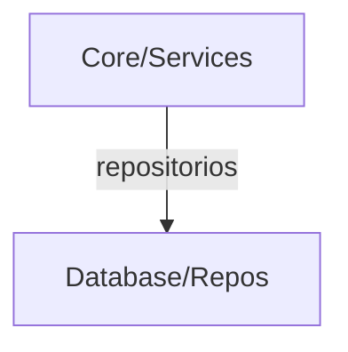

<div class='pagebreak'></div>

## database/ — Referencia

<div id='sec_database___init___py'>

### 📄 `database/__init__.py`

</div>

Capa de datos (`__init__`): modelos, repositorios o acceso SQLAlchemy relacionado con este módulo.

---

<div id='sec_database_config_py'>

### 📄 `database/config.py`

</div>

Capa de datos (`config`): modelos, repositorios o acceso SQLAlchemy relacionado con este módulo.

#### 🏛️ Clase `DatabaseConfig`

**Métodos Principales:**

- `set_db_url`: Allows runtime override of the database URL.
- `get_db_url`: Returns the database connection URL. Priority: Runtime override > Environment variables > Default SQLite.
- `get_echo_sql`: Returns True if SQL queries should be logged.
- `get_log_dir`: Returns the directory for log files.
- `get_backup_dir`: Returns the directory for backup files.

---

<div id='sec_database_database_manager_py'>

### 📄 `database/database_manager.py`

</div>

Capa de datos (`database_manager`): modelos, repositorios o acceso SQLAlchemy relacionado con este módulo.

#### 🏛️ Clase `DatabaseManager`

Gestiona todas las operaciones de la base de datos para la aplicación
utilizando SQLAlchemy.

**Métodos Principales:**

- `__init__`: Inicializa el gestor y configura el motor de SQLAlchemy. Args: db_url (str, optional): URL de conexión. engine (Engine, optional): Motor SQLAlchemy pre-configurado (útil para tests).
- `_create_tables_if_not_exist`: Crea las tablas definidas en los modelos si no existen.
- `_init_repositories`: Inicializa los repositorios con la fábrica de sesiones.
- `close`: Cierra todas las conexiones a la base de datos.
- `get_session`: Devuelve una nueva sesión de SQLAlchemy.
- `db_path`: Devuelve la ruta al archivo de base de datos (solo para SQLite). Extrado de db_url.
- `compare_with_db`: Compare local database with a foreign SQLite database file. Args: foreign_db_path: Path to the foreign .db file (from USB) Returns: DatabaseComparisonDTO containing differences per table
- `apply_sync_changes`: Apply selected changes from a sync operation. Args: comparison: DatabaseComparisonDTO with changes to apply Returns: Number of records successfully applied

---

<div id='sec_database_models___init___py'>

### 📄 `database/models/__init__.py`

</div>

Capa de datos (`__init__`): modelos, repositorios o acceso SQLAlchemy relacionado con este módulo.

---

<div id='sec_database_models_base_py'>

### 📄 `database/models/base.py`

</div>

Modelos ORM base (SQLAlchemy): DeclarativeBase, metadatos compartidos y tablas de
enlace many-to-many entre productos, materiales y preprocesos.

---

<div id='sec_database_models_fabrication_py'>

### 📄 `database/models/fabrication.py`

</div>

Capa de datos (`fabrication`): modelos, repositorios o acceso SQLAlchemy relacionado con este módulo.

#### 🏛️ Clase `Fabricacion`

Entidad principal que representa una Orden de Fabricación (OF).

Vincula un conjunto de productos y preprocesos para su ejecución en planta,
gestionando la trazabilidad y los operarios asignados.

Atributos (Columnas):
    - id (int): Identificador único autoincremental.
    - codigo (str): Código único de la orden (ej: OF-2024-001).
    - descripcion (str, optional): Breve descripción o notas de la orden.
    
Relaciones:
    - preprocesos: Lista de preprocesos asociados (Many-to-Many).
    - trabajadores_asignados: Operarios vinculados a esta OF (Many-to-Many).
    - trabajo_logs: Registro cronológico de actividades en planta (One-to-Many).

#### 🏛️ Clase `FabricacionContador`

Contador para numeración correlativa de etiquetas de unidad en una fabricación.

Permite garantizar que cada unidad física de un lote tenga un ID único incremental.

Atributos (Columnas):
    - fabricacion_id (int): FK hacia 'fabricaciones'. Parte de la PK.
    - ultimo_numero_unidad (int): Último correlativo generado (ej: 42 para la unidad 42).
    
Relaciones:
    - fabricacion: Acceso al objeto Fabricación padre.

---

<div id='sec_database_models_inventory_py'>

### 📄 `database/models/inventory.py`

</div>

Capa de datos (`inventory`): modelos, repositorios o acceso SQLAlchemy relacionado con este módulo.

#### 🏛️ Clase `Material`

Representa un componente físico o materia prima.

Se vincula a productos, preprocesos e iteraciones para gestionar
la lista de materiales (BOM) necesaria en cada fabricación.

#### 🏛️ Clase `Pila`

Contenedor lógico para planes de producción complejos.

Agrupa múltiples fabricaciones y lotes para realizar simulaciones
de carga de trabajo y seguimiento de hitos diarios.

#### 🏛️ Clase `DiarioBitacora`

Registro diario de actividad vinculado a una Pila.

Almacena las entradas de lo planificado vs lo realizado cada día
de la producción activa.

#### 🏛️ Clase `Lote`

Agrupación logística de productos o fabricaciones.

Permite gestionar unidades que deben viajar juntas o que comparten
una misma prioridad de entrega/procesamiento.

---

<div id='sec_database_models_machine_py'>

### 📄 `database/models/machine.py`

</div>

Capa de datos (`machine`): modelos, repositorios o acceso SQLAlchemy relacionado con este módulo.

#### 🏛️ Clase `Maquina`

Representa un recurso físico (fresa, torno, etc.) en planta.

Gestiona su estado de disponibilidad, departamento y los grupos
de preparación asociados para el cálculo de tiempos.

#### 🏛️ Clase `GrupoPreparacion`

Conjunto de pasos de preparación necesarios para una máquina.

Puede ser genérico para la máquina o específico para un producto.

#### 🏛️ Clase `PreparacionPaso`

Tarea individual dentro de un grupo de preparación.

Incluye el tiempo estimado, si es una tarea diaria o de verificación
de primera pieza.

---

<div id='sec_database_models_product_py'>

### 📄 `database/models/product.py`

</div>

Capa de datos (`product`): modelos, repositorios o acceso SQLAlchemy relacionado con este módulo.

#### 🏛️ Clase `Producto`

Modelo que representa un Producto en el catálogo.

Almacena la configuración base, tiempos de fabricación estimados y
relaciones con subfabricaciones, materiales e iteraciones.

Atributos (Columnas):
    - codigo (str): PK. Identificador único del producto.
    - descripcion (str): Nombre descriptivo del producto.
    - departamento (str): Área productiva responsable (ej: Mecanizado).
    - tipo_trabajador (int): Mínimo nivel de habilidad requerido. 
      [Diccionario de Datos] 
      1 = Operario Básico/Junior (tareas rutinarias).
      2 = Especialista/Mid (manejo de maquinaria compleja).
      3 = Experto/Senior (calidad, configuración pesada o supervisión).
    - donde (str, optional): Ubicación física o referencia de almacenamiento.
    - tiene_subfabricaciones (bool): Indica si depende de otros componentes.
    - tiempo_optimo (float, optional): Tiempo de fabricación estimado por unidad.
    
Relaciones:
    - subfabricaciones: Lista de componentes dependientes.
    - materiales: Materias primas asociadas.
    - procesos_mecanicos: Pasos de máquina específicos.
    - iteraciones: Historial de cambios y control de calidad.

#### 🏛️ Clase `Preproceso`

Modelo para tareas preparatorias reutilizables.

Define trabajos que no son procesos mecánicos de máquina pero
consumen tiempo y recursos de operario (ej. limpieza, rebabado).

Atributos (Columnas):
    - id (int): PK autoincremental.
    - nombre (str): Nombre único del proceso.
    - descripcion (str, optional): Texto detallado del trabajo.
    - tiempo (float): Tiempo estimado de ejecución.
    - tipo_trabajador (int): Nivel de habilidad requerido.
    
Relaciones:
    - materiales: Consumibles necesarios para el preproceso.
    - fabricaciones: Órdenes de fabricación que incluyen este paso.

**Métodos Principales:**

- `componentes`: Setter para mantener compatibilidad.

#### 🏛️ Clase `Subfabricacion`

Define un componente que forma parte de un producto pero que
tiene su propio flujo de procesos o es una pieza independiente.

Atributos (Columnas):
    - id (int): PK autoincremental.
    - producto_codigo (str): FK hacia 'productos'.
    - descripcion (str): Nombre del componente.
    - tiempo (float): Tiempo de fabricación.
    - tipo_trabajador (int): Nivel de habilidad requerido.
    - maquina_id (int, optional): FK hacia 'maquinas' (si aplica).
    
Relaciones:
    - producto: Referencia al Producto padre.
    - maquina: Máquina específica asignada.

#### 🏛️ Clase `ProcesoMecanico`

Representa una operación de máquina específica (fresado, torneado, etc.)
vinculada a un producto con un tiempo de ejecución calculado.

Atributos (Columnas):
    - id (int): PK autoincremental.
    - producto_codigo (str): FK hacia 'productos'.
    - nombre (str): Nombre de la operación.
    - descripcion (str): Detalles técnicos del proceso.
    - tiempo (float): Tiempo de máquina por unidad.
    - tipo_trabajador (int): Nivel de habilidad de operario.
    
Relaciones:
    - producto: Producto al que pertenece esta operación.

#### 🏛️ Clase `ProductIteration`

Registro histórico de cambios en un producto.

Almacena revisiones de diseño, responsables, planos y fotos
de piezas reales fabricadas para control de calidad.

Atributos (Columnas):
    - id (int): PK autoincremental.
    - producto_codigo (str): FK hacia 'productos'.
    - fecha_creacion (datetime): Fecha de la revisión.
    - nombre_responsable (str): Quién realizó el cambio.
    - descripcion_cambio (str): Motivo o detalle de la iteración.
    - ruta_imagen (str): Enlace a foto de la pieza fabricada.
    - tipo_fallo (str): Categorización de error si aplica.
    - ruta_plano (str): Enlace al dibujo técnico.
    
Relaciones:
    - producto: Producto objeto de la iteración.
    - materiales: Versión específica de materiales en esta iteración.

---

<div id='sec_database_models_security_py'>

### 📄 `database/models/security.py`

</div>

Modelos ORM de seguridad y auditoria.

Este modulo define las tablas de configuracion global y de seguridad
operativa del sistema:
- `Configuration`: clave/valor de ajustes persistentes.
- `LoginAttempt`: historial de intentos de autenticacion para rate limiting.
- `AuditLog`: trazabilidad de acciones sensibles (RBAC/auditoria).

#### 🏛️ Clase `Configuration`

Par clave/valor para configuraciones persistentes del sistema.

#### 🏛️ Clase `LoginAttempt`

Intento de autenticacion utilizado por la politica de rate limiting.

#### 🏛️ Clase `AuditLog`

Registro auditable de acciones de seguridad y administracion.

---

<div id='sec_database_models_tracking_py'>

### 📄 `database/models/tracking.py`

</div>

Modelos ORM para trazabilidad de fabricacion.

Agrupa el registro historico de ejecucion en planta:
- `TrabajoLog`: cabecera de seguimiento por QR/orden.
- `PasoTrazabilidad`: pasos intermedios de ejecucion.
- `IncidenciaLog`: incidencias reportadas durante la fabricacion.
- `IncidenciaAdjunto`: archivos asociados a incidencias.

#### 🏛️ Clase `TrabajoLog`

Registro principal de trabajo ejecutado para una fabricacion.

#### 🏛️ Clase `PasoTrazabilidad`

Evento de trazabilidad de un paso concreto dentro de un trabajo.

#### 🏛️ Clase `IncidenciaLog`

Incidencia reportada en un trabajo, con estado y resolucion.

#### 🏛️ Clase `IncidenciaAdjunto`

Adjunto asociado a una incidencia (archivo, tipo y metadatos).

---

<div id='sec_database_models_worker_py'>

### 📄 `database/models/worker.py`

</div>

Capa de datos (`worker`): modelos, repositorios o acceso SQLAlchemy relacionado con este módulo.

#### 🏛️ Clase `Trabajador`

Modelo que representa a un operario o administrador del sistema.

Gestiona la autenticación, roles por departamento y la vinculación
con los registros de trabajo e incidencias en planta.

Diccionario de Datos:
    - tipo_trabajador (int): Nivel de capacidad técnica para asignaciones automáticas.
      1 = Operario Básico (operaciones estándar).
      2 = Especialista (maquinaria específica).
      3 = Experto (resolver cuellos de botella y supervisión global).
      El optimizador equiparará este nivel con el mínimo exigido por Producto.

---

<div id='sec_database_repositories___init___py'>

### 📄 `database/repositories/__init__.py`

</div>

Este archivo hace que el directorio 'repositories' sea un paquete de Python
y expone las clases de repositorio para facilitar su importación.

- 🔧 `__getattr__`: Carga perezosa de `ReportsRepository` para no exigir el subpaquete `reports` en imports parciales.

---

<div id='sec_database_repositories_base_py'>

### 📄 `database/repositories/base.py`

</div>

Repositorio base que proporciona funcionalidades comunes para todos los repositorios.

#### 🏛️ Clase `BaseRepository`

Clase base para todos los repositorios.
Proporciona funcionalidades comunes como manejo de sesiones, logging y operaciones CRUD básicas.

**Métodos Principales:**

- `__init__`: Inicializa el repositorio base. Args: session_factory: Factory de sesiones de SQLAlchemy (SessionLocal)
- `get_session`: Obtiene una nueva sesión de SQLAlchemy. Returns: Session de SQLAlchemy o None si hay error
- `safe_execute`: Ejecuta una operación de base de datos de forma segura con manejo de errores. VERSIÓN MEJORADA con mejor logging para debugging.
- `_get_default_error_value`: Valor por defecto a devolver en caso de error. Cada repositorio puede sobrescribir este método.

---

<div id='sec_database_repositories_configuration_repository_py'>

### 📄 `database/repositories/configuration_repository.py`

</div>

Repositorio para la gestión de configuración de la aplicación.

#### 🏛️ Clase `ConfigurationRepository`

Repositorio para gestión de configuración de la aplicación.
Almacena pares clave-valor de configuración.

**Métodos Principales:**

- `_get_default_error_value`: Valor por defecto en caso de error.
- `get_setting`: Obtiene un valor de configuración por su clave. Args: key: Clave de configuración default_value: Valor por defecto si no existe Returns: Valor de configuración o default_value
- `set_setting`: Guarda o actualiza un valor de configuración. Args: key: Clave de configuración value: Valor a guardar (se convertirá a string) Returns: True si se guardó correctamente, False en caso contrario
- `get_holidays`: Obtiene la lista de días festivos. Returns: Lista de objetos date con los festivos
- `add_holiday`: Añade un día festivo. Args: holiday_date: Fecha del festivo description: Descripción opcional del festivo Returns: True si se añadió correctamente, False en caso contrario
- `remove_holiday`: Elimina un día festivo. Args: holiday_date: Fecha del festivo a eliminar Returns: True si se eliminó correctamente

---

<div id='sec_database_repositories_incidencia_repository_py'>

### 📄 `database/repositories/incidencia_repository.py`

</div>

INCIDENCIA REPOSITORY
========================================================================
Repositorio para la gestión de incidencias y adjuntos.
========================================================================

#### 🏛️ Clase `IncidenciaRepository`

Repositorio para gestión de incidencias.

**Métodos Principales:**

- `registrar_incidencia`: Registra una nueva incidencia.
- `_crear_adjunto`: Crea un adjunto fotográfico (uso interno).
- `añadir_foto_a_incidencia`: Añade una foto a una incidencia existente.
- `resolver_incidencia`: Marca una incidencia como resuelta.
- `obtener_incidencias_abiertas`: Obtiene todas las incidencias abiertas.
- `_map_to_incidencia_log_dto`: Map an IncidenciaLog ORM object to IncidenciaLogDTO.
- `_map_to_incidencia_adjunto_dto`: Map IncidenciaAdjunto ORM to DTO.

---

<div id='sec_database_repositories_iteration_repository_py'>

### 📄 `database/repositories/iteration_repository.py`

</div>

Repositorio para gestión de iteraciones de productos.
Módulo único que concentra la persistencia de iteraciones (antes repartida en varias piezas).

#### 🏛️ Clase `IterationRepository`

Repositorio para gestión de iteraciones de productos.
Maneja el historial de cambios, mejoras y gestión de imágenes.

**Métodos Principales:**

- `get_all_iterations_with_dates`: Obtiene todas las iteraciones de todos los productos para la vista de historial. Returns: Lista de ProductIterationDTO
- `get_product_iterations`: Obtiene todas las iteraciones de un producto con sus materiales. Args: producto_codigo: Código del producto Returns: Lista de ProductIterationDTO con materiales
- `get_product_iterations_by_id_or_similar`: Devuelve una iteración por ID.
- `add_product_iteration`: Añade una nueva iteración de producto con sus materiales.
- `update_product_iteration`: Actualiza los campos de una iteración de producto.
- `delete_product_iteration`: Elimina una iteración de producto.
- `update_iteration_image_path`: Actualiza la ruta de la imagen para una iteración.
- `update_iteration_file_path`: Actualiza la ruta de un archivo (imagen/plano) para una iteración.
- `add_image`: Añade una imagen a una iteración.
- `get_images`: Obtiene todas las imágenes de una iteración.
- `delete_image`: Elimina una imagen de la base de datos.
- `_get_default_error_value`: Valor por defecto en caso de error.

---

<div id='sec_database_repositories_iteration_repository_helpers_py'>

### 📄 `database/repositories/iteration_repository_helpers.py`

</div>

Helpers de mapeo para `IterationRepository`.

- 🔧 `material_to_dto`: Convierte un material ORM a DTO.
- 🔧 `iteration_to_dto`: Convierte una iteración ORM a DTO.

---

<div id='sec_database_repositories_label_counter_repository_py'>

### 📄 `database/repositories/label_counter_repository.py`

</div>

Repositorio para gestionar contadores de etiquetas usando SQLAlchemy.
Migrado de SQLite local a base de datos central.

#### 🏛️ Clase `LabelCounterRepository`

Gestiona la numeración de unidades de fabricación usando la BD principal.
Reemplaza la implementación anterior basada en 'etiquetas.db'.

**Métodos Principales:**

- `get_next_unit_range`: Obtiene y reserva un rango de números de unidad únicos para una fabricación. Operación atómica. Args: fabricacion_id (int): El ID de la fabricación. cantidad (int): Cuántos números se necesitan. Returns: LabelRangeDTO con el rango asignado (start, end, count) o None si hay error.
- `_get_next_unit_range_logic`: Lógica interna transaccional para obtener el rango.
- `close`: Método de compatibilidad. No hace nada porque la sesión se maneja por request/operación.

---

<div id='sec_database_repositories_lote_repository_py'>

### 📄 `database/repositories/lote_repository.py`

</div>

Repositorio para la gestión de plantillas de Lote.

#### 🏛️ Clase `LoteRepository`

Gestiona las operaciones CRUD para el modelo Lote utilizando SQLAlchemy.

**Métodos Principales:**

- `create_lote`: Crea una nueva plantilla de Lote y asocia sus componentes.
- `get_lote_details`: Obtiene los detalles de una plantilla de Lote, incluyendo sus componentes.
- `search_lotes`: Busca plantillas de Lote por código o descripción.
- `update_lote`: Actualiza una plantilla de Lote existente.
- `delete_lote`: Elimina una plantilla de Lote.

---

<div id='sec_database_repositories_material_repository_py'>

### 📄 `database/repositories/material_repository.py`

</div>

Repositorio para la gestión de materiales y componentes.
Incluye materiales y la gestión de enlaces producto–material en el mismo repositorio.

#### 🏛️ Clase `MaterialRepository`

Repositorio para gestión de materiales.
Maneja la persistencia y relaciones de componentes industriales.

**Métodos Principales:**

- `get_all_materials`: Obtiene todos los materiales registrados como DTOs.
- `get_material_by_code`: Busca un material por su código único.
- `search_materials`: Busca materiales por código o descripción. Si el término es None o vacío, devuelve todos. Si el término tiene menos de 2 caracteres (y no es vacío), devuelve vacío.
- `add_material`: Añade un material o actualiza su descripción si ya existe.
- `update_material`: Actualiza el código y descripción de un material.
- `delete_material`: Elimina un material por su ID.
- `get_problematic_components_stats`: Obtiene estadísticas de componentes más frecuentes en iteraciones de fallo.
- `link_material_to_product`: Vincula un material a un producto.
- `unlink_material_from_product`: Desvincula un material de un producto.
- `link_material_to_iteration`: Vincula un material a una iteración específica.
- `delete_material_link_from_iteration`: Desvincula un material de una iteración (alias para unlink_material_from_iteration).
- `unlink_material_from_iteration`: Desvincula un material de una iteración.

---

<div id='sec_database_repositories_product_repository_py'>

### 📄 `database/repositories/product_repository.py`

</div>

Repositorio para la gestión de productos.
Incluye la persistencia de productos y la parte relacionada con fabricación en el mismo repositorio.

#### 🏛️ Clase `ProductRepository`

Repositorio para gestión de productos.
Maneja la persistencia de artículos, escandallos y relaciones de fabricación.

**Métodos Principales:**

- `add_product`: Añade un producto, subfabricaciones y procesos mecánicos.
- `update_product`: Actualiza un producto, subfabricaciones y procesos mecánicos.
- `delete_product`: Elimina un producto por su código.
- `get_all_products`: Obtiene la lista completa de productos registrados.
- `get_product_by_code`: Busca un producto por su código único.
- `get_latest_products`: Obtiene los últimos productos (orden descendente por código).
- `get_product_details`: Obtiene detalles, subfabricaciones y procesos de un producto.
- `search_products`: Busca productos por código o descripción (ilike, cualquier longitud). Si el término es None o vacío, devuelve todos (hasta el límite).
- `get_materials_for_product`: Obtiene la lista de materiales vinculados a un producto.
- `get_products_by_fabricacion`: Obtiene los productos asociados a una fabricación. Mantiene compatibilidad con DatabaseManager.

- 🔧 `_subfabricacion_from_row`: Crea un modelo Subfabricacion desde dict (UI/diálogo) o DTO/objeto con atributos. Ignora id/producto_codigo en dicts para evitar choque de kwargs y PKs obsoletas.

---

<div id='sec_database_repositories_product_repository_helpers_py'>

### 📄 `database/repositories/product_repository_helpers.py`

</div>

Helpers de mapeo y normalización para `ProductRepository`.

- 🔧 `to_product_dto`: Convierte el modelo `Producto` a `ProductDTO`.
- 🔧 `to_subfabricacion_dto`: Convierte el modelo `Subfabricacion` a `SubfabricacionDTO`.
- 🔧 `to_proceso_mecanico_dto`: Convierte el modelo `ProcesoMecanico` a `ProcesoMecanicoDTO`.
- 🔧 `to_material_dto`: Convierte el modelo `Material` a `MaterialDTO`.
- 🔧 `normalize_machine_id`: Normaliza `maquina_id` a `int | None`.

---

<div id='sec_database_repositories_protocols_py'>

### 📄 `database/repositories/protocols.py`

</div>

Capa de datos (`protocols`): modelos, repositorios o acceso SQLAlchemy relacionado con este módulo.

#### 🏛️ Clase `RepositoryProtocol`

Contrato común de repositorios basados en BaseRepository (sesión y ejecución segura).

#### 🏛️ Clase `PilaRepositoryProtocol`

Protocolo específico para el repositorio de Pila.

#### 🏛️ Clase `TrackingRepositoryProtocol`

Protocolo específico para el repositorio de Tracking.

---

<div id='sec_database_repositories_tracking_log_repository_py'>

### 📄 `database/repositories/tracking_log_repository.py`

</div>

TRACKING LOG REPOSITORY (Modularizado)
========================================================================
Repositorio para la gestión central de logs de trabajo y pasos.
Organiza la lógica por dominios delegando en gestores especializados (composición).
========================================================================

#### 🏛️ Clase `TrackingLogRepository`

Repositorio para gestión de logs de trabajo y pasos de trazabilidad.
Implementa el patrón Fachada delegando en managers especializados.

**Métodos Principales:**

- `_map_to_trabajo_log_dto`: Wrapper de compatibilidad. Algunos tests pasan `logger` como argumento posicional o keyword; se ignora y se usa siempre `self.logger` para evitar duplicidad en la llamada al mapper.
- `_map_to_incidencia_log_dto`: Wrapper de compatibilidad; ver `_map_to_trabajo_log_dto`.
- `_map_to_paso_trazabilidad_dto`: Wrapper de compatibilidad; ver `_map_to_trabajo_log_dto`.
- `get_fabricaciones_por_trabajador`: Delega la obtención de fabricaciones asignadas al gestor de consultas. Args: trabajador_id: ID del trabajador. Returns: Lista de DTOs de fabricaciones asignadas.

---

<div id='sec_database_repositories_tracking_repository_py'>

### 📄 `database/repositories/tracking_repository.py`

</div>

========================================================================
TRACKING REPOSITORY - GESTIÓN DE TRAZABILIDAD Y SEGUIMIENTO (FACADE)
========================================================================
Repositorio principal que ahora actúa como Facade delegando a:
- TrackingLogRepository
- IncidenciaRepository
- TrackingStatsRepository

Autor: Sistema de Trazabilidad
Fecha: 2025
========================================================================

#### 🏛️ Clase `TrackingRepository`

Repositorio FACADE para operaciones de tracking y trazabilidad.
Delega la lógica a repositorios especializados.

**Métodos Principales:**

- `__init__`: Inicializa el repositorio y sus sub-repositorios.
- `get_fabricaciones_por_trabajador`: Obtiene las fabricaciones asignadas a un trabajador (vía log_repo). Args: trabajador_id: ID del trabajador. Returns: Lista de fabricaciones con sus productos asociados en formato DTO.
- `import_tasks_from_csv`: Importa tareas desde un archivo CSV. (Stub para compatibilidad UI)

---

<div id='sec_database_repositories_tracking_stats_repository_py'>

### 📄 `database/repositories/tracking_stats_repository.py`

</div>

TRACKING STATS REPOSITORY
========================================================================
Repositorio para consultas estadísticas de seguimiento.
========================================================================

#### 🏛️ Clase `TrackingStatsRepository`

Repositorio para consultas estadísticas de seguimiento.

**Métodos Principales:**

- `obtener_estadisticas_trabajador`: Obtiene estadísticas de un trabajador.
- `obtener_estadisticas_fabricacion`: Obtiene estadísticas de una fabricación.
- `obtener_trabajadores_de_fabricacion`: Obtiene todos los trabajadores asignados a una fabricación.

---

<div id='sec_database_repositories_machine___init___py'>

### 📄 `database/repositories/machine/__init__.py`

</div>

Capa de datos (`__init__`): modelos, repositorios o acceso SQLAlchemy relacionado con este módulo.

---

<div id='sec_database_repositories_machine_crud_manager_py'>

### 📄 `database/repositories/machine/crud_manager.py`

</div>

Capa de datos (`crud_manager`): modelos, repositorios o acceso SQLAlchemy relacionado con este módulo.

#### 🏛️ Clase `MachineCRUDManager`

Gestor DAO para operaciones CRUD básicas de máquinas.

Proporciona métodos para listar, añadir, actualizar y eliminar registros de
maquinaria en la base de datos, convirtiéndolos automáticamente a DTOs.

---

<div id='sec_database_repositories_machine_maintenance_manager_py'>

### 📄 `database/repositories/machine/maintenance_manager.py`

</div>

Capa de datos (`maintenance_manager`): modelos, repositorios o acceso SQLAlchemy relacionado con este módulo.

#### 🏛️ Clase `MachineMaintenanceManager`

Gestor DAO para el historial de mantenimiento de máquinas.

---

<div id='sec_database_repositories_machine_preparation_manager_py'>

### 📄 `database/repositories/machine/preparation_manager.py`

</div>

Capa de datos (`preparation_manager`): modelos, repositorios o acceso SQLAlchemy relacionado con este módulo.

#### 🏛️ Clase `MachinePreparationManager`

Gestor DAO para la configuración de preparación de máquinas.

**Métodos Principales:**

- `get_prep_info_for_product`: Primer grupo de preparación vinculado al código de producto (si existe). Returns: (grupo_id, maquina_id) o (None, None) si no hay coincidencia.

---

<div id='sec_database_repositories_machine_repository_py'>

### 📄 `database/repositories/machine/repository.py`

</div>

Capa de datos (`repository`): modelos, repositorios o acceso SQLAlchemy relacionado con este módulo.

#### 🏛️ Clase `MachineRepository`

Repositorio para la gestión de máquinas.
Implementa el patrón Fachada delegando en DAO Managers especializados.

**Métodos Principales:**

- `_sync_managers`: Sincroniza la configuración del repositorio con sus gestores internos.
- `__setattr__`: Propaga cambios en session_factory o safe_execute a los managers.
- `get_machine_history`: Wrapper de compatibilidad para `DatabaseManager.get_machine_history()`. Históricamente este método devolvía un diccionario con el historial de la máquina. En la implementación actual, el historial se obtiene desde el manager de mantenimiento.

---

<div id='sec_database_repositories_machine_stats_manager_py'>

### 📄 `database/repositories/machine/stats_manager.py`

</div>

Capa de datos (`stats_manager`): modelos, repositorios o acceso SQLAlchemy relacionado con este módulo.

#### 🏛️ Clase `MachineStatsManager`

Gestor DAO para estadísticas relacionadas con máquinas.

---

<div id='sec_database_repositories_pila___init___py'>

### 📄 `database/repositories/pila/__init__.py`

</div>

Capa de datos (`__init__`): modelos, repositorios o acceso SQLAlchemy relacionado con este módulo.

---

<div id='sec_database_repositories_pila_pila_base_manager_py'>

### 📄 `database/repositories/pila/pila_base_manager.py`

</div>

Capa de datos (`pila_base_manager`): modelos, repositorios o acceso SQLAlchemy relacionado con este módulo.

#### 🏛️ Clase `PilaBaseManager`

Gestor de utilidades base para el dominio de Pilas (serialización de flujos).

**Métodos Principales:**

- `convert_indices_to_ids`: Convierte índices relativos en IDs únicos persistentes para el flujo.
- `convert_ids_to_indices`: Reconvierte IDs persistentes en índices relativos para uso en memoria/UI.

---

<div id='sec_database_repositories_pila_pila_bitacora_manager_py'>

### 📄 `database/repositories/pila/pila_bitacora_manager.py`

</div>

Capa de datos (`pila_bitacora_manager`): modelos, repositorios o acceso SQLAlchemy relacionado con este módulo.

#### 🏛️ Clase `PilaBitacoraManager`

Gestor DAO para la bitácora diaria de seguimiento de pilas.

**Métodos Principales:**

- `add_diario_evento`: Añade o sobreescribe la entrada de un día en la bitácora de la pila.

---

<div id='sec_database_repositories_pila_pila_crud_manager_py'>

### 📄 `database/repositories/pila/pila_crud_manager.py`

</div>

Capa de datos (`pila_crud_manager`): modelos, repositorios o acceso SQLAlchemy relacionado con este módulo.

#### 🏛️ Clase `PilaCRUDManager`

Gestor DAO para operaciones CRUD básicas de pilas.

---

<div id='sec_database_repositories_pila_pila_workflow_manager_py'>

### 📄 `database/repositories/pila/pila_workflow_manager.py`

</div>

Capa de datos (`pila_workflow_manager`): modelos, repositorios o acceso SQLAlchemy relacionado con este módulo.

#### 🏛️ Clase `PilaWorkflowManager`

Gestor DAO para la lógica de negocio y persistencia de flujos de trabajo (Pilas).

---

<div id='sec_database_repositories_pila_repository_py'>

### 📄 `database/repositories/pila/repository.py`

</div>

Capa de datos (`repository`): modelos, repositorios o acceso SQLAlchemy relacionado con este módulo.

#### 🏛️ Clase `PilaRepository`

Repositorio para la gestión de pilas de producción.
Implementa el patrón Fachada delegando en DAO Managers especializados.

---

<div id='sec_database_repositories_preproceso___init___py'>

### 📄 `database/repositories/preproceso/__init__.py`

</div>

Capa de datos (`__init__`): modelos, repositorios o acceso SQLAlchemy relacionado con este módulo.

---

<div id='sec_database_repositories_preproceso_fabricacion_manager_py'>

### 📄 `database/repositories/preproceso/fabricacion_manager.py`

</div>

Capa de datos (`fabricacion_manager`): modelos, repositorios o acceso SQLAlchemy relacionado con este módulo.

#### 🏛️ Clase `FabricacionManager`

Gestor DAO para la entidad Fabricacion.
Hereda de BaseRepository para aprovechar el patrón de ejecución segura `safe_execute`.

Esta clase implementa la Fase 12C (DTO-First), eliminando el paso de diccionarios
o tuplas crudas entre la base de datos y las capas superiores. Todas las
operaciones de lectura y escritura se normalizan mediante `FabricacionDTO`.

**Métodos Principales:**

- `get_all_fabricaciones`: Obtiene todas las fabricaciones registradas en formato DTO. Realiza una consulta ordenada por ID descendente para mostrar primero las más recientes. Cada registro de SQLAlchemy se mapea a un `FabricacionDTO` para garantizar el aislamiento de la capa de persistencia.
- `get_products_for_fabricacion`: Recupera la lista de productos asociados a una fabricación específica. Utiliza SQL directo a la tabla puente `fabricacion_productos` para optimizar la recuperación. Cada fila se encapsula en un `FabricacionProductoDTO` que incluye el código del producto y la cantidad asignada.
- `add_product_to_fabricacion`: Añade un producto a una fabricación o actualiza su cantidad si ya existe.
- `set_products_for_fabricacion`: Sobrescribe completamente la lista de productos de una fabricación. Implementa una operación atómica de 'limpiar y reemplazar': 1. Elimina todas las asociaciones actuales de la fabricación mediante SQL DELETE. 2. Inserta los nuevos productos contenidos en la lista de `FabricacionProductoDTO`. Si ocurre algún error, se realiza un rollback automático para mantener la integridad.
- `get_fabricacion_by_codigo`: Busca una única Orden de Fabricación por su código exacto.
- `search_fabricaciones`: Busca fabricaciones por código o descripción.
- `get_fabricacion_by_id`: Obtiene una fabricación con sus preprocesos.
- `create_fabricacion_with_preprocesos`: Crea una fabricación y le asigna sus preprocesos.
- `update_fabricacion_and_preprocesos`: Actualiza los datos de una fabricación y su lista de preprocesos.
- `delete_fabricacion`: Elimina una fabricación de la base de datos.
- `get_latest_fabricaciones`: Obtiene las últimas fabricaciones añadidas.
- `get_preprocesos_by_fabricacion`: Obtiene los preprocesos de una fabricación.
- `update_fabricacion_preprocesos`: Actualiza solamente la lista de preprocesos de una fabricación.

---

<div id='sec_database_repositories_preproceso_preproceso_manager_py'>

### 📄 `database/repositories/preproceso/preproceso_manager.py`

</div>

Capa de datos (`preproceso_manager`): modelos, repositorios o acceso SQLAlchemy relacionado con este módulo.

#### 🏛️ Clase `PreprocesoManager`

Gestor DAO para la entidad Preproceso.
Hereda de BaseRepository para utilizar safe_execute.

**Métodos Principales:**

- `get_all_preprocesos`: Obtiene todos los preprocesos con sus materiales como DTOs.
- `get_preproceso_components`: Obtiene los componentes (materiales) asociados a un preproceso específico.
- `create_preproceso`: Crea un nuevo preproceso y lo asocia con sus materiales.
- `update_preproceso`: Actualiza un preproceso existente.
- `delete_preproceso`: Elimina un preproceso y sus relaciones.

---

<div id='sec_database_repositories_preproceso_repository_py'>

### 📄 `database/repositories/preproceso/repository.py`

</div>

Capa de datos (`repository`): modelos, repositorios o acceso SQLAlchemy relacionado con este módulo.

#### 🏛️ Clase `PreprocesoRepository`

Gestiona las operaciones CRUD para los modelos Preproceso y Fabricacion
utilizando exclusivamente SQLAlchemy.
Implementa el patrón Fachada delegando en managers especializados.

**Métodos Principales:**

- `get_all_preprocesos_with_components`: Devuelve preprocesos junto con sus componentes. Se usa como método de compatibilidad para `DatabaseManager.get_all_preprocesos_with_components()`.
- `create_fabricacion`: Crea una nueva fabricación simple (wrapper para compatibilidad).

---

<div id='sec_database_repositories_reports___init___py'>

### 📄 `database/repositories/reports/__init__.py`

</div>

Capa de datos (`__init__`): modelos, repositorios o acceso SQLAlchemy relacionado con este módulo.

---

<div id='sec_database_repositories_reports_reports_incidences_manager_py'>

### 📄 `database/repositories/reports/reports_incidences_manager.py`

</div>

Capa de datos (`reports_incidences_manager`): modelos, repositorios o acceso SQLAlchemy relacionado con este módulo.

#### 🏛️ Clase `ReportsIncidencesManager`

Gestor DAO para análisis de incidencias en reportes.

---

<div id='sec_database_repositories_reports_reports_orders_manager_py'>

### 📄 `database/repositories/reports/reports_orders_manager.py`

</div>

Capa de datos (`reports_orders_manager`): modelos, repositorios o acceso SQLAlchemy relacionado con este módulo.

#### 🏛️ Clase `ReportsOrdersManager`

Gestor DAO para consultas sobre órdenes de fabricación en reportes.

---

<div id='sec_database_repositories_reports_reports_products_manager_py'>

### 📄 `database/repositories/reports/reports_products_manager.py`

</div>

Capa de datos (`reports_products_manager`): modelos, repositorios o acceso SQLAlchemy relacionado con este módulo.

#### 🏛️ Clase `ReportsProductsManager`

Gestor DAO para resúmenes de productos en reportes.

---

<div id='sec_database_repositories_reports_reports_search_manager_py'>

### 📄 `database/repositories/reports/reports_search_manager.py`

</div>

Capa de datos (`reports_search_manager`): modelos, repositorios o acceso SQLAlchemy relacionado con este módulo.

#### 🏛️ Clase `ReportsSearchManager`

Gestor DAO para búsquedas transversales orientadas a reportes.

---

<div id='sec_database_repositories_reports_reports_stats_manager_py'>

### 📄 `database/repositories/reports/reports_stats_manager.py`

</div>

Capa de datos (`reports_stats_manager`): modelos, repositorios o acceso SQLAlchemy relacionado con este módulo.

#### 🏛️ Clase `ReportsStatsManager`

Gestor DAO para cálculos estadísticos complejos en reportes.

---

<div id='sec_database_repositories_reports_repository_py'>

### 📄 `database/repositories/reports/repository.py`

</div>

Capa de datos (`repository`): modelos, repositorios o acceso SQLAlchemy relacionado con este módulo.

#### 🏛️ Clase `ReportsRepository`

Repositorio especializado en consultas de agregación y análisis para reportes.
Implementa el patrón Fachada delegando en DAO Managers especializados.

**Métodos Principales:**

- `obtener_dashboard_producto`: Obtiene en una sola llamada lógica todos los datos del dashboard de un producto. Centraliza el contrato consumido por UI para reducir round-trips en capas superiores.

---

<div id='sec_database_repositories_tracking_core_manager_py'>

### 📄 `database/repositories/tracking/core_manager.py`

</div>

Capa de datos (`core_manager`): modelos, repositorios o acceso SQLAlchemy relacionado con este módulo.

#### 🏛️ Clase `TrackingCoreManager`

Gestor DAO para la gestión central de trabajos (obtención, creación, finalización).

---

<div id='sec_database_repositories_tracking_mappers_py'>

### 📄 `database/repositories/tracking/mappers.py`

</div>

Capa de datos (`mappers`): modelos, repositorios o acceso SQLAlchemy relacionado con este módulo.

#### 🏛️ Clase `TrackingMapper`

Utilidad para mapear modelos de Trazabilidad a DTOs.

---

<div id='sec_database_repositories_tracking_queries_manager_py'>

### 📄 `database/repositories/tracking/queries_manager.py`

</div>

Nombre del Módulo: tracking.queries_manager
Descripcion: Gestor central de consultas complejas para el sistema de tracking.
             Incluye exportación de datos y recuperación de fabricaciones asignadas.

#### 🏛️ Clase `TrackingQueriesManager`

Gestor DAO para consultas complejas y exportación de datos de tracking.

Centraliza la lógica de consultas de solo lectura pesadas y transformaciones
a DTOs para la interfaz de trabajador y exportaciones.

**Métodos Principales:**

- `get_fabricaciones_por_trabajador`: Obtiene las fabricaciones asignadas a un trabajador incluyendo sus productos. Realiza un JOIN entre la tabla de enlace de asignaciones y las fabricaciones, trayendo además los productos vinculados a cada una mediante un outer join. Agrupa los resultados para construir objetos FabricacionAsignadaDTO. Args: trabajador_id: ID del trabajador cuyas asignaciones se desean recuperar. Returns: Lista de DTOs con la información de las fabricaciones y sus productos.

---

<div id='sec_database_repositories_tracking_steps_manager_py'>

### 📄 `database/repositories/tracking/steps_manager.py`

</div>

Capa de datos (`steps_manager`): modelos, repositorios o acceso SQLAlchemy relacionado con este módulo.

#### 🏛️ Clase `TrackingStepsManager`

Gestor DAO para la gestión de pasos de trazabilidad.

---

<div id='sec_database_repositories_worker___init___py'>

### 📄 `database/repositories/worker/__init__.py`

</div>

Capa de datos (`__init__`): modelos, repositorios o acceso SQLAlchemy relacionado con este módulo.

---

<div id='sec_database_repositories_worker_annotation_manager_py'>

### 📄 `database/repositories/worker/annotation_manager.py`

</div>

Capa de datos (`annotation_manager`): modelos, repositorios o acceso SQLAlchemy relacionado con este módulo.

#### 🏛️ Clase `WorkerAnnotationManager`

Gestor DAO para la gestión de anotaciones de trabajadores.

**Métodos Principales:**

- `get_worker_annotations`: Obtiene todas las anotaciones para un trabajador específico.
- `add_worker_annotation`: Añade una nueva anotación para un trabajador asociada a una pila específica.

---

<div id='sec_database_repositories_worker_auth_manager_py'>

### 📄 `database/repositories/worker/auth_manager.py`

</div>

Capa de datos (`auth_manager`): modelos, repositorios o acceso SQLAlchemy relacionado con este módulo.

#### 🏛️ Clase `WorkerAuthManager`

Gestor DAO para la gestión de autenticación y credenciales de trabajadores.

**Métodos Principales:**

- `authenticate_user`: Verifica las credenciales de un usuario y devuelve sus datos si son correctas.
- `update_user_credentials`: Actualiza los datos de login de un trabajador.
- `update_user_password`: Actualiza únicamente la contraseña de un trabajador.

---

<div id='sec_database_repositories_worker_repository_py'>

### 📄 `database/repositories/worker/repository.py`

</div>

Capa de datos (`repository`): modelos, repositorios o acceso SQLAlchemy relacionado con este módulo.

#### 🏛️ Clase `WorkerRepository`

Repositorio para la gestión de trabajadores.
Implementa el patrón Fachada delegando en DAO Managers especializados.

---

<div id='sec_database_repositories_worker_worker_manager_py'>

### 📄 `database/repositories/worker/worker_manager.py`

</div>

Capa de datos (`worker_manager`): modelos, repositorios o acceso SQLAlchemy relacionado con este módulo.

#### 🏛️ Clase `WorkerCoreManager`

Gestor DAO para la gestión de datos básicos de trabajadores.

**Métodos Principales:**

- `get_all_workers`: Obtiene una lista de todos los trabajadores.
- `get_latest_workers`: Obtiene los últimos trabajadores añadidos.
- `get_worker_details`: Obtiene los detalles de un trabajador específico por su ID.
- `add_worker`: Añade un nuevo trabajador o actualiza uno existente.
- `update_worker`: Actualiza los datos de un trabajador existente.
- `delete_worker`: Elimina un trabajador de la base de datos.

---

<div class='pagebreak'></div>

<div id='folder_features'>

## Capítulo: `features/`

</div>

| Métrica | Valor |
|---|---:|
| Archivos `.py` en `features/` | 6 |
| Incluidos en el cuerpo | 6 |
| Omitidos (docstrings/reglas) | 0 |
| Clases detectadas (AST) | 6 |

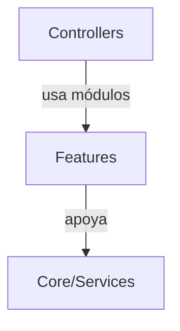

<div class='pagebreak'></div>

## features/ — Referencia

<div id='sec_features___init___py'>

### 📄 `features/__init__.py`

</div>

Funcionalidad encapsulada (`__init__`): reglas de dominio o integración opcional usada por controladores o servicios.

---

<div id='sec_features_worker_controller_py'>

### 📄 `features/worker_controller.py`

</div>

Controlador para la interfaz de trabajador.

Maneja la lógica de negocio para trabajadores:
- Carga de fabricaciones asignadas
- Registro de tiempos mediante QR
- Gestión de incidencias
- Comunicación con la base de datos

#### 🏛️ Clase `WorkerController`

Controlador para gestionar las operaciones de trabajadores.

**Métodos Principales:**

- `initialize`: Inicializa los datos y conecta señales.
- `refresh_data`: Recarga todos los datos.
- `_handle_task_selected`: Actualiza el estado de la UI al seleccionar una tarea.
- `_handle_consult_qr`: Maneja la consulta de un código QR.
- `_handle_start_task`: Maneja el inicio de un paso.
- `_handle_end_task`: Maneja la finalización de un paso.
- `_handle_register_incidence`: Maneja incidencias.

---

<div id='sec_features_worker_controller_io_manager_py'>

### 📄 `features/worker_controller_io_manager.py`

</div>

Operaciones IO/UI para `WorkerController`.

#### 🏛️ Clase `WorkerIOManager`

Colaborador de composición para operaciones I/O del WorkerController.

---

<div id='sec_features_worker_db_sync_py'>

### 📄 `features/worker_db_sync.py`

</div>

Servicio para la sincronización y persistencia de datos del trabajador.
Actúa como fachada para el repositorio de trazabilidad y otras operaciones de BD.

Las fabricaciones asignadas a la lista del trabajador se exponen como
``WorkerTaskListRowDTO`` (ver ``get_assigned_fabricaciones``), no como dicts opacos.

#### 🏛️ Clase `WorkerDbSync`

Maneja las operaciones de lectura/escritura en base de datos para el trabajador.

**Métodos Principales:**

- `get_assigned_fabricaciones`: Obtiene y formatea las fabricaciones asignadas a un trabajador para la UI. Solicita al repositorio las asignaciones (como DTOs) y devuelve filas tipadas (`WorkerTaskListRowDTO`) para la lista del trabajador. Args: trabajador_id: ID del trabajador logueado. Returns: Lista de DTOs con id, codigo, producto_codigo, etc.
- `get_active_trabajos`: Obtiene los trabajos actualmente en proceso para el trabajador.
- `get_paso_activo`: Obtiene el paso actual en proceso del trabajador.
- `get_trabajo_por_qr`: Busca el historial (TrabajoLog) de una unidad por su QR.
- `get_trabajo_por_id`: Obtiene un TrabajoLog por su ID.
- `iniciar_o_recuperar_trabajo`: Inicia un nuevo registro de unidad o recupera uno existente.
- `iniciar_paso`: Registra el inicio de un nuevo paso de trabajo.
- `finalizar_paso`: Registra la finalización de un paso de trabajo.
- `registrar_incidencia`: Registra una incidencia asociada a un trabajo.
- `get_estadisticas`: Obtiene estadísticas de rendimiento del trabajador.
- `get_data_for_export`: Obtiene datos nuevos para exportación.

---

<div id='sec_features_worker_incidence_dialog_py'>

### 📄 `features/worker_incidence_dialog.py`

</div>

Diálogo modal para registrar incidencias del operario.

#### 🏛️ Clase `IncidenceDialog`

Diálogo modal para que el trabajador registre una incidencia,
incluyendo título, descripción y la posibilidad de adjuntar fotos.

---

<div id='sec_features_worker_validation_service_py'>

### 📄 `features/worker_validation_service.py`

</div>

Servicio para la validación de reglas de negocio en la interfaz de trabajador.
Maneja comprobaciones de formatos QR, transiciones de estado y coherencia de datos.

#### 🏛️ Clase `WorkerValidationService`

Gestiona la lógica de validación para procesos de trabajadores.
Desacopla la lógica de decisión del controlador UI.

**Métodos Principales:**

- `validate_qr_data`: Valida el formato de un código QR. Returns: Tuple (is_valid, parsed_data, error_message)
- `validate_product_match`: Verifica si el producto del QR coincide con el de la tarea seleccionada.
- `is_step_duplicated`: Comprueba si un paso ya ha sido completado para una unidad específica.

---

<div class='pagebreak'></div>

<div id='folder_ui'>

## Capítulo: `ui/`

</div>

| Métrica | Valor |
|---|---:|
| Archivos `.py` en `ui/` | 110 |
| Incluidos en el cuerpo | 110 |
| Omitidos (docstrings/reglas) | 0 |
| Clases detectadas (AST) | 106 |

```mermaid
graph TD
  UI[UI (PyQt6)] -->|señales/slots| CTRL[Controllers]
  CTRL -->|delegación| CORE[Core/Services]
```

<div class='pagebreak'></div>

## ui/ — Referencia

<div id='sec_ui___init___py'>

### 📄 `ui/__init__.py`

</div>

Interfaz PyQt6 (`__init__`): widgets, diálogos o recursos visuales conectados al flujo de usuario.

---

<div id='sec_ui_main_window_py'>

### 📄 `ui/main_window.py`

</div>

Interfaz PyQt6 (`main_window`): widgets, diálogos o recursos visuales conectados al flujo de usuario.

#### 🏛️ Clase `MainView`

Vista principal de la aplicación (la ventana).

**Métodos Principales:**

- `__init__`: Inicializa la ventana principal y sus componentes de UI.
- `init_ui`: Inicializa todos los componentes de la interfaz.
- `_init_pages`: Instancia y registra todas las páginas de la aplicación.
- `set_controller`: Asigna el controlador a esta vista y a sus widgets hijos.
- `_create_main_layout`: Configura el layout principal con NavPanel, Header y StackedWidget.
- `switch_page`: Cambia la página visible en el widget apilado.
- `get_page`: Obtiene una página específica por nombre.
- `get_products_tab`: Retorna el widget de gestión de productos.
- `get_fabrications_tab`: Retorna el widget de gestión de fabricaciones.
- `pages`: Interfaz de compatibilidad para el reporte de páginas.
- `buttons`: Compatibilidad legacy: expone los botones del panel de navegación.
- `_forzar_auto_ajuste`: Fuerza un recalculo dinámico del factor de escala y repinta.
- `show_message`: Muestra un diálogo de mensaje al usuario.
- `show_confirmation_dialog`: Muestra un diálogo de confirmación (Sí/No).
- `run_simulation_and_display`: Legacy helper para mostrar resultados de simulación.
- `display_simulation_results`: Envía resultados al widget de cálculo.
- `closeEvent`: Maneja el cierre de la aplicación con backup automático.

---

<div id='sec_ui_startup_screen_py'>

### 📄 `ui/startup_screen.py`

</div>

Nombre del Módulo: startup_screen
Descripción: Ventana de arranque que verifica el estado del sistema antes de
             mostrar la aplicación principal. Diseñada para usuarios no técnicos
             con mensajes contextuales claros y opción de exportar informe.

#### 🏛️ Clase `StartupScreen`

Diálogo modal de arranque que verifica BD y ejecuta tests unitarios.
Diseñado para usuarios no técnicos con mensajes contextuales.

**Métodos Principales:**

- `_start_auto_advance`: Inicia cuenta regresiva para entrar automáticamente.
- `_tick_auto`: Tick de la cuenta regresiva.
- `_generate_report_text`: Genera el texto completo del informe para exportación.
- `closeEvent`: Limpia recursos al cerrar.

---

<div id='sec_ui_startup_screen_constants_py'>

### 📄 `ui/startup_screen_constants.py`

</div>

Constantes usadas por la ventana de arranque (StartupScreen).
Extraídas para reducir LOC del monolito y facilitar tests.

---

<div id='sec_ui_startup_screen_report_py'>

### 📄 `ui/startup_screen_report.py`

</div>

Generación de texto del informe de verificación del sistema (StartupScreen).
Lógica pura sin Qt; testeable con HealthReport mock o real.

- 🔧 `generate_startup_report_text`: Genera el texto completo del informe para exportación. Args: report: Informe de salud. Si es None, devuelve "Sin datos disponibles". log_path: Ruta al archivo de log. Si None, usa ``<writable_root>/logs/EvolucionTiempos.log``. Returns: Texto formateado del informe.

---

<div id='sec_ui_startup_screen_ui_py'>

### 📄 `ui/startup_screen_ui.py`

</div>

Helpers de UI para `StartupScreen`.

Se extrae la construcción de secciones y el render de resultados para reducir
el tamaño del diálogo sin cambiar comportamiento.

#### 🏛️ Clase `StartupSectionWidgets`

Referencias a frame y layouts de una seccion del StartupScreen.

- 🔧 `make_section`: Crea una sección con título, descripción y un layout de contenido.
- 🔧 `clear_layout`: Elimina widgets hijos de un layout.
- 🔧 `build_startup_ui`: Construye la UI del StartupScreen y asigna atributos esperados.
- 🔧 `render_db_report`: Rellena la sección de BD a partir de un HealthReport.

---

<div id='sec_ui_dialogs___init___py'>

### 📄 `ui/dialogs/__init__.py`

</div>

Este módulo sirve como punto de entrada para todos los diálogos de la aplicación.
Refactorización Phase 3 Extended completada: Todas las clases han sido extraídas.

---

<div id='sec_ui_dialogs_backup_restore_dialog_py'>

### 📄 `ui/dialogs/backup_restore_dialog.py`

</div>

Backup Restore Dialog
Permite visualizar, seleccionar y restaurar backups automáticos.

#### 🏛️ Clase `BackupRestoreDialog`

Diálogo para gestionar la restauración de backups.

**Métodos Principales:**

- `init_ui`: Inicializa la interfaz del diálogo.
- `load_backups`: Carga la lista de backups disponibles.

---

<div id='sec_ui_dialogs_canvas_widget_py'>

### 📄 `ui/dialogs/canvas_widget.py`

</div>

Nombre del Módulo: canvas_widget
Descripcion: Canvas **legacy** del dialogo historico de definicion de flujo (tareas en
             ``parent_dialog.canvas_tasks``). Mantiene su propio pintado de conexiones y
             ``_calculate_smart_path`` local.

             El canvas reutilizable del flujo de produccion (planificacion/simulacion mejorada)
             es ``ui.widgets.production_flow.flow_canvas.ProductionFlowCanvas`` junto con
             ``flow_connection_painter.FlowConnectionPainter`` (enrutado ortogonal, capa de
             flechas, etc.). No unificar aqui salvo refactor explicito del dialogo legacy.

#### 🏛️ Clase `CanvasWidget`

Canvas embebido en el dialogo legacy: pinta rejilla y flechas con logica propia
(no usa ``ProductionFlowCanvas``). Depende de ``parent_dialog`` para resolver indices
de tareas y datos de ciclo al dibujar aristas.

**Métodos Principales:**

- `set_connections`: Recibe conexiones (dict legacy o DTO) y fuerza un redibujado.
- `paintEvent`: Se llama cuando el widget necesita ser redibujado. Dibuja el grid de fondo y las conexiones con el estilo adecuado según su tipo.
- `_get_task_index_by_widget`: Obtiene el índice de una tarea por su widget.
- `_draw_cyclic_arrow_with_glow`: Dibuja una flecha cíclica con efecto neón y gradiente de color.
- `_draw_grid`: Dibuja una cuadrícula de fondo tipo papel milimétrico.
- `_calculate_smart_path`: Calcula una ruta inteligente siguiendo el grid entre dos puntos evitando tarjetas.
- `_count_path_collisions`: Cuenta cuántos segmentos del path colisionan con obstáculos.
- `_line_intersects_rect`: Comprueba si una línea intersecta con un rectángulo.
- `_adjust_path_to_avoid_obstacles`: Intenta ajustar el path para evitar obstáculos desplazándolo.
- `_draw_arrowhead`: Dibuja la punta de una flecha.
- `mousePressEvent`: Detecta clics en el canvas (fondo) para ocultar el inspector.

---

<div id='sec_ui_dialogs_canvas_widgets_py'>

### 📄 `ui/dialogs/canvas_widgets.py`

</div>

Compatibilidad: módulo histórico que expone `CanvasWidget` y `CardWidget`.

Este archivo existe para mantener imports estables (`ui.dialogs.canvas_widgets`)
tras la división del monolito en módulos más pequeños.

---

<div id='sec_ui_dialogs_card_widget_py'>

### 📄 `ui/dialogs/card_widget.py`

</div>

Nombre del Módulo: card_widget
Descripción: Tarjeta visual movible que representa una tarea dentro de un `CanvasWidget`.

#### 🏛️ Clase `CardWidget`

Una tarjeta visual y MOVIBLE que representa una tarea en el canvas.
Emite 'clicked' al ser seleccionada y 'moved' al ser movida.

**Métodos Principales:**

- `mousePressEvent`: Se activa al hacer clic en la tarjeta.
- `mouseMoveEvent`: Se activa al mover el ratón mientras se mantiene presionado.
- `mouseReleaseEvent`: Se activa al soltar el botón del ratón.
- `_snap_to_grid`: Ajusta la posición de la tarjeta al punto más cercano de la cuadrícula.
- `_task_name_duration`: Devuelve nombre y duración desde el DTO de tarea.

---

<div id='sec_ui_dialogs_connection_dialog_py'>

### 📄 `ui/dialogs/connection_dialog.py`

</div>

Connection Mode Selection Dialog
================================
Allows the user to choose between Local (SQLite) and Server (PostgreSQL) 
modes at application startup.

#### 🏛️ Clase `ConnectionDialog`

Dialog displayed at startup to select database connection mode.

**Métodos Principales:**

- `get_selection`: Returns a tuple: (mode_string, remember_bool) mode_string: 'sqlite' or 'postgresql'

---

<div id='sec_ui_dialogs_tracking_dialogs_py'>

### 📄 `ui/dialogs/tracking_dialogs.py`

</div>

Interfaz PyQt6 (`tracking_dialogs`): widgets, diálogos o recursos visuales conectados al flujo de usuario.

#### 🏛️ Clase `OrderSetupDialog`

Dialog to setup the start of a production session.
Asks for the Order Number (OF) and the Total Quantity to produce.

---

<div id='sec_ui_dialogs_utility_dialogs_py'>

### 📄 `ui/dialogs/utility_dialogs.py`

</div>

Interfaz PyQt6 (`utility_dialogs`): widgets, diálogos o recursos visuales conectados al flujo de usuario.

#### 🏛️ Clase `AddBreakDialog`

Diálogo simple para añadir un nuevo descanso.

**Métodos Principales:**

- `get_times`: Devuelve las horas seleccionadas en formato de texto.

#### 🏛️ Clase `LoginDialog`

Diálogo para la autenticación de usuarios.

**Métodos Principales:**

- `get_credentials`: Devuelve el usuario y la contraseña introducidos.

#### 🏛️ Clase `ChangePasswordDialog`

Diálogo para cambiar la contraseña de un usuario.

**Métodos Principales:**

- `get_passwords`: Devuelve las contraseñas introducidas.

#### 🏛️ Clase `SyncDialog`

Diálogo para mostrar diferencias entre dos bases de datos y seleccionar cuáles importar.

**Métodos Principales:**

- `_populate_tabs`: Crea una pestaña por cada tabla con diferencias.
- `get_selected_changes`: Recopila todos los elementos marcados por el usuario para ser importados.

#### 🏛️ Clase `SeleccionarHojasExcelDialog`

Diálogo para que el usuario elija qué hojas incluir en el informe Excel.

**Métodos Principales:**

- `get_opciones`: Devuelve un diccionario con las opciones seleccionadas.

#### 🏛️ Clase `MultiWorkerSelectionDialog`

Diálogo para seleccionar múltiples trabajadores de una lista.

**Métodos Principales:**

- `get_selected_workers`: Devuelve una lista con los nombres de los trabajadores seleccionados.

---

<div id='sec_ui_dialogs_effects___init___py'>

### 📄 `ui/dialogs/effects/__init__.py`

</div>

Interfaz PyQt6 (`__init__`): widgets, diálogos o recursos visuales conectados al flujo de usuario.

---

<div id='sec_ui_dialogs_effects_golden_glow_py'>

### 📄 `ui/dialogs/effects/golden_glow.py`

</div>

Interfaz PyQt6 (`golden_glow`): widgets, diálogos o recursos visuales conectados al flujo de usuario.

#### 🏛️ Clase `GoldenGlowEffect`

Widget que dibuja un círculo dorado giratorio alrededor de una tarjeta
para indicar que es una tarea de inicio de ciclo.

Rendimiento Visual (UI y Concurrencia):
Dado que este widget pinta gradientes cónicos (QConicalGradient) constantemente 
para simular un hilo de luz (efecto neón girando a 60 FPS), su arquitectura aísla 
el dibujo delegando la iteración al EventLoop de PyQt6. En lugar de un loop 
`while` bloqueante, se apoya en un `QTimer` que dispara señales intermitentes de  
`update()` motivando a `paintEvent` sólo a demanda, minimizando la huella de CPU. 
Usa EventFilters en sus padres para recálculos morfológicos "Lazy" optimizados.

**Métodos Principales:**

- `eventFilter`: Filtra eventos de la tarjeta padre y del canvas para actualizar la geometría cuando sea necesario.
- `_update_geometry`: Actualiza posición y tamaño para rodear la tarjeta. CORREGIDO: Usa mapTo() para obtener las coordenadas correctas relativas al canvas.
- `paintEvent`: Dibuja un efecto neón con luz circulante continua, sin puntos discretos.
- `stop_animation`: Detiene la animación y limpia recursos.

---

<div id='sec_ui_dialogs_effects_green_cycle_py'>

### 📄 `ui/dialogs/effects/green_cycle.py`

</div>

Interfaz PyQt6 (`green_cycle`): widgets, diálogos o recursos visuales conectados al flujo de usuario.

#### 🏛️ Clase `GreenCycleEffect`

Widget que dibuja un aro verde con efecto neón para tareas intermedias del ciclo.

**Métodos Principales:**

- `paintEvent`: Efecto neón verde ESTÁTICO (sin animación).

---

<div id='sec_ui_dialogs_effects_mixed_gold_green_py'>

### 📄 `ui/dialogs/effects/mixed_gold_green.py`

</div>

Interfaz PyQt6 (`mixed_gold_green`): widgets, diálogos o recursos visuales conectados al flujo de usuario.

#### 🏛️ Clase `MixedGoldGreenEffect`

Widget que dibuja un aro con efecto mixto dorado-verde para tareas finales de ciclo.

**Métodos Principales:**

- `paintEvent`: Efecto neón mixto ESTÁTICO (sin animación).

---

<div id='sec_ui_dialogs_effects_processing_glow_py'>

### 📄 `ui/dialogs/effects/processing_glow.py`

</div>

Interfaz PyQt6 (`processing_glow`): widgets, diálogos o recursos visuales conectados al flujo de usuario.

#### 🏛️ Clase `ProcessingGlowEffect`

Widget que dibuja un círculo naranja pulsante alrededor de una tarjeta
para indicar que está siendo procesada por la simulación.

Rendimiento Visual y Optimización Matemática:
El efecto de respiración (pulso) se basa en la interpolación lineal algorítmica
del canal alfa de colores directos sobre capas progresivamente concéntricas.
Para salvaguardar el Frame-Rate durante simulaciones pesadas (en threads remotos), 
este componente permanece aislado en el Thread Principal, siendo inerte a clicks, 
gestionando la opacidad en una variable `pulse_value` que repinta (`drawEllipse`) 
a golpe de latidos guiados por el `QEventLoop` del sistema, evitando atascos.

**Métodos Principales:**

- `_update_geometry`: Actualiza posición y tamaño para rodear la tarjeta.
- `paintEvent`: Dibuja el círculo naranja pulsante con efecto neón.
- `stop_animation`: Detiene la animación del pulso.

---

<div id='sec_ui_dialogs_effects_progress_py'>

### 📄 `ui/dialogs/effects/progress.py`

</div>

Interfaz PyQt6 (`progress`): widgets, diálogos o recursos visuales conectados al flujo de usuario.

#### 🏛️ Clase `SimulationProgressEffect`

Widget que dibuja un aro azulado grisáceo giratorio con efecto neón
para indicar que una tarjeta está siendo procesada por la simulación.

**Métodos Principales:**

- `eventFilter`: Filtra eventos para actualizar geometría cuando sea necesario.
- `_update_geometry`: Actualiza posición y tamaño para rodear la tarjeta.
- `paintEvent`: Dibuja un efecto neón azulado con luz circulante continua.

---

<div id='sec_ui_dialogs_fabrication___init___py'>

### 📄 `ui/dialogs/fabrication/__init__.py`

</div>

Interfaz PyQt6 (`__init__`): widgets, diálogos o recursos visuales conectados al flujo de usuario.

---

<div id='sec_ui_dialogs_fabrication_assignment_dialogs_py'>

### 📄 `ui/dialogs/fabrication/assignment_dialogs.py`

</div>

Interfaz PyQt6 (`assignment_dialogs`): widgets, diálogos o recursos visuales conectados al flujo de usuario.

#### 🏛️ Clase `AssignPreprocesosDialog`

Diálogo para asignar preprocesos a fabricaciones desde el menú de Preprocesos.

**Métodos Principales:**

- `load_fabricaciones`: Carga todas las fabricaciones disponibles.
- `on_fabricacion_selected`: Maneja la selección de una fabricación.
- `load_current_preprocesos`: Carga los preprocesos actuales de la fabricación.
- `modify_selected_fabricacion`: Abre el diálogo para modificar preprocesos de la fabricación seleccionada.

---

<div id='sec_ui_dialogs_fabrication_bitacora_dialog_py'>

### 📄 `ui/dialogs/fabrication/bitacora_dialog.py`

</div>

Diálogo de bitácora de pilas (`FabricacionBitacoraDialog`).

Resolución de datos (orden): ``pila_service`` inyectado (p. ej. desde ``pila_manager``) →
``resolve_pila_service`` (DI → ``pila_controller.pila_service`` → ``model.pila_service``) →
``model.planning_facade`` (misma API: ``get_diario_bitacora``, ``add_diario_evento``).
No se usan delegadores eliminados de ``AppModel`` para bitácora.

#### 🏛️ Clase `BitacoraEntryDTO`

DTO de entrada del diario de bitácora (plan/realizado/notas).

#### 🏛️ Clase `FabricacionBitacoraDialog`

Diario de bitácora por pila (calendario + entradas plan/realizado/notas).

Persistencia vía ``_bitacora_backend`` (``PilaService`` o ``PlanningFacade``), no vía fachada ``AppModel``.

**Métodos Principales:**

- `_load_and_process_data`: Carga los datos iniciales, formatea el calendario y selecciona el día actual.
- `_highlight_work_days`: Resalta en el calendario los días con trabajo planificado.
- `_update_history_table`: Rellena la tabla del historial con las entradas guardadas.
- `_get_planned_work_for_day`: Genera un resumen del trabajo planificado para una fecha específica.
- `_add_diario_evento`: Guarda o actualiza la entrada para la fecha seleccionada.

---

<div id='sec_ui_dialogs_fabrication_create_dialog_py'>

### 📄 `ui/dialogs/fabrication/create_dialog.py`

</div>

Interfaz PyQt6 (`create_dialog`): widgets, diálogos o recursos visuales conectados al flujo de usuario.

#### 🏛️ Clase `CreateFabricacionDialog`

Diálogo especializado para la creación de nuevas Fabricaciones (Fase 12C).

Permite la configuración integral de una fabricación mediante:
- Asignación dinámica de Preprocesos (Checklist técnica).
- Asignación de Productos con gestión de cantidades (Packing list).
- Validación en tiempo real del código de fabricación y dependencias.

Utiliza el patrón Model-View-Presenter (MVP) para desacoplar la lógica de
recolección de datos de la interfaz de usuario, consolidando el resultado
en un objeto `FabricacionDTO`.

**Métodos Principales:**

- `_setup_preprocesos_tab`: Configura la pestaña de Preprocesos.
- `_setup_productos_tab`: Configura la pestaña de Productos.
- `load_initial_data`: Carga los datos iniciales en las listas.
- `get_fabricacion_data`: Consolida y retorna el estado actual del formulario como un objeto DTO. Este método delega en el Presenter la creación de los DTOs de productos y la cabecera de fabricación, garantizando que los datos estén tipados y normalizados para su envío al servicio de dominio.

---

<div id='sec_ui_dialogs_fabrication_create_presenter_py'>

### 📄 `ui/dialogs/fabrication/create_presenter.py`

</div>

Interfaz PyQt6 (`create_presenter`): widgets, diálogos o recursos visuales conectados al flujo de usuario.

#### 🏛️ Clase `CreateFabricacionPresenter`

Presenter para la creación de Fabricaciones, encargado de la gestión de estado.

Responsabilidades:
- Filtrar y ordenar listas de preprocesos y productos disponibles.
- Mantener el estado de las asignaciones temporales (memoria de sesión).
- Realizar la validación cruzada de datos (ej: código no vacío).
- Mapear el estado interno a objetos `FabricacionDTO` y `FabricacionProductoDTO`.

**Métodos Principales:**

- `get_products_data`: Retorna la lista de productos configurada como DTOs.

---

<div id='sec_ui_dialogs_fabrication_dialog_dependencies_py'>

### 📄 `ui/dialogs/fabrication/dialog_dependencies.py`

</div>

Resolución centralizada de servicios para diálogos de fabricación.

Prioridad fija (testeable vía ``resolve_fabricacion_service`` / ``resolve_pila_service``):

- **FabricacionService**: DI registrado → ``product_controller.fabricacion_service`` → ``model.fabricacion_service``.
- **PilaService**: DI registrado → ``pila_controller.pila_service`` → ``model.pila_service``.

La bitácora y ``FlowActionHandler`` reutilizan ``resolve_pila_service``; si sigue siendo ``None``,
la UI puede usar ``model.planning_facade`` (no métodos de bitácora en ``AppModel``).

- 🔧 `resolve_fabricacion_service`: Resuelve `FabricacionService` para UI sin duplicar reglas en cada diálogo.
- 🔧 `resolve_pila_service`: Resuelve `PilaService` para UI (bitácora, flujo de producción, etc.).

---

<div id='sec_ui_dialogs_fabrication_input_dialogs_py'>

### 📄 `ui/dialogs/fabrication/input_dialogs.py`

</div>

Interfaz PyQt6 (`input_dialogs`): widgets, diálogos o recursos visuales conectados al flujo de usuario.

#### 🏛️ Clase `GetLoteInstanceParametersDialog`

Diálogo para solicitar los parámetros de una instancia de Lote al añadirla a la Pila.

**Métodos Principales:**

- `get_data`: Devuelve un objeto LoteInstanceParametersDTO con los parámetros introducidos por el usuario.

#### 🏛️ Clase `GetOptimizationParametersDialog`

Diálogo para solicitar fecha de inicio, fecha de fin y unidades para la optimización.

#### 🏛️ Clase `GetUnitsDialog`

Diálogo simple para solicitar el número de unidades a producir.

---

<div id='sec_ui_dialogs_fabrication_persistence_dialogs_py'>

### 📄 `ui/dialogs/fabrication/persistence_dialogs.py`

</div>

Interfaz PyQt6 (`persistence_dialogs`): widgets, diálogos o recursos visuales conectados al flujo de usuario.

#### 🏛️ Clase `SavePilaDialog`

Diálogo para pedir nombre y descripción al guardar una pila.

**Métodos Principales:**

- `get_data`: Retorna (nombre, descripcion).

#### 🏛️ Clase `LoadPilaDialog`

Diálogo para mostrar y seleccionar pilas guardadas.

**Métodos Principales:**

- `get_selected_id`: Devuelve el ID seleccionado, ya sea para cargar o eliminar.

---

<div id='sec_ui_dialogs_fabrication_products_dialog_py'>

### 📄 `ui/dialogs/fabrication/products_dialog.py`

</div>

Interfaz PyQt6 (`products_dialog`): widgets, diálogos o recursos visuales conectados al flujo de usuario.

#### 🏛️ Clase `ProductsSelectionDialog`

Diálogo para asignar/editar productos de una fabricación existente.
Permite añadir, quitar y modificar cantidades.

**Métodos Principales:**

- `get_products_data`: Retorna la lista de productos configurada como DTOs.

---

<div id='sec_ui_dialogs_fabrication_selection_dialogs_py'>

### 📄 `ui/dialogs/fabrication/selection_dialogs.py`

</div>

Interfaz PyQt6 (`selection_dialogs`): widgets, diálogos o recursos visuales conectados al flujo de usuario.

#### 🏛️ Clase `PreprocesosSelectionDialog`

Diálogo para seleccionar qué preprocesos asignar a una fabricación.

**Métodos Principales:**

- `get_selected_preprocesos`: Retorna lista de IDs de preprocesos seleccionados.

#### 🏛️ Clase `PreprocesosForCalculationDialog`

Diálogo para mostrar y seleccionar preprocesos disponibles
para añadir al cálculo de tiempos de una fabricación.

**Métodos Principales:**

- `select_all`: Selecciona todos los preprocesos.
- `clear_selection`: Limpia la selección.
- `get_selected_preprocesos`: Retorna lista de preprocesos seleccionados. Returns: list: Lista de DTOs con datos de preprocesos

---

<div id='sec_ui_dialogs_fabrication_ui_dialog_protocols_py'>

### 📄 `ui/dialogs/fabrication/ui_dialog_protocols.py`

</div>

Protocolos mínimos para comandos de aplicación usados desde diálogos de fabricación.

#### 🏛️ Clase `OpensFabricacionPreprocesos`

Abre la gestión de preprocesos para una fabricación (p. ej. `AppController`).

#### 🏛️ Clase `ShowsUserMessage`

Muestra mensajes al usuario (alineado con `IView.show_message` / `MainView`).

---

<div id='sec_ui_dialogs_prep___init___py'>

### 📄 `ui/dialogs/prep/__init__.py`

</div>

Interfaz PyQt6 (`__init__`): widgets, diálogos o recursos visuales conectados al flujo de usuario.

---

<div id='sec_ui_dialogs_prep_prep_groups_dialog_py'>

### 📄 `ui/dialogs/prep/prep_groups_dialog.py`

</div>

Interfaz PyQt6 (`prep_groups_dialog`): widgets, diálogos o recursos visuales conectados al flujo de usuario.

#### 🏛️ Clase `PrepGroupsDialog`

Diálogo para gestionar los Grupos de Preparación de una máquina.
Permite organizar fases de preparación en grupos lógicos.

**Métodos Principales:**

- `__init__`: Inicializa el diálogo de grupos de preparación. Args: machine_id: ID de la máquina. machine_name: Nombre de la máquina. preparation_service: Servicio de grupos y pasos de preparación. product_service: Catálogo de productos para el combo. view: Vista para mensajes y confirmaciones. parent: Widget padre.
- `_toggle_form`: Habilita o deshabilita los campos del formulario.
- `_load_groups`: Carga los grupos de preparación de la máquina en la lista.
- `_add_group`: Prepara el formulario para añadir un nuevo grupo.
- `_save_group`: Guarda o actualiza el grupo actual.
- `_delete_group`: Elimina el grupo seleccionado.
- `_manage_steps`: Abre el diálogo de pasos para el grupo seleccionado.

---

<div id='sec_ui_dialogs_prep_prep_steps_dialog_py'>

### 📄 `ui/dialogs/prep/prep_steps_dialog.py`

</div>

Interfaz PyQt6 (`prep_steps_dialog`): widgets, diálogos o recursos visuales conectados al flujo de usuario.

#### 🏛️ Clase `PrepStepsDialog`

Diálogo para gestionar los pasos individuales de un grupo de preparación.
Permite visualizar, añadir, actualizar y eliminar pasos.

**Métodos Principales:**

- `__init__`: Inicializa el diálogo de pasos de preparación. Args: group_id: ID del grupo de preparación. group_name: Nombre del grupo para el título. preparation_service: Servicio de grupos y pasos de preparación. view: Vista para mensajes y confirmaciones. parent: Widget padre.
- `_load_steps`: Carga los pasos del grupo y los muestra en la tabla.
- `_clear_form`: Limpia el formulario para añadir un nuevo paso.
- `_add_or_update_step`: Añade un nuevo paso o actualiza el seleccionado en el grupo.
- `_delete_step`: Elimina el paso seleccionado.

---

<div id='sec_ui_dialogs_prep_preproceso_dialog_py'>

### 📄 `ui/dialogs/prep/preproceso_dialog.py`

</div>

Interfaz PyQt6 (`preproceso_dialog`): widgets, diálogos o recursos visuales conectados al flujo de usuario.

#### 🏛️ Clase `PreprocesoDialog`

Diálogo para crear o editar un Preproceso, permitiendo la asignación
de materiales (componentes).

**Métodos Principales:**

- `__init__`: Inicializa el diálogo de preproceso. Args: preproceso_existente: Datos del preproceso a editar (opcional). all_materials: Lista de todos los materiales disponibles. material_port: Controlador de producto / materiales (p. ej. ``ProductController``). parent: Widget padre.
- `setup_ui`: Configura la interfaz gráfica del diálogo.
- `_populate_materials_list`: Rellena la lista con los materiales disponibles. Marca como seleccionados aquellos que ya pertenecen al preproceso.
- `_refresh_data`: Recarga los materiales desde el modelo a través del controlador y actualiza la visualización de la lista.
- `_update_assigned_ids_from_selection`: Sincroniza el conjunto interno de IDs asignados con los elementos actualmente seleccionados en el widget de lista.
- `get_data`: Recolecta los datos del formulario y los devuelve como un diccionario. Returns: Diccionario con datos del preproceso o None si la validación falla.

---

<div id='sec_ui_dialogs_product___init___py'>

### 📄 `ui/dialogs/product/__init__.py`

</div>

Interfaz PyQt6 (`__init__`): widgets, diálogos o recursos visuales conectados al flujo de usuario.

---

<div id='sec_ui_dialogs_product_add_iteration_dialog_py'>

### 📄 `ui/dialogs/product/add_iteration_dialog.py`

</div>

Diálogo para añadir iteración de producto (PyQt6).

``AddIterationFormData`` concentra los campos del formulario; el widget de iteraciones
pasa ``asdict(form)`` al controlador para mantener la firma histórica basada en dict.

#### 🏛️ Clase `AddIterationFormData`

Valores del formulario de nueva iteración (frontera tipada frente a dict opaco).

#### 🏛️ Clase `AddIterationDialog`

Diálogo para añadir una nueva iteración con todos los campos requeridos.

---

<div id='sec_ui_dialogs_product_bom_import_preview_dialog_py'>

### 📄 `ui/dialogs/product/bom_import_preview_dialog.py`

</div>

BOMImportPreviewDialog: Diálogo de supervisión para la importación de estructuras.
==================================================================================
Muestra un árbol jerárquico (QTreeWidget) que representa la estructura A3RP.
Permite al usuario marcar/desmarcar qué nodos desea importar como subfabricaciones.

#### 🏛️ Clase `BOMImportPreviewDialog`

Diálogo interactivo para previsualizar y supervisar el árbol BOM antes de importar.

**Métodos Principales:**

- `_populate_tree`: Rellena recursivamente el QTreeWidget con la estructura del nodo. Args: node: DTO del nodo BOM a visualizar. parent_item: Item del árbol que actuará como padre.
- `get_supervised_tree`: Recorre el árbol de la UI y actualiza los flags 'es_subfabricacion' según lo que el usuario haya marcado/desmarcado.
- `_sync_node_from_item`: Sincroniza el estado del checkbox de la UI de vuelta al DTO de forma recursiva. Args: item: Item del árbol a sincronizar.

---

<div id='sec_ui_dialogs_product_procesos_mecanicos_dialog_py'>

### 📄 `ui/dialogs/product/procesos_mecanicos_dialog.py`

</div>

Interfaz PyQt6 (`procesos_mecanicos_dialog`): widgets, diálogos o recursos visuales conectados al flujo de usuario.

#### 🏛️ Clase `ProcesosMecanicosDialog`

Diálogo para gestionar los procesos mecánicos de un producto.
Similar a SubfabricacionesDialog pero sin máquinas.

**Métodos Principales:**

- `_normalize_procesos`: Normaliza `current_procesos` a DTOs para evitar dicts en la UI (Fase 12C). Acepta listas de dicts legacy por compatibilidad, pero internamente usa `ProcesoMecanicoDTO` para que el widget no dependa de claves mágicas.

#### 🏛️ Clase `AddProcesoMecanicoDialog`

Diálogo para añadir un nuevo proceso mecánico.

---

<div id='sec_ui_dialogs_product_product_details_dialog_py'>

### 📄 `ui/dialogs/product/product_details_dialog.py`

</div>

Interfaz PyQt6 (`product_details_dialog`): detalle de producto con pestañas de componentes e iteraciones.

#### 🏛️ Clase `ProductDetailsDialog`

Diálogo que utiliza sub-widgets para gestionar componentes e iteraciones.

Recibe ``ProductController`` (no ``AppController``): materiales e iteraciones
delegan en ese controlador y en la vista principal como padre para diálogos Qt.

**Métodos Principales:**

- `load_all_data`: Carga los datos en ambos sub-widgets.

---

<div id='sec_ui_dialogs_product_subfabricaciones_dialog_py'>

### 📄 `ui/dialogs/product/subfabricaciones_dialog.py`

</div>

Interfaz PyQt6 (`subfabricaciones_dialog`): widgets, diálogos o recursos visuales conectados al flujo de usuario.

#### 🏛️ Clase `SubfabricacionesDialog`

Diálogo para gestionar (CRUD) la lista de sub-fabricaciones de un producto.

**Métodos Principales:**

- `accept`: Sobrescribe el método accept para avisar si hay datos en el formulario sin guardar.

- 🔧 `_make_combo_readable`: Ensancha el combo y la lista desplegable para textos largos (máquinas, etc.).
- 🔧 `_coerce_subfabricaciones_rows`: El widget de productos guarda subfabricaciones como dict; el diálogo opera con DTOs. Normaliza cualquier fila reconocible antes de pintar la tabla.

---

<div id='sec_ui_dialogs_production_flow___init___py'>

### 📄 `ui/dialogs/production_flow/__init__.py`

</div>

Interfaz PyQt6 (`__init__`): widgets, diálogos o recursos visuales conectados al flujo de usuario.

---

<div id='sec_ui_dialogs_production_flow_common_dialogs_py'>

### 📄 `ui/dialogs/production_flow/common_dialogs.py`

</div>

Re-exports de diálogos comunes del flujo de producción.

---

<div id='sec_ui_dialogs_production_flow_cycle_end_config_dialog_py'>

### 📄 `ui/dialogs/production_flow/cycle_end_config_dialog.py`

</div>

Interfaz PyQt6 (`cycle_end_config_dialog`): widgets, diálogos o recursos visuales conectados al flujo de usuario.

#### 🏛️ Clase `CycleEndConfigDialog`

Diálogo para configurar el fin de ciclo de una tarea.
Permite seleccionar a qué tarea de inicio de ciclo regresar.

---

<div id='sec_ui_dialogs_production_flow_define_flow_dialog_py'>

### 📄 `ui/dialogs/production_flow/define_flow_dialog.py`

</div>

Diálogo «Definir / editar pila de producción» (árbol de tareas + flujo + guardado).

Construye ``DefineFlowPresenter`` solo con servicios de dominio (``MachineService``,
``PreparationService``, ``FabricacionService``) resueltos por DI o extraídos de ``hub.model``;
el presenter no mantiene referencia a ``AppModel``.

#### 🏛️ Clase `DefineProductionFlowDialog`

Diálogo orquestador para definir la secuencia de tareas, dependencias y trabajadores.

**Métodos Principales:**

- `_init_components`: Inicializa los sub-componentes y managers.
- `_initial_load`: Realiza la carga inicial de datos.
- `_add_or_update_step`: Añade o actualiza un paso en la pila.
- `_update_flow_display`: Actualiza el panel de visualización del flujo.
- `_reset_form`: Limpia el formulario y resincroniza.
- `_edit_step`: Prepara el formulario para editar un paso.
- `_toggle_start_condition`: Coordina la habilitación de condiciones de inicio.
- `_update_previous_task_menu`: Puebla el menú de dependencias.
- `_delete_step`: Elimina un paso tras confirmación.
- `_assign_worker_to_group`: Asigna trabajadores a un grupo secuencial.
- `_group_selected_steps`: Agrupa los pasos seleccionados.
- `flow_item_widgets`: Capa de compatibilidad para la suite de tests.

---

<div id='sec_ui_dialogs_production_flow_define_flow_presenter_py'>

### 📄 `ui/dialogs/production_flow/define_flow_presenter.py`

</div>

Presenter del diálogo «Definir pila de producción» (lógica pura, sin Qt).

Consultas de dominio solo a través de ``machine_service``, ``preparation_service`` y
``fabricacion_service`` inyectados o resueltos en ``DefineProductionFlowDialog`` (DI o atributos
en ``AppModel``). No recibe ni usa ``AppModel`` como fachada.

#### 🏛️ Clase `DefineFlowPresenter`

Presenter/Lógica para aislar el ensamblado de datos y configuraciones 
de la vista (DefineProductionFlowDialog).

**Métodos Principales:**

- `prepare_task_data`: Organiza la lista plana de tareas primarias en DTOs agrupados por producto.
- `set_production_flow`: Inicializa el flujo de producción convirtiéndolo a DTOs si es necesario.
- `get_production_flow`: Retorna el flujo de producción actual.
- `add_step`: Añade un nuevo paso al flujo.
- `update_step`: Actualiza un paso existente.
- `delete_step`: Elimina un paso y limpia dependencias rotas.
- `get_step`: Obtiene un paso por su índice.
- `get_machines_for_task`: Obtiene las máquinas compatibles con el tipo de proceso de la tarea.
- `get_prep_info`: Obtiene información de preparación por defecto para un producto.
- `get_prep_steps_for_machine`: Obtiene todas las fases de preparación asociadas a una máquina.
- `get_default_step_ids`: Obtiene los IDs de los pasos pertenecientes a un grupo.
- `get_step_view_model`: Genera un FlowItemDTO listo para la vista con strings formateados (Fase 12C).
- `group_tasks`: Crea un grupo secuencial a partir de las tareas seleccionadas (Fase 12C).

- 🔧 `_normalize_prep_info_response`: Convierte respuesta legada (tupla o lista de al menos 2 elementos) a par (grupo, máquina).

---

<div id='sec_ui_dialogs_production_flow_definir_cantidades_dialog_py'>

### 📄 `ui/dialogs/production_flow/definir_cantidades_dialog.py`

</div>

Interfaz PyQt6 (`definir_cantidades_dialog`): widgets, diálogos o recursos visuales conectados al flujo de usuario.

#### 🏛️ Clase `DefinirCantidadesDialog`

Diálogo para definir la cantidad a producir para cada tarea/grupo.

---

<div id='sec_ui_dialogs_production_flow_enhanced_flow_dialog_py'>

### 📄 `ui/dialogs/production_flow/enhanced_flow_dialog.py`

</div>


Interfaz PyQt6 (`enhanced_flow_dialog`): widgets, diálogos o recursos visuales conectados al flujo de usuario.


#### 🏛️ Clase `EnhancedProductionFlowDialog`

Diálogo para la planificación visual del flujo de producción.
Delegado en FlowGraphManager (UI Canvas) y EnhancedFlowPresenter (Lógica).

**Métodos Principales:**

- `closeEvent`: Asegura la limpieza de recursos antes de cerrar.
- `cleanup`: Detiene timers y libera referencias circulares para evitar SegFaults.
- `_preview_execution_order`: Lanza la previsualización delegando en el handler.

---

<div id='sec_ui_dialogs_production_flow_enhanced_flow_presenter_py'>

### 📄 `ui/dialogs/production_flow/enhanced_flow_presenter.py`

</div>

Interfaz PyQt6 (`enhanced_flow_presenter`): widgets, diálogos o recursos visuales conectados al flujo de usuario.

#### 🏛️ Clase `EnhancedFlowPresenter`

Presenter/Lógica para aislar el ensamblado de datos y configuraciones de la vista.

---

<div id='sec_ui_dialogs_production_flow_enhanced_flow_state_manager_py'>

### 📄 `ui/dialogs/production_flow/enhanced_flow_state_manager.py`

</div>

Interfaz PyQt6 (`enhanced_flow_state_manager`): widgets, diálogos o recursos visuales conectados al flujo de usuario.

#### 🏛️ Clase `EnhancedFlowStateManager`

Colaborador de composición para estado del canvas y preview de simulación.

---

<div id='sec_ui_dialogs_production_flow_flow_action_handler_py'>

### 📄 `ui/dialogs/production_flow/flow_action_handler.py`

</div>

Acciones del diálogo de flujo visual (ciclos, guardar/cargar pila, biblioteca).

``load_saved_pila`` obtiene API de pilas vía ``resolve_pila_service``; si no hay servicio,
usa ``model.planning_facade`` y en último término ``model`` (``get_all_pilas`` / ``load_pila``).

#### 🏛️ Clase `FlowActionHandler`

Gestiona las acciones de configuración (ciclos, reasignaciones)
y persistencia (guardar/cargar) del diálogo visual.

**Métodos Principales:**

- `_pila_list_load_api`: `PilaService` resuelto; si no, `planning_facade` o modelo completo como último recurso.
- `initialize_library`: Prepara y carga los datos en el panel de la biblioteca.
- `setup_floating_widgets`: Crea y configura el botón de previsualización y la etiqueta de estado.

---

<div id='sec_ui_dialogs_production_flow_flow_builder_py'>

### 📄 `ui/dialogs/production_flow/flow_builder.py`

</div>

Construcción y serialización de flujos de producción (composición con EnhancedFlowPresenter).

#### 🏛️ Clase `FlowBuilder`

Carga/reconstrucción de estado y construcción/preparación de flujos (delegado por el presenter).

**Métodos Principales:**

- `load_flow`: Inicializa el estado del Presenter desde datos externos. Retorna lista de tareas procesadas con posiciones para que la vista cree los widgets.
- `prepare_task_data`: Organiza la lista plana de tareas primarias en DTOs agrupados por producto.
- `build_production_flow`: Construye el flujo final extraído del estado lógico o de la lista proporcionada.

---

<div id='sec_ui_dialogs_production_flow_flow_simulation_handler_py'>

### 📄 `ui/dialogs/production_flow/flow_simulation_handler.py`

</div>

Interfaz PyQt6 (`flow_simulation_handler`): widgets, diálogos o recursos visuales conectados al flujo de usuario.

#### 🏛️ Clase `FlowSimulationHandler`

Gestiona la lógica de previsualización de simulación en el editor visual.
Controla el timer, las actualizaciones de la etiqueta de progreso y 
la interacción con el presenter y canvas.

**Métodos Principales:**

- `start`: Inicia el proceso de previsualización.
- `stop`: Detiene la previsualización y limpia efectos.
- `_position_label`: Posicion la etiqueta de simulación centrada en el canvas.

---

<div id='sec_ui_dialogs_production_flow_machine_resource_manager_py'>

### 📄 `ui/dialogs/production_flow/machine_resource_manager.py`

</div>

Interfaz PyQt6 (`machine_resource_manager`): widgets, diálogos o recursos visuales conectados al flujo de usuario.

#### 🏛️ Clase `MachineResourceManager`

Gestiona la lógica de recursos de máquina y fases de preparación para DefineProductionFlowDialog.
Desacopla la carga dinámica de componentes de la UI del diálogo principal.

**Métodos Principales:**

- `update_machines_for_task`: Configura el menú de máquinas basado en el tipo de tarea y carga valores por defecto.
- `load_prep_steps`: Carga dinámicamente los checkboxes de fases de preparación para la máquina seleccionada.

---

<div id='sec_ui_dialogs_production_flow_reassignment_rule_dialog_py'>

### 📄 `ui/dialogs/production_flow/reassignment_rule_dialog.py`

</div>

Interfaz PyQt6 (`reassignment_rule_dialog`): widgets, diálogos o recursos visuales conectados al flujo de usuario.

#### 🏛️ Clase `ReassignmentRuleDialog`

Diálogo para definir la regla de reasignación de un trabajador para una tarea.

---

<div id='sec_ui_widgets___init___py'>

### 📄 `ui/widgets/__init__.py`

</div>

Interfaz PyQt6 (`__init__`): widgets, diálogos o recursos visuales conectados al flujo de usuario.

---

<div id='sec_ui_widgets_base_py'>

### 📄 `ui/widgets/base.py`

</div>

========================================================================
WIDGETS BASE DE INTERFAZ DE USUARIO
========================================================================
Clases base, configuración e imports comunes de los que heredan los
widgets de la aplicación. Centraliza comportamientos estándar y
utilidades gráficas compartidas.
========================================================================

---

<div id='sec_ui_widgets_calculate_times_widget_py'>

### 📄 `ui/widgets/calculate_times_widget.py`

</div>

Interfaz PyQt6 (`calculate_times_widget`): widgets, diálogos o recursos visuales conectados al flujo de usuario.

#### 🏛️ Clase `CalculateTimesWidget`

Widget para la pantalla de cálculo de tiempos de fabricación.

**Métodos Principales:**

- `apply_empty_plan_results_state`: Sin simulación reciente coherente con la pila: oculta cronograma/log y limpia tablas.
- `_plan_table_row_values`: Textos de fila: (#, tipo, detalle, unidades, fecha).
- `add_step_to_pila`: Añade un paso (tarea/preproceso) a la pila manualmente.

---

<div id='sec_ui_widgets_dashboard_widget_py'>

### 📄 `ui/widgets/dashboard_widget.py`

</div>

Interfaz PyQt6 (`dashboard_widget`): widgets, diálogos o recursos visuales conectados al flujo de usuario.

#### 🏛️ Clase `DashboardWidget`

Widget para mostrar gráficos y estadísticas de producción.

Los datos llegan vía ``update_*`` desde el controlador de UI; no mantiene ``AppController``.

**Métodos Principales:**

- `setup_ui`: Configura la interfaz del dashboard.
- `_create_chart_view`: Función auxiliar para crear un QChartView con un título.
- `update_machine_usage`: Actualiza el gráfico de uso de máquinas.
- `update_worker_load`: Actualiza el gráfico de carga de trabajo.
- `update_problematic_components`: Actualiza el gráfico de componentes problemáticos.
- `update_monthly_activity`: Actualiza el nuevo gráfico de actividad mensual.

---

<div id='sec_ui_widgets_fabrications_widget_py'>

### 📄 `ui/widgets/fabrications_widget.py`

</div>

Nombre del Módulo: FabricationsWidget
Descripción: Componente de interfaz para la gestión (CRUD) de órdenes de fabricación y preprocesos.

#### 🏛️ Clase `FabricationsWidget`

Widget específico para la gestión de Fabricaciones (CRUD).

**Métodos Principales:**

- `__init__`: Inicializa el widget de fabricaciones. `_app_controller` se ignora (compat ``MainView``). La lógica vive en controladores conectados por señales; este widget solo emite señales Qt.
- `update_fabrications_table`: Bridge method para compatibilidad con FabricacionManager.

---

<div id='sec_ui_widgets_gestion_datos_widget_py'>

### 📄 `ui/widgets/gestion_datos_widget.py`

</div>

Interfaz PyQt6 (`gestion_datos_widget`): widgets, diálogos o recursos visuales conectados al flujo de usuario.

#### 🏛️ Clase `GestionDatosWidget`

Widget unificado que contiene pestañas para gestionar los datos
principales de la aplicación.

Las pestañas resuelven controladores de dominio vía DI; no reciben ``AppController``
desde esta vista ni se mantiene referencia al hub.

---

<div id='sec_ui_widgets_help_widget_py'>

### 📄 `ui/widgets/help_widget.py`

</div>

Interfaz PyQt6 (`help_widget`): widgets, diálogos o recursos visuales conectados al flujo de usuario.

#### 🏛️ Clase `HelpWidget`

Widget para mostrar la página de ayuda 'Cómo Funciona'.

---

<div id='sec_ui_widgets_historial_widget_py'>

### 📄 `ui/widgets/historial_widget.py`

</div>

Interfaz PyQt6 (`historial_widget`): widgets, diálogos o recursos visuales conectados al flujo de usuario.

#### 🏛️ Clase `HistorialWidget`

Widget para la nueva sección de historial de iteraciones y fabricaciones.

---

<div id='sec_ui_widgets_home_widget_py'>

### 📄 `ui/widgets/home_widget.py`

</div>

Nombre del Módulo: home_widget
Descripcion: Pantalla de inicio de la aplicación Hipatia. Muestra el resumen
             del último arranque del sistema (estado de BD, integridad, datos)
             y alberga la terminal interna de advertencias y errores en tiempo
             real para que el usuario pueda revisar la salud del programa en
             cualquier momento sin necesidad de acceder a archivos de log.

#### 🏛️ Clase `HomeWidget`

Widget de inicio: resumen esquemático del último arranque y terminal interna.

Integra dos paneles verticales:
- Panel de salud del sistema: estado de BD, tablas y último backup.
- Terminal de log: muestra en tiempo real los WARNING/ERROR/CRITICAL
  generados durante la sesión, con botones de limpieza y exportación.

**Métodos Principales:**

- `connect_log_handler`: Conecta el handler de logging Qt a la terminal interna del widget. Invoca ``connect_to_widget()`` del handler, que además de conectar la señal reproduce el buffer de mensajes acumulados durante el arranque (antes de que la UI estuviera lista). Debe llamarse una vez desde el punto de entrada (``app.py``) después de crear el ``QtLogHandler`` y registrarlo en el logger root. Args: handler: Instancia de ``QtLogHandler`` ya añadida al logger root mediante ``logging.getLogger().addHandler(handler)``.
- `update_health_report`: Actualiza el panel con el HealthReport de forma esquemática y descriptiva. Args: report: instancia de HealthReport.

---

<div id='sec_ui_widgets_log_terminal_widget_py'>

### 📄 `ui/widgets/log_terminal_widget.py`

</div>

Nombre del Módulo: log_terminal_widget
Descripcion: Widget de terminal interna para la pantalla de inicio de Hipatia.
             Muestra en tiempo real los mensajes de nivel WARNING, ERROR y CRITICAL
             generados por el sistema de logging durante la ejecución, con
             coloración diferenciada por nivel y botones de limpieza y exportación.

             El widget está pensado para uso no técnico: el operario puede trabajar
             con normalidad y consultar este panel antes de cerrar el programa para
             detectar posibles incidencias internas, o exportarlo a un archivo .txt
             para enviar al soporte técnico.

#### 🏛️ Clase `LogTerminalWidget`

Panel tipo terminal que muestra advertencias y errores internos en tiempo real.

Características:
- Muestra únicamente mensajes de nivel WARNING, ERROR y CRITICAL del sistema
  de logging de Python, coloreando cada nivel con un color distinto.
- Botón **Limpiar** para vaciar la visualización sin afectar los logs en disco.
- Botón **Exportar** para guardar el contenido completo en un archivo ``.txt``
  seleccionado por el usuario mediante diálogo de sistema.
- Se integra con ``QtLogHandler`` mediante ``connect_handler()``.

Uso típico::

    terminal = LogTerminalWidget()
    terminal.connect_handler(qt_log_handler)
    layout.addWidget(terminal)

**Métodos Principales:**

- `__init__`: Inicializa el widget de terminal y construye su interfaz. Args: parent: Widget padre de Qt, o None si es raíz.
- `_build_ui`: Construye todos los elementos visuales del widget.
- `_build_header`: Construye la cabecera con título y botones de acción. Returns: Widget que contiene el encabezado completo.
- `_button_style`: Genera el estilo CSS de un botón de la cabecera. Args: bg: Color de fondo normal en formato hexadecimal. hover: Color de fondo al pasar el cursor. Returns: Cadena de estilo QSS.
- `append_log`: Añade una línea de log formateada al panel de la terminal. Detecta el nivel de log en el texto recibido y aplica la coloración correspondiente mediante HTML incrustado en el ``QTextEdit``. Desplaza automáticamente el panel al final del contenido. Args: text: Mensaje de log ya formateado, tal como lo entrega ``QtLogHandler`` tras pasar por su ``Formatter``.
- `connect_handler`: Conecta la señal del handler de logging al slot de visualización. Args: handler: Instancia de ``QtLogHandler`` ya registrada en el logger root. A partir de esta llamada, cada mensaje WARNING/ERROR/ CRITICAL generado aparecerá automáticamente en el panel.

---

<div id='sec_ui_widgets_lotes_widget_py'>

### 📄 `ui/widgets/lotes_widget.py`

</div>

Interfaz PyQt6 (`lotes_widget`): widgets, diálogos o recursos visuales conectados al flujo de usuario.

#### 🏛️ Clase `DefinirLoteWidget`

Widget para crear y editar plantillas de Lote.

**Métodos Principales:**

- `__init__`: `_app_controller` se ignora en ctor; opcionalmente se usa en ``set_controller``.
- `set_controller`: Compat ``MainView``: opcionalmente mejora ``FabricacionService`` vía hub y repuebla listas.
- `populate_fabrications_list`: Obtiene todas las fabricaciones y llena la lista, excluyendo las tareas generadas automáticamente.
- `filter_fabrications`: Filtra la lista de fabricaciones según el texto ingresado.
- `populate_products_list`: Obtiene todos los productos y llena la lista.
- `filter_products`: Filtra la lista de productos según el texto ingresado.

#### 🏛️ Clase `LotesWidget`

Widget específico para editar y visualizar las plantillas de Lote.

**Métodos Principales:**

- `__init__`: `_app_controller` se ignora (compat ``MainView``).
- `set_controller`: Compat ``MainView``; listas y CRUD usan ``LoteController`` del DI.

---

<div id='sec_ui_widgets_machines_widget_py'>

### 📄 `ui/widgets/machines_widget.py`

</div>

Interfaz PyQt6 (`machines_widget`): widgets, diálogos o recursos visuales conectados al flujo de usuario.

#### 🏛️ Clase `MachinesWidget`

Widget para gestionar la base de datos de máquinas (CRUD).

**Métodos Principales:**

- `__init__`: `_app_controller` se ignora (compat ``MainView``); dependencias vía DI.

---

<div id='sec_ui_widgets_main_header_py'>

### 📄 `ui/widgets/main_header.py`

</div>

Nombre del Módulo: main_header
Descripcion: Cabecera superior de la ventana principal con herramientas globales.

#### 🏛️ Clase `MainHeader`

Widget de cabecera que contiene el botón de auto-ajuste de escala.

**Métodos Principales:**

- `__init__`: Inicializa la cabecera y sus componentes.
- `_init_ui`: Crea el layout de la cabecera y el botón de auto-ajuste.

---

<div id='sec_ui_widgets_main_nav_panel_py'>

### 📄 `ui/widgets/main_nav_panel.py`

</div>

Nombre del Módulo: main_nav_panel
Descripcion: Widget lateral de navegación para la ventana principal.
             Gestiona los botones de acceso a las diferentes secciones y el menú de planificación.

#### 🏛️ Clase `MainNavPanel`

Panel lateral de navegación con botones categorizados y menú de operaciones.

**Métodos Principales:**

- `__init__`: Inicializa el panel de navegación y sus estilos.
- `_setup_style`: Establece la apariencia visual del panel lateral.
- `_init_ui`: Crea los botones y categorías del panel, dentro de un área con scroll.
- `_create_category_label`: Crea una etiqueta de categoría estilizada.
- `_create_nav_button`: Crea un botón de navegación que emite una señal al ser pulsado.
- `update_active_button`: Actualiza visualmente qué botón aparece marcado como activo. Args: active_page: nombre interno de la página activa.

---

<div id='sec_ui_widgets_prep_steps_widget_py'>

### 📄 `ui/widgets/prep_steps_widget.py`

</div>

Interfaz PyQt6 (`prep_steps_widget`): widgets, diálogos o recursos visuales conectados al flujo de usuario.

#### 🏛️ Clase `PrepStepsWidget`

Widget para gestionar la base de datos de fases de preparación (CRUD).

**Métodos Principales:**

- `load_preprocesos_data`: Carga los datos de los preprocesos en la lista.
- `clear_details_area`: Limpia el panel de detalles.
- `_create_form_widgets`: Crea la estructura del formulario de detalles.

- 🔧 `_ui_record_field`: Lee un campo de un dict o de un objeto/DTO (Fase 12C: UI tolerante a ambas formas).

---

<div id='sec_ui_widgets_preprocesos_widget_py'>

### 📄 `ui/widgets/preprocesos_widget.py`

</div>

Interfaz PyQt6 (`preprocesos_widget`): widgets, diálogos o recursos visuales conectados al flujo de usuario.

#### 🏛️ Clase `PreprocesosWidget`

Widget rediseñado para la gestión de Preprocesos.
Muestra una lista a la izquierda y los detalles del seleccionado a la derecha.

**Métodos Principales:**

- `set_controller`: Compat ``MainView.set_controller``; la vista usa DI y ``ProductController``.

---

<div id='sec_ui_widgets_products_widget_py'>

### 📄 `ui/widgets/products_widget.py`

</div>

Módulo base para el widget de gestión de productos en la UI principal.

#### 🏛️ Clase `ProductsWidget`

Widget para editar y visualizar Productos.

**Métodos Principales:**

- `__init__`: `_app_controller` se ignora (compat ``MainView``); dependencias vía DI.
- `display_product_form`: Muestra el formulario para editar un producto o crear uno nuevo. Args: data: DTO del producto o código (si es nuevo). sub_data: Lista de subfabricaciones existentes. is_new: Si es True, configura el formulario para creación.

- 🔧 `_subfabricacion_row_from_domain`: Serializa una subfabricación de dominio a dict para el formulario y persistencia.

---

<div id='sec_ui_widgets_reportes_widget_py'>

### 📄 `ui/widgets/reportes_widget.py`

</div>

========================================================================
REPORTES WIDGET - Módulo Principal de Reportes de Producción
========================================================================
Widget principal que integra búsqueda, lista de órdenes y gráficas.

``ReportService`` se resuelve desde ``hub.container`` o, en su defecto, ``hub.model.report_service``
(misma instancia que el DI). Los sub-widgets **solo** usan ``ReportService``, sin pasar por
delegadores de ``AppModel``.
========================================================================

#### 🏛️ Clase `ReportesWidget`

Módulo de reportes: búsqueda, órdenes por producto y gráficas.

Tras ``set_controller(hub)`` los hijos reciben únicamente ``ReportService`` resuelto del hub.

**Métodos Principales:**

- `set_controller`: Enlaza hub: actualiza ``ReportService`` en sub-widgets.

---

<div id='sec_ui_widgets_settings_widget_py'>

### 📄 `ui/widgets/settings_widget.py`

</div>

Nombre del Módulo: settings_widget.py
Descripción: Widget de configuración general para la aplicación Hipatia.
Maneja la lógica de horarios laborales, descansos, festivos y copias de seguridad.

#### 🏛️ Clase `SettingsWidget`

Panel de configuración de la aplicación.
Orquesta la vista de horarios, descansos y parámetros del sistema.

La vista depende de ``ScheduleController`` (``set_schedule_controller``) y, si hace falta
carga antes de existir ese controlador, de ``DatabaseManager`` vía ``set_config_db_fallback``;
no mantiene referencia a ``AppController``.

**Métodos Principales:**

- `__init__`: Inicializa el widget de configuración. Args: schedule_controller: Controlador para gestión de horarios. parent: Widget padre opcional.
- `set_schedule_controller`: Asigna el controlador de horarios (sin pasar por AppController).
- `set_config_db_fallback`: Base de datos con ``config_repo`` para carga temprana si aún no hay ScheduleController.
- `_init_ui`: Configura la estructura visual del panel.
- `load_schedule_settings`: Solicita al controlador que cargue los ajustes en los widgets.
- `on_add_break_clicked`: Evento para añadir un descanso mediante el diálogo del controlador.
- `on_edit_break_clicked`: Evento para editar el descanso seleccionado.
- `on_remove_break_clicked`: Evento para eliminar el descanso seleccionado.
- `on_add_holiday_clicked`: Marca el día del calendario como festivo.
- `on_remove_holiday_clicked`: Elimina el carácter festivo del día seleccionado.
- `on_save_all_clicked`: Guarda la configuración completa incluyendo la hora de backup.
- `_update_break_buttons_state`: Habilita o deshabilita botones según selección en la lista.
- `_highlight_holidays`: Pinta en el calendario los días definidos como festivos (visual).

---

<div id='sec_ui_widgets_timeline_widget_py'>

### 📄 `ui/widgets/timeline_widget.py`

</div>

Interfaz PyQt6 (`timeline_widget`): widgets, diálogos o recursos visuales conectados al flujo de usuario.

#### 🏛️ Clase `TimelineVisualizationWidget`

Widget que dibuja un diagrama de Gantt interactivo y detallado.

#### 🏛️ Clase `TaskAnalysisPanel`

Widget que muestra el detalle de una tarea seleccionada.

---

<div id='sec_ui_widgets_workers_widget_py'>

### 📄 `ui/widgets/workers_widget.py`

</div>

Nombre del Módulo: workers_widget.py
Descripción: Widget orquestador para la gestión de trabajadores en el panel de administración.
             Gestiona la lista, detalles, asignaciones y sincronización con el controlador.

#### 🏛️ Clase `WorkersWidget`

Widget principal para la gestión de trabajadores (Orquestador).

Centraliza la vista de lista de trabajadores y los paneles de detalle.
Gestiona la comunicación entre sub-widgets y el WorkerController.
Incluye un área de scroll para asegurar la visibilidad de los botones de acción.

**Métodos Principales:**

- `__init__`: `_app_controller` se ignora (compat ``MainView``); dependencias vía DI.
- `populate_list`: Puebla la lista lateral de trabajadores.
- `clear_details_area`: Oculta los paneles y muestra el placeholder.
- `show_worker_details`: Muestra la información de un trabajador en los paneles correspondientes.
- `show_add_new_form`: Configura el panel de detalles para un nuevo trabajador.
- `get_form_data`: Delega la extracción de datos de formulario al panel de detalles.
- `get_assignment_data`: Delega la extracción de datos de asignación al panel de detalles.
- `update_product_search_results`: Actualiza los resultados de búsqueda en el panel de detalles.
- `setup_of_completer`: Configura el autocompletado de O.F. en el panel de detalles.
- `show_incidences_dialog`: Abre el diálogo modal de incidencias.
- `populate_history_tables`: Método de compatibilidad para el controlador.
- `clear_assignment_form`: Limpia los campos de asignación de tareas en el panel de detalles.
- `form_widgets`: Propiedad de compatibilidad para acceder a los widgets del formulario.

---

<div id='sec_ui_widgets_product___init___py'>

### 📄 `ui/widgets/product/__init__.py`

</div>

Interfaz PyQt6 (`__init__`): widgets, diálogos o recursos visuales conectados al flujo de usuario.

---

<div id='sec_ui_widgets_product_iterations_widget_py'>

### 📄 `ui/widgets/product/iterations_widget.py`

</div>

Nombre del Módulo: iterations_widget.py
Descripción: Widget para visualizar y gestionar el historial de iteraciones de un producto.
Incluye la gestión de materiales asociados y galería de imágenes.

Al añadir una iteración, el diálogo devuelve ``AddIterationFormData``; aquí se convierte
a dict con ``asdict`` para ``handle_add_product_iteration`` del controlador.

#### 🏛️ Clase `ProductIterationsWidget`

Panel de visualización de iteraciones y mejoras de productos.
Gestiona el listado de cambios y la galería de imágenes asociada.

**Métodos Principales:**

- `__init__`: Inicializa el widget de iteraciones. Args: product_code: Código del producto actual. product_controller: Controlador de productos (servicios, adjuntos vía ``app``). parent: Widget padre opcional.
- `_init_ui`: Configura la estructura visual del panel mediante un splitter horizontal.
- `load_data`: Carga las iteraciones para el producto especificado o el actual.
- `_refresh_list`: Actualiza el listado visual de iteraciones.
- `_clear_details_panel`: Limpia los campos de detalle (alias para compatibility).
- `_show_details_panel`: Mantiene compatibilidad con tests de visualización.
- `_reselect_current_iteration`: Busca y selecciona de nuevo la iteración actual en la lista.
- `_add_image_to_gallery`: Añade una imagen a la galería visual (alias para compatibilidad con tests).
- `on_new_iteration_clicked`: Evento para crear una nueva iteración del producto.
- `on_edit_iteration_clicked`: Evento para editar la iteración seleccionada.
- `on_delete_iteration_clicked`: Evento para eliminar la iteración seleccionada.
- `on_view_plano_clicked`: Abre el plano adjunto de la iteración seleccionada.
- `refresh_gallery`: Actualiza la vista de miniaturas de la galería.
- `on_add_image_clicked`: Solicita la subida de una nueva imagen de iteración.
- `on_delete_image_clicked`: Elimina la imagen seleccionada en la galería.

---

<div id='sec_ui_widgets_product_materials_widget_py'>

### 📄 `ui/widgets/product/materials_widget.py`

</div>

Interfaz PyQt6 (`materials_widget`): lista de materiales de un producto.

#### 🏛️ Clase `ProductMaterialsWidget`

Gestión de la lista de materiales (componentes) de un producto.

Usa ``ProductController`` para servicios y comandos; ``view`` es la ventana principal
para ``show_message`` / ``show_confirmation_dialog`` (protocolo IView).

**Métodos Principales:**

- `load_data`: Carga la lista de materiales del producto en la tabla.

---

<div id='sec_ui_widgets_production_flow___init___py'>

### 📄 `ui/widgets/production_flow/__init__.py`

</div>

Interfaz PyQt6 (`__init__`): widgets, diálogos o recursos visuales conectados al flujo de usuario.

---

<div id='sec_ui_widgets_production_flow_define_control_panel_py'>

### 📄 `ui/widgets/production_flow/define_control_panel.py`

</div>

Interfaz PyQt6 (`define_control_panel`): widgets, diálogos o recursos visuales conectados al flujo de usuario.

#### 🏛️ Clase `DefineControlPanel`

Panel de control lateral para añadir y editar pasos en el flujo de producción.
Encapsula la interfaz de configuración de tareas, condiciones de inicio y recursos.

**Métodos Principales:**

- `get_form_data`: Recoge todos los datos configurados en el panel.
- `populate_form`: Puebla el formulario con datos de un paso existente (Fase 12C).

---

<div id='sec_ui_widgets_production_flow_flow_canvas_py'>

### 📄 `ui/widgets/production_flow/flow_canvas.py`

</div>


Nombre del Modulo: flow_canvas
Descripcion: Canvas PyQt6 del flujo de produccion: tarjetas ``FlowCardWidget`` arrastrables,
             rejilla de fondo en el propio widget y conexiones dibujadas en un hijo
             ``_FlowConnectionsLayer`` encima de las tarjetas (Qt pinta primero el padre y luego
             los hijos; sin capa, las flechas quedarian tapadas). Ajusta geometria de la capa en
             ``resizeEvent``, ``set_connections`` y ``add_task_widget``, y la mantiene al frente
             con ``raise_``. Clic en fondo: ``mousePressEvent`` ignora la capa transparente para
             emitir ``backgroundClicked``. Las aristas se delegan a ``FlowConnectionPainter``.


#### 🏛️ Clase `_FlowConnectionsLayer`

Hijo a pantalla completa del canvas: solo pinta conexiones, sin capturar raton
(``WA_TransparentForMouseEvents``), para que el trazo quede visible sobre las tarjetas.

#### 🏛️ Clase `ProductionFlowCanvas`

Area de trabajo del grafo de tareas: drop desde biblioteca, seleccion y movimiento de tarjetas,
lista ``connections`` normalizada con ``CanvasVisualConnection`` y capa superior para flechas.
Senales: ``taskDropped``, ``cardSelected`` (UID canvas o id logico), ``cardMoved``, ``backgroundClicked``.

**Métodos Principales:**

- `set_connections`: Actualiza la lista de conexiones (dict o CanvasVisualConnection) y redibuja.
- `add_task_widget`: Registra un widget de tarea en el canvas y conecta sus señales.
- `clear_widgets`: Limpia todos los widgets de tareas y conexiones.
- `mousePressEvent`: Detecta clics en el fondo del canvas.
- `paintEvent`: Rejilla de fondo (las flechas van en ``_FlowConnectionsLayer``, encima de las tarjetas).

- 🔧 `_drag_source_item_user_data`: ``UserRole`` en el ítem: QListWidget usa data(role); QTreeWidget/QTableWidget, data(0, role).

---

<div id='sec_ui_widgets_production_flow_flow_card_widget_py'>

### 📄 `ui/widgets/production_flow/flow_card_widget.py`

</div>

Nombre del Módulo: flow_card_widget
Descripcion: Tarjeta de tarea en el canvas de flujo; textos delegados en core.flow_card_labels.

#### 🏛️ Clase `FlowCardWidget`

Una tarjeta visual y MOVIBLE que representa una tarea en el canvas.
Emite 'clicked' al ser seleccionada y 'moved' al ser movida.

**Métodos Principales:**

- `_apply_base_style`: Aplica el estilo CSS base.
- `mousePressEvent`: Se activa al hacer clic en la tarjeta.
- `mouseMoveEvent`: Se activa al mover el ratón mientras se mantiene presionado.
- `mouseReleaseEvent`: Se activa al soltar el botón del ratón.
- `_snap_to_grid`: Ajusta la posición de la tarjeta al punto más cercano de la cuadrícula.
- `set_selected`: Marca visualmente la tarjeta como seleccionada.
- `set_highlighted`: Resalta la tarjeta con un color específico.
- `update_workers`: Actualiza la visualización de los trabajadores asignados.

---

<div id='sec_ui_widgets_production_flow_flow_connection_painter_py'>

### 📄 `ui/widgets/production_flow/flow_connection_painter.py`

</div>

Nombre del Módulo: flow_connection_painter
Descripcion: Pintado y enrutado de conectores entre tarjetas del canvas de flujo de produccion.

    - Enrutado (``calculate_smart_path``): polilinea ortogonal Manhattan que no cruza ninguna
      tarjeta visible, incluidos origen y destino. Margen de exclusion ``CONNECTOR_OBSTACLE_PAD``;
      los puntos de ruta usan ``CONNECTOR_EDGE_STUB`` mas alla del borde para quedar fuera de ese
      rectangulo. Si el tramo directo es libre, se prefieren codos en L o un «jog» para evitar
      lineas rectas entre celdas alineadas. Respaldo: barrido de corredores y desvios en U.
    - Dibujo: terminales visuales en el borde de la celda se anteponen/sufijan a la polilinea de
      ruta para que linea y flecha encajen con la tarjeta (sin hueco flotante). Trazo con
      ``QPainterPath`` y esquinas redondeadas (``quadTo``). Conexiones ciclicas: anclajes
      verticalmente (abajo/arriba), gradiente y flecha segun tangente real del path.
    - API de aristas: tipos y flags ciclicos via ``CanvasCyclicConnectionFlags`` (sin dict en
      la firma de pintado).

#### 🏛️ Clase `FlowConnectionPainter`

Utilidad de pintado sobre un ``QPainter``: calcula polilinea de conexion (evitando tarjetas)
y la dibuja con trazo redondeado, flecha alineada a la tangente del path y variante ciclica
con resplandor. Los metodos publicos de interes para tests o reutilizacion son
``draw_connection``, ``calculate_smart_path`` y ``draw_grid``.

**Métodos Principales:**

- `draw_connection`: Dibuja la arista entre dos tarjetas segun ``conn_type`` (normal o ciclica) y flags de ciclo. Args: all_widgets: Lista de tarjetas del canvas para obstaculos y orden de pintado.
- `_draw_normal_connection`: Conexión estándar: anclajes laterales y ruta ortogonal.
- `_draw_cyclic_connection`: Conexión cíclica con efectos de brillo.
- `_stroke_rounded_path_gradient`: Trazado suavizado con gradiente aproximado (eje inicio→fin del conector).
- `calculate_smart_path`: Calcula la polilinea de enrutamiento entre ``start`` y ``end`` (puntos ya desplazados con stub). Returns: Lista de ``QPointF`` sin los terminales visuales en borde de celda; el llamador que dibuja suele anteponer/sufijar ``_visual_terminals_*``.
- `_obstacle_rects`: Todas las tarjetas visibles son obstáculos; origen y destino también (los anclajes quedan fuera con EDGE_STUB).
- `_prefer_orthogonal_elbow`: Aunque el segmento A–B sea libre, propone un trazado en L o con «jog» para que siempre haya codos visibles (las tarjetas alineadas no dejan línea recta única).
- `draw_grid`: Dibuja la cuadrícula de fondo.

- 🔧 `_anchors_by_vector`: Puntos de enrutamiento fuera del borde (``stub``), con Y o X orientada hacia la otra tarjeta. Deben usar ``stub >= CONNECTOR_OBSTACLE_PAD`` para quedar fuera del rectangulo de colision.
- 🔧 `_cyclic_anchors`: Anclajes de ruta bajo el borde inferior del origen y sobre el superior del destino (con ``stub``).
- 🔧 `_visual_terminals_lateral`: Bordes visibles de las tarjetas (sin hueco); la ruta geométrica usa EDGE_STUB más allá.
- 🔧 `_visual_terminals_cyclic`: Borde inferior de origen y borde superior de destino (flecha llega a la celda).
- 🔧 `_dedupe_consecutive_points`: Elimina vertices consecutivos casi coincidentes al unir terminales visuales con la ruta.
- 🔧 `_orthogonal_polyline_to_rounded_path`: Convierte una polilínea ortogonal en un QPainterPath con esquinas redondeadas (quadTo), estilo conector tipo diagrama profesional.
- 🔧 `_tangent_near_path_end`: Punto previo y final del trazado para orientar la flecha según la curva real.

---

<div id='sec_ui_widgets_production_flow_flow_display_panel_py'>

### 📄 `ui/widgets/production_flow/flow_display_panel.py`

</div>

Interfaz PyQt6 (`flow_display_panel`): widgets, diálogos o recursos visuales conectados al flujo de usuario.

#### 🏛️ Clase `FlowDisplayPanel`

Panel derecho de DefineProductionFlowDialog.
Gestiona la visualización de la secuencia de tareas y las acciones sobre el flujo.

**Métodos Principales:**

- `update_display`: Refresca la visualización de la lista de pasos.
- `get_selected_indices`: Retorna los índices de los pasos seleccionados mediante checkbox.

---

<div id='sec_ui_widgets_production_flow_flow_graph_manager_py'>

### 📄 `ui/widgets/production_flow/flow_graph_manager.py`

</div>

Nombre del Modulo: flow_graph_manager
Descripcion: Coordina el presenter del flujo mejorado con un ``ProductionFlowCanvas``: creacion
             de tarjetas, sincronizacion de indices, efectos de ciclo/simulacion y conexiones
             logicas. Escucha ``cardMoved`` y ``cardSelected`` del canvas; ``update_connections``
             obtiene todas las aristas con ``canvas_state_all_logical_connections`` y las pinta
             en bloque, resaltando tarjetas relacionadas cuando hay tarea seleccionada.

#### 🏛️ Clase `FlowGraphManager`

Puente entre estado del presenter (``canvas_tasks``) y widgets en ``ProductionFlowCanvas``.

Registra movimientos y seleccion de tarjetas, reconstruye el grafo desde datos de flujo,
aplica efectos (madre de ciclo, simulacion) y delega el dibujo de flechas en el canvas via
``canvas_state_all_logical_connections`` + ``canvas.set_connections``.

**Métodos Principales:**

- `cleanup`: Libera recursos y rompe referencias circulares para evitar SegFaults.
- `add_task_widget`: Crea un widget para una tarea y lo sincroniza con el presenter.
- `update_task_config`: Actualiza la configuración de una tarea y reaplica efectos visuales.
- `load_from_flow`: Reconstruye el canvas y el estado lógico desde datos de flujo.
- `remove_task_widget`: Elimina el widget y actualiza el estado lógico.
- `clear`: Limpia todo el canvas y el estado.
- `select_task`: Marca visualmente una tarea como seleccionada y actualiza relaciones.
- `update_connections`: Dibuja todas las flechas del flujo; si hay selección, resalta aristas relacionadas.
- `apply_mother_effect`: Aplica o quita el efecto de GoldenGlowEffect.
- `update_all_cycle_effects`: Sincroniza todos los efectos de ciclo intermedios y finales.
- `highlight_processing_task`: Aplica el efecto azul de simulación.
- `clear_simulation_effects`: Limpia todos los efectos de resaltado de procesamiento.
- `synchronize_positions`: Sincroniza las posiciones de los widgets con el estado del presenter.
- `get_task_inspector_context`: Prepara el contexto tipado para el inspector de tareas.

---

<div id='sec_ui_widgets_production_flow_flow_item_widget_py'>

### 📄 `ui/widgets/production_flow/flow_item_widget.py`

</div>

Interfaz PyQt6 (`flow_item_widget`): widgets, diálogos o recursos visuales conectados al flujo de usuario.

#### 🏛️ Clase `FlowItemWidget`

Widget especializado para representar un paso individual o un grupo 
en la lista de la pila de producción.

**Métodos Principales:**

- `is_selected`: Retorna si el checkbox está marcado (solo para pasos individuales).

---

<div id='sec_ui_widgets_production_flow_flow_toolbar_py'>

### 📄 `ui/widgets/production_flow/flow_toolbar.py`

</div>

Interfaz PyQt6 (`flow_toolbar`): widgets, diálogos o recursos visuales conectados al flujo de usuario.

#### 🏛️ Clase `FlowToolbarWidget`

Barra de herramientas inferior para el Planificador Visual de Producción.
Gestiona las acciones principales (limpiar, cargar, guardar, calcular).

**Métodos Principales:**

- `set_buttons_enabled`: Habilita o deshabilita los botones de la barra.

---

<div id='sec_ui_widgets_production_flow_inspector_panel_py'>

### 📄 `ui/widgets/production_flow/inspector_panel.py`

</div>

Interfaz PyQt6 (`inspector_panel`): widgets, diálogos o recursos visuales conectados al flujo de usuario.

#### 🏛️ Clase `ProductionTaskInspector`

Panel lateral para inspeccionar y editar las propiedades de una tarea
seleccionada en el flujo de producción.

**Métodos Principales:**

- `_init_ui`: Inicializa la interfaz gráfica del inspector.
- `_toggle_start_widgets`: Habilita/deshabilita widgets según el modo seleccionado.
- `_emit_change`: Emite la señal de cambio si hay una tarea activa.
- `get_selected_assigned_worker`: Devuelve el nombre del trabajador asignado seleccionado, o None.
- `set_task`: Carga una tarea en el inspector. Args: task_data (dict): Datos de la tarea (configuración). all_tasks (list): Lista de todas las tareas para llenar dependencias. machines (list): Lista de máquinas disponibles. available_workers (list): Lista de nombres de todos los trabajadores.
- `clear`: Limpia el inspector ocultando el formulario y mostrando el placeholder.

---

<div id='sec_ui_widgets_production_flow_inspector_presenter_py'>

### 📄 `ui/widgets/production_flow/inspector_presenter.py`

</div>


Interfaz PyQt6 (`inspector_presenter`): widgets, diálogos o recursos visuales conectados al flujo de usuario.


#### 🏛️ Clase `InspectorPresenter`

**Métodos Principales:**

- `set_task`: Almacena la tarea actual y los trabajadores posibles.
- `get_workers_lists`: Devuelve (nombres asignados, nombres disponibles).
- `assign_workers`: Añade trabajadores por nombre; devuelve la lista completa de asignados.
- `unassign_workers`: Quita trabajadores por nombre; devuelve la lista de asignados resultante.
- `build_dependency_list`: Lista (texto para combo, índice) para dependencias; omite la tarea actual.

---

<div id='sec_ui_widgets_production_flow_inspector_task_loader_py'>

### 📄 `ui/widgets/production_flow/inspector_task_loader.py`

</div>

Carga de datos en `ProductionTaskInspector` (set_task).

- 🔧 `apply_task_to_widgets`: Aplica `task_data` a los widgets del inspector y sincroniza presenter. Retorna (current_task_id, current_task_data).

---

<div id='sec_ui_widgets_production_flow_inspector_ui_py'>

### 📄 `ui/widgets/production_flow/inspector_ui.py`

</div>

Construcción de UI para `ProductionTaskInspector`.

Se extrae a un módulo separado para reducir el tamaño del panel sin cambiar su
API pública; los controles se exponen como atributos de `InspectorWidgets`.

#### 🏛️ Clase `InspectorWidgets`

Referencias tipadas a los controles del inspector de tarea.

- 🔧 `build_inspector_ui`: Construye la UI del inspector y devuelve `InspectorWidgets`, `content_scroll`, `placeholder`.

---

<div id='sec_ui_widgets_production_flow_library_panel_py'>

### 📄 `ui/widgets/production_flow/library_panel.py`

</div>

Interfaz PyQt6 (`library_panel`): widgets, diálogos o recursos visuales conectados al flujo de usuario.

#### 🏛️ Clase `TaskLibraryPanel`

Panel lateral que muestra la biblioteca de tareas disponibles agrupadas por producto.
Permite arrastrar tareas al canvas.

**Métodos Principales:**

- `populate_tasks`: Rellena el árbol con los datos de tareas agrupados por producto.
- `set_canvas_tasks`: Actualiza la lista de IDs de tareas que están en el canvas para dar feedback visual.
- `update_visual_state`: Colorea las tareas que ya están en el canvas.

---

<div id='sec_ui_widgets_reports___init___py'>

### 📄 `ui/widgets/reports/__init__.py`

</div>

Interfaz PyQt6 (`__init__`): widgets, diálogos o recursos visuales conectados al flujo de usuario.

---

<div id='sec_ui_widgets_reports_charts_container_py'>

### 📄 `ui/widgets/reports/charts_container.py`

</div>

========================================================================
CHARTS CONTAINER WIDGET - Contenedor de Gráficas de Análisis
========================================================================
Widget contenedor que muestra múltiples gráficas de análisis para
un producto seleccionado: tiempo promedio, evolución temporal,
tiempos por trabajador y patrón de incidencias.

Datos: únicamente ``report_service=`` (``ReportService``).
========================================================================

#### 🏛️ Clase `ReportsChartsWidget`

Widget contenedor para las gráficas de análisis.
Muestra estadísticas y gráficas para un producto seleccionado.

**Métodos Principales:**

- `_create_placeholder_tabs`: Crea tabs con placeholders.
- `update_charts`: Actualiza todas las gráficas para un producto. Args: producto_codigo: Código del producto
- `_update_stats_cards`: Actualiza las tarjetas de estadísticas.
- `_update_evolution_chart`: Actualiza la gráfica de evolución temporal.
- `_update_workers_chart`: Actualiza la gráfica de tiempos por trabajador.
- `_update_incidents_chart`: Actualiza la gráfica de incidencias (pie chart).
- `clear`: Limpia el widget.

---

<div id='sec_ui_widgets_reports_charts_renderers_py'>

### 📄 `ui/widgets/reports/charts_renderers.py`

</div>

Render helpers seguros para `ReportsChartsWidget`.

- 🔧 `clear_stats_layout`: Limpia el layout de estadísticas del contenedor.

---

<div id='sec_ui_widgets_reports_order_list_py'>

### 📄 `ui/widgets/reports/order_list.py`

</div>

========================================================================
ORDER LIST WIDGET - Widget de Lista de Órdenes de Fabricación
========================================================================
Widget que muestra las órdenes de fabricación de un producto,
con información resumida y opción de expandir para ver detalles.

Datos: únicamente vía ``report_service=`` (``ReportService`` desde DI o ``model.report_service``).
========================================================================

#### 🏛️ Clase `OrderCard`

Tarjeta individual para mostrar resumen de una orden de fabricación.

**Métodos Principales:**

- `__init__`: Args: order_data: OrdenFabricacionResumenDTO
- `set_selected`: Actualiza estilo visual para reflejar selección.
- `mousePressEvent`: Emite señal al hacer clic.

#### 🏛️ Clase `OrderListWidget`

Widget que muestra lista de órdenes de fabricación.

Signals:
    order_selected(str): Emitido cuando se selecciona una orden.

**Métodos Principales:**

- `load_orders_for_product`: Carga las órdenes de fabricación de un producto. Args: producto_codigo: Código del producto
- `_display_orders`: Muestra las órdenes en tarjetas.
- `_clear_cards`: Elimina todas las tarjetas.
- `select_order`: Marca visualmente una orden como seleccionada en la lista actual.
- `clear`: Limpia el widget.

---

<div id='sec_ui_widgets_reports_smart_search_py'>

### 📄 `ui/widgets/reports/smart_search.py`

</div>

Búsqueda con autocompletado en el módulo de reportes.

La consulta usa exclusivamente ``ReportService`` (inyectado o vía ``set_report_service`` /
``set_controller``).

#### 🏛️ Clase `SmartSearchWidget`

Widget de búsqueda inteligente que ofrece autocompletado y
filtrado en tiempo real para el módulo de reportes.

**Métodos Principales:**

- `_perform_search`: Ejecuta la búsqueda contra ``ReportService``.
- `_update_results_list`: Actualiza la lista visual de resultados.
- `set_report_service`: Actualiza el servicio de reportes (p. ej. tras ``set_controller`` en el padre).
- `clear_search`: Limpia el campo de búsqueda y resultados.
- `set_controller`: Resuelve ``ReportService`` desde el hub (container DI o ``model.report_service``).

---

<div id='sec_ui_widgets_reports_stat_card_py'>

### 📄 `ui/widgets/reports/stat_card.py`

</div>

Tarjeta reutilizable de estadísticas para reportes.

#### 🏛️ Clase `StatCard`

Tarjeta de estadística individual.

---

<div id='sec_ui_widgets_worker_camera_info_panel_py'>

### 📄 `ui/widgets/worker/camera_info_panel.py`

</div>

Interfaz PyQt6 (`camera_info_panel`): widgets, diálogos o recursos visuales conectados al flujo de usuario.

#### 🏛️ Clase `CameraInfoPanel`

Panel para mostrar información detallada y estados de validación.

**Métodos Principales:**

- `update_info`: Actualiza el texto y estilo del panel.

---

<div id='sec_ui_widgets_worker_camera_selector_panel_py'>

### 📄 `ui/widgets/worker/camera_selector_panel.py`

</div>

Interfaz PyQt6 (`camera_selector_panel`): widgets, diálogos o recursos visuales conectados al flujo de usuario.

#### 🏛️ Clase `CameraSelectorPanel`

Panel para la selección y detección de cámaras.

**Métodos Principales:**

- `set_loading`: Muestra estado de carga en el combo.
- `update_cameras`: Puebla el combo con la lista de cámaras y selecciona la actual.
- `get_selected_camera`: Devuelve el DTO seleccionado actualmente.

---

<div id='sec_ui_widgets_worker_worker_activity_panel_py'>

### 📄 `ui/widgets/worker/worker_activity_panel.py`

</div>

Interfaz PyQt6 (`worker_activity_panel`): widgets, diálogos o recursos visuales conectados al flujo de usuario.

#### 🏛️ Clase `WorkerActivityPanel`

Panel que muestra el historial de tareas y logs de actividad de un trabajador.

**Métodos Principales:**

- `populate_history`: Puebla la tabla de historial de tareas.
- `populate_activity_log`: Puebla la tabla de logs de actividad.
- `clear`: Limpia las tablas.

---

<div id='sec_ui_widgets_worker_worker_details_panel_py'>

### 📄 `ui/widgets/worker/worker_details_panel.py`

</div>

Interfaz PyQt6 (`worker_details_panel`): widgets, diálogos o recursos visuales conectados al flujo de usuario.

#### 🏛️ Clase `WorkerDetailsPanel`

Panel que contiene el formulario de detalles y asignación de un trabajador.

**Métodos Principales:**

- `set_worker_data`: Puebla el formulario con los datos de un trabajador.
- `get_form_data`: Extrae los datos del formulario en un WorkerFormDataDTO.
- `get_assignment_data`: Extrae los datos de la nueva tarea a asignar.
- `update_product_results`: Actualiza la lista de resultados de búsqueda de productos.
- `clear_assignment_search_fields`: Vacía el buscador de producto y reinicia la cantidad en el bloque de asignación.
- `set_of_completer`: Configura autocompletado para el campo de orden de fabricación.

---

<div id='sec_ui_widgets_worker_worker_incidence_dialog_py'>

### 📄 `ui/widgets/worker/worker_incidence_dialog.py`

</div>

Interfaz PyQt6 (`worker_incidence_dialog`): widgets, diálogos o recursos visuales conectados al flujo de usuario.

#### 🏛️ Clase `WorkerIncidenceDialog`

Diálogo para mostrar el detalle de las incidencias de un trabajador.

**Métodos Principales:**

- `_populate_incidences`: Puebla la lista con los datos de las incidencias.

---

<div id='sec_ui_worker___init___py'>

### 📄 `ui/worker/__init__.py`

</div>

Interfaz PyQt6 (`__init__`): widgets, diálogos o recursos visuales conectados al flujo de usuario.

---

<div id='sec_ui_worker_camera_config_dialog_py'>

### 📄 `ui/worker/camera_config_dialog.py`

</div>

DIÁLOGO DE CONFIGURACIÓN DE CÁMARA - INTERFAZ TRABAJADOR
Versión Refactorizada (Monolito #5) - Fase 12C (DTOs)

#### 🏛️ Clase `CameraConfigDialog`

Diálogo para configurar cámara, refactorizado con Presenter y Paneles.

---

<div id='sec_ui_worker_camera_config_presenter_py'>

### 📄 `ui/worker/camera_config_presenter.py`

</div>

Presenter para la configuración de cámara.
Gestiona la lógica de detección, validación y estado de cámaras usando DTOs.

#### 🏛️ Clase `CameraConfigPresenter`

Presentador que desacopla la lógica de CameraManager de la UI de configuración.

**Métodos Principales:**

- `detect_cameras_light`: Realiza un sondeo rápido de cámaras y devuelve DTOs.
- `get_camera_detail`: Obtiene información detallada de una cámara (puede ser info previa o nueva).
- `test_camera`: Realiza una validación pesada con preview.
- `validate_before_save`: Valida la cámara antes de permitir el guardado si no está validada.
- `_map_to_detail_dto`: Convierte CameraInfo de core a CameraDetailDTO.

---

<div id='sec_ui_worker_main_window___init___py'>

### 📄 `ui/worker/main_window/__init__.py`

</div>

Interfaz PyQt6 (`__init__`): widgets, diálogos o recursos visuales conectados al flujo de usuario.

---

<div id='sec_ui_worker_main_window_ui_manager_py'>

### 📄 `ui/worker/main_window/ui_manager.py`

</div>

Construcción de la interfaz de WorkerMainWindow mediante WorkerMainWindowUIManager (composición).

#### 🏛️ Clase `WorkerMainWindowUIManager`

Gestor de layout y widgets iniciales de :class:`WorkerMainWindow`.

**Métodos Principales:**

- `setup_main_window`: Configura la interfaz de usuario principal sobre la ventana.

---

<div id='sec_ui_worker_main_window_window_py'>

### 📄 `ui/worker/main_window/window.py`

</div>

Ventana principal del rol trabajador (PyQt6).

La lista de tareas recibe filas ``WorkerTaskListRowDTO``; las señales hacia controladores
siguen emitiendo ``dict`` plano vía ``WorkerTaskListRowDTO.to_signal_dict()`` para no romper contratos existentes.

#### 🏛️ Clase `WorkerMainWindow`

Ventana principal para el rol de trabajador.

Estado de selección: ``current_selected_task`` es un ``WorkerTaskListRowDTO`` cuando hay fila activa.

**Métodos Principales:**

- `enable_action_buttons`: Habilita o deshabilita los botones de control de tareas.
- `_forzar_auto_ajuste`: Fuerza un recalculo dinámico del factor de escala y repinta toda la aplicación iterando sobre sus hijos.
- `add_screen`: Añade una nueva vista al contenedor de pantallas de la ventana.
- `show_confirmation_dialog`: Muestra un diálogo de confirmación Sí/No.

---

<div class='pagebreak'></div>

<div id='folder_scripts'>

## Capítulo: `scripts/`

</div>

| Métrica | Valor |
|---|---:|
| Archivos `.py` en `scripts/` | 62 |
| Incluidos en el cuerpo | 62 |
| Omitidos (docstrings/reglas) | 0 |
| Clases detectadas (AST) | 24 |

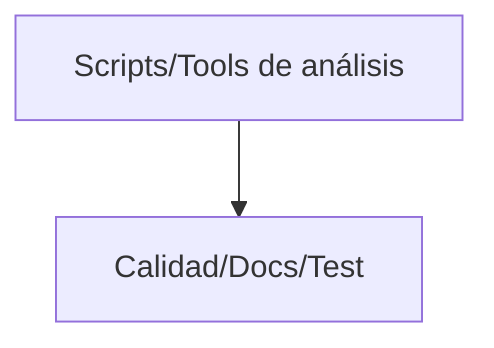

<div class='pagebreak'></div>

## scripts/ — Referencia

<div id='sec_scripts___init___py'>

### 📄 `scripts/__init__.py`

</div>

Script ejecutable (`__init__`): automatización, informes o mantenimiento del proyecto (no forma parte del runtime de la app).

---

<div id='sec_scripts_analyze_mixin_py'>

### 📄 `scripts/analyze_mixin.py`

</div>

Analiza un archivo Python (clase grande o módulo acoplado): lista atributos y llamadas vía self.*
Útil para planificar extracción a composición o a gestores independientes.

---

<div id='sec_scripts_analyze_pila_controller_py'>

### 📄 `scripts/analyze_pila_controller.py`

</div>

Script ejecutable (`analyze_pila_controller`): automatización, informes o mantenimiento del proyecto (no forma parte del runtime de la app).

---

<div id='sec_scripts_analyze_product_controller_coverage_py'>

### 📄 `scripts/analyze_product_controller_coverage.py`

</div>

Script ejecutable (`analyze_product_controller_coverage`): automatización, informes o mantenimiento del proyecto (no forma parte del runtime de la app).

---

<div id='sec_scripts_analyze_ui_state_py'>

### 📄 `scripts/analyze_ui_state.py`

</div>

Script ejecutable (`analyze_ui_state`): automatización, informes o mantenimiento del proyecto (no forma parte del runtime de la app).

---

<div id='sec_scripts_architecture_layer_edges_py'>

### 📄 `scripts/architecture_layer_edges.py`

</div>

Grafo de imports entre capas de primer nivel (ui, controllers, core, database, features).

Escanea AST de todos los .py bajo esos directorios, clasifica aristas por capa origen/destino,
lista violaciones de arquitectura (reglas del plan Hipatia) y detecta ciclos simples
entre capas (2- y 3-ciclos explícitos).

Uso:
  python3 scripts/architecture_layer_edges.py
  python3 scripts/architecture_layer_edges.py --json reports/architecture_layer_edges.json

- 🔧 `collect_import_targets`: Nombres de módulo completos importados (sin relativos).
- 🔧 `scan_layers`: module_name -> conjunto de strings importados (módulos).
- 🔧 `build_layer_edge_list`: (from_layer, to_layer) -> [(source_module, imported_module), ...].
- 🔧 `find_simple_cycles`: 2-ciclos y 3-ciclos entre capas (suficiente para N pequeño).

---

<div id='sec_scripts_audit_import_graph_py'>

### 📄 `scripts/audit_import_graph.py`

</div>

Grafo de imports entre capas: controladores / servicios / database.

Genera un informe Markdown (y JSON opcional) con aristas ``controllers.*``
que importan ``core.services.*`` (y referencias cruzadas útiles para revisión).

Para el mapa **completo** por capa (``ui``, ``database``, ``core``, ``controllers``,
``features``), violaciones y ciclos simples, usar ``scripts/architecture_layer_edges.py``.

---

<div id='sec_scripts_audit_module_docstrings_py'>

### 📄 `scripts/audit_module_docstrings.py`

</div>

Auditoría de docstrings de módulo: lista archivos .py sin descripción útil al nivel de módulo.

Salida: informe JSON bajo reports/ y resumen por stdout. Criterios alineados con
doc_audit_common / generate_daniel_doc.py.

---

<div id='sec_scripts_build_executable_py'>

### 📄 `scripts/build_executable.py`

</div>

Script ejecutable (`build_executable`): automatización, informes o mantenimiento del proyecto (no forma parte del runtime de la app).

- 🔧 `clean_build_environment`: Limpia compilaciones anteriores para evitar basura o conflictos.
- 🔧 `build_hipatia`: Ejecuta PyInstaller de forma programática con toda la configuración de Hipatia.

---

<div id='sec_scripts_check_documentation_omissions_py'>

### 📄 `scripts/check_documentation_omissions.py`

</div>

Nombre del Módulo: check_documentation_omissions
Descripción: Verifica automáticamente que la documentación técnica generada
             no tenga archivos omitidos en el índice de código.

- 🔧 `regenerate_docs`: Regenera la documentación técnica usando el script oficial.
- 🔧 `read_omitted_count`: Extrae el valor de "Omitidos (reglas de docstrings/otros)" del markdown.
- 🔧 `main`: Punto de entrada del chequeo de regresión documental.

---

<div id='sec_scripts_check_typing_coverage_py'>

### 📄 `scripts/check_typing_coverage.py`

</div>

Script ejecutable (`check_typing_coverage`): automatización, informes o mantenimiento del proyecto (no forma parte del runtime de la app).

---

<div id='sec_scripts_codebase_analyzer_py'>

### 📄 `scripts/codebase_analyzer.py`

</div>

Script ejecutable (`codebase_analyzer`): automatización, informes o mantenimiento del proyecto (no forma parte del runtime de la app).

---

<div id='sec_scripts_coverage_focus_py'>

### 📄 `scripts/coverage_focus.py`

</div>

Cobertura enfocada a archivos modificados (Hipatia).

Objetivo: exigir 100% de cobertura en un conjunto de archivos/rutas concretas
sin forzar 100% del proyecto completo.

Requiere: pytest + pytest-cov instalados (ya se usa cobertura en el proyecto).

Uso:
  python3 scripts/coverage_focus.py --paths ui/widgets/reports/order_list.py core/app_model.py
  python3 scripts/coverage_focus.py --paths controllers --tests tests/unit/test_main_window.py

Notas:
- Este script ejecuta pytest con `--cov` y lee un `coverage.json` temporal.
- Por defecto omite `tests/*` y `scripts/*` del cálculo global de cobertura.

---

<div id='sec_scripts_detect_dead_code_py'>

### 📄 `scripts/detect_dead_code.py`

</div>

Detección de código muerto en el paquete ``ui/dialogs/``.
======================================================
Recorre cada ``*.py`` bajo ``ui/dialogs/``, extrae métodos por clase y
busca referencias en ``app.py``, ``ui/``, ``controllers/``, ``core/``, ``tests/``.

Clasificación heurística (revisar manualmente antes de borrar):
- USADO: referencias fuera del fichero de definición
- INTERNO: solo llamadas desde la misma clase/paquete
- MUERTO: sin referencias detectables (falsos positivos: slots Qt, getattr, etc.)

Genera un Markdown bajo ``Documentacion/``.

#### 🏛️ Clase `MethodExtractor`

Extrae todos los métodos de cada clase.

- 🔧 `extract_package_classes`: Parsea todos los ``.py`` bajo ``package_dir`` y fusiona clases con clave ``rel/path.py::ClassName``.
- 🔧 `find_references_in_file`: Busca referencias a métodos y clases en un archivo. Retorna un diccionario con las referencias encontradas.
- 🔧 `find_all_references`: Busca referencias en todo el proyecto.
- 🔧 `_class_reference_key`: Nombre corto de clase para coincidir con ``find_all_references``.
- 🔧 `analyze_dead_code`: Analiza y clasifica métodos según su uso.
- 🔧 `generate_report`: Genera el reporte en formato Markdown.
- 🔧 `main`: Función principal.

---

<div id='sec_scripts_doc_audit_common_py'>

### 📄 `scripts/doc_audit_common.py`

</div>

Criterios compartidos para auditoría de docstrings de módulo (Daniel doc + audit_module_docstrings).

- 🔧 `module_docstring_raw`: Texto del docstring de módulo. Incluye el caso frecuente ``from __future__ ...`` seguido de un literal ``"""..."""``, que **no** expone ``ast.get_docstring`` pero es doc de módulo válido en tiempo de ejecución.
- 🔧 `module_docstring_is_acceptable`: True si el módulo tiene docstring de módulo no trivial según FRASES_IGNORADAS. Equivale a 'doc_valid' en generate_daniel_doc para el nodo raíz.
- 🔧 `parse_module`: Parsea un archivo UTF-8; devuelve (tree, None) o (None, mensaje de error).
- 🔧 `summarize_module_for_audit`: Resumen para informes JSON (clases/funcs top-level sin depender del docstring).

---

<div id='sec_scripts_download_opencv_resources_py'>

### 📄 `scripts/download_opencv_resources.py`

</div>

Descarga recursos auxiliares para usar OpenCV (modelos y documentación).

Este script se ejecuta desde la raíz del proyecto y escribe los artefactos en:
- `core/models/` (modelos WeChatQRCode)
- `Documentacion/opencv/` (zip de documentación)

- 🔧 `download_file`: Descarga un fichero y lo guarda en `dest_path`.
- 🔧 `main`: Punto de entrada del script de descargas.

---

<div id='sec_scripts_extract_test_quality_in_progress_py'>

### 📄 `scripts/extract_test_quality_in_progress.py`

</div>

Nombre del Módulo: extract_test_quality_in_progress
Descripción: Genera un backlog detallado de archivos de test en estado "En Progreso"
             según `test_reports/compliance_data.json`, incluyendo penalizaciones
             corregibles y recomendaciones conservadoras para elevar el score.

Uso:
    python3 scripts/extract_test_quality_in_progress.py

Salidas:
    - Documentacion/Mejora_Calidad/backlog_tests_en_progreso.md
    - .agents/skills/backlog_tests_en_progreso/SKILL.md

- 🔧 `_recommendations`: Devuelve recomendaciones conservadoras basadas en penalizaciones. Nota: No intenta "forzar 100/100" si el techo real está limitado por Qt/docx/builtins.

---

<div id='sec_scripts_generate_comprehensive_report_py'>

### 📄 `scripts/generate_comprehensive_report.py`

</div>

Script ejecutable (`generate_comprehensive_report`): automatización, informes o mantenimiento del proyecto (no forma parte del runtime de la app).

---

<div id='sec_scripts_generate_coverage_report_py'>

### 📄 `scripts/generate_coverage_report.py`

</div>

Script ejecutable (`generate_coverage_report`): automatización, informes o mantenimiento del proyecto (no forma parte del runtime de la app).

- 🔧 `run_coverage`: Runs pytest with coverage json report.
- 🔧 `load_coverage_data`: Loads coverage.json.
- 🔧 `get_category`: Determines category based on filename.
- 🔧 `format_missing_lines`: Formats a list of missing lines into ranges (e.g. '1-5, 8, 10-12').
- 🔧 `print_report`: Prints the categorized report.

---

<div id='sec_scripts_generate_daniel_doc_py'>

### 📄 `scripts/generate_daniel_doc.py`

</div>

Nombre del Módulo: generate_daniel_doc
Descripción: Genera documentación técnica completa de Hipatia en Markdown con
             diagramas Mermaid automáticos (ERD, arquitectura, árbol de carpetas,
             flujo de fabricación) extraídos del código real del proyecto.
             Incluye sección de Suite de Tests generada desde compliance_data.json.

             La narrativa embebida (p. ej. Fase 12C y CI) debe mantenerse alineada con
             `.github/workflows/ci.yml` y con las skills de Fase 12C al cambiar gates.

- 🔧 `_build_folder_tree_mermaid`: Genera un diagrama Mermaid del árbol de carpetas principales.
- 🔧 `_path_to_module`: Convierte una ruta tipo `core/services/foo.py` a módulo Python: `core.services.foo`. Si es `__init__.py`, se interpreta como paquete.
- 🔧 `_load_mypy_disallow_untyped_defs`: Devuelve un mapa {pattern: disallow_untyped_defs}. pattern es el nombre del módulo/patrón que sigue a `mypy-` en mypy.ini.
- 🔧 `_pattern_matches_module`: Soporte simple de patrones tipo `core.*` y `controllers.foo`.
- 🔧 `_mypy_strict_for_file`: Etiqueta + motivo (breve) de por qué el archivo no está al 100%.
- 🔧 `_parse_all_classes`: Extrae solo nombres de clases (sin depender de docstrings). Esto permite que el índice no “omita” clases aunque luego no aparezcan en el cuerpo.
- 🔧 `_parse_all_symbols`: Extrae nombres de clases y funciones top-level sin depender de docstrings.
- 🔧 `_has_ast_content`: Determina si un archivo Python contiene contenido parseable por AST.
- 🔧 `_is_package_init`: Indica si el archivo es un `__init__.py` de paquete.
- 🔧 `_collect_index_tree`: Recorre todas las rutas `.py` bajo los directorios del alcance del índice y construye el árbol de carpetas/subcarpetas.
- 🔧 `_render_index_tree_md`: Renderiza el árbol como lista jerárquica (texto), incluyendo archivos y clases.
- 🔧 `_folder_connections_mermaid`: Diagrama Mermaid compacto de conexiones por capa. Basado en la arquitectura fija UI -> Controllers -> Core -> Database.
- 🔧 `_index_stats`: Calcula métricas rápidas para auditoría en papel: - total_py: total de .py considerados en el índice - included: incluidos en cuerpo - omitted: omitidos (docstrings/reglas)
- 🔧 `_folder_stats`: Resumen por carpeta para portada de capítulo (modo papel).
- 🔧 `_split_markdown_into_sections`: Particiona el markdown en secciones independientes para impresión: - prefix: portada + índice + secciones intro hasta antes de la referencia por carpetas/archivos - sections: lista ordenada de (kind:key, text) kind: - folder:<dirname> - file:<rel_path>
- 🔧 `_measure_page_starts_for_file_sections`: Renderiza el markdown en secciones discretas para obtener: {rel_path: page_start}.
- 🔧 `_render_pdf_from_markdown`: Convierte markdown -> PDF usando partición por archivo para estabilidad.
- 🔧 `_collect_files`: Devuelve (root_files, {dirname: [rel_paths]}).
- 🔧 `_load_compliance_data`: Carga los datos de compliance desde test_reports/compliance_data.json. Si el archivo no existe, devuelve lista vacía (la sección se omite).
- 🔧 `_write_testing_section`: Escribe la sección 'Suite de Tests' en el documento Markdown. Incluye: - Filosofía general de testing del proyecto - Explicación del sistema de scoring y techo real - Tabla resumen global (score absoluto, techo, estado) - Tabla por archivo con decisión técnica de mocking

---

<div id='sec_scripts_generate_monolitos_finales_py'>

### 📄 `scripts/generate_monolitos_finales.py`

</div>

Script ejecutable (`generate_monolitos_finales`): automatización, informes o mantenimiento del proyecto (no forma parte del runtime de la app).

- 🔧 `main`: Genera bajo demanda `Documentacion/Monolitos_finales.md` (no versionado por defecto).

---

<div id='sec_scripts_generate_quotes_db_py'>

### 📄 `scripts/generate_quotes_db.py`

</div>

Script ejecutable (`generate_quotes_db`): automatización, informes o mantenimiento del proyecto (no forma parte del runtime de la app).

- 🔧 `fetch_quotes`: Descarga frases de múltiples fuentes JSON.
- 🔧 `generate_database`: Genera el fichero JSON final con las frases.

---

<div id='sec_scripts_init_database_py'>

### 📄 `scripts/init_database.py`

</div>

Script ejecutable (`init_database`): automatización, informes o mantenimiento del proyecto (no forma parte del runtime de la app).

- 🔧 `init_database`: Inicializa la base de datos creando todas las tablas.

---

<div id='sec_scripts_inject_module_docstrings_py'>

### 📄 `scripts/inject_module_docstrings.py`

</div>

Inyecta docstrings de módulo donde faltan (criterio doc_audit_common), sin tocar
archivos que ya tienen docstring aceptable.

Uso::

    python3 scripts/inject_module_docstrings.py --dry-run
    python3 scripts/inject_module_docstrings.py --apply

- 🔧 `_describe_module`: Una o dos frases en español; suficientemente específicas para no caer en frases genéricas prohibidas.

---

<div id='sec_scripts_legacy_analyzer_py'>

### 📄 `scripts/legacy_analyzer.py`

</div>

Analizador de Código Legacy — Proyecto Hipatia
==============================================
Fase 4 del Plan de Mejora de Calidad: detecta patrones legacy para su
eliminación o sustitución (print → logger, marcadores deprecated, docstrings
obsoletos, delegaciones/shim y código muerto candidato).

Genera:
- legacy_report.json: datos estructurados para el agente
- legacy_report.md: informe legible en Documentacion/Refactorizacion_Completa/Legacy/

Uso:
  python3 scripts/legacy_analyzer.py [--json-only] [--md-only]

- 🔧 `get_production_python_files`: Lista todos los archivos .py en directorios de producción.
- 🔧 `get_all_python_files`: Lista todos los .py del proyecto (excepto venv/git).
- 🔧 `find_print_statements`: Detecta llamadas a print() en archivos de producción.
- 🔧 `find_bare_except`: Detecta except: sin tipo (bare except).
- 🔧 `find_deprecated_markers`: Busca líneas con marcadores @deprecated, TODO: Remove, DEPRECATED.
- 🔧 `find_legacy_in_docstrings`: Busca docstrings que mencionan obsoleto/legacy/deprecated.
- 🔧 `_is_simple_delegation`: Comprueba si la función solo delega en otra (return other() o self.other()). Devuelve (True, nombre_delegado) o (False, None).
- 🔧 `find_simple_delegations`: Detecta funciones que solo delegan en otra (posibles shims/aliases legacy).
- 🔧 `_count_symbol_mentions`: Cuenta menciones literales de un símbolo en una lista de archivos Python. Nota: Heurística basada en regex. Es suficiente para detectar shims no usados sin introducir dependencias externas.
- 🔧 `filter_unused_delegations`: Filtra delegaciones simples dejando solo las que no tienen uso externo detectable. Criterio: si el símbolo aparece 1 vez en todo el proyecto (su propia definición), lo tratamos como candidato a eliminación.
- 🔧 `find_legacy_re_exports`: Busca comentarios que indican re-exports o métodos legacy (ej. app_controller).
- 🔧 `build_report`: Construye el informe completo de código legacy.
- 🔧 `generate_md`: Genera el informe en Markdown.
- 🔧 `main`: Punto de entrada.

---

<div id='sec_scripts_list_mypy_core_services_gaps_py'>

### 📄 `scripts/list_mypy_core_services_gaps.py`

</div>

Lista módulos bajo ``core/services`` que aún no aparecen en ``mypy.ini`` dentro
de un bloque ``[mypy-...]`` con ``disallow_untyped_defs = True``.

Uso::

    python3 scripts/list_mypy_core_services_gaps.py
    python3 scripts/list_mypy_core_services_gaps.py --json reports/mypy_core_services_gaps.json

---

<div id='sec_scripts_monolith_analyzer_py'>

### 📄 `scripts/monolith_analyzer.py`

</div>

Analizador de monolitos y dependencias (Hipatia).

Genera:
- Ranking de archivos Python por tamaño (LOC) y acoplamiento (in/out degree).
- Grafo de imports por módulo (package-level) y por archivo (file-level).
- Detección básica de ciclos (SCC) en el grafo.
- Reporte Markdown + JSON para alimentar la fase "Monolitos".

Uso:
  python3 scripts/monolith_analyzer.py
  python3 scripts/monolith_analyzer.py --min-loc 500 --top 30

#### 🏛️ Clase `_ImportCollector`

**Métodos Principales:**

- `visit_If`: Ignora imports dentro de: if TYPE_CHECKING: ya que no forman parte del grafo de dependencias en runtime.

- 🔧 `_resolve_internal_target`: Resuelve un import a un archivo del repo si coincide con un módulo interno. Heurística: intenta el módulo completo y prefijos.
- 🔧 `_scc_kosaraju`: SCC por Kosaraju (sin dependencias externas).

---

<div id='sec_scripts_print_summary_py'>

### 📄 `scripts/print_summary.py`

</div>

Script ejecutable (`print_summary`): automatización, informes o mantenimiento del proyecto (no forma parte del runtime de la app).

---

<div id='sec_scripts_profile_queries_py'>

### 📄 `scripts/profile_queries.py`

</div>

Script ejecutable (`profile_queries`): automatización, informes o mantenimiento del proyecto (no forma parte del runtime de la app).

- 🔧 `profile_method`: Executes a method and counts SQL queries.

---

<div id='sec_scripts_reorder_docstring_before_future_py'>

### 📄 `scripts/reorder_docstring_before_future.py`

</div>

Reordena el docstring de módulo inmediatamente **antes** del bloque ``from __future__``.

Homogeneidad con PEP 236 (docstring antes de future). Idempotente si ya está bien ordenado.

- 🔧 `reorder_source`: Devuelve texto reordenado o None si no aplica.

---

<div id='sec_scripts_run_quality_audit_py'>

### 📄 `scripts/run_quality_audit.py`

</div>

Script ejecutable (`run_quality_audit`): automatización, informes o mantenimiento del proyecto (no forma parte del runtime de la app).

---

<div id='sec_scripts_security_audit_analyzer_py'>

### 📄 `scripts/security_audit_analyzer.py`

</div>

Security Audit Analyzer Script
Analyzes the codebase for security issues identified in the technical audit.

#### 🏛️ Clase `SecurityAuditAnalyzer`

Analyzes code for security vulnerabilities.

**Métodos Principales:**

- `analyze_credentials`: Find hardcoded credentials.
- `analyze_fail_open_policy`: Find fail-open security patterns.
- `analyze_hashlib_usage`: Find hashlib usage for password hashing.
- `analyze_rate_limiting`: Check for rate limiting in authentication.
- `analyze_audit_logging`: Check for audit logging.
- `analyze_database_issues`: Check for database-related security issues.
- `generate_report`: Generate a formatted report of findings.
- `run_analysis`: Run all analysis methods.

---

<div id='sec_scripts_seed_data_py'>

### 📄 `scripts/seed_data.py`

</div>

Script ejecutable (`seed_data`): automatización, informes o mantenimiento del proyecto (no forma parte del runtime de la app).

- 🔧 `seed_data`: Inserta datos de prueba en la base de datos.

---

<div id='sec_scripts_sync_worktree_to_icloud_py'>

### 📄 `scripts/sync_worktree_to_icloud.py`

</div>

Copia archivos modificados o sin seguimiento desde SOURCE_ROOT a HIPATIA_ICLOUD.

Uso típico (macOS)::

    export HIPATIA_ICLOUD="$HOME/Library/Mobile Documents/com~apple~CloudDocs/Programacion/Calcular_tiempos_fabricacion"
    python3 scripts/sync_worktree_to_icloud.py

El agente debe ejecutarlo tras cada lote de ediciones si el workspace no es ya iCloud.

---

<div id='sec_scripts_test_quality_analyzer_py'>

### 📄 `scripts/test_quality_analyzer.py`

</div>

Analizador de calidad de tests (no forma parte del runtime de la app).

Calcula score absoluto (0–100), penalizaciones y «techo real» (_calculate_ceiling): parte del
castigo por mocks/patches se perdona cuando PyQt6 u otros externos hacen inevitable el patrón.

Cohortes (test_tier / strict_domain):
    Los tests de servicios, repositorios y persistencia bajo tests/db/ se clasifican como
    strict_domain. Para ellos el estado «Actualizado» exige score absoluto 100; no basta estar
    en techo de mocks. El resto (ui_qt) sigue la regla histórica basada en ceiling_score y
    at_ceiling. Ver classify_test_tier() y resolve_analyzer_status().

Salida:
    Al ejecutar como script, escribe test_reports/compliance_data.json con campos entre otros
    score, ceiling_score, status, test_tier, strict_domain, domain_status.

Heurísticas adicionales (desconexión UI–dominio):
    contract_test_hints en cada entrada: conteo informativo de literales ``32`` como rol Qt en
    archivos bajo ``tests/``. weak_any_only_interaction_count y penalización asociada en tests
    de controller/service: empuja a no limitarse a assert_called_*_with(ANY, ANY, ...).

- 🔧 `_is_whitelisted_patch`: Devuelve True si el target del patch está en la whitelist de inevitables.
- 🔧 `_count_inevitable_patches`: Cuenta @patch sin autospec que son inevitables (builtins, Qt, OS).
- 🔧 `_count_inevitable_loose_mocks`: Cuenta MagicMock() sueltos que son inevitables por dependencias externas sin stubs. - Qt: widgets PyQt6 no tienen stubs de tipo → MagicMock() es la única opción - docx: python-docx no tiene stubs → MagicMock() para Document, Run, etc.
- 🔧 `_calculate_ceiling`: Calcula el techo real de score para un archivo de test. Separa penalizaciones inevitables (dependencias externas sin stubs) de penalizaciones corregibles (antipatrones reales). Retorna dict con: ceiling_score, ceiling_penalties, actionable_penalties, at_ceiling, ceiling_explanation. Nota: el «Actualizado» global no se deduce solo de aquí; resolve_analyzer_status() aplica reglas distintas para la cohorte strict_domain (score absoluto 100).
- 🔧 `_count_patches`: Devuelve (total_patches, patches_con_autospec).
- 🔧 `_count_loose_mocks_ast`: Cuenta llamadas reales a MagicMock()/Mock() sin args/kwargs. Importante: no contar ocurrencias en docstrings/comentarios (los regex dan falsos positivos).
- 🔧 `_count_tests_without_assert`: Cuenta tests que no tienen ningún assert significativo. Regla: `assert True` se considera **trivial** y no cuenta como verificación real. Un test se considera "sin assert" si NO contiene: - asserts no triviales (`assert x == ...`, `assert mock.call_count == ...`, etc.), o - verificaciones de interacción (`.assert_called_*`, `.call_count`, etc.) Solo se considera fin de test al ver "def test_..." o "async def test_..." al mismo indent o menor; así se evita truncar el cuerpo por líneas "def"/"class" dentro de strings multilínea (p. ej. código de ejemplo en el test).
- 🔧 `_is_controller_or_service_file`: Detecta si el archivo testea controladores o servicios.
- 🔧 `_is_tests_db_path`: True si el archivo está bajo tests/db/ (convención de tests de persistencia).
- 🔧 `classify_test_tier`: Asigna la cohorte de política de estado (independiente del score numérico). Returns: infra: conftest y utilidades de test (lista fija por nombre de archivo). strict_domain: ruta .../tests/db/... o nombre test_*_service.py / test_*repository*.py (salvo _STRICT_DOMAIN_EXCLUDED_NAMES). Objetivo: score absoluto 100 para «Actualizado». ui_qt: resto de tests de producto; aplica techo real y umbral ceiling_score >= 80.
- 🔧 `resolve_analyzer_status`: Deriva status (Actualizado / En Progreso / Legacy), texto de detalle y domain_status. strict_domain: «Actualizado» solo con score >= 100; domain_status Listo/Pendiente dominio. Con score < 100 y sin penalizaciones corregibles (at_ceiling), sigue En Progreso: el techo no sustituye al 100 absoluto en esta cohorte. infra y ui_qt: sin domain_status (None). Misma lógica que antes: at_ceiling ⇒ Actualizado aunque el techo sea bajo (p. ej. PyQt); si no, ceiling_score >= 80 / >= 50 / resto. Returns: Tupla (status, status_detail, domain_status). domain_status es None fuera de strict_domain.
- 🔧 `_count_weak_any_only_interaction_lines`: Cuenta aserciones cuyos argumentos son solo ANY; ignora líneas con ``# noqa: weak_any``.
- 🔧 `analyze_test_file`: Analiza un archivo de test: métricas, score, techo y estado según cohorte. Añade respecto al histórico: test_tier, strict_domain (bool), domain_status (str|None).
- 🔧 `run_analysis`: Ejecuta el análisis en toda la carpeta de tests.

---

<div id='sec_scripts_track_docx_dependencies_py'>

### 📄 `scripts/track_docx_dependencies.py`

</div>

Script para rastrear dependencias directas de 'docx' (python-docx)
y generar un informe de archivos afectados.

---

<div id='sec_scripts_ui_dto_boundary_analyzer_py'>

### 📄 `scripts/ui_dto_boundary_analyzer.py`

</div>

Nombre del Módulo: ui_dto_boundary_analyzer
Descripcion: Audita la frontera UI/DTO para detectar accesos tipo diccionario
             dentro de `ui/` (p.ej. `obj["campo"]`, `obj.get("campo")`) que suelen
             indicar datos sin tipar o mezclas DTO vs dict. Ignora `os.environ.get`
             (variables de entorno, no DTO). Genera informes para la Fase 12C.

             Las variables en INTERNAL_UI_DICT_VARS (p. ej. `data`) se ignoran salvo que la
             clave literal esté en DOMAIN_DICT_KEYS_FORCE_REPORT (campos típicos de entidad/BD),
             para reducir falsos negativos en `data["id"]` sin reabrir todo el ruido de estado UI.

Uso:
    python3 scripts/ui_dto_boundary_analyzer.py
    python3 scripts/ui_dto_boundary_analyzer.py --json-only
    python3 scripts/ui_dto_boundary_analyzer.py --md-only
    python3 scripts/ui_dto_boundary_analyzer.py --enforce-zero   # CI: falla si hay hallazgos
    python3 scripts/ui_dto_boundary_analyzer.py --max-findings 5
    python3 scripts/ui_dto_boundary_analyzer.py --baseline ruta/baseline.json

Salida (por defecto):
    Documentacion/Refactorizacion_Completa/Fase_12C/ui_dto_boundary_report.json
    Documentacion/Refactorizacion_Completa/Fase_12C/ui_dto_boundary_report.md

#### 🏛️ Clase `Finding`

Hallazgo de acceso tipo diccionario dentro de UI.

- 🔧 `should_report_name_dict_access`: False: el acceso se considera estado interno UI (receptor en INTERNAL_UI_DICT_VARS y clave no es de dominio forzado). True: incluir en el informe.
- 🔧 `_iter_ui_files`: Devuelve todos los `.py` bajo `ui/` (sin venv/git).
- 🔧 `_is_os_environ_access`: True si la expresión es `os.environ` (no es frontera UI/DTO).
- 🔧 `analyze_file`: Analiza un archivo UI y devuelve hallazgos de acceso dict-like. - Subscript: `x["campo"]` o `x['campo']` - get_call: `x.get("campo", ...)`
- 🔧 `build_report`: Construye el reporte completo de hallazgos en `ui/`.
- 🔧 `generate_md`: Genera un informe legible en Markdown para Fase 12C.
- 🔧 `_gate_exit_code`: Devuelve (código_salida, mensaje_vacío_o_error). Prioridad: --enforce-zero > --baseline > --max-findings.
- 🔧 `main`: Punto de entrada CLI.

---

<div id='sec_scripts_ui_dto_boundary_decision_report_py'>

### 📄 `scripts/ui_dto_boundary_decision_report.py`

</div>

Genera un informe de decisión (por hallazgo) para la Fase 12C.

Lee:
  Documentacion/Refactorizacion_Completa/Fase_12C/ui_dto_boundary_report.json
Genera:
  Documentacion/Refactorizacion_Completa/Fase_12C/ui_dto_boundary_decision_report.md

Decisión conservadora:
- `ui/**/production_flow/**`: dict deliberado (payload/config serializable interno de UI)
- `ui/dialogs/canvas_widget.py` y `ui/dialogs/card_widget.py`: estado interno de UI
- Cualquier otro archivo (si apareciera): "Posible cambio" hacia atributos DTO.

---

<div id='sec_scripts_ui_dto_findings_catalog_py'>

### 📄 `scripts/ui_dto_findings_catalog.py`

</div>

Nombre del Módulo: ui_dto_findings_catalog
Descripcion: Inventario de hallazgos UI/DTO (subscript y .get con clave literal)
             con metadatos de conexion: receptor AST, agrupacion por archivo/receptor,
             imports del modulo y enlaces entre hallazgos del mismo grupo.

Uso:
    python3 scripts/ui_dto_findings_catalog.py
    python3 scripts/ui_dto_findings_catalog.py --no-production-flow
    python3 scripts/ui_dto_findings_catalog.py --json-only

Salida (por defecto):
    Documentacion/Refactorizacion_Completa/Fase_12C/ui_dto_findings_catalog.json
    Documentacion/Refactorizacion_Completa/Fase_12C/ui_dto_findings_catalog.md
    Documentacion/Refactorizacion_Completa/Fase_12C/ui_dto_findings_checklist.md

- 🔧 `_item_signature`: Clave estable al cambiar numeración F0001 tras regenerar.

---

<div id='sec_scripts_update_readme_metrics_py'>

### 📄 `scripts/update_readme_metrics.py`

</div>

Actualiza el bloque de métricas del README entre los marcadores HIPATIA_METRICS.

Requisitos para cifras completas:
  - `python scripts/test_quality_analyzer.py` → `test_reports/compliance_data.json`
  - `QT_QPA_PLATFORM=offscreen python -m pytest tests --cov=. --cov-report=json`
    → `coverage.json` (ignorado por git; no se sube al repo)

El bloque del README sí se commitea con valores de la última corrida local o de CI.

---

<div id='sec_scripts_update_test_imports_py'>

### 📄 `scripts/update_test_imports.py`

</div>

Script ejecutable (`update_test_imports`): automatización, informes o mantenimiento del proyecto (no forma parte del runtime de la app).

---

<div id='sec_scripts_verify_migration_py'>

### 📄 `scripts/verify_migration.py`

</div>

Migration Verification Script
==============================
Detects orphan code patterns that may have been left behind during the
SQLAlchemy/DTO migration.

Usage:
    python scripts/verify_migration.py

Checks for:
1. Direct db.set_setting() / db.get_setting() calls (should use config_repo)
2. Tuple access patterns on DTO results ([0], [1], etc.)
3. Usage of removed methods from DatabaseManager
4. Old import patterns

#### 🏛️ Clase `CodeIssue`

Represents a potential code issue found during verification.

- 🔧 `find_python_files`: Find all Python files in the project, excluding certain directories.
- 🔧 `check_orphan_method_calls`: Check for direct calls to methods that should go through repositories.
- 🔧 `check_tuple_access_on_dtos`: Check for tuple access patterns that might indicate unconverted code.
- 🔧 `check_removed_methods`: Check for usage of methods that have been removed from DatabaseManager.
- 🔧 `check_file`: Run all checks on a single file.
- 🔧 `print_issues`: Print issues in a formatted way and return counts.
- 🔧 `main`: Main entry point.

---

<div id='sec_scripts_verify_qr_optimization_py'>

### 📄 `scripts/verify_qr_optimization.py`

</div>

Script ejecutable (`verify_qr_optimization`): automatización, informes o mantenimiento del proyecto (no forma parte del runtime de la app).

---

<div id='sec_scripts_verify_structure_py'>

### 📄 `scripts/verify_structure.py`

</div>

Script ejecutable (`verify_structure`): automatización, informes o mantenimiento del proyecto (no forma parte del runtime de la app).

---

<div id='sec_scripts_analysis_analyze_codebase_py'>

### 📄 `scripts/analysis/analyze_codebase.py`

</div>

Script ejecutable (`analyze_codebase`): automatización, informes o mantenimiento del proyecto (no forma parte del runtime de la app).

#### 🏛️ Clase `FileStats`

Métricas por fichero (derivadas del AST) para análisis de tipado.

#### 🏛️ Clase `DirectorySummary`

Resumen agregado por directorio.

---

<div id='sec_scripts_analysis_analyze_controller_py'>

### 📄 `scripts/analysis/analyze_controller.py`

</div>

Nombre del Módulo: scripts.analysis.analyze_controller
Descripcion: Analizador AST ad-hoc para revisar tipado en métodos de un controlador.

---

<div id='sec_scripts_analysis_analyze_coverage_risks_py'>

### 📄 `scripts/analysis/analyze_coverage_risks.py`

</div>

Script ejecutable (`analyze_coverage_risks`): automatización, informes o mantenimiento del proyecto (no forma parte del runtime de la app).

---

<div id='sec_scripts_analysis_analyze_db_usage_py'>

### 📄 `scripts/analysis/analyze_db_usage.py`

</div>

Script ejecutable (`analyze_db_usage`): automatización, informes o mantenimiento del proyecto (no forma parte del runtime de la app).

- 🔧 `analyze_file`: Analyzes a python file for DB related keywords and AST nodes.

---

<div id='sec_scripts_analysis_analyze_dependencies_py'>

### 📄 `scripts/analysis/analyze_dependencies.py`

</div>

Nombre del Módulo: scripts.analysis.analyze_dependencies
Descripcion: Construye un grafo de dependencias Python y detecta hubs/acoplamientos.

---

<div id='sec_scripts_analysis_analyze_fabrication_dialogs_py'>

### 📄 `scripts/analysis/analyze_fabrication_dialogs.py`

</div>

Script ejecutable (`analyze_fabrication_dialogs`): automatización, informes o mantenimiento del proyecto (no forma parte del runtime de la app).

---

<div id='sec_scripts_analysis_analyze_loose_mocks_py'>

### 📄 `scripts/analysis/analyze_loose_mocks.py`

</div>

Script ejecutable (`analyze_loose_mocks`): automatización, informes o mantenimiento del proyecto (no forma parte del runtime de la app).

---

<div id='sec_scripts_analysis_analyze_refactoring_impact_py'>

### 📄 `scripts/analysis/analyze_refactoring_impact.py`

</div>

Script ejecutable (`analyze_refactoring_impact`): automatización, informes o mantenimiento del proyecto (no forma parte del runtime de la app).

---

<div id='sec_scripts_analysis_analyze_repository_connections_py'>

### 📄 `scripts/analysis/analyze_repository_connections.py`

</div>

Script de Análisis de Conexiones de Repositorios

Analiza todas las conexiones a un repositorio específico:
- Funciones que lo utilizan
- Archivos que dependen de él
- Métodos llamados
- Mapa de dependencias

#### 🏛️ Clase `RepositoryConnectionAnalyzer`

Analiza conexiones y dependencias de repositorios.

**Métodos Principales:**

- `analyze_file`: Analiza un archivo Python buscando usos de repositorios.
- `analyze_project`: Analiza todo el proyecto.
- `generate_report`: Genera un reporte legible.
- `export_to_markdown`: Exporta los resultados a un archivo Markdown.

- 🔧 `main`: Función principal.

---

<div id='sec_scripts_analysis_analyze_root_files_py'>

### 📄 `scripts/analysis/analyze_root_files.py`

</div>

Script de Análisis de Archivos Raíz
===================================
Analiza los scripts Python en la raíz del proyecto para determinar:
1. Qué definen (Clases, Funciones).
2. De qué dependen (Imports).
3. Dónde se usan (Referencias en el resto del proyecto).

Ayuda a decidir si moverlos a `core/`, `ui/`, `tools/` o eliminarlos.

- 🔧 `get_definitions_and_imports`: Extrae clases, funciones e imports de un archivo.
- 🔧 `find_usages`: Busca ocurrencias del nombre del módulo o sus definiciones en el proyecto.

---

<div id='sec_scripts_analysis_analyze_structure_py'>

### 📄 `scripts/analysis/analyze_structure.py`

</div>

Script ejecutable (`analyze_structure`): automatización, informes o mantenimiento del proyecto (no forma parte del runtime de la app).

---

<div id='sec_scripts_analysis_analyze_tracking_impact_py'>

### 📄 `scripts/analysis/analyze_tracking_impact.py`

</div>

Script ejecutable (`analyze_tracking_impact`): automatización, informes o mantenimiento del proyecto (no forma parte del runtime de la app).

---

<div id='sec_scripts_analysis_analyze_typing_deep_py'>

### 📄 `scripts/analysis/analyze_typing_deep.py`

</div>

Nombre del Módulo: scripts.analysis.analyze_typing_deep
Descripcion: Auditoría de cobertura de anotaciones de tipos por archivo/función.

---

<div id='sec_scripts_analysis_analyze_ui_structure_py'>

### 📄 `scripts/analysis/analyze_ui_structure.py`

</div>

Script ejecutable (`analyze_ui_structure`): automatización, informes o mantenimiento del proyecto (no forma parte del runtime de la app).

- 🔧 `analyze_file`: Analyzes a Python file and produces a markdown report.
- 🔧 `analyze_class`: Analyzes a class node.
- 🔧 `analyze_method_row`: Analyzes a method and adds a table row.
- 🔧 `analyze_function`: Analyzes a standalone function.

---

<div id='sec_scripts_analysis_detect_obsolete_code_py'>

### 📄 `scripts/analysis/detect_obsolete_code.py`

</div>

Script ejecutable (`detect_obsolete_code`): automatización, informes o mantenimiento del proyecto (no forma parte del runtime de la app).

- 🔧 `get_python_files`: Recursively find all Python files in the directory.
- 🔧 `extract_definitions`: Extract class and function names defined in a file.
- 🔧 `search_usages`: Count usages of target names in all files.
- 🔧 `check_deprecated`: Busca decoradores de deprecación y comentarios TODO: Remove.

---

<div id='sec_scripts_analysis_verify_naming_conventions_py'>

### 📄 `scripts/analysis/verify_naming_conventions.py`

</div>

Script ejecutable (`verify_naming_conventions`): automatización, informes o mantenimiento del proyecto (no forma parte del runtime de la app).

- 🔧 `get_python_files`: Recursively find all Python files in the directory.
- 🔧 `is_snake_case`: Check if string is snake_case.
- 🔧 `is_camel_case`: Check if string is CamelCase (PascalCase).
- 🔧 `check_file_conventions`: Check naming conventions in a single file.

---

<div id='sec_scripts_maintenance_backup_database_py'>

### 📄 `scripts/maintenance/backup_database.py`

</div>

========================================================================
SCRIPT DE BACKUP - BASE DE DATOS
========================================================================
Este script crea una copia de seguridad de tu base de datos ANTES de
realizar cualquier modificación al esquema.

IMPORTANTE: Ejecuta este script ANTES de añadir los nuevos modelos.
========================================================================

- 🔧 `create_backup`: Crea una copia de seguridad de la base de datos. Args: db_path: Ruta a la base de datos (por defecto usa la config de entorno)
- 🔧 `backup_all_databases`: Crea backup de la base de datos principal configurada.

---

<div id='sec_scripts_maintenance_reset_admin_py'>

### 📄 `scripts/maintenance/reset_admin.py`

</div>

Script de mantenimiento: restablece o crea el usuario admin local en SQLite
con contraseña conocida; uso manual en entornos de desarrollo.

- 🔧 `_resolve_sqlite_db_path`: Devuelve la ruta del fichero SQLite según ``DatabaseConfig``, o None si no aplica.
- 🔧 `reset_admin_password`: Pone la contraseña del usuario ``admin`` a ``admin`` (solo SQLite configurado).

---

<div class='pagebreak'></div>

<div id='folder_tools'>

## Capítulo: `tools/`

</div>

| Métrica | Valor |
|---|---:|
| Archivos `.py` en `tools/` | 3 |
| Incluidos en el cuerpo | 3 |
| Omitidos (docstrings/reglas) | 0 |
| Clases detectadas (AST) | 2 |

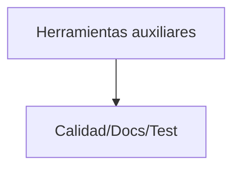

<div class='pagebreak'></div>

## tools/ — Referencia

<div id='sec_tools___init___py'>

### 📄 `tools/__init__.py`

</div>

Herramienta de consola (`__init__`): análisis estático o asistencia al desarrollo.

---

<div id='sec_tools_analyze_app_controller_py'>

### 📄 `tools/analyze_app_controller.py`

</div>

Herramienta de análisis AST: compara métodos y atributos de AppController con
la documentación de nomenclatura en Markdown (informe de cobertura doc vs código).

---

<div id='sec_tools_hardware_detect_cameras_py'>

### 📄 `tools/hardware/detect_cameras.py`

</div>

Script para detectar TODAS las cámaras disponibles en el sistema,
incluyendo las que están en índices no continuos.

---

<div class='pagebreak'></div>

<div id='folder_migrations'>

## Capítulo: `migrations/`

</div>

| Métrica | Valor |
|---|---:|
| Archivos `.py` en `migrations/` | 3 |
| Incluidos en el cuerpo | 3 |
| Omitidos (docstrings/reglas) | 0 |
| Clases detectadas (AST) | 0 |

```mermaid
graph TD
  MIG[Schema de BD (Alembic)] --> DB[Database]
```

<div class='pagebreak'></div>

## migrations/ — Referencia

<div id='sec_migrations_env_py'>

### 📄 `migrations/env.py`

</div>

- 🔧 `run_migrations_offline`: Run migrations in 'offline' mode. This configures the context with just a URL and not an Engine, though an Engine is acceptable here as well.  By skipping the Engine creation we don't even need a DBAPI to be available. Calls to context.execute() here emit the given string to the script output.
- 🔧 `run_migrations_online`: Run migrations in 'online' mode. In this scenario we need to create an Engine and associate a connection with the context.

---

<div id='sec_migrations_versions_a195b5f170d2_add_security_tables_py'>

### 📄 `migrations/versions/a195b5f170d2_add_security_tables.py`

</div>

add_security_tables

Revision ID: a195b5f170d2
Revises: c1444b2546d3
Create Date: 2026-02-15 15:13:38.733337

- 🔧 `upgrade`: Upgrade schema.
- 🔧 `downgrade`: Downgrade schema.

---

<div id='sec_migrations_versions_c1444b2546d3_initial_clean_migration_py'>

### 📄 `migrations/versions/c1444b2546d3_initial_clean_migration.py`

</div>

Initial clean migration

Revision ID: c1444b2546d3
Revises: 
Create Date: 2026-02-07 11:21:28.029952

- 🔧 `upgrade`: Upgrade schema.
- 🔧 `downgrade`: Downgrade schema.

---

