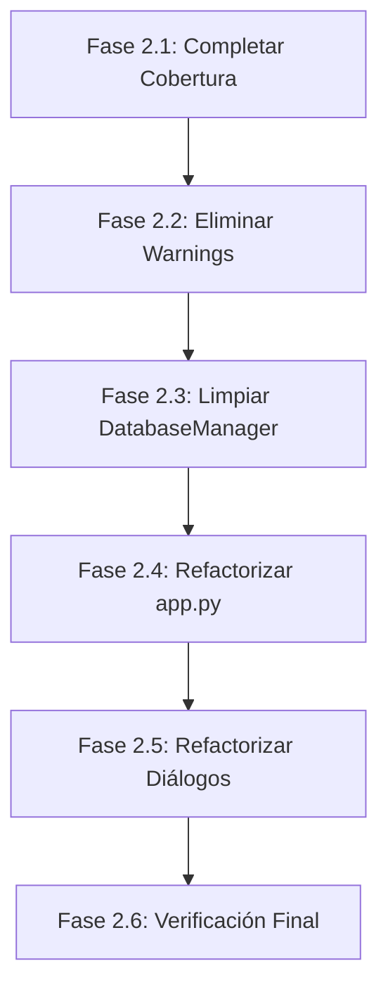

# Fase 2: Plan de Refactorización

> **Fecha de creación:** 26 de Diciembre de 2025  
> **Estado:** Listo para implementación  
> **Objetivo:** Continuar mejorando el código tras la migración a SQLAlchemy y DTOs

---

## 1. Estado Actual del Proyecto

### 1.1 Resumen Ejecutivo

La **Fase 1** de refactorización se ha completado exitosamente:

| Métrica | Estado Actual |
|---------|---------------|
| **Tests Totales** | 466 ✅ |
| **Tests Pasando** | 466 (100%) |
| **Cobertura Repositorios** | 99% (1789 statements, 15 missing) |
| **Warnings** | 20 (ResourceWarning) |

### 1.2 Repositorios - Estado de Cobertura

```
────────────────────────────────────────────────────────────────────────
Repositorio                              Stmts   Miss  Cover   Estado
────────────────────────────────────────────────────────────────────────
base.py                                    44      0   100%   ✅ Completo
configuration_repository.py               76      9    88%   ⚠️ Pendiente
iteration_repository.py                   87      6    93%   ⚠️ Pendiente
label_counter_repository.py               25      0   100%   ✅ Completo
lote_repository.py                        58      0   100%   ✅ Completo
machine_repository.py                    187      0   100%   ✅ Completo
material_repository.py                   124      0   100%   ✅ Completo
pila_repository.py                       238      0   100%   ✅ Completo
preproceso_repository.py                 158      0   100%   ✅ Completo
product_repository.py                    112      0   100%   ✅ Completo
tracking_repository.py                   537      0   100%   ✅ Completo
worker_repository.py                     130      0   100%   ✅ Completo
────────────────────────────────────────────────────────────────────────
TOTAL                                   1789     15    99%
────────────────────────────────────────────────────────────────────────
```

### 1.3 DTOs Implementados

Se han definido **22 DTOs** en `core/dtos.py`:

| Categoría | DTOs |
|-----------|------|
| **Máquinas** | `MachineDTO`, `MachineMaintenanceDTO`, `PreparationGroupDTO`, `PreparationStepDTO` |
| **Trabajadores** | `WorkerDTO`, `WorkerAnnotationDTO` |
| **Productos** | `ProductDTO`, `SubfabricacionDTO`, `ProcesoMecanicoDTO` |
| **Materiales** | `MaterialDTO`, `MaterialStatsDTO`, `ProductIterationMaterialDTO` |
| **Pilas** | `PilaDTO`, `ComponenteDTO` |
| **Preprocesos** | `PreprocesoDTO`, `FabricacionDTO`, `FabricacionProductoDTO` |
| **Lotes** | `LoteDTO` |
| **Configuración** | `ConfigurationDTO` |
| **Iteraciones** | `ProductIterationDTO` |
| **Etiquetas** | `LabelRangeDTO` |

---

## 2. Problemas Detectados

### 2.1 Líneas Sin Cobertura

#### ConfigurationRepository (9 líneas)
| Línea | Método | Problema |
|-------|--------|----------|
| 21 | `_get_default_error_value` | No se ejecuta en tests |
| 96-98 | `get_holidays` | Rama de error AttributeError |
| 118-119 | `add_holiday` | Festivo ya existe (return True) |
| 154-155 | `remove_holiday` | Error JSONDecodeError |
| 165 | `remove_holiday` | Festivo no encontrado (return True) |

#### IterationRepository (6 líneas)
| Línea | Método | Problema |
|-------|--------|----------|
| 156 | `add_product_iteration` | Rama de excepción |
| 244-245 | `update_iteration_image_path` | Iteración no encontrada |
| 276-277 | `update_iteration_file_path` | Iteración no encontrada |
| 288 | `_get_default_error_value` | No se ejecuta en tests |

### 2.2 ResourceWarning en Tests

Se detectan **20 advertencias** de tipo `ResourceWarning: unclosed database`:

- **Origen principal:** `test_database_manager_legacy.py::TestDatabaseManagerLegacy::test_delegated_methods`
- **Causa:** Conexiones de base de datos no cerradas correctamente en mocks
- **Impacto:** No afecta funcionalidad pero indica fugas de recursos en tests

### 2.3 Código Legacy en DatabaseManager

El archivo `database_manager.py` aún contiene **1984 líneas** con:
- Métodos de migración (v1-v11) 
- Código SQL directo para creación de tablas
- Métodos delegados a repositorios (que podrían simplificarse)

---

## 3. Plan de Trabajo - Fases



---

## 4. Fase 2.1: Completar Cobertura de Tests (100%)

### Objetivo
Alcanzar **100% de cobertura** en todos los repositorios eliminando los 15 statements sin cubrir.

### Tareas

#### 4.1.1 ConfigurationRepository - Tests de Error
| Tarea | Descripción | Archivo Test |
|-------|-------------|--------------|
| T-CONF-01 | Test para `_get_default_error_value` | `test_configuration_repository.py` |
| T-CONF-02 | Test para `get_holidays` con AttributeError | `test_configuration_repository.py` |
| T-CONF-03 | Test para `add_holiday` cuando ya existe | `test_configuration_repository.py` |
| T-CONF-04 | Test para `remove_holiday` con JSONDecodeError | `test_configuration_repository.py` |
| T-CONF-05 | Test para `remove_holiday` cuando no existe | `test_configuration_repository.py` |

```python
# Ejemplo de test para T-CONF-02
def test_get_holidays_with_invalid_entry(self, repos, session):
    """get_holidays debe manejar entradas con AttributeError gracefully."""
    config_repo = repos["configuration"]
    # Insertar JSON con entrada malformada (sin método .get())
    config_repo.set_setting('holidays', '[{"date": "2025-01-01"}, null]')
    holidays = config_repo.get_holidays()
    # Solo debe retornar la entrada válida
    assert len(holidays) == 1
```

#### 4.1.2 IterationRepository - Tests de Casos Límite
| Tarea | Descripción | Archivo Test |
|-------|-------------|--------------|
| T-ITER-01 | Test para `_get_default_error_value` | `test_iteration_repository.py` |
| T-ITER-02 | Test para `add_product_iteration` con error | `test_iteration_repository.py` |
| T-ITER-03 | Test para `update_iteration_image_path` not found | `test_iteration_repository.py` |
| T-ITER-04 | Test para `update_iteration_file_path` not found | `test_iteration_repository.py` |

```python
# Ejemplo de test para T-ITER-03
def test_update_iteration_image_path_not_found(self, repos):
    """update_iteration_image_path debe retornar False si no existe."""
    iteration_repo = repos["iteration"]
    result = iteration_repo.update_iteration_image_path(
        iteracion_id=99999,
        ruta_imagen="/path/to/image.jpg"
    )
    assert result is False
```

### Comando de Verificación
```bash
source .venv/bin/activate && python -m pytest tests/ \
    --cov=database/repositories \
    --cov-report=term-missing \
    --cov-fail-under=100 -v
```

---

## 5. Fase 2.2: Eliminar ResourceWarnings

### Objetivo
Eliminar todas las advertencias de `ResourceWarning: unclosed database` en los tests.

### Tareas

| Tarea | Descripción | Archivo | Prioridad |
|-------|-------------|---------|-----------|
| T-WARN-01 | Corregir mock de conexiones en `test_database_manager_legacy.py` | `tests/unit/` | Alta |
| T-WARN-02 | Añadir `finally` para cerrar conexiones en fixtures | `tests/conftest.py` | Alta |
| T-WARN-03 | Revisar uso de `with` en operaciones de sesión | `base.py` | Media |

### Solución Propuesta

```python
# En tests que usan mock de DatabaseManager:
@pytest.fixture
def mock_db_manager():
    with patch('database.database_manager.DatabaseManager') as mock_dm:
        mock_instance = mock_dm.return_value
        mock_instance.conn = MagicMock()
        yield mock_instance
        # Cleanup explícito
        mock_instance.close()
```

### Comando de Verificación
```bash
source .venv/bin/activate && python -m pytest tests/ -v -W error::ResourceWarning
```

---

## 6. Fase 2.3: Limpiar DatabaseManager

### Objetivo
Reducir la complejidad de `database_manager.py` eliminando código obsoleto y consolidando la arquitectura.

### Análisis Actual

| Componente | Líneas | Estado |
|------------|--------|--------|
| Imports y setup | ~30 | Mantener |
| `__init__` y conexión | ~100 | Refactorizar |
| Migraciones v1-v11 | ~400 | Evaluar extracción |
| Métodos delegados | ~200 | **Eliminar** |
| Métodos legacy SQL | ~300 | **Migrar o eliminar** |
| Métodos auxiliares | ~150 | Revisar |

### Tareas

| Tarea | Descripción | Riesgo |
|-------|-------------|--------|
| T-DM-01 | Identificar métodos delegados no usados | Bajo |
| T-DM-02 | Eliminar métodos delegados redundantes | Medio |
| T-DM-03 | Extraer migraciones a módulo separado | Bajo |
| T-DM-04 | Eliminar método `test_all_repositories()` | Bajo |
| T-DM-05 | Consolidar métodos de verificación de integridad | Medio |

### Métodos Candidatos para Eliminación

> [!WARNING]
> Verificar que no existan llamadas antes de eliminar.

```python
# Métodos que YA están delegados a repositorios:
# - get_all_products() → ProductRepository
# - get_all_workers() → WorkerRepository  
# - get_all_machines() → MachineRepository
# - get_setting() / set_setting() → ConfigurationRepository
# - get_all_pilas() → PilaRepository
```

### Comando de Búsqueda
```bash
grep -rn "db_manager\." app.py ui/ --include="*.py" | grep -v "__pycache__"
```

---

## 7. Fase 2.4: Refactorizar app.py

### Objetivo
Asegurar que todos los consumidores de datos en `app.py` usen correctamente DTOs en lugar de tuplas/diccionarios.

### Análisis de app.py

| Métrica | Valor |
|---------|-------|
| **Líneas totales** | 6681 |
| **Clases principales** | `AppModel`, `AppController`, `MainWindow` |
| **Repositorios usados** | 10 directamente |

### Tareas

| Tarea | Descripción | Prioridad |
|-------|-------------|-----------|
| T-APP-01 | Buscar accesos por índice `[0]`, `[1]`, etc. | Alta |
| T-APP-02 | Buscar desempaquetado de tuplas `for a, b, c in data` | Alta |
| T-APP-03 | Verificar uso correcto de `.atributo` en DTOs | Media |
| T-APP-04 | Documentar patrones de consumo de DTOs | Baja |

### Comando de Búsqueda de Problemas
```bash
# Buscar accesos por índice sospechosos
grep -n "\[0\]\|\\[1\]\|\\[2\]" app.py | grep -v "^#" | head -50

# Buscar desempaquetado de tuplas
grep -n "for .*, .* in" app.py | head -30
```

---

## 8. Fase 2.5: Refactorizar Diálogos y Widgets

### Objetivo
Verificar y corregir todos los widgets y diálogos de UI para usar DTOs correctamente.

### Archivos a Revisar

| Archivo | Líneas Aprox. | Widgets/Diálogos |
|---------|---------------|------------------|
| `ui/widgets.py` | ~3500 | 15 widgets |
| `ui/dialogs.py` | ~2000 | 12 diálogos |
| `ui/worker/camera_config_dialog.py` | ~300 | 1 diálogo |

### Patrón Común de Error

```python
# ❌ INCORRECTO: Desempaquetado de tuplas
def populate_list(self, data):
    for id, nombre, activo, *_ in data:  # TypeError si data tiene DTOs
        ...

# ✅ CORRECTO: Acceso por atributo DTO
def populate_list(self, data):
    for item in data:
        id = item.id
        nombre = item.nombre_completo
        activo = item.activo
        ...
```

### Tareas

| Tarea | Widget/Diálogo | Método a Revisar |
|-------|----------------|------------------|
| T-UI-01 | `WorkersWidget` | `populate_list()` |
| T-UI-02 | `MachinesWidget` | `populate_list()` |
| T-UI-03 | `ProductsWidget` | `update_search_results()` |
| T-UI-04 | `PilasWidget` | `populate_list()` |
| T-UI-05 | `HistorialWidget` | Todos los métodos |
| T-UI-06 | `FabricationsWidget` | `update_search_results()` |

---

## 9. Fase 2.6: Verificación Final

### Objetivo
Validar que toda la refactorización mantiene la funcionalidad y mejora la calidad del código.

### Checklist de Verificación

#### Tests Automatizados
- [ ] 100% tests pasando (`pytest tests/ -v`)
- [ ] 100% cobertura repositorios (`--cov-fail-under=100`)
- [ ] 0 warnings (`-W error::ResourceWarning`)
- [ ] 0 errores de linting (`pylint database/ core/`)

#### Verificación Manual
- [ ] Iniciar aplicación (`python app.py`)
- [ ] Navegar por todas las secciones principales
- [ ] Crear/editar/eliminar un producto
- [ ] Crear/gestionar una fabricación
- [ ] Verificar flujo de tracking (si aplicable)

### Comandos de Verificación Final

```bash
# 1. Tests completos con cobertura
source .venv/bin/activate && python -m pytest tests/ \
    --cov=database/repositories \
    --cov=core/dtos \
    --cov-report=html:test_reports/coverage \
    --cov-fail-under=100 \
    -v

# 2. Linting
pylint database/repositories/*.py core/dtos.py --output-format=text

# 3. Búsqueda de código legacy
grep -rn "\.conn\." database/ --include="*.py" | grep -v "__pycache__"
```

---

## 10. Lista de Tareas Completa

### Resumen por Fase

| Fase | Tareas | Prioridad | Estimación |
|------|--------|-----------|------------|
| 2.1 Completar Cobertura | 9 | Alta | 2-3 horas |
| 2.2 Eliminar Warnings | 3 | Alta | 1-2 horas |
| 2.3 Limpiar DatabaseManager | 5 | Media | 3-4 horas |
| 2.4 Refactorizar app.py | 4 | Media | 2-3 horas |
| 2.5 Refactorizar UI | 6+ | Media | 3-4 horas |
| 2.6 Verificación Final | - | Alta | 1-2 horas |

### Orden Recomendado de Ejecución

1. **T-CONF-01 a T-CONF-05** - Completar tests ConfigurationRepository
2. **T-ITER-01 a T-ITER-04** - Completar tests IterationRepository
3. **T-WARN-01 a T-WARN-03** - Eliminar warnings
4. **T-DM-01 a T-DM-05** - Limpiar DatabaseManager
5. **T-APP-01 a T-APP-04** - Verificar app.py
6. **T-UI-01 a T-UI-06** - Verificar widgets/diálogos

---

## 11. Criterios de Éxito

| Criterio | Objetivo | Estado Actual |
|----------|----------|---------------|
| Cobertura total repositorios | 100% | 99% |
| Tests pasando | 100% | 100% ✅ |
| Warnings | 0 | 20 |
| Accesos por índice en DTOs | 0 | Por verificar |
| Desempaquetado de tuplas | 0 | Por verificar |

---

## 12. Referencias

### Documentación Existente

| Documento | Ubicación | Propósito |
|-----------|-----------|-----------|
| [Guia_Refactorizacion_Fase1.md](file:///Users/danielsanz/Library/Mobile%20Documents/com~apple~CloudDocs/Programacion/Calcular_tiempos_fabricacion/Documentacion/Migraciion%20repositorios/Guia_Refactorizacion_Fase1.md) | Migraciion repositorios/ | Plan original migración SQLAlchemy |
| [migracion_y_testing_repositorios.md](file:///Users/danielsanz/Library/Mobile%20Documents/com~apple~CloudDocs/Programacion/Calcular_tiempos_fabricacion/Documentacion/Migraciion%20repositorios/migracion_y_testing_repositorios.md) | Migraciion repositorios/ | Guía de migración DTOs |
| [Creacion_de_Tests.md](file:///Users/danielsanz/Library/Mobile%20Documents/com~apple~CloudDocs/Programacion/Calcular_tiempos_fabricacion/Documentacion/Migraciion%20repositorios/Creacion_de_Tests.md) | Migraciion repositorios/ | Estándares de tests |
| [migration_status_report.md](file:///Users/danielsanz/Library/Mobile%20Documents/com~apple~CloudDocs/Programacion/Calcular_tiempos_fabricacion/Documentacion/migration_status_report.md) | Documentacion/ | Estado actual migración |

### Comandos Útiles

```bash
# Ejecutar tests
source .venv/bin/activate && python -m pytest tests/ -v

# Con cobertura específica
pytest tests/unit/test_configuration_repository.py --cov=database/repositories/configuration_repository.py --cov-report=term-missing

# Buscar uso de repositorio específico
grep -rn "config_repo\|configuration_repo" app.py ui/ --include="*.py"
```

---

> [!TIP]
> **Regla de oro:** Cada tarea debe completarse con sus tests correspondientes antes de pasar a la siguiente. Nunca simplificar tests para alcanzar cobertura; cada error es una oportunidad de mejora.

---

*Documento generado automáticamente - 26/12/2025*
