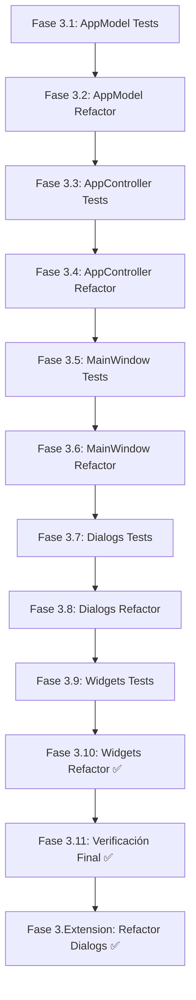
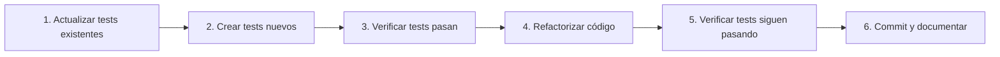

# Fase 3: Plan de Refactorización Integral

> **Fecha de creación:** 26 de Diciembre de 2025  
> **Estado:** Pendiente de implementación  
> **Prerrequisitos:** Fase 2 completada (538 tests, 100% cobertura repositorios)

---

## 1. Estado Actual del Proyecto

### 1.1 Resumen Post-Fase 2

| Métrica | Estado Actual |
|---------|---------------|
| **Tests Totales** | 538 ✅ |
| **Tests Pasando** | 538 (100%) |
| **Cobertura Repositorios** | 100% |
| **Cobertura DatabaseManager** | 98% |
| **Warnings** | 0 |

### 1.2 Problemas Resueltos en Fase 2

| Problema | Solución | Estado |
|----------|----------|--------|
| Tuplas en lugar de DTOs | Migración a atributos DTO | ✅ Resuelto |
| ResourceWarnings | Cierre explícito conexiones | ✅ Resuelto |
| Método close() duplicado | Eliminado duplicado | ✅ Resuelto |
| Cobertura repos < 100% | 69 tests nuevos | ✅ Resuelto |

### 1.3 Archivos Pendientes de Refactorización

| Archivo | Líneas | Complejidad | Prioridad |
|---------|--------|-------------|-----------|
| `app.py` | 6,689 | 271 funciones | Alta |
| `ui/dialogs.py` | 7,947 | 278 items | Alta |
| `ui/widgets.py` | 3,477 | 155 items | Media |
| `database/database_manager.py` | 1,177 | Reducido | Baja |

---

## 2. Objetivos de Fase 3

### 2.1 Objetivo Principal

**Refactorizar los archivos monolíticos** (`app.py`, `ui/dialogs.py`, `ui/widgets.py`) 
en módulos manejables con cobertura de tests del 100%.

### 2.2 Principios de Diseño

1. **Principio de Responsabilidad Única (SRP):** Cada módulo <= 500 líneas
2. **Test-First:** Tests escritos ANTES de cada refactorización
3. **Cobertura 100%:** Cada módulo nuevo debe tener tests completos
4. **Sin Regresiones:** Suite de 538+ tests debe pasar siempre

---

## 3. Plan de Subfases



---

## 4. Fase 3.1: Tests para AppModel

### 4.1.1 Objetivo
Crear tests unitarios para `AppModel` (líneas 221-1030 de `app.py`) antes de refactorizar.

### 4.1.2 Archivos a Crear

| Archivo | Descripción | Cobertura Objetivo |
|---------|-------------|-------------------|
| `tests/unit/test_app_model.py` | Tests unitarios AppModel | 100% |
| `tests/integration/test_app_model_integration.py` | Tests integración | 80% |

### 4.1.3 Métodos a Testear (Muestra)

```python
# AppModel tiene ~80 métodos, aquí los principales:
class TestAppModel:
    # Fabricaciones
    def test_get_latest_fabricaciones(self): ...
    def test_search_fabricaciones(self): ...
    def test_create_fabricacion(self): ...
    
    # Iteraciones
    def test_get_product_iterations(self): ...
    def test_add_product_iteration(self): ...
    
    # Pilas
    def test_load_pila(self): ...
    def test_delete_pila(self): ...
    
    # Workers
    def test_get_all_workers(self): ...
    def test_get_latest_workers(self): ...
```

### 4.1.4 Estrategia de Mocking

```python
@pytest.fixture
def mock_db_manager():
    """Mock de DatabaseManager con todas las dependencias."""
    mock = MagicMock(spec=DatabaseManager)
    mock.preproceso_repo = MagicMock()
    mock.product_repo = MagicMock()
    mock.worker_repo = MagicMock()
    mock.machine_repo = MagicMock()
    mock.pila_repo = MagicMock()
    mock.iteration_repo = MagicMock()
    return mock
```

### 4.1.5 Comando de Verificación

```bash
source .venv/bin/activate && python -m pytest tests/unit/test_app_model.py \
    --cov=app --cov-report=term-missing -v
```

### 4.1.6 Criterio de Éxito

- [ ] Cobertura de AppModel >= 95%
- [ ] Todos los tests pasando
- [ ] Sin warnings

---

## 5. Fase 3.2: Refactorización de AppModel

### 5.2.1 Objetivo

Extraer `AppModel` a un módulo independiente: `core/app_model.py`

### 5.2.2 Nueva Estructura

```
core/
├── __init__.py
├── app_model.py          # NUEVO - Lógica de negocio
├── dtos.py               # Existente - DTOs
└── camera_manager.py     # Existente
```

### 5.2.3 Pasos de Implementación

1. Crear archivo `core/app_model.py`
2. Mover clase `AppModel` completa
3. Actualizar imports en `app.py`
4. Ejecutar suite completa de tests
5. Verificar que la aplicación arranca

### 5.2.4 Verificación

```bash
# Tests post-refactor
source .venv/bin/activate && python -m pytest tests/ --tb=short -q

# Verificar import
python -c "from core.app_model import AppModel; print('OK')"

# Verificar que app arranca (visual)
python app.py &
sleep 5
kill %1
```

---

## 6. Fase 3.3: Tests para AppController

### 6.3.1 Objetivo

Crear tests para `AppController` antes de su refactorización.

### 6.3.2 Ubicación de AppController

La clase `AppController` coordina AppModel y MainWindow. Es responsable de:
- Conectar señales entre componentes
- Gestionar flujos de trabajo complejos
- Manejar eventos de UI

### 6.3.3 Archivos a Crear

| Archivo | Descripción |
|---------|-------------|
| `tests/unit/test_app_controller.py` | Tests unitarios |
| `tests/integration/test_app_controller_flow.py` | Tests de flujo |

### 6.3.4 Estrategia

```python
@pytest.fixture
def app_controller(mock_db_manager):
    """Controller con dependencias mockeadas."""
    model = MagicMock(spec=AppModel)
    controller = AppController(mock_db_manager)
    controller.model = model
    return controller
```

---

## 7. Fase 3.4: Refactorización de AppController

### 7.4.1 Objetivo

Extraer `AppController` a `controllers/app_controller.py`

### 7.4.2 Nueva Estructura

```
controllers/
├── __init__.py
├── app_controller.py     # NUEVO - Controlador principal
├── product_controller.py # NUEVO - Controlador de productos
├── worker_controller.py  # NUEVO - Controlador de trabajadores
└── pila_controller.py    # NUEVO - Controlador de pilas
```

### 7.4.3 División Propuesta

| Controller | Responsabilidad | Métodos Aprox. |
|------------|-----------------|----------------|
| `AppController` | Coordinación general | 20 |
| `ProductController` | CRUD productos | 15 |
| `WorkerController` | Gestión trabajadores | 10 |
| `PilaController` | Gestión pilas | 15 |

---

## 8. Fase 3.5: Tests para MainWindow

### 8.5.1 Objetivo

Tests para `MainWindow` enfocados en:
- Inicialización de UI
- Navegación entre secciones
- Eventos de usuario

### 8.5.2 Consideraciones PyQt6

```python
@pytest.fixture
def main_window(qtbot, mock_controller):
    """MainWindow con Qt test utilities."""
    window = MainWindow(mock_controller)
    qtbot.addWidget(window)
    return window

def test_navigate_to_products(main_window, qtbot):
    """Test navegación a sección productos."""
    qtbot.mouseClick(main_window.btn_products, Qt.MouseButton.LeftButton)
    assert main_window.stack.currentWidget() == main_window.products_page
```

### 8.5.3 Archivos a Crear

| Archivo | Descripción |
|---------|-------------|
| `tests/unit/test_main_window.py` | Tests unitarios UI |
| `tests/e2e/test_main_window_flows.py` | Tests E2E |

---

## 9. Fase 3.6: Refactorización de MainWindow

### 9.6.1 Objetivo

Reducir `MainWindow` extrayendo páginas/secciones a módulos.

### 9.6.2 Nueva Estructura

```
ui/
├── __init__.py
├── main_window.py        # NUEVO - Solo MainWindow (~500 líneas)
├── dialogs/              # NUEVO - Carpeta de diálogos
│   ├── __init__.py
│   ├── product_dialogs.py
│   ├── worker_dialogs.py
│   └── ...
├── widgets/              # NUEVO - Carpeta de widgets
│   ├── __init__.py
│   ├── dashboard_widget.py
│   ├── products_widget.py
│   └── ...
└── worker/               # Existente
```

---

## 10. Fase 3.7: Tests para Diálogos

### 10.7.1 Objetivo

Tests para los 27+ diálogos en `ui/dialogs.py` (7,947 líneas).

### 10.7.2 Diálogos Prioritarios

| Diálogo | Líneas | Complejidad |
|---------|--------|-------------|
| `EnhancedProductionFlowDialog` | ~400 | Alta |
| `PreprocesosSelectionDialog` | ~85 | Media |
| `CreateFabricacionDialog` | ~100 | Media |
| `ProductDialog` | ~200 | Media |

### 10.7.3 Estrategia de Tests

```python
class TestEnhancedProductionFlowDialog:
    def test_dialog_initializes(self, qtbot):
        """Dialog se inicializa correctamente."""
        dialog = EnhancedProductionFlowDialog(data=[])
        qtbot.addWidget(dialog)
        assert dialog.canvas is not None
    
    def test_add_task(self, qtbot, dialog):
        """Se puede añadir una tarea."""
        initial_count = len(dialog.tasks)
        dialog.add_task({"nombre": "Test"})
        assert len(dialog.tasks) == initial_count + 1
```

---

## 11. Fase 3.8: Refactorización de Diálogos

### 11.8.1 Objetivo

Dividir `ui/dialogs.py` (7,947 líneas) en módulos por dominio.

### 11.8.2 Nueva Estructura

```
ui/dialogs/
├── __init__.py           # Exporta todos los diálogos
├── base_dialogs.py       # Clases base compartidas
├── product_dialogs.py    # AddProduct, EditProduct, etc.
├── worker_dialogs.py     # WorkerAnnotation, etc.
├── fabrication_dialogs.py # CreateFabrication, etc.
├── preproceso_dialogs.py # PreprocesoSelection, etc.
├── flow_dialogs.py       # EnhancedProductionFlow, Canvas, Card
├── settings_dialogs.py   # Settings, Configuration
└── utility_dialogs.py    # Confirmation, Input, etc.
```

### 11.8.3 Tamaño Objetivo por Archivo

| Archivo | Máximo Líneas |
|---------|---------------|
| Cada archivo | ≤ 800 |
| Total dividido | ~8,000 (mismas líneas, organizado) |

---

## 12. Fase 3.9: Tests para Widgets

### 12.9.1 Objetivo

Tests para los 15+ widgets en `ui/widgets.py` (3,477 líneas).

### 12.9.2 Widgets Prioritarios

| Widget | Líneas | Funcionalidad |
|--------|--------|---------------|
| `TimelineVisualizationWidget` | ~200 | Gantt interactivo |
| `HistorialWidget` | ~150 | Historial iteraciones |
| `DashboardWidget` | ~300 | Panel principal |
| `MachinesWidget` | ~200 | Gestión máquinas |

### 12.9.3 Archivos a Crear

| Archivo | Descripción |
|---------|-------------|
| `tests/unit/test_widgets.py` | Tests widgets básicos |
| `tests/unit/test_dashboard_widget.py` | Tests dashboard |
| `tests/unit/test_timeline_widget.py` | Tests Gantt |

---

## 13. Fase 3.10: Refactorización de Widgets

### 13.10.1 Objetivo

Dividir `ui/widgets.py` en módulos cohesivos.

### 13.10.2 Nueva Estructura

```
ui/widgets/
├── __init__.py             # Exporta todos los widgets
├── base_widgets.py         # Widgets base reutilizables
├── dashboard_widget.py     # Dashboard
├── timeline_widget.py      # Gantt/Timeline
├── historial_widget.py     # Historial
├── products_widget.py      # Productos
├── machines_widget.py      # Máquinas
├── workers_widget.py       # Trabajadores
├── pilas_widget.py         # Pilas
├── preprocesos_widget.py   # Preprocesos
├── settings_widget.py      # Configuración
└── calculator_widget.py    # Calculadora tiempos
```

> [!NOTE]
> **Completado:** Ver [Fase_3_10_Refactorizacion_Widgets.md](Fase_3_10_Refactorizacion_Widgets.md)

---

## 14. Fase 3.11: Verificación Final

### 14.11.1 Checklist de Verificación

#### Tests Automatizados
- [ ] 100% tests pasando
- [ ] Cobertura global >= 90%
- [ ] 0 warnings
- [ ] 0 errores de linting

#### Verificación Manual
- [ ] Iniciar aplicación
- [ ] Navegar todas las secciones
- [ ] Crear/editar/eliminar producto
- [ ] Gestionar fabricaciones
- [ ] Verificar cálculo de tiempos
- [ ] Gestionar trabajadores
- [ ] Revisar dashboard

### 14.11.2 Comandos de Verificación

```bash
# Suite completa
source .venv/bin/activate && python -m pytest tests/ -v --tb=short

# Cobertura por módulo
python -m pytest tests/ \
    --cov=core --cov=controllers --cov=ui \
    --cov-report=html:test_reports/coverage_fase3

# Verificar app arranca
python -c "from app import MainWindow; print('Import OK')"
```

> [!SUCCESS]
> **Resultado 27/12/2025:** Fase 3 Completada. Se ha eliminado `ui/dialogs_legacy.py` y refactorizado todo el código. Ver [Fase_3_Ext_Refactorizacion_Dialogos.md](Fase_3_Ext_Refactorizacion_Dialogos.md)

---

## 15. Fase 3.12: Actualización del Sistema de Reportes

### 15.12.1 Objetivo

Actualizar `audit_report_generator.py` para incluir cobertura de nuevos módulos.

### 15.12.2 Cambios Requeridos

1. **Nuevas categorías de cobertura:**
   - `core/app_model.py`
   - `controllers/*.py`
   - `ui/dialogs/*.py`
   - `ui/widgets/*.py`

2. **Tabla de cobertura en HTML:**
```python
def _generate_coverage_table(self, coverage_data):
    modules = [
        ('Repositorios', 'database/repositories/*'),
        ('Core', 'core/*'),
        ('Controllers', 'controllers/*'),
        ('UI Dialogs', 'ui/dialogs/*'),
        ('UI Widgets', 'ui/widgets/*'),
    ]
    # Generar tabla con % por módulo
```

3. **Script runner actualizado:**
```bash
#!/bin/bash
pytest tests/ \
    --cov=database/repositories \
    --cov=core \
    --cov=controllers \
    --cov=ui \
    --cov-report=html:test_reports/coverage \
    --cov-report=json:test_reports/coverage.json
```

---

## 16. Estimaciones de Tiempo

| Subfase | Descripción | Estimación |
|---------|-------------|------------|
| 3.1 | Tests AppModel | 3-4 horas |
| 3.2 | Refactor AppModel | 2-3 horas |
| 3.3 | Tests AppController | 2-3 horas |
| 3.4 | Refactor AppController | 3-4 horas |
| 3.5 | Tests MainWindow | 2-3 horas |
| 3.6 | Refactor MainWindow | 2-3 horas |
| 3.7 | Tests Dialogs | 4-5 horas |
| 3.8 | Refactor Dialogs | 4-5 horas |
| 3.9 | Tests Widgets | 3-4 horas |
| 3.10 | Refactor Widgets | 3-4 horas |
| 3.11 | Verificación Final | 2-3 horas |
| 3.12 | Actualizar Reportes | 1-2 horas |
| **TOTAL** | | **31-43 horas** |

---

## 17. Flujo de Trabajo por Sesión

### Patrón Recomendado



### Ejemplo de Sesión (Subfase 3.1)

1. **Inicio (5 min):** Revisar estado actual
   ```bash
   pytest tests/ --tb=no -q | tail -5
   ```

2. **Crear tests (2-3 horas):**
   - Crear `tests/unit/test_app_model.py`
   - Implementar tests método por método

3. **Verificar (10 min):**
   ```bash
   pytest tests/unit/test_app_model.py -v --cov=app
   ```

4. **Commit:**
   ```bash
   git add tests/unit/test_app_model.py
   git commit -m "Fase 3.1: Tests para AppModel - cobertura X%"
   ```

---

## 18. Dependencias entre Subfases

| Subfase | Depende de | Bloquea |
|---------|------------|---------|
| 3.1 | - | 3.2 |
| 3.2 | 3.1 | 3.3, 3.4 |
| 3.3 | 3.2 | 3.4 |
| 3.4 | 3.2, 3.3 | 3.5 |
| 3.5 | 3.4 | 3.6 |
| 3.6 | 3.5 | 3.7 |
| 3.7 | 3.6 | 3.8 |
| 3.8 | 3.7 | 3.9 |
| 3.9 | 3.8 | 3.10 |
| 3.10 | 3.9 | 3.11 |
| 3.11 | 3.10 | 3.12 |
| 3.12 | 3.11 | - |

---

## 19. Criterios de Éxito Globales

| Criterio | Objetivo |
|----------|----------|
| Tests totales | >= 700 |
| Cobertura global | >= 90% |
| Archivo más grande | <= 800 líneas |
| Warnings | 0 |
| Errores linting | 0 |
| App funcional | ✓ Manual test |

---

## 20. Comandos Útiles

```bash
# Ver líneas por archivo
wc -l app.py ui/*.py | sort -n

# Buscar desempaquetado de tuplas residual
grep -rn "for .*, .* in" app.py ui/ --include="*.py"

# Ver cobertura específica
pytest tests/ --cov=core.app_model --cov-report=term-missing

# Ejecutar solo tests de UI (requiere display)
pytest tests/unit/test_*widget*.py tests/unit/test_*dialog*.py -v

# Linting
pylint core/ controllers/ ui/ --output-format=text
```

---

> [!TIP]
> **Regla de oro:** Nunca refactorizar sin tests primero. 
> Si no hay tests para cierto código, crearlos es la primera tarea.

---

*Documento generado - 26/12/2025*
