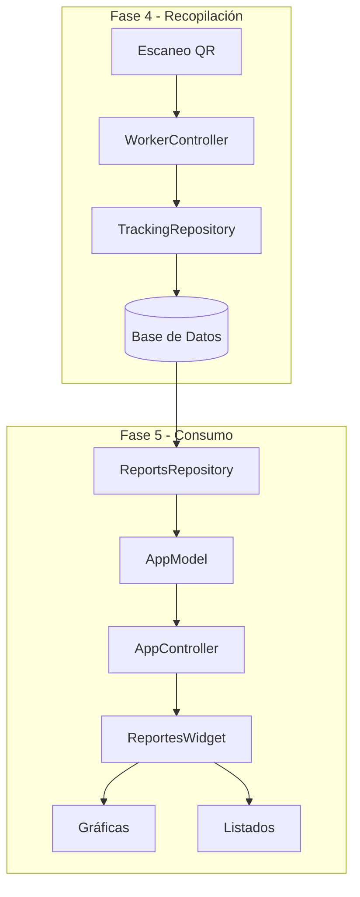

# Fase 5: Módulo de Reportes de Producción

**Fecha de Creación:** 30 de Diciembre de 2025  
**Objetivo Principal:** Implementar un módulo completo de reportes de producción que permita visualizar, analizar y explorar los datos de fabricación recopilados mediante el sistema de trazabilidad QR.

---

## 1. Análisis del Estado Actual

### 1.1 Flujo de Datos de Trazabilidad



### 1.2 Modelos de Datos Disponibles

Los datos de producción se almacenan en las siguientes entidades:

| Modelo | Propósito | Campos Clave |
|--------|-----------|--------------|
| `TrabajoLog` | Registro principal de una unidad producida | `qr_code`, `tiempo_inicio`, `tiempo_fin`, `duracion_segundos`, `orden_fabricacion` |
| `PasoTrazabilidad` | Pasos individuales (capas) por unidad | `paso_nombre`, `tipo_paso`, `duracion_paso_segundos`, `trabajador_id` |
| `IncidenciaLog` | Incidencias registradas | `tipo_incidencia`, `estado`, `fecha_reporte` |
| `Fabricacion` | Orden de fabricación | `codigo`, `descripcion`, `productos` |
| `Producto` | Producto fabricado | `codigo`, `descripcion` |

### 1.3 Métodos Existentes en TrackingRepository

Del análisis realizado, los métodos más relevantes para reportes son:

- `obtener_estadisticas_fabricacion(fabricacion_id)` → Estadísticas por orden
- `obtener_estadisticas_trabajador(trabajador_id, fecha_inicio, fecha_fin)` → Estadísticas por trabajador
- `get_all_ordenes_fabricacion()` → Lista de OFs únicas
- `get_trabajo_logs_por_trabajador(trabajador_id)` → Logs por trabajador
- `obtener_incidencias_abiertas(fabricacion_id)` → Incidencias activas

### 1.4 Estado del Widget de Reportes

El widget actual (`ui/widgets/reportes_widget.py`) es un **placeholder** de 48 líneas con:
- Panel izquierdo: Caja de búsqueda + lista de resultados
- Panel derecho: Placeholder vacío

---

## 2. Arquitectura Propuesta

### 2.1 Nuevo Repositorio de Reportes

> [!IMPORTANT]
> Se recomienda crear un **repositorio especializado** para consultas de reportes que optimice las queries para agregación y análisis, manteniendo separación de responsabilidades.

**Archivo:** `database/repositories/reports_repository.py`

```python
class ReportsRepository(BaseRepository):
    """
    Repositorio especializado en consultas de agregación y análisis
    para el módulo de reportes de producción.
    """
```

**Métodos propuestos:**

| Método | Descripción | Retorno |
|--------|-------------|---------|
| `buscar_por_codigo(query)` | Búsqueda inteligente por código producto/fabricación | `List[ResultadoBusquedaDTO]` |
| `obtener_ordenes_por_producto(producto_codigo)` | OFs de un producto ordenadas por fecha | `List[OrdenFabricacionResumenDTO]` |
| `obtener_resumen_orden(orden_fabricacion)` | Resumen completo de una OF | `OrdenFabricacionDetalleDTO` |
| `calcular_promedio_tiempo_unidad(producto_codigo)` | Tiempo promedio por unidad | `PromedioTiempoDTO` |
| `obtener_incidencias_por_producto(producto_codigo)` | Historial de incidencias | `List[IncidenciaResumenDTO]` |
| `obtener_tiempos_por_trabajador(producto_codigo)` | Tiempos promedio por trabajador | `List[TiempoTrabajadorDTO]` |
| `obtener_evolucion_temporal(producto_codigo)` | Evolución de tiempos en el tiempo | `List[PuntoEvolucionDTO]` |

### 2.2 Nuevos DTOs para Reportes

**Archivo:** `core/reports_dtos.py`

```python
@dataclass
class ResultadoBusquedaDTO:
    tipo: str  # 'producto' | 'fabricacion' | 'orden'
    codigo: str
    descripcion: str
    fecha_ultimo_uso: Optional[datetime]

@dataclass
class OrdenFabricacionResumenDTO:
    orden_fabricacion: str
    fecha_inicio: datetime
    fecha_fin: Optional[datetime]
    cantidad_unidades: int
    tiempo_total_segundos: int
    incidencias_count: int

@dataclass
class PromedioTiempoDTO:
    producto_codigo: str
    promedio_segundos: float
    desviacion_estandar: float
    minimo_segundos: int
    maximo_segundos: int
    total_unidades: int

@dataclass  
class TiempoTrabajadorDTO:
    trabajador_id: int
    trabajador_nombre: str
    promedio_segundos: float
    unidades_realizadas: int
```

### 2.3 Diseño del Widget de Reportes

```
+----------------------------------+----------------------------------------+
|        PANEL IZQUIERDO           |            PANEL DERECHO               |
|          (400px fijo)            |           (expandible)                 |
+----------------------------------+----------------------------------------+
| [Buscar código...        🔍]     |   +----------------------------------+ |
|                                  |   |  ÓRDENES DE FABRICACIÓN          | |
| ┌─────────────────────────────┐  |   |  ┌────────────────────────────┐  | |
| │ Resultados de Búsqueda      │  |   |  │ OF-2024-001 | 15/12 | 50u │  | |
| ├─────────────────────────────┤  |   |  │ [▼ Ver Detalles]           │  | |
| │ 📦 PROD-001 - Producto A    │  |   |  ├────────────────────────────┤  | |
| │ 📦 PROD-002 - Producto B    │  |   |  │ OF-2024-002 | 20/12 | 100u│  | |
| │ 🏭 FAB-001 - Fabricación X  │  |   |  │ [▼ Ver Detalles]           │  | |
| └─────────────────────────────┘  |   |  └────────────────────────────┘  | |
|                                  |   +----------------------------------+ |
| [Filtrar por tipo: ────────▼]    |                                        |
|                                  |   +----------------------------------+ |
| ┌─────────────────────────────┐  |   |  GRÁFICAS DE ANÁLISIS            | |
| │ Información del Elemento    │  |   |  ┌────────────────────────────┐  | |
| │                             │  |   |  │   📊 Tiempo promedio/unidad│  | |
| │ Código: PROD-001            │  |   |  │   📈 Evolución temporal    │  | |
| │ Descripción: Producto A     │  |   |  │   👥 Tiempos por trabajador│  | |
| │ Total OFs: 15               │  |   |  │   ⚠️ Patrón de incidencias │  | |
| │ Última producción: 28/12    │  |   |  └────────────────────────────┘  | |
| └─────────────────────────────┘  |   +----------------------------------+ |
+----------------------------------+----------------------------------------+
```

---

## 3. Plan de Implementación por Fases

### Fase 5.1: Infraestructura de Datos (Backend)

**Objetivo:** Crear el repositorio y DTOs necesarios para alimentar el módulo de reportes.

#### Archivos a Crear

| Archivo | Descripción |
|---------|-------------|
| `database/repositories/reports_repository.py` | Repositorio especializado |
| `core/reports_dtos.py` | DTOs para reportes |

#### Archivos a Modificar

| Archivo | Cambio |
|---------|--------|
| `database/repositories/__init__.py` | Exportar `ReportsRepository` |
| `database/database_manager.py` | Instanciar `ReportsRepository` |
| `core/app_model.py` | Añadir métodos proxy para reportes |

---

### Fase 5.2: Búsqueda Inteligente

**Objetivo:** Implementar búsqueda en tiempo real con coincidencias parciales.

#### Funcionalidades

1. **Auto-completado dinámico**: Al escribir, mostrar coincidencias
2. **Búsqueda múltiple**: Buscar en productos, fabricaciones y OFs
3. **Ordenación por relevancia**: Mostrar primero coincidencias exactas
4. **Debounce de 300ms**: Evitar consultas excesivas durante escritura

#### Componente UI

```python
class SmartSearchWidget(QWidget):
    """Widget de búsqueda inteligente con autocompletado."""
    result_selected = pyqtSignal(str, str)  # (tipo, codigo)
```

---

### Fase 5.3: Panel de Órdenes de Fabricación

**Objetivo:** Mostrar listado de OFs con información resumida y desplegables.

#### Funcionalidades

1. **Listado ordenado por fecha** (más reciente primero)
2. **Información por fila**: OF, fecha, cantidad, duración total
3. **Menús desplegables** al hacer clic:
   - Ver incidencias
   - Ver tiempos detallados por unidad
   - Ver trabajadores involucrados
   - Exportar datos

#### Componente UI

```python
class OrderListWidget(QWidget):
    """Widget para mostrar listado de órdenes de fabricación."""
    order_selected = pyqtSignal(str)  # orden_fabricacion
```

---

### Fase 5.4: Panel de Gráficas y Análisis

**Objetivo:** Visualización de datos con gráficas interactivas.

> [!NOTE]
> Se utilizará **PyQtChart** (ya disponible en el proyecto) para las visualizaciones.

#### Gráficas a Implementar

| Gráfica | Tipo | Datos |
|---------|------|-------|
| Tiempo promedio por unidad | Indicador + Gauge | Promedio, min, max |
| Evolución temporal | Línea | Tiempos a lo largo del tiempo |
| Tiempos por trabajador | Barras horizontales | Comparativa entre trabajadores |
| Patrón de incidencias | Pastel/Donut | Tipos de incidencias |

#### Componente UI

```python
class ReportsChartsWidget(QWidget):
    """Widget contenedor para las gráficas de análisis."""
    
    def update_charts(self, producto_codigo: str):
        """Actualiza todas las gráficas para un producto."""
```

---

### Fase 5.5: Integración y Pulido

**Objetivo:** Conectar todos los componentes y pulir la experiencia de usuario.

#### Tareas

1. **Conectar señales** entre widgets
2. **Implementar caché** para evitar consultas repetidas
3. **Añadir estados de carga** (spinners, placeholders)
4. **Implementar manejo de errores** con mensajes claros
5. **Ajustar estilos CSS** para coherencia visual

---

## 4. Diseño Visual

### 4.1 Paleta de Colores

| Elemento | Color | Uso |
|----------|-------|-----|
| Primario | `#2563eb` | Botones, enlaces, selección |
| Éxito | `#16a34a` | Indicadores positivos |
| Advertencia | `#f59e0b` | Alertas, incidencias |
| Error | `#dc2626` | Errores, problema grave |
| Fondo claro | `#f8fafc` | Fondos de paneles |
| Texto | `#1e293b` | Texto principal |

### 4.2 Componentes Reutilizables

```python
# ui/widgets/reports/
├── __init__.py
├── smart_search.py      # Búsqueda inteligente
├── order_list.py        # Lista de órdenes
├── order_detail.py      # Detalle desplegable de orden
├── charts_container.py  # Contenedor de gráficas
├── time_chart.py        # Gráfica de tiempos
├── worker_chart.py      # Gráfica por trabajador
└── incident_chart.py    # Gráfica de incidencias
```

---

## 5. Plan de Verificación

### 5.1 Tests Unitarios

**Archivo:** `tests/unit/test_reports_repository.py`

```bash
# Ejecutar tests del repositorio de reportes
python -m pytest tests/unit/test_reports_repository.py -v
```

| Test | Descripción |
|------|-------------|
| `test_buscar_por_codigo_producto` | Búsqueda retorna productos |
| `test_buscar_por_codigo_fabricacion` | Búsqueda retorna fabricaciones |
| `test_buscar_sin_resultados` | Búsqueda vacía retorna lista vacía |
| `test_obtener_ordenes_por_producto` | Ordenes ordenadas por fecha |
| `test_calcular_promedio_tiempo` | Cálculo correcto de promedio |
| `test_obtener_tiempos_por_trabajador` | Tiempos agrupados por trabajador |

### 5.2 Tests de Integración

**Archivo:** `tests/integration/test_reports_integration.py`

```bash
# Ejecutar tests de integración
python -m pytest tests/integration/test_reports_integration.py -v
```

| Test | Descripción |
|------|-------------|
| `test_flujo_busqueda_a_grafica` | Búsqueda → Selección → Carga de gráficas |
| `test_carga_ordenes_con_datos_reales` | Carga de OFs desde BD de prueba |

### 5.3 Verificación Manual

#### Escenario 1: Búsqueda de Producto

1. Abrir la aplicación
2. Ir al menú "Reportes"
3. En el campo de búsqueda, escribir "PROD"
4. **Verificar:** Aparecen resultados mientras se escribe
5. Seleccionar un producto de la lista
6. **Verificar:** Se muestran las órdenes de fabricación en el panel derecho

#### Escenario 2: Visualización de Gráficas

1. Después del Escenario 1
2. **Verificar:** Las gráficas se cargan en el panel inferior
3. **Verificar:** La gráfica de "Tiempo promedio" muestra un valor numérico
4. **Verificar:** La gráfica de "Tiempos por trabajador" muestra barras si hay datos

#### Escenario 3: Detalle de Orden

1. Después del Escenario 1
2. Hacer clic en una orden de fabricación
3. **Verificar:** Se despliega un menú con opciones
4. Seleccionar "Ver incidencias"
5. **Verificar:** Se muestran las incidencias de esa orden (o mensaje "Sin incidencias")

---

## 6. Consideraciones de Seguridad

> [!CAUTION]
> Los datos de producción son críticos. Se deben implementar las siguientes medidas:

1. **Solo lectura en reportes**: El módulo de reportes no modifica datos
2. **Validación de inputs**: Sanitizar consultas de búsqueda
3. **Logging de acceso**: Registrar quién accede a qué reportes
4. **Transacciones de solo lectura**: Usar `session.no_autoflush` para consultas

---

## 7. Resumen de Archivos

### Nuevos Archivos

| Ruta | Descripción |
|------|-------------|
| `database/repositories/reports_repository.py` | Repositorio de reportes |
| `core/reports_dtos.py` | DTOs para reportes |
| `ui/widgets/reports/__init__.py` | Módulo de widgets de reportes |
| `ui/widgets/reports/smart_search.py` | Búsqueda inteligente |
| `ui/widgets/reports/order_list.py` | Lista de órdenes |
| `ui/widgets/reports/order_detail.py` | Detalle de orden |
| `ui/widgets/reports/charts_container.py` | Contenedor de gráficas |
| `ui/widgets/reports/time_chart.py` | Gráfica de tiempos |
| `ui/widgets/reports/worker_chart.py` | Gráfica por trabajador |
| `ui/widgets/reports/incident_chart.py` | Gráfica de incidencias |
| `tests/unit/test_reports_repository.py` | Tests unitarios |
| `tests/integration/test_reports_integration.py` | Tests de integración |

### Archivos a Modificar

| Ruta | Cambio |
|------|--------|
| `database/repositories/__init__.py` | Añadir export de `ReportsRepository` |
| `database/database_manager.py` | Instanciar `ReportsRepository` |
| `core/app_model.py` | Añadir métodos proxy para reportes |
| `ui/widgets/reportes_widget.py` | Reescribir completamente |
| `ui/main_window.py` | Verificar conexión con nuevo widget |

---

## 8. Dependencias

El proyecto ya cuenta con todas las dependencias necesarias:

- **PyQt6** - Framework UI
- **PyQtChart** - Gráficas (verificar importación)
- **SQLAlchemy** - ORM para consultas
- **dataclasses** - Para DTOs

---

## 9. Estimación de Tiempo

| Fase | Estimación |
|------|------------|
| 5.1 - Infraestructura de Datos | 4-6 horas |
| 5.2 - Búsqueda Inteligente | 3-4 horas |
| 5.3 - Panel de Órdenes | 4-5 horas |
| 5.4 - Panel de Gráficas | 6-8 horas |
| 5.5 - Integración y Pulido | 3-4 horas |
| **Total Estimado** | **20-27 horas** |

---

## 10. Próximos Pasos

1. [ ] Revisar y aprobar este plan de implementación
2. [ ] Crear estructura de carpetas para el módulo
3. [ ] Implementar Fase 5.1 (Backend)
4. [ ] Implementar Fase 5.2 (Búsqueda)
5. [ ] Implementar Fase 5.3 (Panel de Órdenes)
6. [ ] Implementar Fase 5.4 (Gráficas)
7. [ ] Implementar Fase 5.5 (Integración)
8. [ ] Ejecutar tests completos
9. [ ] Documentar en walkthrough final
