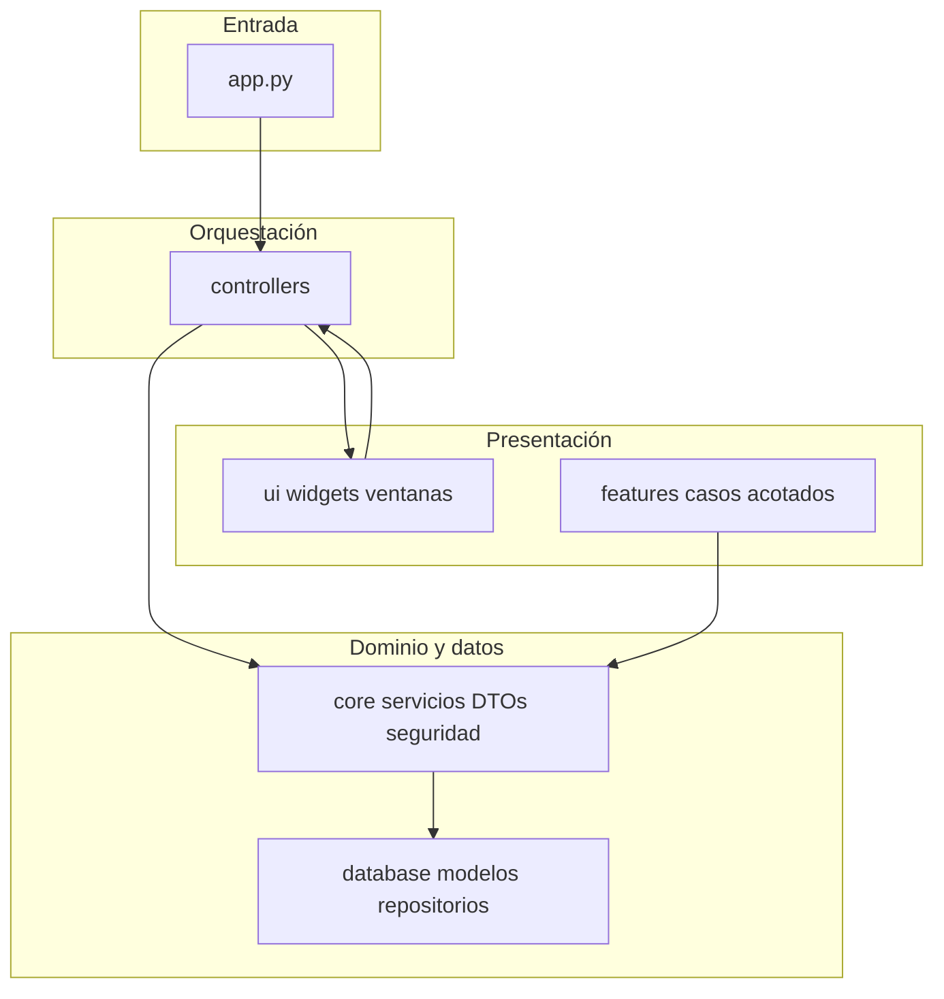

# Mapa de navegación del código (Hipatia)

Documento breve para orientarse en el repositorio sin leer primero la documentación técnica exhaustiva. La referencia detallada sigue en `Documentacion/Documentacion Daniel.md`, skills bajo `.agents/skills/` y el README raíz.

---

## 1. Propósito

Este mapa indica **capas**, **carpetas con distinto rol** (código vivo vs informes históricos) y **puntos de entrada por flujo**. No sustituye análisis de dependencias ni el plan de calidad; solo reduce el coste cognitivo inicial.

---

## 2. Capas de ejecución

Flujo habitual de una acción de usuario en la aplicación de escritorio:



- **`app.py`**: arranque, `QApplication`, `QtLogHandler`, login y bifurcación vista responsable vs trabajador.
- **`controllers/`**: `AppController`, sesión, señales UI, subcontroladores por área (producto, fabricación, worker administración, etc.).
- **`core/`**: servicios de dominio, DTOs, seguridad, paths, sincronización USB, importación de listas de materiales (BOM), etiquetado y utilidades compartidas.
- **`database/`**: SQLAlchemy, repositorios, modelos, migraciones Alembic.
- **`ui/`**: PyQt6 (vista principal, diálogos, widgets por página).
- **`features/`**: módulos de producto relativamente acotados (p. ej. controlador de la ventana de trabajador) que consumen `core` y `database`.

---

## 3. Directorios: rol y madurez

| Carpeta | Rol | Notas |
|---------|-----|--------|
| `app.py`, `controllers/`, `core/`, `database/`, `ui/`, `features/` | **Producción activa** | Donde vive el comportamiento que ejecutan los usuarios. |
| `tests/` | **Suite de regresión** | pytest; convenciones en skills `strict_testing`, `testing_por_capa`. |
| `scripts/` | **Herramientas CLI** | Analizadores, generación de docs, utilidades de mantenimiento (no son la app). |
| `migrations/` | **Esquema BD** | Alembic; coherente con modelos en `database/models/`. |
| `Documentacion/` | **Documentación humana** | Incluye este mapa, informes por fase, despliegue; parte es histórica de refactorización. |
| `Documentacion/Refactorizacion_Completa/` | **Referencia de fases cerradas** | Informes y planes ya ejecutados o en modo archivo; no implica que el código “bajo esa carpeta” siga siendo el patrón actual. |
| `Documentacion/Documentacion Daniel.md` | **Inventario técnico amplio** | Generado/actualizado con scripts; útil para búsqueda profunda, mala como primera lectura. |
| `reports/` | **Salidas de analizadores** | A menudo en `.gitignore`; no forma parte del producto en runtime. |
| `.agents/skills/` | **Metodología y gates** | Índice: `.agents/skills/SKILL_INDEX.md`. |
| `resources/`, `config/` (si aplica) | **Recursos y configuración** | Rutas según `core/paths` y entorno. |

---

## 4. Flujos de producto (anclas)

| Flujo | Dónde empezar (indicativo) |
|-------|----------------------------|
| Arranque, login, rol trabajador vs responsable | `app.py`, `controllers/session_controller.py` |
| Vista principal (navegación, páginas) | `ui/main_window.py`, `ui/widgets/` por nombre de página |
| Gestión trabajadores y asignación de tareas | `controllers/worker/`, `ui/widgets/workers_widget.py`, `core/services/worker_service.py` |
| Vista trabajador (tareas, log, QR) | `ui/worker/main_window/`, `features/worker_controller.py` |
| Trazabilidad y asignación fabricación–trabajador | `core/services/tracking_assignment_service.py`, `database/repositories/tracking*.py` |
| Seguridad y permisos | `core/security/` |
| Informes | `controllers/report_controller.py`, `core/services/report_*.py` |
| Simulación / pilas | `controllers/simulation/`, `core/simulation/` |
| Importación BOM (Excel A3RP → productos y materiales) | `core/import_manager/services/bom_import_service.py`, `ui/dialogs/product/bom_import_preview_dialog.py`, adaptador Excel en `core/import_manager/` |
| Sincronización con base externa (p. ej. USB) | `core/sync_service.py`, diálogos de sincronización en `ui/dialogs/` |
| Presupuestos / cotizaciones | `core/quote_service.py` y controladores de producto que lo invoquen |

---

## 5. Legado y análisis automático

- Criterios de qué tratar como **legacy** y checklist: [`.agents/skills/fase_legacy/SKILL.md`](../.agents/skills/fase_legacy/SKILL.md).
- Informe candidatos (prints, except amplios, marcadores, etc.):

  ```bash
  python3 scripts/legacy_analyzer.py
  ```

  Salida típica bajo `Documentacion/Refactorizacion_Completa/Legacy/` (`legacy_report.md` / `.json`).

El informe **no define** la arquitectura deseada; solo lista **candidatos** a revisar o limpiar.

---

## 6. Por qué `git status` puede verse enorme

- Tener el **repositorio o la copia de trabajo bajo iCloud Drive** (típico al desarrollar en Mac) puede multiplicar archivos tocados o conflictos de sincronización del propio disco de trabajo; **no afecta al modelo de despliegue en Windows** ni a usuarios de fábrica que solo ejecutan el instalable.
- Varias ramas o worktrees también multiplican lo que `git` ve como cambios.
- Sesiones largas de refactor tocan muchos módulos acoplados (controllers + core + tests).
- Artefactos que no deberían versionarse: ver skill [`.agents/skills/limpieza_proyecto/SKILL.md`](../.agents/skills/limpieza_proyecto/SKILL.md) antes de empaquetar o publicar.

Este mapa describe la **intención** del árbol del proyecto, no el estado de tu working tree.

---

## 7. SQLite, datos locales y dónde vive la base

### Desarrollo (p. ej. Mac)

Si el **código o `data/` del repo** está dentro de una carpeta **sincronizada en la nube** (iCloud Drive, etc.), el fichero SQLite puede sufrir conflictos de copia, latencia o accesos raros: es un riesgo del **entorno de desarrollo**, no algo que “arregle” el empaquetado. La mitigación práctica es evitar ese layout o trabajar con copia local del repo.

### Producción Windows (instalación típica, PyInstaller `onedir`)

La app escribe en **`get_writable_app_root()`** ([`core/paths.py`](../core/paths.py)): en binario, la **carpeta del `.exe`** (no el interior del ejecutable). Ahí se crean `data/montaje.db`, `logs/`, `backups/`, etc. ([`database/config.py`](../database/config.py)). **No entra iCloud** en ese escenario.

**Sincronizar o mover datos entre equipos** debe hacerse con flujos **explícitos** (copias de seguridad, restauración, exportación que ya contempla el producto vía `BACKUP_DIR` y el módulo de backup), no dejando la **carpeta de instalación** dentro de OneDrive u otro sync de archivos en segundo plano: reaparecería la misma clase de problemas que con SQLite bajo nube.

### Varios usuarios escribiendo a la vez

Varios clientes abriendo **el mismo fichero `.db` compartido por red o por sync** no es un modelo robusto. Para **acceso concurrente real** a un único origen de verdad, el código ya admite **`DB_TYPE=postgresql`** en [`database/config.py`](../database/config.py) (u otro motor servidor); es independiente del tema iCloud en desarrollo.

---

## 8. Lectura recomendada (orden)

1. [README.md](../README.md) — métricas, arranque, CI.
2. **Este mapa** — orientación en carpetas y flujos.
3. [.agents/skills/SKILL_INDEX.md](../.agents/skills/SKILL_INDEX.md) — qué skills están activas vs archivo.
4. [.agents/skills/plan_mejora_calidad/SKILL.md](../.agents/skills/plan_mejora_calidad/SKILL.md) — plan operativo de calidad.
5. [Documentacion Daniel.md](Documentacion%20Daniel.md) — solo cuando haga falta detalle por módulo o API.

---

*Última revisión: 2026-04 — alineado con importación BOM, sincronización y flujos de trabajador; conviene revisar enlaces si se mueven rutas clave.*
