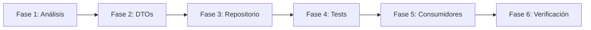

# Guía Completa: Migración y Testing de Repositorios

> **Documento de Referencia para Migración de Tuplas a DTOs**  
> **Última Actualización:** 25 de Diciembre de 2025  
> **Basado en:** Migración exitosa de `MachineRepository` y `WorkerRepository`

---

## 1. Resumen del Proceso

La migración de repositorios consiste en transformar métodos que devuelven **tuplas crudas** a métodos que devuelven **Data Transfer Objects (DTOs)** fuertemente tipados. Este cambio proporciona:

- ✅ Acceso por atributo en lugar de índices opacos
- ✅ Tipado estático con type hints
- ✅ Resistencia a cambios de orden en columnas de BD
- ✅ Errores claros en tiempo de ejecución
- ✅ Mejor experiencia de desarrollo (autocompletado)

---

## 2. Fases de la Migración



---

## 3. Fase 1: Análisis del Repositorio

### 3.1 Identificar Métodos que Devuelven Tuplas

Buscar en el repositorio métodos que usen `_convert_list_to_tuples()` o devuelvan `List[Tuple[...]]`:

```python
# Ejemplo de método que necesita migración
def get_all_workers(self, include_inactive: bool = False) -> List[Tuple[int, str, int, str]]:
    # ...
    return self._convert_list_to_tuples(trabajadores,
                                        ['id', 'nombre_completo', 'activo', 'notas'])
```

### 3.2 Documentar la Estructura de Cada Tupla

Para cada método, documentar:

| Método | Campos de Tupla | Orden |
|--------|-----------------|-------|
| `get_all_workers()` | id, nombre_completo, activo, notas, tipo_trabajador | 0, 1, 2, 3, 4 |
| `get_worker_annotations()` | pila_id, fecha, anotacion | 0, 1, 2 |

### 3.3 Buscar Consumidores

Ejecutar búsquedas para encontrar dónde se usan los valores de las tuplas:

```bash
# Buscar accesos por índice
grep -rn "workers\[0\]\[" --include="*.py" .
grep -rn "worker\[1\]" --include="*.py" .

# Buscar el nombre del método
grep -rn "get_all_workers" --include="*.py" .
```

---

## 4. Fase 2: Definición de DTOs

### 4.1 Ubicación

Todos los DTOs deben definirse en `core/dtos.py`.

### 4.2 Estructura de un DTO

```python
from dataclasses import dataclass
from typing import Optional
from datetime import datetime, date

@dataclass
class NombreDelDTO:
    """Descripción breve del DTO."""
    campo1: tipo1
    campo2: tipo2
    # ... más campos
```

### 4.3 Ejemplos Reales

```python
# DTO para entidad principal
@dataclass
class WorkerDTO:
    """DTO para datos de trabajadores."""
    id: int
    nombre_completo: str
    activo: bool
    notas: str
    tipo_trabajador: int

# DTO para entidad relacionada
@dataclass
class WorkerAnnotationDTO:
    """DTO para anotaciones de trabajadores."""
    pila_id: int
    fecha: datetime
    anotacion: str

# DTO para datos de máquinas
@dataclass
class MachineDTO:
    id: int
    nombre: str
    departamento: str
    tipo_proceso: str
    activa: bool
```

### 4.4 Convenciones de Nomenclatura

- Sufijo `DTO` para todas las dataclasses
- PascalCase para nombres de clase
- snake_case para atributos, coincidiendo con nombres de columnas de BD
- Tipos Python nativos (`bool`, no `int` para booleanos)

---

## 5. Fase 3: Refactorización del Repositorio

### 5.1 Añadir Import de DTOs

```python
# Al inicio del archivo del repositorio
from core.dtos import WorkerDTO, WorkerAnnotationDTO
```

### 5.2 Cambiar el Tipo de Retorno

```python
# ANTES
def get_all_workers(self, include_inactive: bool = False) -> List[Tuple[int, str, int, str]]:

# DESPUÉS
def get_all_workers(self, include_inactive: bool = False) -> List[WorkerDTO]:
```

### 5.3 Reemplazar `_convert_list_to_tuples()` por Conversión a DTO

```python
# ANTES
def _operation(session):
    trabajadores = query.order_by(Trabajador.nombre_completo).all()
    return self._convert_list_to_tuples(trabajadores,
                                        ['id', 'nombre_completo', 'activo', 'notas'])

# DESPUÉS
def _operation(session):
    trabajadores = query.order_by(Trabajador.nombre_completo).all()
    return [
        WorkerDTO(
            id=t.id,
            nombre_completo=t.nombre_completo,
            activo=bool(t.activo),  # Conversión explícita si es necesario
            notas=t.notas or "",    # Manejo de None
            tipo_trabajador=t.tipo_trabajador
        ) for t in trabajadores
    ]
```

### 5.4 Actualizar Docstrings

```python
def get_all_workers(self, include_inactive: bool = False) -> List[WorkerDTO]:
    """
    Obtiene una lista de todos los trabajadores.

    Args:
        include_inactive: Si incluir trabajadores inactivos

    Returns:
        Lista de WorkerDTO con los datos de cada trabajador
    """
```

---

## 6. Fase 4: Actualización de Tests

### 6.1 Importar DTOs en Tests

```python
# Al inicio del archivo de tests
from core.dtos import WorkerDTO, WorkerAnnotationDTO
```

### 6.2 Tabla de Conversión de Aserciones

| Antes (Tupla) | Después (DTO) |
|---------------|---------------|
| `workers[0][0]` | `workers[0].id` |
| `workers[0][1]` | `workers[0].nombre_completo` |
| `workers[0][2]` | `workers[0].activo` |
| `workers[0][3]` | `workers[0].notas` |
| `workers[0][4]` | `workers[0].tipo_trabajador` |
| `isinstance(workers[0], tuple)` | `isinstance(workers[0], WorkerDTO)` |

### 6.3 Ejemplo de Test Actualizado

```python
# ANTES
def test_get_all_workers_with_data(self, repos, session):
    # ... setup ...
    workers = worker_repo.get_all_workers()
    
    assert len(workers) == 2
    assert isinstance(workers[0], tuple)
    assert workers[0][1] == "Ana García"
    assert workers[1][1] == "Carlos López"

# DESPUÉS
def test_get_all_workers_with_data(self, repos, session):
    # ... setup ...
    workers = worker_repo.get_all_workers()
    
    assert len(workers) == 2
    assert isinstance(workers[0], WorkerDTO)
    assert workers[0].nombre_completo == "Ana García"
    assert workers[1].nombre_completo == "Carlos López"
```

### 6.4 Tests E2E con Iteración

```python
# ANTES
workers = worker_repo.get_all_workers()
w_a_id = next(w[0] for w in workers if w[1] == "Worker A")

# DESPUÉS
workers = worker_repo.get_all_workers()
w_a_id = next(w.id for w in workers if w.nombre_completo == "Worker A")
```

---

## 7. Fase 5: Actualización de Código Consumidor

### 7.1 Buscar Todos los Consumidores

```bash
grep -rn "get_all_workers" --include="*.py" .
grep -rn "get_latest_workers" --include="*.py" .
```

### 7.2 Ubicaciones Comunes

| Archivo | Uso Típico |
|---------|------------|
| `app.py` | Controladores, UI |
| `report_strategy.py` | Generación de informes |
| `ui/widgets.py` | Widgets de interfaz |
| `ui/dialogs.py` | Diálogos |

### 7.3 Ejemplos de Actualización

```python
# app.py - Lista de nombres
# ANTES
worker_names = [w[1] for w in workers_data]
# DESPUÉS
worker_names = [w.nombre_completo for w in workers_data]

# report_strategy.py - Diccionario
# ANTES
all_workers = {w[1]: w[4] for w in model.worker_repo.get_all_workers(True)}
# DESPUÉS
all_workers = {w.nombre_completo: w.tipo_trabajador for w in model.worker_repo.get_all_workers(True)}

# app.py - Tupla para otro uso
# ANTES
real_workers = [(data[1], data[4]) for data in real_workers_data]
# DESPUÉS
real_workers = [(data.nombre_completo, data.tipo_trabajador) for data in real_workers_data]
```

### 7.4 ⚠️ CRÍTICO: Actualización de Widgets UI

**Este paso es fundamental para que la aplicación funcione correctamente.** Los widgets en `ui/widgets.py` suelen usar desempaquetado de tuplas que **rompe la aplicación** si no se actualiza.

#### Buscar Métodos `populate_list`

```bash
grep -n "populate_list" ui/widgets.py
```

#### Patrón de Actualización

```python
# ANTES (Desempaquetado de tuplas - ROMPE LA APP)
def populate_list(self, workers_data):
    for worker_id, nombre, activo, *_ in workers_data:  # ❌ TypeError
        item_text = f"{nombre} {'(Activo)' if activo else '(Inactivo)'}"
        item.setData(Qt.ItemDataRole.UserRole, worker_id)

# DESPUÉS (Acceso por atributos DTO - FUNCIONA)
def populate_list(self, workers_data):
    for worker in workers_data:
        worker_id = worker.id
        nombre = worker.nombre_completo
        activo = worker.activo
        
        item_text = f"{nombre} {'(Activo)' if activo else '(Inactivo)'}"
        item.setData(Qt.ItemDataRole.UserRole, worker_id)
```

#### Lista de Widgets a Revisar por Repositorio

| Repositorio | Widget | Método |
|-------------|--------|--------|
| `WorkerRepository` | `WorkersWidget` | `populate_list()` |
| `MachineRepository` | `MachinesWidget` | `populate_list()` |
| `ProductRepository` | `ProductsWidget` | `update_search_results()` |
| `PilaRepository` | `PilasWidget` | `populate_list()` |
| `PreprocesoRepository` | `FabricationsWidget` | `update_search_results()` |
| `PreprocesoRepository` | `PrepStepsWidget` | `populate_list()` |

#### Error Típico si no se Actualiza

```
TypeError: cannot unpack non-iterable WorkerDTO object
File ".../ui/widgets.py", line 1062, in populate_list
    for worker_id, nombre, activo, *_ in workers_data:
```

---

## 8. Fase 6: Verificación

### 8.1 Ejecutar Tests del Repositorio

```bash
# Tests unitarios del repositorio específico
pytest tests/unit/test_worker_repository.py -v

# Tests de integración
pytest tests/integration/test_worker_integration.py -v

# Tests E2E
pytest tests/e2e/test_worker_workflow.py -v
```

### 8.2 Ejecutar Suite Completa

```bash
# Todos los tests
pytest tests/ -v

# Con cobertura
pytest tests/ --cov=database/repositories/worker_repository.py --cov-report=term-missing
```

### 8.3 Verificación Manual (Opcional)

1. Iniciar la aplicación
2. Navegar a la sección de trabajadores/máquinas
3. Verificar que los datos se muestran correctamente
4. Probar crear, editar y eliminar registros

---

## 9. Checklist de Migración

Para cada repositorio, completar esta lista:

```markdown
### Repositorio: [NombreRepository]

#### Fase 1: Análisis
- [ ] Identificar métodos con tuplas
- [ ] Documentar estructura de cada tupla
- [ ] Buscar consumidores en el código

#### Fase 2: DTOs
- [ ] Crear DTO principal en `core/dtos.py`
- [ ] Crear DTOs secundarios si es necesario
- [ ] Importar datetime si se usa

#### Fase 3: Repositorio
- [ ] Añadir imports de DTOs
- [ ] Modificar tipo de retorno de cada método
- [ ] Reemplazar `_convert_list_to_tuples()` por list comprehension
- [ ] Actualizar docstrings

#### Fase 4: Tests
- [ ] Actualizar tests unitarios
- [ ] Actualizar tests de integración
- [ ] Actualizar tests E2E

#### Fase 5: Consumidores
- [ ] Actualizar `app.py`
- [ ] Actualizar `report_strategy.py`
- [ ] **⚠️ Actualizar `ui/widgets.py` - Método `populate_list()`**
- [ ] Actualizar otros widgets/diálogos

#### Fase 6: Verificación
- [ ] Tests unitarios pasando
- [ ] Tests de integración pasando
- [ ] Tests E2E pasando
- [ ] Suite completa pasando
```

---

## 10. Repositorios Migrados

| Repositorio | Estado | Tests | DTOs Creados |
|-------------|--------|-------|--------------|
| `MachineRepository` | ✅ Completado | 32 | `MachineDTO`, `MachineMaintenanceDTO`, `PreparationGroupDTO`, `PreparationStepDTO` |
| `WorkerRepository` | ✅ Completado | 35 | `WorkerDTO`, `WorkerAnnotationDTO` |
| `MaterialRepository` | ✅ Completado | 28 | `MaterialDTO`, `MaterialStatsDTO` |
| `PilaRepository` | ⏳ Pendiente | - | - |
| `ProductRepository` | ⏳ Pendiente | - | - |
| `PreprocesoRepository` | ⏳ Pendiente | - | - |

---

## 11. Estructura Final del Proyecto

```
core/
└── dtos.py                    # Todos los DTOs centralizados

database/
├── models.py                  # Modelos SQLAlchemy
└── repositories/
    ├── base.py               # Clase base con safe_execute
    ├── machine_repository.py # ✅ Devuelve DTOs
    ├── worker_repository.py  # ✅ Devuelve DTOs
    ├── pila_repository.py    # ⏳ Pendiente
    └── product_repository.py # ⏳ Pendiente

tests/
├── unit/
│   ├── test_machine_repository.py
│   └── test_worker_repository.py
├── integration/
│   └── test_worker_integration.py
└── e2e/
    └── test_worker_workflow.py
```

---

## 12. Errores Comunes y Soluciones

### Error: `AttributeError: 'tuple' object has no attribute 'nombre'`
**Causa:** Olvidaste actualizar algún consumidor.  
**Solución:** Busca accesos por índice que quedaron sin actualizar.

### Error: `TypeError: 'NoneType' object is not subscriptable`
**Causa:** El campo en la BD es NULL y no se manejó.  
**Solución:** Usa `field or ""` o `field or 0` en la conversión.

### Error: `AssertionError: isinstance(workers[0], tuple)`
**Causa:** Test no actualizado después de la migración.  
**Solución:** Cambiar a `isinstance(workers[0], WorkerDTO)`.

### Error: `TypeError: cannot unpack non-iterable WorkerDTO object`
**Causa:** El widget UI (`ui/widgets.py`) intenta desempaquetar el DTO como tupla.  
**Solución:** Cambiar el bucle `for a, b, c in data:` por `for item in data:` y acceder a `item.a`, `item.b`, `item.c`.  
**Archivo típico:** `ui/widgets.py` en métodos `populate_list()`.

---

## 13. Comando de Referencia Rápida

```bash
# Buscar tuplas en un repositorio
grep -n "_convert_list_to_tuples" database/repositories/nombre_repository.py

# Buscar consumidores
grep -rn "get_all_nombre" --include="*.py" .

# Ejecutar tests específicos
pytest tests/unit/test_nombre_repository.py -v

# Ejecutar todos los tests
pytest tests/ -v
```

---

> **Nota:** Este documento debe actualizarse cada vez que se migre un nuevo repositorio para mantener el registro del progreso y servir como referencia para futuras migraciones.
